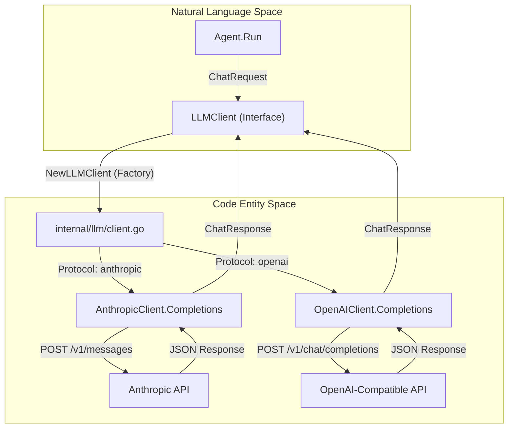
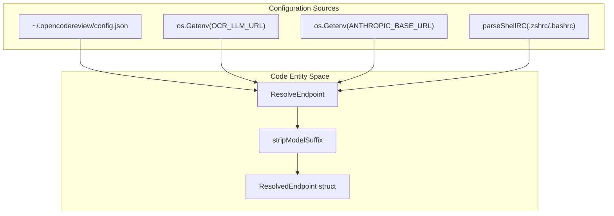

# LLM Client Layer

Relevant source files

The following files were used as context for generating this wiki page:

- [cmd/opencodereview/config_cmd.go](cmd/opencodereview/config_cmd.go)
- [cmd/opencodereview/llm_cmd.go](cmd/opencodereview/llm_cmd.go)
- [internal/llm/client.go](internal/llm/client.go)
- [internal/llm/client_test.go](internal/llm/client_test.go)
- [internal/llm/resolver.go](internal/llm/resolver.go)
- [internal/llm/resolver_test.go](internal/llm/resolver_test.go)
- [internal/llm/usage_resolver.go](internal/llm/usage_resolver.go)
- [internal/telemetry/config.go](internal/telemetry/config.go)

The LLM Client Layer is responsible for abstracting the communication between OpenCodeReview (OCR) and various Large Language Model providers. It handles the complexities of protocol translation, endpoint discovery, reliable delivery through retries, and precise token accounting.

## Overview

OCR interacts with LLMs through a unified `LLMClient` interface [internal/llm/client.go:36-40](). This interface allows the rest of the system to remain agnostic of the underlying provider, whether it is Anthropic's Messages API or the OpenAI Chat Completions API.

### Key Capabilities
*   **Dual-Protocol Support**: Native implementations for both `AnthropicClient` and `OpenAIClient` [internal/llm/client.go:199-211]().
*   **Unified Messaging**: A shared `Message` struct that handles both simple string content and complex multi-part content blocks (e.g., tool results) [internal/llm/client.go:48-62]().
*   **Resilience**: Built-in exponential backoff retry logic for handling transient network errors or rate limits [internal/llm/client.go:23]().
*   **Token Management**: Integration with `tiktoken` for accurate local token counting and context window management [internal/llm/client.go:213-221]().
*   **Usage Extraction**: A robust `resolveUsage` utility that probes multiple JSON paths to extract token usage from various vendor-specific response formats [internal/llm/usage_resolver.go:52-82]().

### LLM Communication Flow

The following diagram illustrates how the `LLMClient` bridges the high-level agent logic to specific API implementations.

**LLM Request Pipeline**

Sources: [internal/llm/client.go:36-40](), [internal/llm/client.go:198-211](), [internal/llm/client.go:145-151]()

---

## Endpoint Resolution and Protocol Selection

OCR uses a multi-tiered strategy to resolve LLM configuration. It attempts to find a valid `URL`, `Token`, and `Model` from several sources in a specific priority order.

1.  **OCR Config File**: Located at `~/.opencodereview/config.json` [internal/llm/resolver.go:45](), [internal/llm/resolver.go:103-132]().
2.  **OCR Environment Variables**: `OCR_LLM_URL`, `OCR_LLM_TOKEN`, `OCR_LLM_MODEL` [internal/llm/resolver.go:23-28](), [internal/llm/resolver.go:67-87]().
3.  **Claude Code Environment**: Support for `ANTHROPIC_BASE_URL`, `ANTHROPIC_AUTH_TOKEN`, and `ANTHROPIC_MODEL` [internal/llm/resolver.go:31-35](), [internal/llm/resolver.go:135-146]().
4.  **Shell RC Files**: Automatic parsing of `~/.zshrc`, `~/.bashrc`, or `~/.profile` for exported Anthropic credentials [internal/llm/resolver.go:149-158](), [internal/llm/resolver.go:188-228]().

The `ResolveEndpoint` function determines the `Protocol` ("anthropic" or "openai") based on the source and explicit overrides like `OCR_USE_ANTHROPIC` [internal/llm/resolver.go:76-84](). It also automatically cleans model names by stripping ANSI escape codes or suffixes [internal/llm/resolver.go:184-186]().

For details, see [Endpoint Resolution and Protocol Selection](#4.1).

**Configuration Resolution Strategy**

Sources: [internal/llm/resolver.go:40-64](), [internal/llm/resolver.go:13-20](), [internal/llm/resolver.go:184-186]()

---

## HTTP Client, Streaming, and Token Counting

The client layer provides robust HTTP handling, including support for Server-Sent Events (SSE) for streaming responses via `StreamCompletion` [internal/llm/client.go:39]().

### Request Handling
*   **Retries**: The system performs up to 10 retries with exponential backoff for failed requests [internal/llm/client.go:23]().
*   **Timeouts**: Configurable timeouts via `ClientConfig` ensure the agent doesn't hang indefinitely [internal/llm/client.go:188-194]().
*   **User Agent**: Every request includes a custom `User-Agent` identifying the OCR version and provider [internal/llm/client.go:27-33]().

### Token Counting and Usage
OCR uses `tiktoken` to count tokens locally. This is critical for the "Memory Compression" system, which triggers when token usage exceeds specific thresholds. The `modelTokenizerCache` ensures that encoders (like `cl100k_base`) are reused across requests for efficiency [internal/llm/client.go:214-221]().

Additionally, the `UsageInfo` struct captures detailed metadata from API responses, including prompt tokens, completion tokens, and cache hits/writes [internal/llm/usage_resolver.go:9-15]().

For details, see [HTTP Client, Streaming, and Token Counting](#4.2).

---

## Data Structures

| Struct | Purpose |
| :--- | :--- |
| `ChatRequest` | Contains messages, tools, and model parameters for a completion. |
| `Message` | Represents a turn in the conversation; supports `Role`, `Content`, and `ToolCalls` [internal/llm/client.go:48-53](). |
| `ToolCall` | Represents a request from the LLM to execute a specific tool [internal/llm/client.go:124-128](). |
| `ChatResponse` | The unified result containing the generated text, tool calls, and usage metadata [internal/llm/client.go:145-151](). |
| `UsageInfo` | Detailed token metrics including `CacheReadTokens` and `CacheWriteTokens` [internal/llm/usage_resolver.go:9-15](). |

Sources: [internal/llm/client.go:48-151](), [internal/llm/usage_resolver.go:9-15]()
