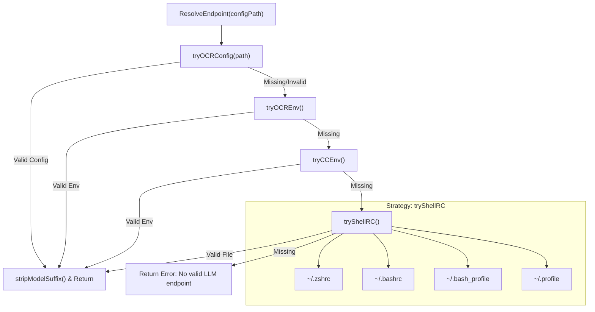
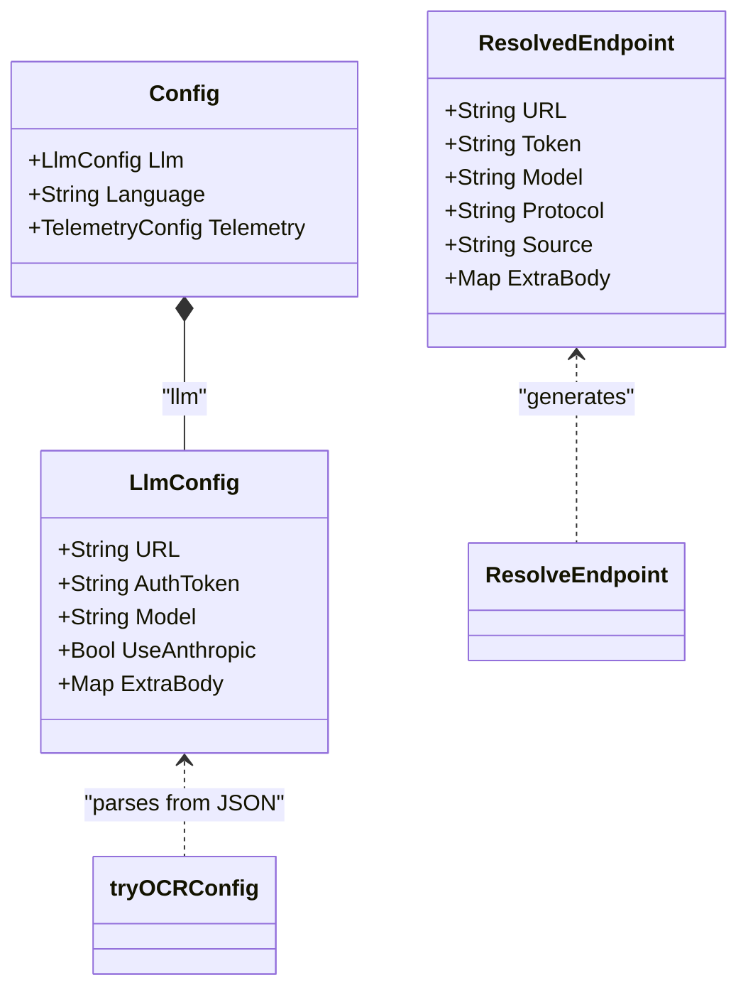

# Endpoint Resolution and Protocol Selection

Relevant source files

The following files were used as context for generating this wiki page:

- [cmd/opencodereview/config_cmd.go](cmd/opencodereview/config_cmd.go)
- [cmd/opencodereview/llm_cmd.go](cmd/opencodereview/llm_cmd.go)
- [internal/config/testconnection/task.json](internal/config/testconnection/task.json)
- [internal/config/testconnection/testconnection.go](internal/config/testconnection/testconnection.go)
- [internal/llm/resolver.go](internal/llm/resolver.go)
- [internal/llm/resolver_test.go](internal/llm/resolver_test.go)
- [internal/telemetry/config.go](internal/telemetry/config.go)

OpenCodeReview (OCR) implements a flexible LLM endpoint resolution system that allows it to operate across different environments—from local development machines to CI/CD pipelines. It supports two primary communication protocols: the **Anthropic Messages API** and the **OpenAI Chat Completions API**.

## Endpoint Resolution Strategy

The resolution process is handled by the `ResolveEndpoint` function, which evaluates four distinct strategies in a strict priority order. For a strategy to be considered successful, it must provide three mandatory fields: a `URL`, an `AuthToken` (or `Token`), and a `Model` name [internal/llm/resolver.go:37-40]().

### Resolution Hierarchy

The following table describes the priority of configuration sources as defined in the `strategies` slice [internal/llm/resolver.go:41-49]():

| Priority | Source | Description |
| :--- | :--- | :--- |
| 1 | **OCR Config File** | JSON configuration located at `~/.opencodereview/config.json` [internal/llm/resolver.go:45](), [cmd/opencodereview/config_cmd.go:12-18](). |
| 2 | **OCR Environment** | Explicit OCR-specific environment variables (`OCR_LLM_URL`, `OCR_LLM_TOKEN`, `OCR_LLM_MODEL`) [internal/llm/resolver.go:22-28](). |
| 3 | **Claude Code Env** | Compatibility layer for `ANTHROPIC_BASE_URL`, `ANTHROPIC_AUTH_TOKEN`, and `ANTHROPIC_MODEL` [internal/llm/resolver.go:30-35](). |
| 4 | **Shell RC Files** | Automatic parsing of `.zshrc`, `.bashrc`, `.bash_profile`, and `.profile` for exported Anthropic credentials [internal/llm/resolver.go:148-158](). |

### Logic Flow of ResolveEndpoint

The resolution logic iterates through the strategies, returning the first result where all three required fields are non-empty. It also performs model name cleanup by stripping ANSI escape sequences (e.g., `[1m]`) often found in terminal-exported variables [internal/llm/resolver.go:51-61]().

**Data Flow: Endpoint Resolution Logic**

**Sources:** [internal/llm/resolver.go:40-64](), [internal/llm/resolver.go:149-178](), [internal/llm/resolver.go:184-186]()

---

## Protocol Selection

OCR distinguishes between the **Anthropic** and **OpenAI** protocols via the `Protocol` field in the `ResolvedEndpoint` struct [internal/llm/resolver.go:13-20]().

### Protocol Switching Logic

1.  **OCR Config File**: The `llmFileConfig` struct includes a `UseAnthropic *bool` field. If `nil` or `true`, the protocol is `anthropic`. If explicitly `false`, it switches to `openai` [internal/llm/resolver.go:94](), [internal/llm/resolver.go:121-131]().
2.  **OCR Environment**: The variable `OCR_USE_ANTHROPIC` controls the switch. It accepts truthy values like `true`, `1`, or `yes`. If set to a falsy value, the `openai` protocol is selected [internal/llm/resolver.go:75-86]().
3.  **Claude Code/Shell RC Compatibility**: When configuration is sourced from `ANTHROPIC_*` variables, the protocol is strictly locked to `anthropic` to ensure compatibility with Claude-compatible proxies [internal/llm/resolver.go:145](), [internal/llm/resolver.go:227]().

### URL Normalization and Model Cleaning

*   **URL Suffixing**: For Anthropic-based sources (CC Env and Shell RC), OCR ensures the URL is properly suffixed. If a base URL lacks a versioned path (containing `/v1/`), the system automatically appends `/v1/messages` via `ensureMessagesSuffix` [internal/llm/resolver.go:231-238]().
*   **Model Suffix Stripping**: Model names extracted from environments are passed through `stripModelSuffix`, which uses a regular expression `\[\d+m\]$` to remove trailing formatting codes [internal/llm/resolver.go:182-186]().

**Code Entity Mapping: Configuration and Resolution Entities**

**Sources:** [internal/llm/resolver.go:13-20](), [cmd/opencodereview/config_cmd.go:73-85](), [internal/llm/resolver.go:89-100]()

---

## Configuration Management CLI

The configuration used by the resolver is primarily managed via the `ocr config` command, which interacts with the local filesystem.

### Key Implementation Details
- **Persistence**: User-level configuration is stored at `~/.opencodereview/config.json` [cmd/opencodereview/config_cmd.go:12-18]().
- **Setting Values**: The `setConfigValue` function handles the mapping of CLI keys (like `llm.use_anthropic`) to internal struct fields, including boolean parsing and JSON unmarshaling for vendor-specific `extra_body` fields [cmd/opencodereview/config_cmd.go:126-172]().
- **Connectivity Verification**: The `ocr llm test` command utilizes `ResolveEndpoint` to fetch current settings and attempts a real completion request using the `TEST_TASK` conversation template to verify the resolved URL and Token [cmd/opencodereview/llm_cmd.go:27-41](), [internal/config/testconnection/testconnection.go:30-37]().

### Extra Body Support
The `ResolvedEndpoint` and the configuration file support an `ExtraBody` field [internal/llm/resolver.go:19-20](). This allows users to pass vendor-specific parameters (like custom headers or model-specific flags) directly to the underlying LLM provider [cmd/opencodereview/config_cmd.go:84](), [cmd/opencodereview/config_cmd.go:162-167]().

**Sources:** [cmd/opencodereview/config_cmd.go:39-70](), [cmd/opencodereview/llm_cmd.go:61-89](), [internal/llm/resolver.go:121-132]()
