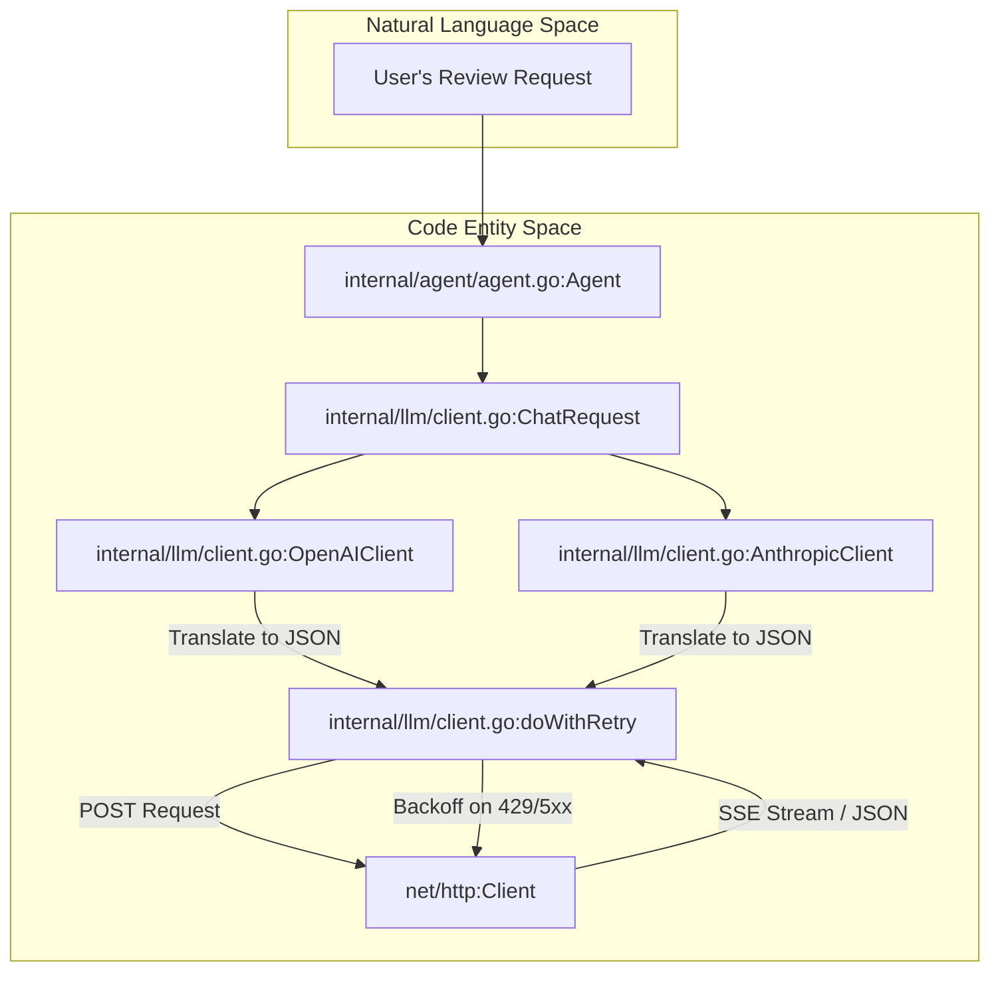
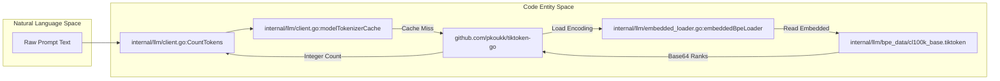

# HTTP Client, Streaming, and Token Counting

Relevant source files

The following files were used as context for generating this wiki page:

- [internal/llm/bpe_data/cl100k_base.tiktoken](internal/llm/bpe_data/cl100k_base.tiktoken)
- [internal/llm/client.go](internal/llm/client.go)
- [internal/llm/client_test.go](internal/llm/client_test.go)
- [internal/llm/embedded_loader.go](internal/llm/embedded_loader.go)
- [internal/llm/usage_resolver.go](internal/llm/usage_resolver.go)

This page details the implementation of the LLM communication layer in OpenCodeReview. It covers the dual-protocol client architecture, the Server-Sent Events (SSE) streaming mechanism, the exponential backoff retry logic, and the offline-capable token counting system.

## LLM Client Architecture

OpenCodeReview provides a unified `LLMClient` interface [internal/llm/client.go:36-40]() that abstracts away the differences between the **OpenAI Chat Completions API** and the **Anthropic Messages API**.

The client selection is handled by a factory function, `NewLLMClient`, which dispatches to specific implementations based on the `ResolvedEndpoint` protocol [internal/llm/client.go:197-211]().

### Data Flow and Protocol Translation

The system uses a shared set of data structures for requests and responses. The `ChatRequest` and `Message` types [internal/llm/client.go:48-53]() are designed to be expressive enough for both protocols, including support for multi-part content blocks used by Claude [internal/llm/client.go:57-62]().

### Request Translation Diagram

This diagram illustrates how a generic `ChatRequest` is translated into provider-specific payloads and executed via the `http.Client`.

| Name | Code Entity |
| :--- | :--- |
| **Request Factory** | `internal/llm/client.go:NewLLMClient` |
| **OpenAI Implementation** | `internal/llm/client.go:OpenAIClient` |
| **Anthropic Implementation** | `internal/llm/client.go:AnthropicClient` |
| **Retry Logic** | `internal/llm/client.go:doWithRetry` |

**Sources:** [internal/llm/client.go:36-211]()

---

## Streaming and SSE Handling

Streaming is implemented via `StreamCompletion`, which processes Server-Sent Events (SSE) from the LLM provider.

1.  **Connection**: The client sends a request with `"stream": true`.
2.  **Buffering**: A `bufio.Scanner` reads the response body line-by-line [internal/llm/client.go:465-470]().
3.  **Parsing**: Lines starting with `data: ` are stripped and the JSON payload is extracted [internal/llm/client.go:478-485]().
4.  **Callback**: The raw content chunk is passed to a provided callback function `cb func(chunk []byte) error` [internal/llm/client.go:39]().

### Retry Logic with Exponential Backoff

The internal function `doWithRetry` [internal/llm/client.go:23]() manages the lifecycle of an HTTP request. It will attempt up to `maxRetries` (10) [internal/llm/client.go:23]() if it encounters:
*   Network timeouts or connection resets.
*   HTTP 429 (Rate Limit).
*   HTTP 5xx (Server Errors).

The wait time increases exponentially: $2^{attempt} \times 100ms$ plus a small jitter to prevent "thundering herd" issues.

**Sources:** [internal/llm/client.go:23-40](), [internal/llm/client.go:465-485]()

---

## Token Counting and BPE Data

OpenCodeReview uses `tiktoken-go` for precise token counting. To ensure the CLI remains functional in air-gapped or restricted network environments, the Byte Pair Encoding (BPE) data files are embedded directly into the binary.

### Embedded Loader Implementation

The `internal/llm/embedded_loader.go` file uses Go's `//go:embed` directive to include `.tiktoken` files from the `internal/llm/bpe_data/` directory [internal/llm/embedded_loader.go:13-14]().

| Encoding Name | File Source |
| :--- | :--- |
| `cl100k_base` | `internal/llm/bpe_data/cl100k_base.tiktoken` |
| `o200k_base` | `internal/llm/bpe_data/o200k_base.tiktoken` |
| `p50k_base` | `internal/llm/bpe_data/p50k_base.tiktoken` |
| `r50k_base` | `internal/llm/bpe_data/r50k_base.tiktoken` |

The `InitEmbeddedLoader` function [internal/llm/embedded_loader.go:20-23]() overrides the default `tiktoken` loader to intercept network requests for these files and serve them from the `embed.FS` [internal/llm/embedded_loader.go:36-41]().

### Token Counting Data Flow

| Name | Code Entity |
| :--- | :--- |
| **Token Counter** | `internal/llm/client.go:CountTokens` |
| **BPE Loader** | `internal/llm/embedded_loader.go:embeddedBpeLoader` |
| **BPE Data** | `internal/llm/bpe_data/cl100k_base.tiktoken` |

### Token Calculation Details
The `CountTokens` function determines the correct encoding based on the model name [internal/llm/client.go:233-248](). For example:
*   `gpt-4`, `gpt-3.5-turbo`, and `claude-3` models typically use `cl100k_base` [internal/llm/client.go:238]().
*   `o1` models use `o200k_base` [internal/llm/client.go:236]().

The calculation includes overhead for message metadata (role, name) to match the LLM provider's internal accounting [internal/llm/client.go:250-280]().

**Sources:** [internal/llm/client.go:214-280](), [internal/llm/embedded_loader.go:1-76](), [internal/llm/bpe_data/cl100k_base.tiktoken:1-380]()

---

## Usage Extraction

Since different LLM providers and proxies return token usage in varying JSON structures, the `UsageResolver` provides a robust path-probing mechanism [internal/llm/usage_resolver.go:52-82]().

### Probed JSON Paths
The system attempts to extract `PromptTokens`, `CompletionTokens`, and cache-related tokens using an ordered list of candidate paths:

*   **Prompt Tokens**: `usage.prompt_tokens`, `prompt_tokens`, `data.usage.prompt_tokens` [internal/llm/usage_resolver.go:17-21]().
*   **Cache Hits (Anthropic)**: `usage.cache_read_input_tokens`, `usage.prompt_tokens_details.cache_tokens_hit` [internal/llm/usage_resolver.go:29-34]().
*   **Cache Writes**: `usage.cache_creation_input_tokens` [internal/llm/usage_resolver.go:36-39]().

If `TotalTokens` is not explicitly provided in the response, it is calculated as the sum of prompt, completion, and cache tokens [internal/llm/usage_resolver.go:77-79]().

**Sources:** [internal/llm/usage_resolver.go:8-114]()
