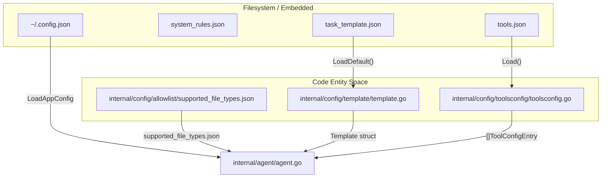
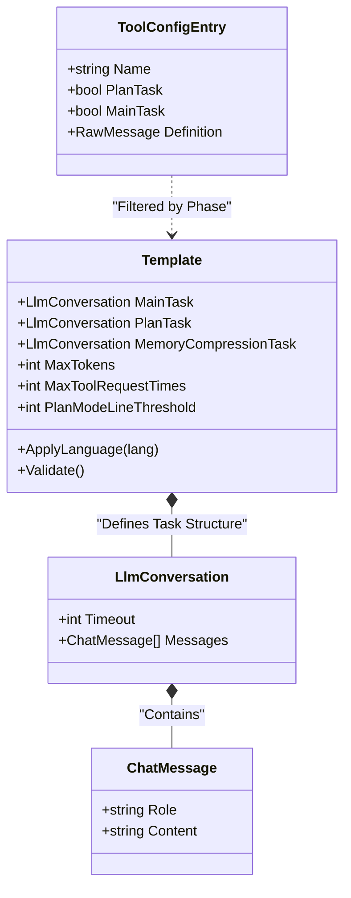

# Configuration System

Relevant source files

The following files were used as context for generating this wiki page:

- [internal/config/allowlist/supported_file_types.json](internal/config/allowlist/supported_file_types.json)
- [internal/config/rules/system_rules.json](internal/config/rules/system_rules.json)
- [internal/config/template/task_template.json](internal/config/template/task_template.json)
- [internal/config/template/template.go](internal/config/template/template.go)
- [internal/config/toolsconfig/toolsconfig.go](internal/config/toolsconfig/toolsconfig.go)

The OpenCodeReview (OCR) configuration system is a multi-layered architecture designed to manage user preferences, agent behaviors, linguistic rules, and tool capabilities. It combines persistent user settings with embedded defaults to ensure the system is functional out-of-the-box while remaining highly customizable.

### Configuration Overview

The system is divided into four primary subsystems that govern different aspects of the review process:

| Subsystem | Primary File | Purpose |
|:---|:---|:---|
| **User Config** | `~/.open-code-review/config.json` | LLM credentials, model selection, and telemetry toggles. |
| **System Rules** | `system_rules.json` | Per-language and per-file checklists used to guide the LLM's review. |
| **Prompt Templates** | `task_template.json` | Definitions for Plan, Main, and Memory compression tasks. |
| **Tool Definitions** | `tools.json` | JSON schemas and configurations for the agent's toolset. |

### Configuration Loading Flow

The following diagram illustrates how the `Template` struct and various loaders interact to prepare the environment for the `Agent`.

**Configuration Initialization Sequence**

Sources: [internal/config/template/template.go:27-34](), [internal/config/toolsconfig/toolsconfig.go:24-40](), [internal/config/allowlist/supported_file_types.json:1-69]()

---

### User Configuration
The `Config` struct represents the top-level settings stored on the user's machine, typically at `~/.open-code-review/config.json`. This file manages:
* **LLM Settings**: URL, Auth Token, Model, and protocol selection (Anthropic vs OpenAI).
* **Localization**: The `Language` field determines the response language (defaults to Chinese).
* **Telemetry**: Master switches for OTLP or Console exporters and content logging.

### System Review Rules
The system uses a rule-based engine to inject specific checklists into the LLM's context based on the files being reviewed. These rules are defined in `system_rules.json` and matched using glob patterns with brace expansion. This ensures that a Java file receives different scrutiny than a `pom.xml` or a SQL migration script.

* **Pattern Matching**: Uses `path_rule_map` to associate file patterns (e.g., `**/*.java`) with specific rule files (e.g., `java.md`) [internal/config/rules/system_rules.json:3-17]().
* **Fallback**: Provides a `default_rule` for files that do not match specific patterns [internal/config/rules/system_rules.json:2]().

For details, see [System Review Rules](#5.1).

### Prompt Templates and Task Configuration
Task execution is governed by the `Template` struct, which defines the `LlmConversation` structure for the three phases of the agent: `PLAN_TASK`, `MAIN_TASK`, and `MEMORY_COMPRESSION_TASK` [internal/config/template/template.go:12-21](). 
* **Localization**: The `ApplyLanguage` method dynamically injects language directives into all system messages [internal/config/template/template.go:54-61]().
* **Constraints**: Parameters like `MaxTokens`, `MaxToolRequestTimes`, and `PlanModeLineThreshold` control the agent's resource consumption and strategy [internal/config/template/template.go:16-20]().
* **Validation**: The `Validate()` function ensures that critical limits are positive and that the `MainTask` contains messages before execution [internal/config/template/template.go:63-74]().

For details, see [Prompt Templates and Task Configuration](#5.2).

### Tool Definitions and File Allowlist
The agent's capabilities are restricted by a tool configuration and a file allowlist. 
* **Tool Schemas**: `tools.json` defines the JSON schema for each tool, which is provided to the LLM to enable function calling [internal/config/toolsconfig/toolsconfig.go:12-17]().
* **Phase Filtering**: Tools can be selectively enabled for the `PlanTask` or `MainTask` phases using the `ToolDefsByPhase` method [internal/config/toolsconfig/toolsconfig.go:45-54]().
* **File Filtering**: The system uses `supported_file_types.json` to determine which files in a repository are eligible for AI-assisted review (e.g., `.go`, `.java`, `.ts`, `.sql`), preventing the agent from wasting tokens on binary files or unsupported formats [internal/config/allowlist/supported_file_types.json:1-69]().

For details, see [Tool Definitions Config and File Allowlist](#5.3).

---

### Configuration Structure Mapping

**Data Mapping: Template to LLM Conversation**

Sources: [internal/config/template/template.go:12-22](), [internal/config/template/template.go:77-86](), [internal/config/toolsconfig/toolsconfig.go:12-17]()
