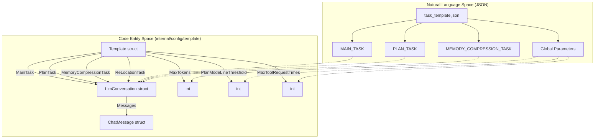
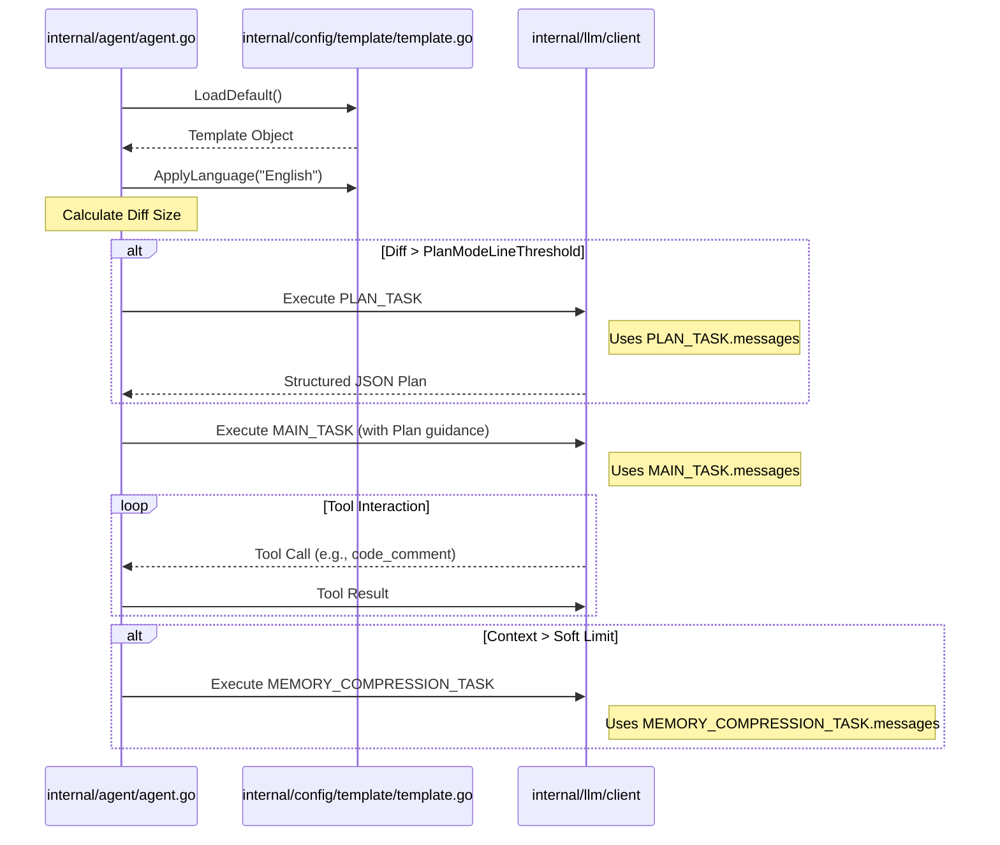

# Prompt Templates and Task Configuration

<details>
<summary>Relevant source files</summary>

The following files were used as context for generating this wiki page:

- [internal/config/template/task_template.json](internal/config/template/task_template.json)
- [internal/config/template/template.go](internal/config/template/template.go)

</details>


This page details the configuration and structure of prompt templates used by the OpenCodeReview (OCR) agent. The system utilizes a structured JSON-based template system to define the behavior, constraints, and instructions for the LLM across different phases of the review process.

## Overview of Task Configuration

The core of the agent's behavior is defined in `internal/config/template/task_template.json` [internal/config/template/task_template.json:1-40](). This configuration is unmarshaled into the `Template` struct, which governs four distinct task types:

1.  **MAIN_TASK**: The primary loop where the agent reviews code, uses tools, and generates comments [internal/config/template/task_template.json:2-14]().
2.  **PLAN_TASK**: An optional pre-analysis phase for large changes to identify risk points and tool strategies [internal/config/template/task_template.json:15-27]().
3.  **MEMORY_COMPRESSION_TASK**: Used to summarize long conversation histories to fit within context window limits [internal/config/template/task_template.json:28-40]().
4.  **RE_LOCATION_TASK**: An optional task used for re-calculating or verifying line positions for comments [internal/config/template/template.go:21]().

### Data Structure Mapping

The following diagram illustrates how the JSON configuration maps to the Go internal structures defined in the `template` package.

**Template Configuration Mapping**


Sources: [internal/config/template/template.go:12-22](), [internal/config/template/template.go:76-86]()

## The Template Struct and Initialization

The `Template` struct is the central repository for task-specific prompts and execution limits. It is initialized via `LoadDefault()`, which uses Go's `embed` directive to include the JSON content directly in the binary [internal/config/template/template.go:24-34]().

### Key Parameters
| Parameter | Type | Description |
| :--- | :--- | :--- |
| `MaxTokens` | `int` | The maximum token limit allowed for a single LLM response [internal/config/template/template.go:16](). |
| `MaxToolRequestTimes` | `int` | Upper limit on how many consecutive tool calls the agent can make in one task [internal/config/template/template.go:18](). |
| `PlanModeLineThreshold` | `int` | The threshold of changed lines that triggers the `PLAN_TASK` before the `MAIN_TASK` [internal/config/template/template.go:20](). |
| `ToolRequestWaitTimeMs` | `int` | Milliseconds to wait between tool requests (for rate limiting) [internal/config/template/template.go:17](). |
| `MaxSubtaskExecMinutes` | `int` | Total timeout for a single subtask execution [internal/config/template/template.go:19](). |

Sources: [internal/config/template/template.go:12-22]()

## LlmConversation and ChatMessage Schema

Every task (Main, Plan, Memory) is defined as an `LlmConversation` [internal/config/template/template.go:77-80]().

-   **Timeout**: Integer seconds defining the HTTP timeout for the LLM request [internal/config/template/template.go:78]().
-   **Messages**: A slice of `ChatMessage` objects containing `Role` (system, user, assistant) and `Content` [internal/config/template/template.go:83-86]().

### Content Placeholders
The `Content` strings in `task_template.json` use double-curly-brace placeholders which are populated at runtime by the agent. Key placeholders include:
- `{{diff}}`: The unified diff of the file being reviewed [internal/config/template/task_template.json:10]().
- `{{system_rule}}`: The checklist derived from `system_rules.json` [internal/config/template/task_template.json:10]().
- `{{plan_tools}}`: Descriptions of available tools for the planning phase [internal/config/template/task_template.json:19]().
- `{{current_file_path}}`: The path of the file under review [internal/config/template/task_template.json:10]().

Sources: [internal/config/template/template.go:77-86](), [internal/config/template/task_template.json:1-40]()

## Localization and Validation

### ApplyLanguage
The `ApplyLanguage` function provides localization by injecting a language directive into the `system` message of every task [internal/config/template/template.go:55-62](). If no language is specified, it defaults to "Chinese" via `resolveLang` [internal/config/template/template.go:46-51]().

```go
func (t *Template) ApplyLanguage(lang string) {
	instruction := "\n\nAlways respond in " + resolveLang(lang) + "."
	applyLanguage(&t.MainTask, instruction)
    if t.PlanTask != nil {
		applyLanguage(t.PlanTask, instruction)
	}
	applyLanguage(&t.MemoryCompressionTask, instruction)
}
```
Sources: [internal/config/template/template.go:37-62]()

### Validation Logic
The `Validate()` method ensures that the loaded configuration is sane before the agent starts. It checks for positive token limits and ensures the `MainTask` contains at least one message [internal/config/template/template.go:63-74]().

## Task Execution Flow

The following diagram shows how the `Template` configuration drives the `Review Agent` logic and how it transitions between different task states.

**Prompt Application Flow**


Sources: [internal/config/template/template.go:55-74](), [internal/config/template/task_template.json:15-40](), [internal/config/template/template.go:12-22]()
