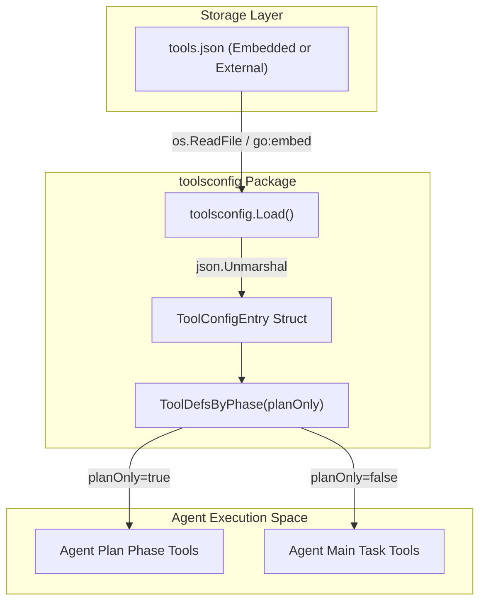
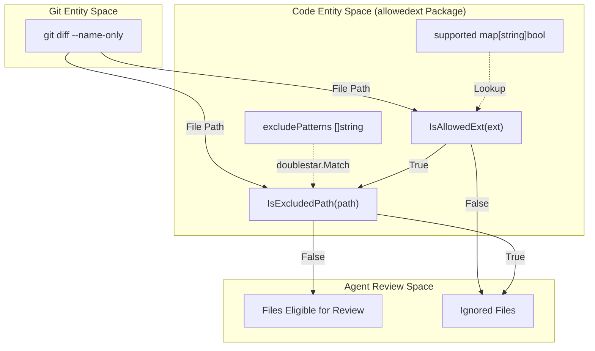

# Tool Definitions Config and File Allowlist

Relevant source files

The following files were used as context for generating this wiki page:

- [internal/config/allowlist/allowed_ext.go](internal/config/allowlist/allowed_ext.go)
- [internal/config/allowlist/allowed_ext_test.go](internal/config/allowlist/allowed_ext_test.go)
- [internal/config/allowlist/default_exclude_patterns.json](internal/config/allowlist/default_exclude_patterns.json)
- [internal/config/allowlist/supported_file_types.json](internal/config/allowlist/supported_file_types.json)
- [internal/config/rules/rule_docs/arkts.md](internal/config/rules/rule_docs/arkts.md)
- [internal/config/rules/system_rules.json](internal/config/rules/system_rules.json)
- [internal/config/toolsconfig/tools.json](internal/config/toolsconfig/tools.json)
- [internal/config/toolsconfig/toolsconfig.go](internal/config/toolsconfig/toolsconfig.go)

This section describes how OpenCodeReview (OCR) defines the capabilities of its LLM agents through JSON-based tool schemas and how it restricts the scope of reviews using a file extension allowlist and path-based exclusion patterns. These configurations bridge the gap between high-level agent instructions and the concrete execution of file system operations or code analysis.

## Tool Definitions Configuration

The agent's capabilities are defined in `tools.json`. This file contains the JSON Schema for each tool, which the LLM uses to understand how to format tool calls. The system distinguishes between tools available during the **Plan Phase** and the **Main Task Loop**.

### Tool Schema and Loading

The `toolsconfig` package manages the lifecycle of these definitions. Each entry in the configuration specifies the tool's name, its availability per phase, and the raw JSON definition required by the LLM provider (Anthropic or OpenAI).

| Field | Type | Description |
| :--- | :--- | :--- |
| `name` | `string` | The unique identifier for the tool (e.g., `code_comment`). [internal/config/toolsconfig/toolsconfig.go:13]() |
| `plan_task` | `bool` | If `true`, the tool is available during the initial planning phase. [internal/config/toolsconfig/toolsconfig.go:14]() |
| `main_task` | `bool` | If `true`, the tool is available during the main review execution. [internal/config/toolsconfig/toolsconfig.go:15]() |
| `definition` | `json.RawMessage` | The actual JSON schema passed to the LLM. [internal/config/toolsconfig/toolsconfig.go:16]() |

**Sources:**
- [internal/config/toolsconfig/toolsconfig.go:12-17]()
- [internal/config/toolsconfig/tools.json:1-133]()

### Data Flow: Tool Definition to Agent

The following diagram illustrates how the `toolsconfig.Load` function populates the agent's environment.

**Diagram: Tool Definition Loading and Phase Filtering**

**Sources:**
- [internal/config/toolsconfig/toolsconfig.go:24-40]()
- [internal/config/toolsconfig/toolsconfig.go:45-54]()

### Core Tools Overview

The `tools.json` file defines several critical tools for the review process:
*   `code_comment`: The primary tool for submitting review feedback. It requires `existing_code` to locate the target line via a dynamic sliding window algorithm. [internal/config/toolsconfig/tools.json:28-68]()
*   `file_read`: Allows the LLM to read specific line ranges of files to gain context. [internal/config/toolsconfig/tools.json:70-97]()
*   `code_search`: Enables codebase-wide searches using regex or literal strings with support for Git pathspec syntax. [internal/config/toolsconfig/tools.json:99-133]()
*   `file_read_diff`: Used to view changes in other files to confirm suspected issues across the modification list. [internal/config/toolsconfig/tools.json:135-141]()
*   `task_done`: Signals the completion of the current task with a `state` of `DONE` or `FAILED`. [internal/config/toolsconfig/tools.json:2-26]()

**Sources:**
- [internal/config/toolsconfig/tools.json:1-141]()

## File Allowlist and Exclusion Logic

To ensure the agent focuses on relevant source code and avoids binary files, large assets, or test data, OCR implements a two-tier filtering system in the `allowedext` package.

### File Extension Allowlist (`IsAllowedExt`)

The system maintains a list of approximately 68 supported extensions (e.g., `.go`, `.java`, `.ts`, `.ets`, `.json5`) in `supported_file_types.json`.

*   **Initialization**: The package uses `sync.Once` in `initMap()` to lazily load the JSON data into a thread-safe `supported` map for O(1) lookups. [internal/config/allowlist/allowed_ext.go:52-61]()
*   **Case Insensitivity**: Both the map keys and the input extensions are converted to lowercase using `strings.ToLower`. [internal/config/allowlist/allowed_ext.go:59,76]()

### Path Exclusion Patterns (`IsExcludedPath`)

Even if an extension is allowed, certain files (like generated code or test suites) should be excluded from review. This is controlled by `default_exclude_patterns.json`.

*   **Pattern Support**: Uses the `doublestar` library to support recursive directory matching (`**`), single-segment wildcards (`*`), and brace expansion (`{a,b}`). [internal/config/allowlist/allowed_ext.go:8-24]()
*   **Default Exclusions**: Includes patterns such as `**/*_test.go`, `**/__tests__/**`, and `**/*_spec.rb`. [internal/config/allowlist/default_exclude_patterns.json:1-18]()

**Sources:**
- [internal/config/allowlist/allowed_ext.go:25-97]()
- [internal/config/allowlist/supported_file_types.json:1-69]()
- [internal/config/allowlist/default_exclude_patterns.json:1-18]()

### File Filtering Pipeline

The following diagram shows how the system filters files before they reach the LLM, associating Git paths with the internal allowlist logic.

**Diagram: File Filtering and Exclusion Pipeline**

**Sources:**
- [internal/config/allowlist/allowed_ext.go:74-77]()
- [internal/config/allowlist/allowed_ext.go:88-97]()
- [internal/config/allowlist/allowed_ext_test.go:7-108]()

## System Review Rules Integration

The filtering logic works in tandem with `system_rules.json`, which maps file patterns to specific Markdown-based review guidelines. This ensures that once a file (e.g., an `.ets` file) passes the allowlist, it is reviewed against the correct domain-specific rules (e.g., `arkts.md`).

| Pattern | Rule File | Target Language/Framework |
| :--- | :--- | :--- |
| `**/*.java` | `java.md` | Java Standard Rules |
| `**/*.ets` | `arkts.md` | HarmonyOS ArkTS / ArkUI |
| `**/pom.xml` | `pom_xml.md` | Maven Configuration |
| `**/*.{ts,js,tsx,jsx}` | `ts_js_tsx_jsx.md` | Web / TypeScript |

**Sources:**
- [internal/config/rules/system_rules.json:1-18]()
- [internal/config/rules/rule_docs/arkts.md:1-56]()
