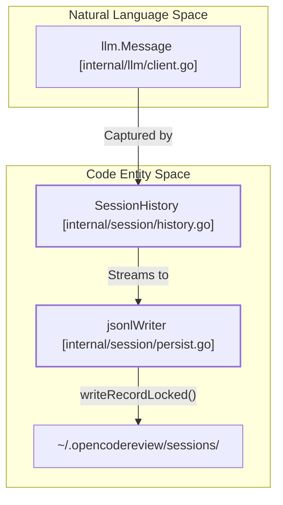
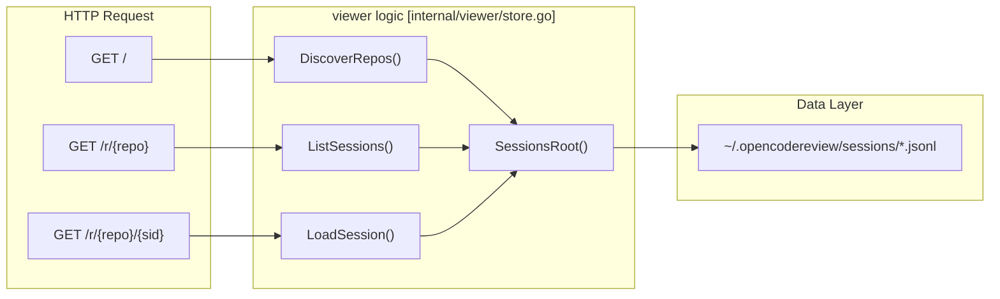

# Session Persistence and WebUI Viewer

Relevant source files

The following files were used as context for generating this wiki page:

- [internal/session/history.go](internal/session/history.go)
- [internal/session/persist.go](internal/session/persist.go)
- [internal/session/persist_test.go](internal/session/persist_test.go)
- [internal/viewer/store.go](internal/viewer/store.go)

OpenCodeReview provides a comprehensive system for recording, persisting, and visualizing the entire lifecycle of a code review session. Every interaction between the agent and the LLM—including planning, tool execution, and memory management—is captured and stored for later inspection.

### Overview of Persistence and Visualization

The system is divided into two primary components:
1.  **Persistence Layer**: A thread-safe mechanism that streams session events to a local JSONL-based storage format in `~/.opencodereview/sessions/` [internal/session/persist.go:16-18]().
2.  **WebUI Viewer**: A built-in web server that allows users to browse historical sessions, inspect LLM prompts/responses, and analyze tool usage through a graphical interface [internal/viewer/store.go:1-4]().

### Session Data Architecture

The `SessionHistory` struct serves as the top-level container for a review run [internal/session/history.go:33-48](). It organizes data into `FileSession` objects per file [internal/session/history.go:51-56](), which further contain `TaskRecord` entries categorized by `TaskType` (Plan, Main, Memory Compression, or Re-Location) [internal/session/history.go:16-23]().

#### Persistence Flow Diagram

This diagram illustrates how the `jsonlWriter` bridges the "Natural Language Space" (LLM messages) to the "Code Entity Space" (persistence structs and file system).

**Sources:** [internal/session/history.go:33-68](), [internal/session/persist.go:19-32](), [internal/session/persist.go:114-122]()

---

### Session Persistence (JSONL Format)

The persistence layer uses a streaming approach to ensure data is saved even if a review process is interrupted. The `jsonlWriter` handles the serialization of events into a `.jsonl` file located in a subdirectory named after the encoded repository path [internal/session/persist.go:92-101]().

**Key Features:**
*   **UUID Chaining**: Every record is assigned a unique ID via `generateUUID()`, and most records include a `parentUuid` to maintain a causal chain of events [internal/session/persist.go:52-63](), [internal/session/persist.go:158-165]().
*   **Thread Safety**: A `sync.Mutex` protects the `jsonlWriter`, allowing multiple concurrent agent subtasks to log events simultaneously without interleaving JSON fragments [internal/session/persist.go:20](), [internal/session/persist.go:150-152]().
*   **Event Types**: The system records `session_start`, `llm_request`, `llm_response`, `llm_error`, `tool_call`, and `session_end` [internal/session/persist.go:125-253]().

For detailed information on the JSONL schema and the writer implementation, see **[Session Persistence (JSONL Format)](#6.1)**.

**Sources:** [internal/session/persist.go:16-32](), [internal/session/persist.go:92-112](), [internal/session/persist.go:158-177]()

---

### WebUI Session Viewer

The `ocr viewer` command launches a local HTTP server that serves a dashboard for exploring stored sessions. The `viewer` package provides functions like `DiscoverRepos` and `LoadSession` to parse the JSONL files into view-optimized structures [internal/viewer/store.go:34-74](), [internal/viewer/store.go:257-258]().

#### Viewer Routing and Components

The viewer uses Go's `html/template` engine to render data retrieved from the `SessionsRoot` [internal/viewer/store.go:18-24]().

| Route | Function | Description |
| :--- | :--- | :--- |
| `/` | `DiscoverRepos` | Lists all repositories found in the sessions directory [internal/viewer/store.go:34](). |
| `/r/{repo}` | `ListSessions` | Lists all sessions for a specific repository, showing metadata like Model and Duration [internal/viewer/store.go:94-119](). |
| `/r/{repo}/{sid}` | `LoadSession` | Detailed view of a session, grouping records into `FileGroup` and `TaskCard` objects [internal/viewer/store.go:218-245](). |

#### WebUI Navigation Diagram

The following diagram shows how the viewer logic maps HTTP requests to the session data stored on disk.

**Sources:** [internal/viewer/store.go:18-24](), [internal/viewer/store.go:34-41](), [internal/viewer/store.go:94-101](), [internal/viewer/store.go:257-260]()

**Task Visualization:**
The viewer organizes LLM interactions into an ordered sequence based on `TaskType`: `PlanTask`, `MainTask`, `MemoryCompressionTask`, and `ReLocationTask` [internal/viewer/store.go:227-232](). This allows developers to see exactly how the agent planned its review, what tools it called, and how it summarized its findings.

For details on the server implementation and template rendering, see **[WebUI Session Viewer](#6.2)**.

**Sources:** [internal/viewer/store.go:197-201](), [internal/viewer/store.go:218-222](), [internal/viewer/store.go:235-245]()
