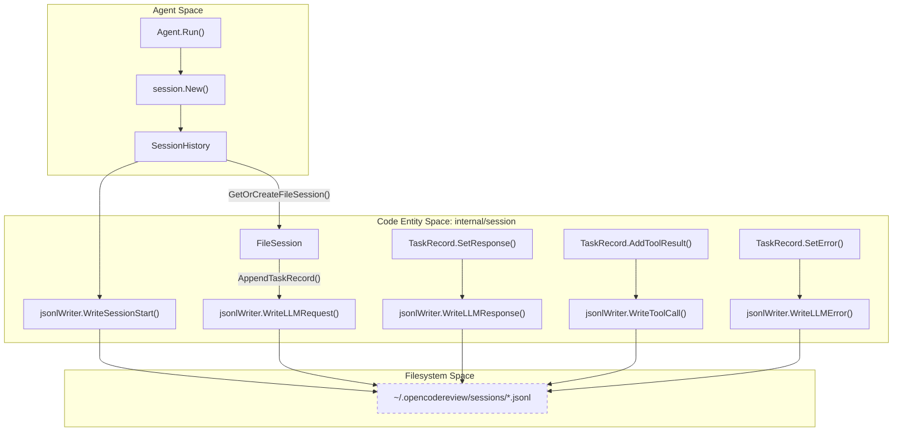
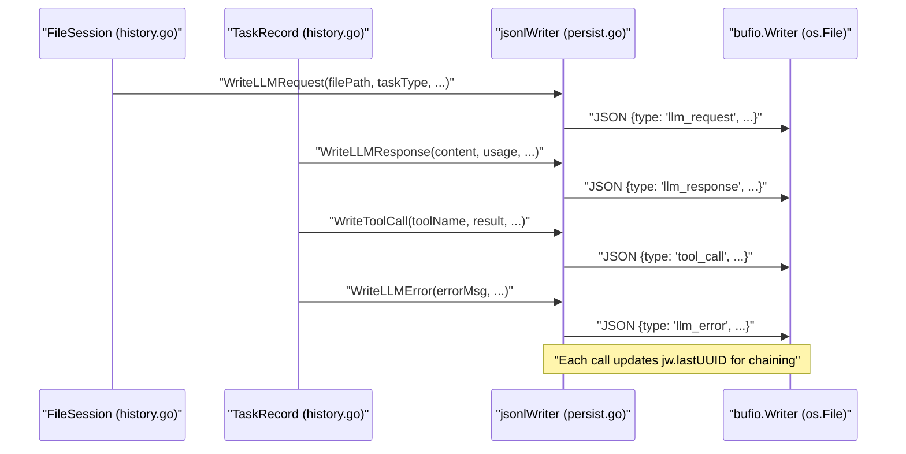

# Session Persistence (JSONL Format)

Relevant source files

The following files were used as context for generating this wiki page:

- [internal/session/history.go](internal/session/history.go)
- [internal/session/persist.go](internal/session/persist.go)
- [internal/session/persist_test.go](internal/session/persist_test.go)
- [internal/viewer/store.go](internal/viewer/store.go)

OpenCodeReview implements a robust session persistence layer that captures every interaction between the agent and the LLM. This data is streamed in real-time to the local filesystem in JSON Lines (JSONL) format, allowing for detailed auditing, debugging, and visualization via the WebUI viewer.

## Overview

The persistence system is managed by the `session` package. It tracks the lifecycle of a code review run, from the initial planning phase to individual file subtasks and tool executions. Every event is recorded as a discrete JSON object on a new line, ensuring that data is preserved even if the process terminates unexpectedly [internal/session/persist.go:16-18]().

### Key Storage Details
- **Location**: Sessions are stored in `~/.opencodereview/sessions/<encoded-repo-path>/` [internal/session/persist.go:98-98]().
- **Filename**: Each session uses a unique UUID as its filename with a `.jsonl` extension [internal/session/persist.go:103-103]().
- **Format**: JSON Lines (JSONL), where each line is a valid JSON object representing a specific event `type`.
- **Repo Encoding**: Repository paths are sanitized by replacing separators and colons with hyphens or underscores to ensure filesystem compatibility [internal/session/persist.go:65-90]().

## Data Model and Event Types

The `SessionHistory` struct acts as the primary orchestrator for a review run [internal/session/history.go:33-48](). It contains multiple `FileSession` objects, which in turn hold `TaskRecord` entries for different phases of the agent's work [internal/session/history.go:51-68]().

### Event Types in JSONL
The `jsonlWriter` emits several distinct record types [internal/session/persist.go:19-32]():

| Event Type | Purpose | Key Fields |
| :--- | :--- | :--- |
| `session_start` | Marks the beginning of a CR run. | `sessionId`, `cwd`, `gitBranch`, `model`, `reviewMode` |
| `llm_request` | Captured when the agent sends messages to the LLM. | `filePath`, `taskType`, `request_no`, `messages` |
| `llm_response` | Captured when the LLM returns content or tool calls. | `content`, `tool_calls`, `usage`, `duration_ms` |
| `llm_error` | Recorded when an LLM request fails. | `error`, `request_no`, `duration_ms` |
| `tool_call` | Recorded after a tool (e.g., `file_read`) is executed. | `tool_name`, `arguments`, `result`, `ok` |
| `session_end` | Final summary of the run. | `files_reviewed`, `duration_seconds`, `llm_failures` |

### Task Classification
Records are categorized into `TaskType` constants to distinguish between different stages of the review pipeline [internal/session/history.go:16-23]():
- `plan_task`: Initial strategy and file selection.
- `main_task`: The actual code analysis and comment generation.
- `memory_compression_task`: Summarization of context when token limits are approached.
- `re_location_task`: Recalculating line numbers for comments.

**Sources:** [internal/session/history.go:15-68](), [internal/session/persist.go:125-253]()

## Implementation Details

### UUID Chaining and Thread Safety
To maintain the causal order of events across concurrent goroutines (since multiple files are reviewed in parallel), the `jsonlWriter` employs **UUID Chaining**. Every record contains a `uuid` and a `parentUuid` [internal/session/persist.go:127-129](). The `parentUuid` points to the `uuid` of the immediately preceding record written to the file [internal/session/persist.go:165-165]().

Thread safety is guaranteed via `sync.Mutex` in both the `SessionHistory` and `jsonlWriter` structs, preventing interleaved writes or race conditions when multiple file subtasks attempt to log events simultaneously [internal/session/persist.go:20-20](), [internal/session/history.go:34-34]().

### Persistence Logic Flow
The following diagram illustrates how the `Agent` (referencing the logical flow) interacts with the `SessionHistory` and `jsonlWriter` to persist data.

**Session Persistence Data Flow**

**Sources:** [internal/session/history.go:103-127](), [internal/session/history.go:131-145](), [internal/session/history.go:169-186](), [internal/session/persist.go:19-32]()

## Detailed Event Sequencing

The system ensures that the relationship between a request, its response, and the subsequent tool calls is preserved.

1.  **Session Start**: `New()` initializes the `jsonlWriter` and immediately calls `WriteSessionStart` [internal/session/history.go:103-126]().
2.  **Request Logging**: When `AppendTaskRecord` is called, it deep-copies the messages and triggers `WriteLLMRequest` [internal/session/history.go:169-186]().
3.  **Response Logging**: Upon receiving an LLM response, `SetResponse` calculates token usage (using `llm.CountTokens` logic) and triggers `WriteLLMResponse` [internal/session/history.go:224-245]().
4.  **Error Logging**: If an LLM call fails, `SetError` increments the failure counter and triggers `WriteLLMError` [internal/session/history.go:257-270]().
5.  **Tool Logging**: If the LLM requests tool execution, `AddToolResult` captures the output and triggers `WriteToolCall` [internal/session/history.go:273-290]().
6.  **Finalization**: `Finalize()` records the end time, the list of files reviewed, and total `llm_failures` [internal/session/history.go:149-164]().

### Code-to-System Mapping
The following diagram maps the logical persistence events to the specific internal functions and the resulting JSON structure.

**Event Mapping: Code to JSONL**

**Sources:** [internal/session/history.go:181-183](), [internal/session/history.go:242-244](), [internal/session/history.go:267-269](), [internal/session/history.go:287-289](), [internal/session/persist.go:114-122]()

## Token Usage Estimation
Because OCR supports multiple LLM providers, it includes estimated token usage in the `llm_response` records. The `TokenUsage` struct captures `prompt_tokens` and `completion_tokens` [internal/session/history.go:72-77](). These values are typically calculated using `tiktoken` (integrated via the `llm` package) to ensure consistent reporting across different backends [internal/session/history.go:237-240]().

**Sources:** [internal/session/history.go:72-77](), [internal/session/history.go:237-240]()
