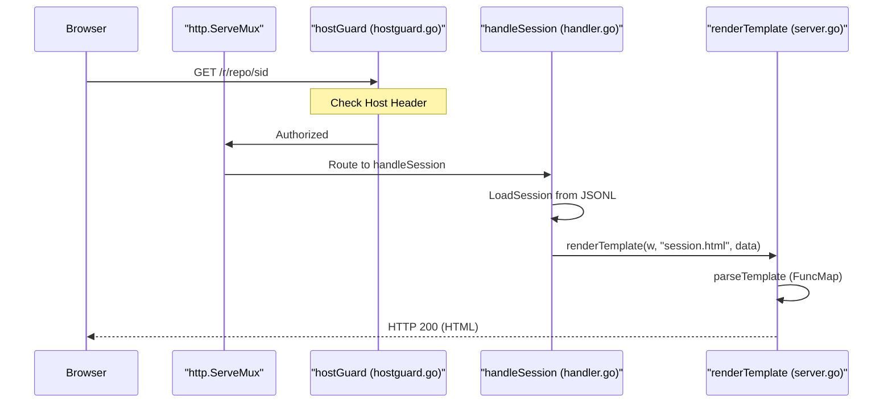
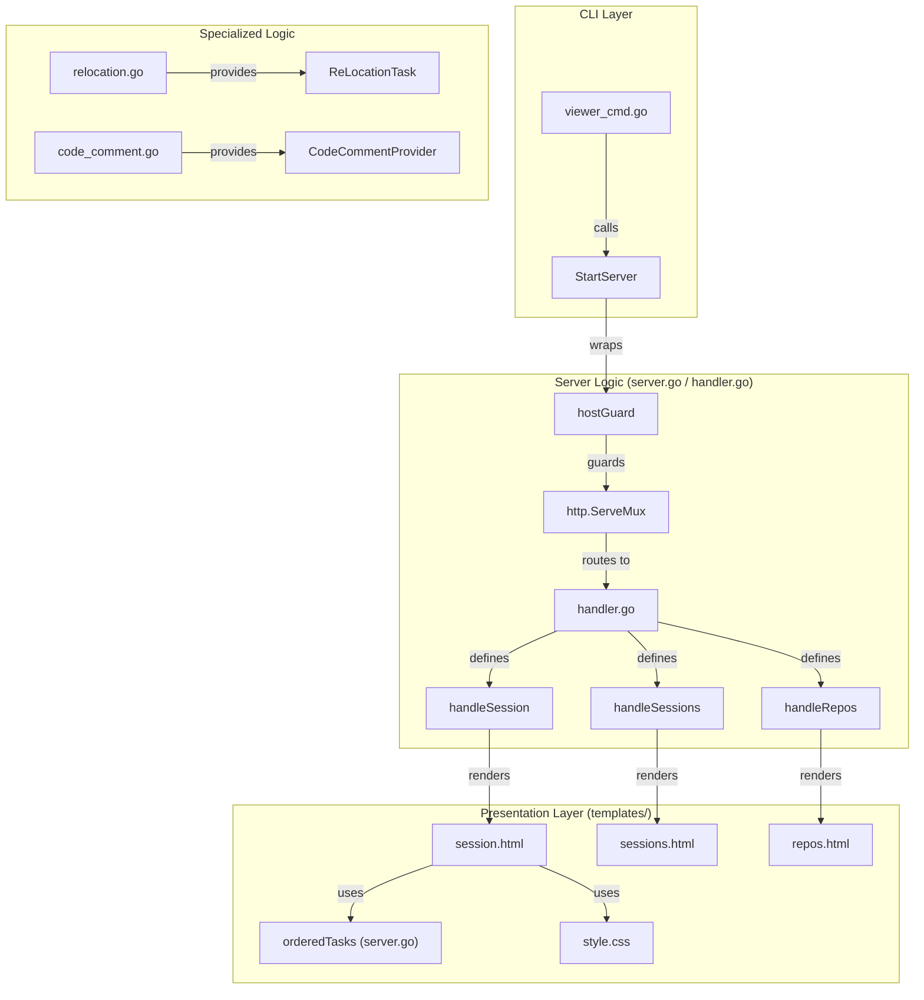

# WebUI Session Viewer

Relevant source files

The following files were used as context for generating this wiki page:

- [cmd/opencodereview/viewer_cmd.go](cmd/opencodereview/viewer_cmd.go)
- [internal/diff/relocation.go](internal/diff/relocation.go)
- [internal/diff/relocation_test.go](internal/diff/relocation_test.go)
- [internal/tool/code_comment.go](internal/tool/code_comment.go)
- [internal/viewer/handler.go](internal/viewer/handler.go)
- [internal/viewer/hostguard.go](internal/viewer/hostguard.go)
- [internal/viewer/hostguard_test.go](internal/viewer/hostguard_test.go)
- [internal/viewer/server.go](internal/viewer/server.go)
- [internal/viewer/static/style.css](internal/viewer/static/style.css)
- [internal/viewer/templates/repos.html](internal/viewer/templates/repos.html)
- [internal/viewer/templates/session.html](internal/viewer/templates/session.html)
- [internal/viewer/templates/sessions.html](internal/viewer/templates/sessions.html)

The WebUI Session Viewer provides a read-only graphical interface for browsing historical code review sessions. It parses the JSONL records generated during reviews and presents them as structured conversations, including token usage statistics, tool execution details, and organized task timelines.

## Command Entry Point

The viewer is launched via the `ocr viewer` (or alias `ocr v`) command [cmd/opencodereview/viewer_cmd.go:46-47](). The command initializes a local HTTP server that defaults to `localhost:5483` [cmd/opencodereview/viewer_cmd.go:18]().

### Execution Flow
1. **Flag Parsing**: `parseViewerFlags` processes the `--addr` argument [cmd/opencodereview/viewer_cmd.go:14-26]().
2. **Server Start**: `runViewer` calls `viewer.StartServer(addr)` [cmd/opencodereview/viewer_cmd.go:39]().
3. **Root Resolution**: The server identifies the session storage location using `SessionsRoot()` [internal/viewer/server.go:16-17]().

**Sources:**
- [cmd/opencodereview/viewer_cmd.go:14-55]()
- [internal/viewer/server.go:16-20]()

## HTTP Infrastructure and Security

The viewer uses a standard `http.ServeMux` for routing [internal/viewer/server.go:22](). To prevent DNS-rebinding attacks that could expose sensitive source code (stored in the JSONL logs), the server wraps the multiplexer in a `hostGuard` middleware [internal/viewer/server.go:49-54]().

### Host Guard and Security
- **`hostGuard`**: Rejects requests whose `Host` header is not on the allowlist [internal/viewer/hostguard.go:85-102]().
- **Default Allowlist**: Includes `localhost`, `127.0.0.1`, and `::1`. If a specific IP is bound via `--addr`, it is automatically added [internal/viewer/hostguard.go:58-71]().
- **Environment Override**: Users can extend the allowlist via the `OCR_VIEWER_ALLOWED_HOSTS` environment variable [internal/viewer/hostguard.go:12, 72-78]().

### Routing Table
| Path | Handler Function | Purpose |
| :--- | :--- | :--- |
| `/` | `handleRepos` | Lists all discovered repositories (directories in the session root) [internal/viewer/server.go:28-30](). |
| `/static/` | `http.FileServer` | Serves embedded CSS and assets [internal/viewer/server.go:25](). |
| `/r/{repo}` | `handleSessions` | Lists all `.jsonl` session files for a specific repository [internal/viewer/server.go:31-38](). |
| `/r/{repo}/{sessionID}` | `handleSession` | Displays full conversation, metadata, and tool calls [internal/viewer/server.go:39-47](). |

**Title: Session Loading and Rendering Flow**

**Sources:**
- [internal/viewer/server.go:22-62]()
- [internal/viewer/hostguard.go:51-102]()
- [internal/viewer/handler.go:9-79]()

## HTML Template Engine

The viewer uses Go's `html/template` package with assets embedded via `embed.FS` [internal/viewer/server.go:13-14]().

### Template Functions (`FuncMap`)
Custom functions process data for display [internal/viewer/server.go:78-131]():
- `formatTime`: Formats timestamps to `2006-01-02 15:04` in the `Asia/Shanghai` zone [internal/viewer/server.go:73-75]().
- `formatDuration`: Converts seconds to `m s` format [internal/viewer/server.go:167-175]().
- `taskTypeClass`: Assigns CSS classes (e.g., `task-plan`, `task-main`, `task-memory`, `task-relocation`) based on the `TaskType` [internal/viewer/server.go:90-103]().
- `orderedTasks`: Sorts conversations into a logical sequence: Plan → Main → Re-location → Memory Compression [internal/viewer/server.go:104-130]().
- `cardCount`: Sums total LLM requests for a file [internal/viewer/server.go:83-89]().

### UI Components
- **Session Header**: Displays CWD, Branch, Review Mode, and Model [internal/viewer/templates/session.html:12-29]().
- **Token Summary**: Shows prompt/completion tokens and a per-file breakdown [internal/viewer/templates/session.html:31-72]().
- **File Accordion**: Groups LLM requests by file path using `
` elements [internal/viewer/templates/session.html:86-151]().
- **Tool Detail**: Nested `
` showing tool arguments and results [internal/viewer/templates/session.html:124-142]().

**Sources:**
- [internal/viewer/server.go:77-176]()
- [internal/viewer/templates/session.html:1-154]()
- [internal/viewer/static/style.css:206-250]()

## System Entity Map

The following diagram maps the logical WebUI components to their implementation files and key data structures.

**Title: WebUI Component and Data Mapping**

**Sources:**
- [cmd/opencodereview/viewer_cmd.go:28-40]()
- [internal/viewer/server.go:16-54]()
- [internal/viewer/handler.go:9-79]()
- [internal/viewer/hostguard.go:85-102]()
- [internal/viewer/server.go:104-130]()
- [internal/diff/relocation.go:19-27]()
