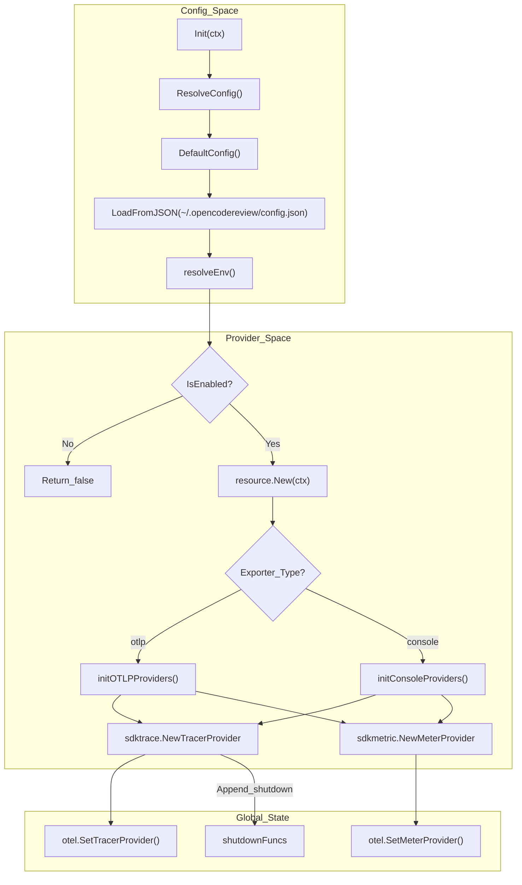
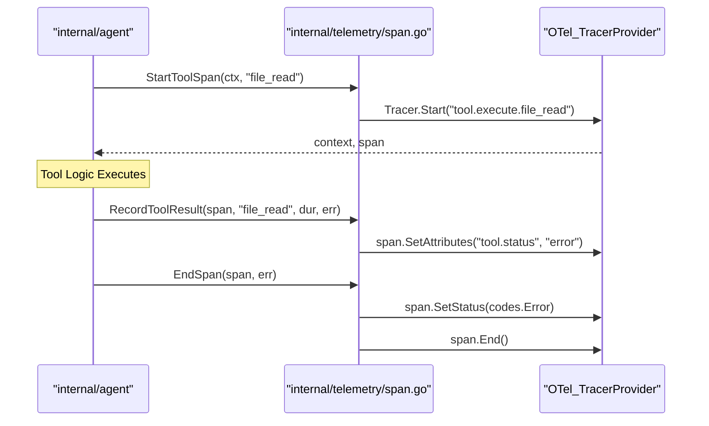

# Telemetry and Observability

Relevant source files

The following files were used as context for generating this wiki page:

- [cmd/opencodereview/config_cmd.go](cmd/opencodereview/config_cmd.go)
- [cmd/opencodereview/llm_cmd.go](cmd/opencodereview/llm_cmd.go)
- [internal/llm/resolver.go](internal/llm/resolver.go)
- [internal/llm/resolver_test.go](internal/llm/resolver_test.go)
- [internal/telemetry/config.go](internal/telemetry/config.go)
- [internal/telemetry/events.go](internal/telemetry/events.go)
- [internal/telemetry/exporter.go](internal/telemetry/exporter.go)
- [internal/telemetry/metrics.go](internal/telemetry/metrics.go)
- [internal/telemetry/provider.go](internal/telemetry/provider.go)
- [internal/telemetry/shutdown.go](internal/telemetry/shutdown.go)
- [internal/telemetry/span.go](internal/telemetry/span.go)

The `internal/telemetry` package provides a unified observability layer for OpenCodeReview based on the OpenTelemetry (OTel) standard [internal/telemetry/config.go:1-3](). It supports tracing, metrics collection, and structured event logging to monitor the performance and behavior of the LLM-driven review pipeline.

The system is designed to support two primary modes of operation:
1.  **Console Mode**: Pretty-prints traces and metrics to stdout for local debugging [internal/telemetry/config.go:14]().
2.  **OTLP Mode**: Exports data via gRPC to a remote collector (e.g., Jaeger, Prometheus, or Honeycomb) for system integration [internal/telemetry/config.go:23-24]().

For details on exporter selection and provider lifecycle, see [OpenTelemetry Setup and Exporters](#7.1).

## Initialization Lifecycle

The telemetry lifecycle is managed through a global initialization sequence that resolves configuration from multiple layers before setting the global `TracerProvider` and `MeterProvider`.

### Configuration Precedence
Configuration is resolved in the following order of increasing priority:
1.  **Defaults**: Defined in `DefaultConfig()` (e.g., "console" exporter, "open-code-review" service name) [internal/telemetry/config.go:29-38]().
2.  **JSON Config**: Loaded from `~/.opencodereview/config.json` via the `telemetry` section [internal/telemetry/config.go:61-106]().
3.  **Environment Variables**: Highest priority. Variables like `OCR_ENABLE_TELEMETRY=1` or `OTEL_EXPORTER_OTLP_ENDPOINT` override all previous settings [internal/telemetry/config.go:42-59]().

### Init Flow Diagram
The following diagram illustrates how `telemetry.Init` sets up the provider ecosystem.

**Telemetry Provider Setup**

**Sources:** [internal/telemetry/provider.go:28-62](), [internal/telemetry/config.go:108-122](), [internal/telemetry/exporter.go:28-88]()

## Tracing and Spans

The system uses spans to track the execution of the review pipeline. If telemetry is disabled, `StartSpan` returns a no-op span to avoid nil pointer exceptions in calling code [internal/telemetry/span.go:19-22]().

### Key Tracing Functions
*   **`StartSpan(ctx, name)`**: Creates a generic span [internal/telemetry/span.go:19-24]().
*   **`StartToolSpan(ctx, toolName)`**: Specialized span for agent tools with `tool.name` attributes [internal/telemetry/span.go:57-60]().
*   **`EndSpan(span, err)`**: Closes the span and automatically records the error status if `err` is non-nil [internal/telemetry/span.go:27-33]().

### Tool Execution Trace Flow
The relationship between the agent's tool execution and the telemetry spans is shown below.

**Tool Execution Telemetry Mapping**

**Sources:** [internal/telemetry/span.go:57-75](), [internal/telemetry/span.go:27-33]()

## Metrics Collection

Metrics are initialized lazily on first use via `ensureMetrics()` to avoid overhead if no data is recorded [internal/telemetry/metrics.go:29-33]().

### Core Metrics
| Metric Name | Type | Description |
| :--- | :--- | :--- |
| `ocr.review.duration_seconds` | Histogram | Total wall-clock time for a review session [internal/telemetry/metrics.go:37-38]() |
| `ocr.files_reviewed_total` | Counter | Total count of files processed [internal/telemetry/metrics.go:41-42]() |
| `ocr.llm.tokens_used` | Counter | Tokens consumed, tagged by `model` and `type` [internal/telemetry/metrics.go:53-54]() |
| `ocr.tool.calls_total` | Counter | Number of tool executions, tagged by `tool.name` [internal/telemetry/metrics.go:61-62]() |

For details on recording specific metrics and span attributes, see [Spans, Metrics, and Content Logging](#7.2).

## Content Logging Toggle

To protect sensitive data, OpenCodeReview includes a `ContentLog` toggle [internal/telemetry/config.go:25]().
*   When `OCR_CONTENT_LOGGING=1` is set, telemetry events may include raw LLM prompts or responses [internal/telemetry/config.go:56-58]().
*   By default, this is `false`, and only metadata (tokens, duration, file paths) is exported [internal/telemetry/config.go:15]().
*   Check this status using `telemetry.ContentLogging()` [internal/telemetry/provider.go:70-76]().

## Console Output and Events

The `events.go` file provides helpers for printing human-readable summaries to the terminal while simultaneously emitting OTel events.

*   **`Event(ctx, name, attrs)`**: Emits a structured span that ends immediately to represent a point-in-time occurrence [internal/telemetry/events.go:20-28]().
*   **`PrintTraceSummary(...)`**: Outputs a final one-line summary to `stdout` containing files reviewed, comments generated, and token usage [internal/telemetry/events.go:69-78]().
*   **Tool Lifecycle Printing**: `PrintToolCallStarted`, `PrintToolCallFinished`, and `PrintToolCallError` provide visual feedback in the CLI (e.g., `▶ file_read`, `✔ file_read (12ms)`) [internal/telemetry/events.go:83-102]().

## Graceful Shutdown

Since exporters (especially OTLP) use batching, it is critical to flush buffers before the CLI process exits.

*   **`Shutdown(ctx)`**: Iterates through all registered `shutdownFuncs` (for both Tracer and Meter providers) and executes them [internal/telemetry/shutdown.go:12-30]().
*   **`ShutdownWithTimeout(ctx, timeout)`**: A helper that ensures the process doesn't hang indefinitely during shutdown, typically called via `defer` in the main entry point [internal/telemetry/shutdown.go:33-39]().

**Sources:** [internal/telemetry/shutdown.go:1-40](), [internal/telemetry/provider.go:15-18]()
