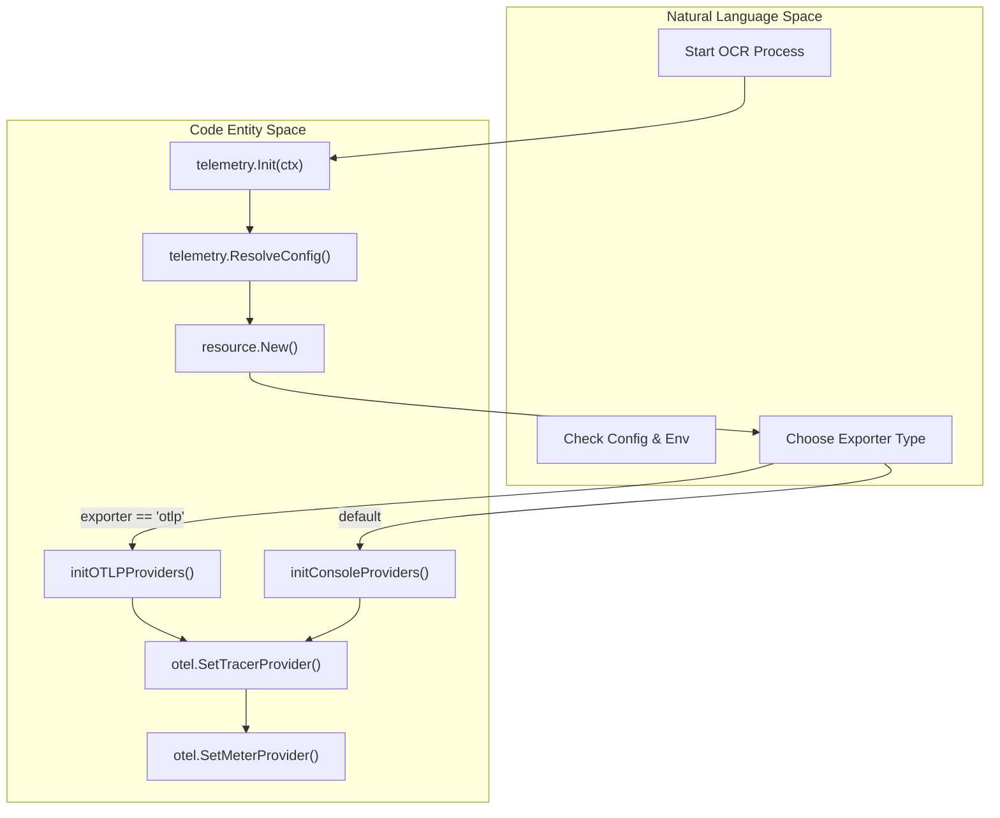
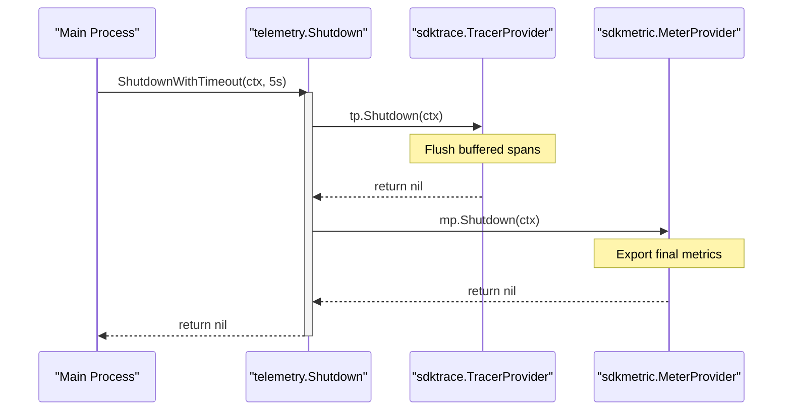

# OpenTelemetry Setup and Exporters

Relevant source files

The following files were used as context for generating this wiki page:

- [internal/telemetry/exporter.go](internal/telemetry/exporter.go)
- [internal/telemetry/provider.go](internal/telemetry/provider.go)
- [internal/telemetry/shutdown.go](internal/telemetry/shutdown.go)

OpenCodeReview (OCR) integrates with OpenTelemetry (OTel) to provide observability into the agent's execution, LLM interactions, and tool performance. This page covers the initialization lifecycle, the selection between OTLP and Console exporters, and the management of global telemetry providers.

## Telemetry Initialization Lifecycle

The telemetry system is initialized via the `telemetry.Init` function [internal/telemetry/provider.go:28-62](). It follows a singleton pattern where the first call performs the setup, and subsequent calls return the existing state [internal/telemetry/provider.go:29-32]().

The initialization process follows these steps:
1. **Configuration Resolution**: Loads settings from environment variables and the local config file via `ResolveConfig` [internal/telemetry/provider.go:34-38]().
2. **Resource Creation**: Constructs an OTel `resource.Resource` containing metadata about the host, process, and OS [internal/telemetry/provider.go:40-49]().
3. **Provider Selection**: Based on the `cfg.Exporter` value, it branches to either OTLP (gRPC) or Console (Stdout) setup [internal/telemetry/provider.go:51-56]().
4. **Global Registration**: Sets the initialized `TracerProvider` and `MeterProvider` as the global defaults for the `go.opentelemetry.io/otel` package [internal/telemetry/provider.go:58-59]().

### Telemetry Initialization Flow

The following diagram illustrates the transition from the `Init` call to the concrete provider implementations.

**Initialization Logic Flow**

Sources: [internal/telemetry/provider.go:28-62](), [internal/telemetry/exporter.go:28-88]()

## Exporter Implementations

OCR supports two primary export modes: OTLP for production monitoring and Console for local debugging.

### OTLP Exporter (gRPC)
The `initOTLPProviders` function configures gRPC-based exporters for both traces and metrics [internal/telemetry/exporter.go:28-59](). 
- **Traces**: Uses `otlptracegrpc` with a batch span processor (`sdktrace.WithBatcher`) [internal/telemetry/exporter.go:30-41]().
- **Metrics**: Uses `otlpmetricgrpc` with a periodic reader (`sdkmetric.NewPeriodicReader`) [internal/telemetry/exporter.go:45-56]().
- **Endpoint**: Targeted via `cfg.OTLPEndpoint` [internal/telemetry/exporter.go:31]().

### Console Exporter (Stdout)
The `initConsoleProviders` function is used for local development or when an OTLP collector is unavailable [internal/telemetry/exporter.go:61-88]().
- **Traces**: Uses `stdouttrace` with `WithPrettyPrint()` for human-readable logs [internal/telemetry/exporter.go:19-21]().
- **Metrics**: Uses `stdoutmetric` with `WithPrettyPrint()` [internal/telemetry/exporter.go:23-26]().

| Feature | OTLP Exporter | Console Exporter |
| :--- | :--- | :--- |
| **Use Case** | Distributed Tracing (Jaeger/Honeycomb) | Local Debugging |
| **Protocol** | gRPC | Standard Output |
| **Span Processor** | `sdktrace.WithBatcher` | `sdktrace.WithBatcher` |
| **Metric Reader** | `sdkmetric.NewPeriodicReader` | `sdkmetric.NewPeriodicReader` |

Sources: [internal/telemetry/exporter.go:18-88]()

## Provider Lifecycle and Shutdown

Telemetry providers are stored in global variables within the `telemetry` package [internal/telemetry/provider.go:15-20](). To prevent data loss, OCR maintains a list of `shutdownFuncs` that are populated during provider initialization [internal/telemetry/exporter.go:43, 58, 74, 87]().

### Graceful Shutdown Sequence
The shutdown sequence ensures all buffered spans and metrics are flushed to the backend before the process terminates.

1. **`Shutdown(ctx)`**: Iterates through all registered shutdown functions and executes them [internal/telemetry/shutdown.go:12-30]().
2. **`ShutdownWithTimeout(ctx, timeout)`**: A wrapper that enforces a deadline (typically via `context.WithTimeout`) to prevent the process from hanging if the telemetry backend is unresponsive [internal/telemetry/shutdown.go:33-39]().

**Telemetry Shutdown Architecture**

Sources: [internal/telemetry/shutdown.go:10-39](), [internal/telemetry/provider.go:15-20]()

## Content Logging Toggle
The system includes a security/privacy toggle `ContentLogging()` [internal/telemetry/provider.go:69-77](). When enabled via `OCR_CONTENT_LOGGING`, OCR will include raw LLM prompts and tool outputs in the telemetry spans. This is checked by the agent before attaching sensitive data to attributes [internal/telemetry/provider.go:71-76]().

Sources: [internal/telemetry/provider.go:69-77]()
