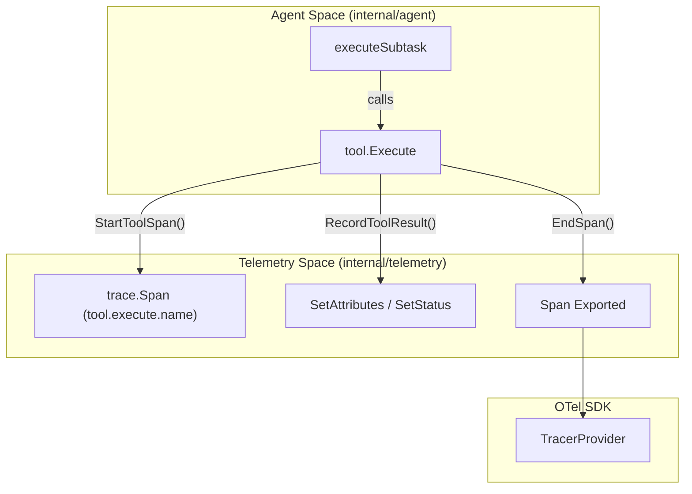

# Spans, Metrics, and Content Logging

<details>
<summary>Relevant source files</summary>

The following files were used as context for generating this wiki page:

- [internal/telemetry/events.go](internal/telemetry/events.go)
- [internal/telemetry/metrics.go](internal/telemetry/metrics.go)
- [internal/telemetry/span.go](internal/telemetry/span.go)

</details>


This page details the implementation of observability within OpenCodeReview (OCR). It covers how the system uses OpenTelemetry (OTel) to track execution flow via spans, collect performance and usage data via metrics, and manage the logging of sensitive LLM interactions.

## Tracing and Spans

OCR uses OpenTelemetry spans to provide a detailed trace of the review process. Spans are created for major logical units, specifically focusing on LLM API calls and Agent tool executions.

### Span Lifecycle and Management
The telemetry package provides wrapper functions to handle span creation and termination, ensuring that if telemetry is disabled, the system gracefully falls back to no-op operations.

*   **`StartSpan`**: The primary entry point for creating a new span. It checks `IsEnabled()` before calling the tracer [internal/telemetry/span.go:19-24]().
*   **`EndSpan`**: Finalizes a span and automatically records error status and details if an error is provided [internal/telemetry/span.go:27-33]().
*   **`SetAttr`**: A type-safe helper to attach attributes (string, int, bool, float64) to an active span [internal/telemetry/span.go:36-54]().

### Tool Execution Spans
Every tool call made by the Agent is wrapped in a specific "tool" span. This allows for granular performance analysis of individual tools like `file_read` or `code_search`.

*   **`StartToolSpan`**: Automatically prefixes the span name with `tool.execute.` and attaches the `tool.name` attribute [internal/telemetry/span.go:57-60]().
*   **`RecordToolResult`**: Captures the tool's duration, status ("ok" or "error"), and error messages [internal/telemetry/span.go:63-75]().

### Trace Events
For point-in-time occurrences that do not represent a duration, OCR uses Trace Events.
*   **`Event` / `Eventf`**: Emits a structured event as a span with immediate end [internal/telemetry/events.go:20-33]().
*   **`PhaseEvent`**: Specifically used to record the completion of review phases (e.g., Plan, Main Task Loop) along with the file path and duration [internal/telemetry/events.go:50-61]().

### Data Flow: Agent to Telemetry
The following diagram illustrates how the `Agent` and its tool system interact with the `telemetry` package to generate spans.

**Diagram: Agent Tool Execution Trace Flow**

Sources: [internal/telemetry/span.go:57-75](), [internal/telemetry/events.go:50-61]()

---

## Metrics Collection

OCR collects quantitative data using the OpenTelemetry Metrics API. Metrics are initialized lazily via `ensureMetrics()` upon the first recording attempt [internal/telemetry/metrics.go:29-68]().

### Key Metrics
The following table summarizes the primary metrics tracked during a review session:

| Metric Name | Type | Unit | Description |
| :--- | :--- | :--- | :--- |
| `ocr.review.duration_seconds` | Histogram | `s` | Total time for a complete review run [internal/telemetry/metrics.go:37-38]() |
| `ocr.files_reviewed_total` | Counter | `1` | Total number of files processed [internal/telemetry/metrics.go:41-42]() |
| `ocr.comments_generated_total` | Counter | `1` | Total review comments produced [internal/telemetry/metrics.go:45-46]() |
| `ocr.llm.requests_total` | Counter | `1` | Count of LLM API calls (labeled by `model`, `status`) [internal/telemetry/metrics.go:49-50]() |
| `ocr.llm.tokens_used` | Counter | `1` | Token consumption (labeled by `type`, `model`) [internal/telemetry/metrics.go:53-54]() |
| `ocr.llm.request_duration_seconds`| Histogram | `s` | Latency of LLM requests [internal/telemetry/metrics.go:57-58]() |
| `ocr.tool.calls_total` | Counter | `1` | Count of tool executions (labeled by `tool.name`, `status`) [internal/telemetry/metrics.go:61-62]() |

### Recording Logic
*   **`RecordLLMRequest`**: Captures model name, duration, total tokens, and status. It creates attributes for both the request counter and the duration histogram [internal/telemetry/metrics.go:102-120]().
*   **`RecordToolCall`**: Tracks tool usage and performance, distinguishing between "ok" and "error" statuses [internal/telemetry/metrics.go:122-140]().

Sources: [internal/telemetry/metrics.go:12-68](), [internal/telemetry/metrics.go:102-140]()

---

## Content Logging and Privacy

A critical aspect of LLM telemetry is the handling of raw prompt and response content. OCR implements a `content_logging` toggle to control whether this sensitive data is captured in telemetry spans and events.

### The content_logging Toggle
When `content_logging` is disabled (default), OCR avoids attaching raw strings like the full LLM prompt or the generated response to OpenTelemetry attributes. This prevents sensitive code or proprietary prompts from being exported to external OTLP collectors.

### Console Observability
While OpenTelemetry handles structured data, OCR also provides human-readable feedback to `stdout` and `stderr` during execution.

*   **`PrintToolCallStarted`**: Summarizes tool arguments for the console. It uses `summarizeArgs` to extract concise info (e.g., file paths or search patterns) while omitting large data chunks [internal/telemetry/events.go:83-90]().
*   **`summarizeArgs`**: Specifically looks for keys like `path`, `search`, or `query` to display, and truncates other values to 50 characters [internal/telemetry/events.go:106-125]().
*   **`PrintTraceSummary`**: Outputs a final summary to `stdout` including files reviewed, comments generated, and token usage [internal/telemetry/events.go:69-78]().

### Telemetry Implementation Map
The following diagram maps the logical telemetry concepts to the specific code entities that implement them.

**Diagram: Telemetry Code Entity Mapping**
```mermaid
classDiagram
    class "Tracer" {
        <<internal/telemetry/span.go>>
        +StartSpan(ctx, name)
        +StartToolSpan(ctx, toolName)
        +EndSpan(span, err)
    }
    class "Meter" {
        <<internal/telemetry/metrics.go>>
        +RecordLLMRequest(ctx, model, dur, tokens, status)
        +RecordToolCall(ctx, name, dur, ok)
        +RecordReviewDuration(ctx, dur)
    }
    class "Events" {
        <<internal/telemetry/events.go>>
        +PhaseEvent(ctx, phase, path, dur, err)
        +PrintToolCallStarted(name, args)
        +PrintTraceSummary(files, comments, tokens, dur)
    }

    Tracer --|> "otel.Tracer" : wraps
    Meter --|> "otel.Meter" : wraps
    Events ..> Tracer : uses for PhaseEvent
```
Sources: [internal/telemetry/span.go:1-60](), [internal/telemetry/metrics.go:1-140](), [internal/telemetry/events.go:1-125]()
