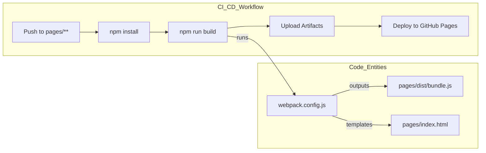

# Project Website (pages/)

<details>
<summary>Relevant source files</summary>

The following files were used as context for generating this wiki page:

- [.github/workflows/deploy-pages.yml](.github/workflows/deploy-pages.yml)
- [pages/index.html](pages/index.html)
- [pages/src/App.tsx](pages/src/App.tsx)
- [pages/src/components/BenchmarkSection.tsx](pages/src/components/BenchmarkSection.tsx)
- [pages/src/components/HighlightsSection.tsx](pages/src/components/HighlightsSection.tsx)
- [pages/src/components/LandingPage.tsx](pages/src/components/LandingPage.tsx)
- [pages/src/components/Navbar.tsx](pages/src/components/Navbar.tsx)
- [pages/src/index.tsx](pages/src/index.tsx)
- [pages/src/styles/index.css](pages/src/styles/index.css)
- [pages/webpack.config.js](pages/webpack.config.js)

</details>


The `pages/` directory contains the source code for the OpenCodeReview marketing and documentation website. This is a single-page application (SPA) built with **React** and **TypeScript**, styled using **Tailwind CSS**, and bundled with **Webpack**. The site serves as the public face of the project, providing a landing page, benchmark results, and a quick-start guide.

## System Architecture

The website is decoupled from the Go-based CLI and review engine. It uses a modern frontend toolchain to generate a static build suitable for hosting on platforms like GitHub Pages.

### Frontend Stack and Build Toolchain

The project utilizes a standard React ecosystem for development and production builds:

*   **Framework**: React 18 using the Functional Component model [pages/src/index.tsx:9-19]().
*   **Routing**: `react-router-dom` with `HashRouter` to support static hosting environments where server-side routing is unavailable [pages/src/index.tsx:3,14]().
*   **Styling**: Tailwind CSS for utility-first styling, integrated via `postcss-loader` [pages/src/styles/index.css:1-3](), [pages/webpack.config.js:30]().
*   **Bundling**: Webpack 5 with `babel-loader` for TypeScript and JSX transpilation [pages/webpack.config.js:6-37]().
*   **Development**: A dedicated dev server runs on port `3030` with history API fallback for SPA routing [pages/webpack.config.js:41-48]().

### Website Component Hierarchy

The application entry point is `index.tsx`, which wraps the `App` component in a `LanguageProvider` for internationalization and a `HashRouter` for navigation.

**Website Component Structure**

```mermaid
graph TD
    subgraph "Entry_Point"
        "index.tsx" --> "LanguageProvider"
        "LanguageProvider" --> "HashRouter"
        "HashRouter" --> "App.tsx"
    end

    subgraph "Routing_Layer"
        "App.tsx" --> "Routes"
        "Routes" -- "/" --> "LandingPage"
        "Routes" -- "/docs" --> "DocsPage"
    end

    subgraph "LandingPage_Structure"
        "LandingPage" --> "Navbar"
        "LandingPage" --> "HeroSection"
        "LandingPage" --> "HighlightsSection"
        "LandingPage" --> "WhySection"
        "LandingPage" --> "FeaturesSection"
        "LandingPage" --> "BenchmarkSection"
        "LandingPage" --> "QuickStartSection"
    end
```

**Sources:** [pages/src/index.tsx:1-20](), [pages/src/App.tsx:1-16](), [pages/src/components/LandingPage.tsx:25-35]().

## Configuration and Styling

The visual identity of the project is defined through a combination of Tailwind utilities and custom CSS. It includes a "terminal" or "agentic" aesthetic using noise overlays, glassmorphism, and glowing borders [pages/src/styles/index.css:21-113]().

The Webpack configuration handles environment-specific logic, such as setting the `publicPath` to `/open-code-review/` for production builds to ensure compatibility with GitHub Pages subpaths [pages/webpack.config.js:10]().

**Deployment Pipeline**
The site is automatically built and deployed via GitHub Actions whenever changes are pushed to the `main` branch within the `pages/` directory [`.github/workflows/deploy-pages.yml:3-7`]().



**Sources:** [`.github/workflows/deploy-pages.yml:19-57`](), [pages/webpack.config.js:7-11]().

## Subsystems

### Landing Page Components
The primary interface is the `LandingPage`, which aggregates several specialized sections. Notably, the `BenchmarkSection` displays a leaderboard comparing OpenCodeReview's performance (using models like Claude-4.6-Opus and Qwen-3.6-Plus) against other tools [pages/src/components/BenchmarkSection.tsx:20-141]().

For details, see [Landing Page Components](#8.1).

### Internationalization (i18n)
The website supports multiple languages (English and Chinese) through a custom i18n system. This system uses a React Context (`LanguageProvider`) to provide the `t` translation function and current language state to components like `Navbar` and `HighlightsSection` [pages/src/components/Navbar.tsx:12](), [pages/src/components/HighlightsSection.tsx:5]().

For details, see [Internationalization (i18n)](#8.2).

## Key Code Entities

| Entity | Path | Role |
| :--- | :--- | :--- |
| `LanguageProvider` | `pages/src/i18n/index.tsx` | Context provider for multi-language support [pages/src/index.tsx:13](). |
| `HashRouter` | `pages/src/index.tsx` | Handles client-side routing for static hosting [pages/src/index.tsx:14](). |
| `webpack.config.js` | `pages/webpack.config.js` | Defines the build pipeline and dev server settings [pages/webpack.config.js:4-55](). |
| `LandingPage` | `pages/src/components/LandingPage.tsx` | Root component for the main marketing site [pages/src/components/LandingPage.tsx:11-36](). |
| `BenchmarkSection` | `pages/src/components/BenchmarkSection.tsx` | Renders the model performance leaderboard [pages/src/components/BenchmarkSection.tsx:149-220](). |
| `App` | `pages/src/App.tsx` | Main routing component defining available pages [pages/src/App.tsx:6-13](). |

**Sources:** [pages/src/index.tsx:13-17](), [pages/webpack.config.js:4-11](), [pages/src/App.tsx:6-13](), [pages/src/components/LandingPage.tsx:25-35]().
