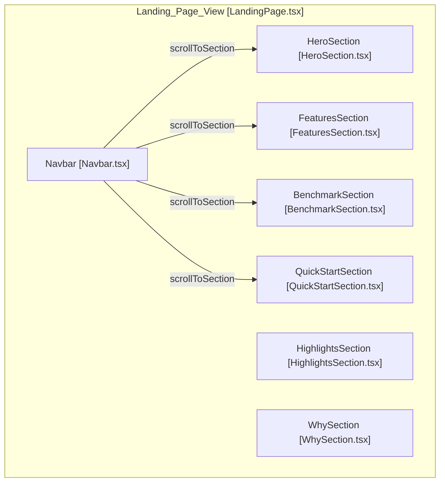
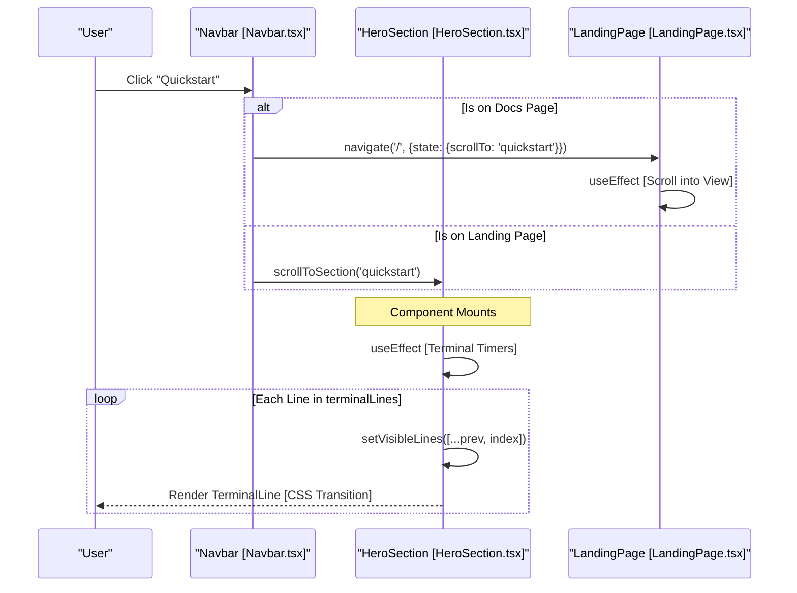

# Landing Page Components

Relevant source files

The following files were used as context for generating this wiki page:

- [.github/workflows/deploy-pages.yml](.github/workflows/deploy-pages.yml)
- [pages/index.html](pages/index.html)
- [pages/src/components/BenchmarkSection.tsx](pages/src/components/BenchmarkSection.tsx)
- [pages/src/components/FeaturesSection.tsx](pages/src/components/FeaturesSection.tsx)
- [pages/src/components/HeroSection.tsx](pages/src/components/HeroSection.tsx)
- [pages/src/components/HighlightsSection.tsx](pages/src/components/HighlightsSection.tsx)
- [pages/src/components/LandingPage.tsx](pages/src/components/LandingPage.tsx)
- [pages/src/components/Navbar.tsx](pages/src/components/Navbar.tsx)
- [pages/src/components/QuickStartSection.tsx](pages/src/components/QuickStartSection.tsx)
- [pages/src/components/WhySection.tsx](pages/src/components/WhySection.tsx)
- [pages/src/pages/DocsPage.tsx](pages/src/pages/DocsPage.tsx)
- [pages/src/styles/index.css](pages/src/styles/index.css)
- [pages/webpack.config.js](pages/webpack.config.js)

The landing page of OpenCodeReview is a React-based single-page application (SPA) designed to provide a high-fidelity marketing and onboarding experience. It utilizes a modular component architecture, Tailwind CSS for styling, and an i18n system for multi-language support.

## Component Architecture

The landing page is orchestrated by the `LandingPage` component, which serves as a layout container for several specialized functional sections.

### Data Flow and Navigation
The `LandingPage` component manages top-level navigation state. It utilizes `useLocation` from `react-router-dom` to handle deep-linking to specific sections (e.g., `#features`, `#benchmark`) via smooth scrolling [pages/src/components/LandingPage.tsx:11-22]().

**Component Hierarchy Diagram**
This diagram maps the logical sections of the landing page to their respective React component implementations.

Sources: [pages/src/components/LandingPage.tsx:1-34](), [pages/src/components/Navbar.tsx:14-18](), [pages/src/components/Navbar.tsx:31-37]()

---

## Component Details

### Navbar
The `Navbar` provides the primary navigation and global controls, such as language switching and external links to GitHub.

*   **Scroll Logic**: It tracks the window scroll position to toggle background transparency and blur effects [pages/src/components/Navbar.tsx:25-29]().
*   **I18n Integration**: It triggers `setLanguage` to toggle between English (`en`) and Chinese (`zh`) via the `useTranslation` hook [pages/src/components/Navbar.tsx:12](), [pages/src/components/Navbar.tsx:39-41]().
*   **Routing**: It differentiates between internal section scrolling (on the landing page) and navigation via `navigate` with state (when on the `/docs` page) to trigger scrolling upon arrival [pages/src/components/Navbar.tsx:20-23]().

Sources: [pages/src/components/Navbar.tsx:6-148]()

### HeroSection
The `HeroSection` serves as the initial entry point, featuring a simulated terminal animation to demonstrate the CLI's behavior.

*   **Terminal Animation**: Uses a `terminalLines` array to simulate real-time output of an `ocr review` command, including tool calls like `file_read` and `code_search` [pages/src/components/HeroSection.tsx:4-17]().
*   **Sequential Rendering**: An `useEffect` hook manages timeouts to push line indices into `visibleLines` state, triggering staggered CSS transitions for each `TerminalLine` [pages/src/components/HeroSection.tsx:46-55]().
*   **Visual Style**: Implements a "glass-strong" effect with scan-line animations and a terminal cursor effect to mimic a developer environment [pages/src/components/HeroSection.tsx:134-143](), [pages/src/styles/index.css:116-120]().

Sources: [pages/src/components/HeroSection.tsx:4-154](), [pages/src/styles/index.css:116-125]()

### HighlightsSection
This component provides key performance metrics and project status at a glance.

*   **Intersection Observer**: Uses an `IntersectionObserver` to trigger entry animations only when the section becomes visible in the viewport [pages/src/components/HighlightsSection.tsx:9-21]().
*   **Metrics**: Displays stats such as the benchmark F1 score (26.1%) and the performance ratio compared to other tools [pages/src/components/HighlightsSection.tsx:23-48]().

Sources: [pages/src/components/HighlightsSection.tsx:4-88]()

### BenchmarkSection
This component displays a competitive leaderboard comparing OpenCodeReview's performance against other tools using various LLM backends.

*   **Data Structure**: Uses the `LeaderboardEntry` interface to define metrics like `f1`, `precision`, and `recall` [pages/src/components/BenchmarkSection.tsx:4-18]().
*   **Static Data**: The `leaderboardData` constant contains results for models including `Claude-4.6-Opus`, `Qwen-3.6-Plus`, and `GLM-4.7` [pages/src/components/BenchmarkSection.tsx:20-141]().
*   **Interaction**: Rows highlight on hover using `setHoveredRow` to improve readability [pages/src/components/BenchmarkSection.tsx:150](), [pages/src/components/BenchmarkSection.tsx:196-203]().

Sources: [pages/src/components/BenchmarkSection.tsx:4-220]()

### QuickStartSection
The `QuickStartSection` provides a three-step onboarding guide for users to install and configure the tool.

*   **Step Logic**: Steps are defined in an array including installation (`npm i -g`), configuration (`ocr config set`), and execution (`ocr review`) [pages/src/components/QuickStartSection.tsx:34-70]().
*   **Clipboard Utility**: Includes a `handleCopy` function that supports both modern `navigator.clipboard` and a fallback `textarea` selection method [pages/src/components/QuickStartSection.tsx:72-90]().
*   **Zero-Config Callout**: Highlights the ability to use environment variables (e.g., `ANTHROPIC_AUTH_TOKEN`) instead of the persistent config file [pages/src/components/QuickStartSection.tsx:150-166]().

Sources: [pages/src/components/QuickStartSection.tsx:30-173]()

---

## Visual & Interaction Model

The landing page components share a unified design language based on a "Dark Mode" aesthetic with brand-specific accents.

**Component Interaction & Rendering Flow**
This diagram illustrates how the `HeroSection` manages the simulated terminal state and how the `Navbar` interacts with the global viewport.

Sources: [pages/src/components/HeroSection.tsx:46-55](), [pages/src/components/LandingPage.tsx:13-22](), [pages/src/components/Navbar.tsx:19-22](), [pages/src/components/Navbar.tsx:31-37]()

### Shared UI Elements
*   **Noise Overlay**: A global `noise-overlay` CSS class is applied to section backgrounds using a SVG-based fractal noise texture [pages/src/styles/index.css:21-31]().
*   **Ambient Glow**: Most sections use absolute-positioned divs with high blur values (e.g., `blur-[120px]`) to create "glow orbs" [pages/src/components/HeroSection.tsx:66-68](), [pages/src/components/FeaturesSection.tsx:55-56](), [pages/src/components/BenchmarkSection.tsx:156]().
*   **Glassmorphism**: Components like `feature-card`, `stat-card`, and `code-block` use the `glass` or `glass-strong` classes for backdrop-filter effects [pages/src/styles/index.css:101-113](), [pages/src/components/QuickStartSection.tsx:112]().

Sources: [pages/src/styles/index.css:21-113](), [pages/src/components/LandingPage.tsx:25-32](), [pages/src/components/FeaturesSection.tsx:53-58](), [pages/src/components/QuickStartSection.tsx:112-116]()
