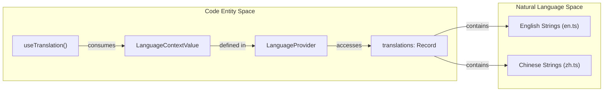

# Internationalization (i18n)

<details>
<summary>Relevant source files</summary>

The following files were used as context for generating this wiki page:

- [pages/src/i18n/context.tsx](pages/src/i18n/context.tsx)
- [pages/src/i18n/en.ts](pages/src/i18n/en.ts)
- [pages/src/i18n/index.ts](pages/src/i18n/index.ts)
- [pages/src/i18n/types.ts](pages/src/i18n/types.ts)
- [pages/src/i18n/zh.ts](pages/src/i18n/zh.ts)

</details>


The internationalization (i18n) system for the OpenCodeReview project website (located in `pages/`) provides a robust framework for multi-language support, specifically targeting English (`en`) and Chinese (`zh`). It utilizes React Context for state management, TypeScript for type safety, and local storage for preference persistence.

## Architecture Overview

The i18n system is centralized in the `pages/src/i18n/` directory. It follows a provider pattern where the application is wrapped in a `LanguageProvider` that exposes translation functions and state to all child components.

### Core Components and Data Flow

The system consists of three primary layers:
1.  **Type Definitions**: Defining the supported languages and the structure of translation maps.
2.  **Resource Files**: Static TypeScript objects containing the actual string mappings for each language.
3.  **Context Provider**: A React Context implementation that manages the current language state and provides the `t()` translation function.

### System Data Flow Diagram

The following diagram illustrates how translations flow from raw resource files to the UI components.

**I18n Translation Flow**
```mermaid
graph TD
    subgraph "Resource Space"
        EN["en.ts (TranslationKeys)"]
        ZH["zh.ts (TranslationKeys)"]
    end

    subgraph "Logic Space (context.tsx)"
        LC["LanguageContext"]
        LP["LanguageProvider"]
        GLI["getInitialLanguage()"]
        T_FUNC["t(key: string)"]
    end

    subgraph "Storage Space"
        LS[("localStorage ('ocr-lang')")]
    end

    subgraph "UI Space"
        COMP["React Components"]
        NAV["Navbar (Language Switcher)"]
    end

    LS -.->|Read| GLI
    GLI -->|Initial State| LP
    EN -->|Import| LP
    ZH -->|Import| LP
    LP -->|Provides| LC
    LC -->|Exposes t()| COMP
    NAV -->|setLanguage()| LP
    LP -->|Write| LS
```
Sources: [pages/src/i18n/context.tsx:1-43](), [pages/src/i18n/types.ts:1-4](), [pages/src/i18n/en.ts:1-3]()

## Implementation Details

### Type System
The system uses strict TypeScript types to ensure consistency between different language files.
*   `Language`: A union type restricted to `'en' | 'zh'` [pages/src/i18n/types.ts:1-1]().
*   `TranslationKeys`: A `Record<string, string>` that acts as the map for key-value pairs [pages/src/i18n/types.ts:3-3]().

### Language Persistence
The `getInitialLanguage` function attempts to retrieve the user's preferred language from `localStorage` using the key `ocr-lang`. If no value is found or the value is invalid, it defaults to `'en'` [pages/src/i18n/context.tsx:16-24]().

### The `t` Function
The translation function `t(key: string)` is the primary interface for components. It performs a lookup in the `translations` record based on the active `language`. If a key is missing in the current language map, it gracefully falls back to returning the key string itself [pages/src/i18n/context.tsx:34-36]().

## Resource Structure

Translations are organized by component or section (e.g., `navbar`, `hero`, `features`). This flat-key structure (using dot notation) prevents naming collisions.

| Key Prefix | Description | Example Key |
| :--- | :--- | :--- |
| `navbar.*` | Navigation links and buttons | `navbar.features` |
| `hero.*` | Landing page hero section | `hero.title` |
| `features.*` | Core product feature descriptions | `features.feat1Title` |
| `quickstart.*` | Installation and setup instructions | `quickstart.step1Title` |
| `docs.*` | Documentation page content | `docs.overviewTitle` |

Sources: [pages/src/i18n/en.ts:4-167](), [pages/src/i18n/zh.ts:4-167]()

## Component Consumption

Components consume translations via the `useTranslation` hook. This hook provides access to the `t` function, the current `language`, and the `setLanguage` updater [pages/src/i18n/context.tsx:45-49]().

### Code-to-Logic Mapping

The following diagram shows the relationship between the code entities and the logical translation process.

**Entity Mapping: Component to Translation**

Sources: [pages/src/i18n/context.tsx:6-14](), [pages/src/i18n/context.tsx:45-49](), [pages/src/i18n/index.ts:1-2]()

### Usage Example
When a component needs to render a localized string, it follows this pattern:
1. Call `useTranslation()` to get the `t` function [pages/src/i18n/context.tsx:45-49]().
2. Pass the specific key (e.g., `'hero.title'`) to `t()` [pages/src/i18n/context.tsx:34-36]().
3. The `LanguageProvider` ensures that if `setLanguage` is called elsewhere (e.g., in a Navbar toggle), the component re-renders with the new string [pages/src/i18n/context.tsx:26-43]().

Sources: [pages/src/i18n/context.tsx:26-43](), [pages/src/i18n/context.tsx:45-49]()
