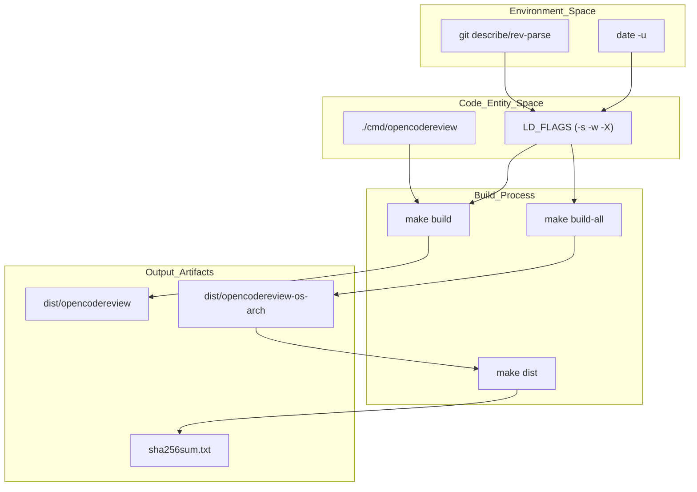
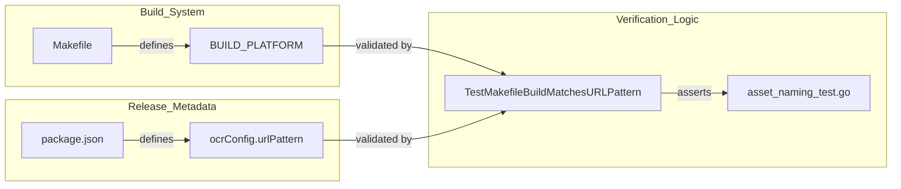

# Makefile and Local Build

Relevant source files

The following files were used as context for generating this wiki page:

- [Makefile](Makefile)
- [go.mod](go.mod)
- [internal/release/asset_naming_test.go](internal/release/asset_naming_test.go)

This page details the build system for OpenCodeReview, centered around a multi-functional `Makefile`. The build process emphasizes static linking for portability, cross-compilation for multiple architectures, and the injection of build-time metadata via linker flags.

## Build System Overview

The build system is designed to produce a single, self-contained binary named `opencodereview` [Makefile:6](). To ensure maximum compatibility across different environments (such as various Linux distributions), the project enforces static linking by setting `CGO_ENABLED=0` within its build macros [Makefile:23]().

### Build Metadata Injection
The `Makefile` dynamically extracts versioning information from the local environment and injects it into the binary using Go's `-X` linker flags [Makefile:17-20](). This allows the `ocr version` command to report accurate build details by populating variables in the `main` package.

| Variable | Source | LD_FLAGS Mapping |
| :--- | :--- | :--- |
| `VERSION` | Git Tag (fallback to `v0.0.0-short-hash`) | `main.Version` |
| `GIT_COMMIT` | `git rev-parse --short HEAD` | `main.GitCommit` |
| `BUILD_DATE` | `date -u +"%Y-%m-%dT%H:%M:%SZ"` | `main.BuildDate` |

Sources: [Makefile:10-20]()

## Makefile Targets

The `Makefile` defines several categories of targets ranging from daily development to full release distribution.

### Development Targets
*   **`build`**: Compiles the binary for the current host architecture and places it in `./dist/opencodereview` [Makefile:29-30]().
*   **`test`**: Runs the Go test suite with the race detector enabled and caching disabled (`-count=1`) [Makefile:32-33]().
*   **`run`**: Triggers a `build` and then immediately executes the binary to review staged changes (`--staged`) in the current repository [Makefile:38-39]().
*   **`fmt` / `vet` / `check`**: Standardizes code formatting and runs static analysis to ensure code quality [Makefile:44-51]().
*   **`clean`**: Removes the `./dist` directory to ensure a fresh build state [Makefile:35-36]().

### Release and Distribution Targets
*   **`build-all`**: Orchestrates the cross-compilation for the entire support matrix including Linux, Darwin, and Windows for both AMD64 and ARM64 architectures [Makefile:72]().
*   **`sha256sum`**: Generates a sorted list of SHA-256 checksums for all binaries in the `dist` folder, outputting to `sha256sum.txt` [Makefile:75-76]().
*   **`dist`**: The primary release target. It cleans previous builds, compiles all platforms, generates checksums, and creates a `VERSION` file [Makefile:79-80]().

Sources: [Makefile:29-81]()

## Cross-Compilation Matrix

OpenCodeReview utilizes a Go build matrix to support common developer environments. Each target uses the `BUILD_PLATFORM` macro to standardize flags, disable CGO, and handle output naming conventions [Makefile:22-26]().

### Supported Platforms
| OS (`GOOS`) | Architecture (`GOARCH`) | Extension | Target Name |
| :--- | :--- | :--- | :--- |
| Linux | amd64 | (none) | `build-linux-amd64` |
| Linux | arm64 | (none) | `build-linux-arm64` |
| Darwin | amd64 | (none) | `build-darwin-amd64` |
| Darwin | arm64 | (none) | `build-darwin-arm64` |
| Windows | amd64 | `.exe` | `build-windows-amd64` |
| Windows | arm64 | `.exe` | `build-windows-arm64` |

Sources: [Makefile:54-72]()

## Build Process Data Flow

The following diagram illustrates how the `Makefile` transforms source code and environment metadata into distributed release artifacts.

### Build Artifact Generation Flow

Sources: [Makefile:10-26](), [Makefile:75-80]()

## Asset Naming and Consistency

The project maintains strict consistency between the `Makefile` build outputs and the distribution metadata defined in `package.json`.

### Asset Naming Verification
The internal test `internal/release/asset_naming_test.go` ensures that the filenames generated by the `Makefile` match the `urlPattern` expected by the installation scripts and npm distribution [internal/release/asset_naming_test.go:133-142]().

*   **URL Pattern**: Assets are expected to follow the format `opencodereview-{os}-{arch}` [internal/release/asset_naming_test.go:81]().
*   **Checksums**: The checksum file must be named exactly `sha256sum.txt` [internal/release/asset_naming_test.go:177-178]().

### Build-to-Release Association

Sources: [internal/release/asset_naming_test.go:13-20](), [internal/release/asset_naming_test.go:133-172]()

## Dependency Management

The project uses Go Modules for dependency management, targeting modern Go features.

*   **`go.mod`**: Defines the module path as `github.com/open-code-review/open-code-review` and requires Go version `1.25.0` or higher [go.mod:1-3]().
*   **Key Dependencies**:
    *   `tiktoken-go`: Used for LLM token counting and encoding [go.mod:7]().
    *   `opentelemetry`: Extensive use of OTel SDK for tracing and metrics [go.mod:8-16]().
    *   `doublestar`: Used for advanced glob pattern matching in file filtering and rule selection [go.mod:6]().

Sources: [go.mod:1-17]()
