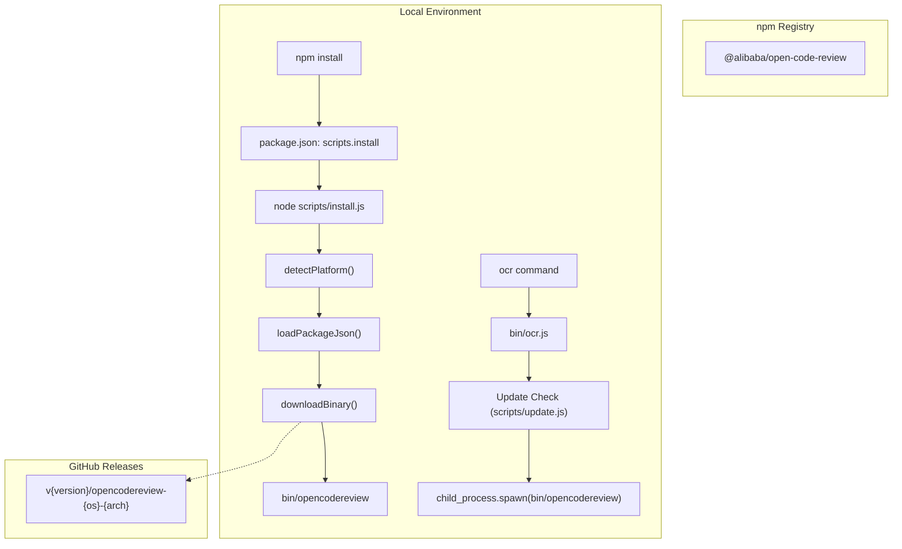
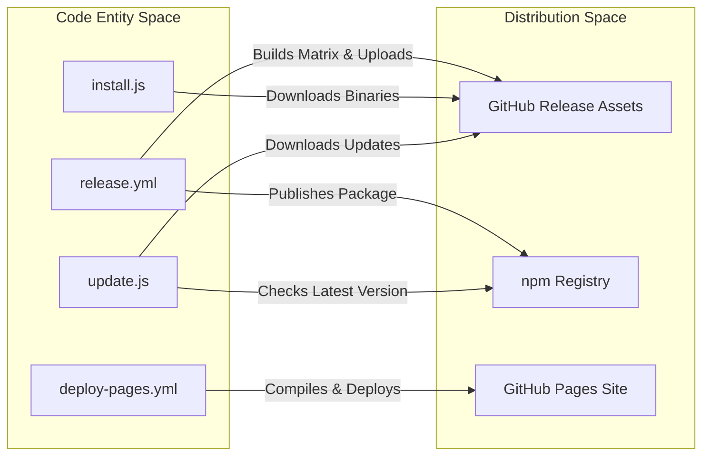

# CI/CD Workflows and npm Publishing

Relevant source files

The following files were used as context for generating this wiki page:

- [.github/workflows/deploy-pages.yml](.github/workflows/deploy-pages.yml)
- [.github/workflows/release.yml](.github/workflows/release.yml)
- [.npmignore](.npmignore)
- [LICENSE](LICENSE)
- [bin/ocr.js](bin/ocr.js)
- [pages/index.html](pages/index.html)
- [pages/src/components/BenchmarkSection.tsx](pages/src/components/BenchmarkSection.tsx)
- [pages/src/components/Navbar.tsx](pages/src/components/Navbar.tsx)
- [pages/webpack.config.js](pages/webpack.config.js)
- [scripts/install.js](scripts/install.js)
- [scripts/publish/_common.sh](scripts/publish/_common.sh)
- [scripts/update.js](scripts/update.js)

This page describes the automated release and deployment pipelines for OpenCodeReview. The project utilizes GitHub Actions to handle multi-platform binary compilation, GitHub Release generation, npm package publishing, and the deployment of the documentation website to GitHub Pages.

## Release Workflow (`release.yml`)

The `release.yml` workflow is the primary distribution pipeline. It is triggered whenever a new tag matching the pattern `v*` is pushed to the repository [.github/workflows/release.yml:3-5](). The workflow is divided into three sequential jobs: `build`, `release`, and `npm-publish`.

### Multi-Arch Build Matrix
The `build` job uses a strategy matrix to cross-compile the Go binary for multiple operating systems and architectures [.github/workflows/release.yml:13-27]().

| OS | Architecture | Binary Name Format |
| :--- | :--- | :--- |
| `linux` | `amd64` | `opencodereview-linux-amd64` |
| `linux` | `arm64` | `opencodereview-linux-arm64` |
| `darwin` | `amd64` | `opencodereview-darwin-amd64` |
| `darwin` | `arm64` | `opencodereview-darwin-arm64` |
| `windows` | `amd64` | `opencodereview-windows-amd64.exe` |
| `windows` | `arm64` | `opencodereview-windows-arm64.exe` |

During compilation, `LD_FLAGS` are used to inject metadata into the `main` package, including the version (from the git tag), the short commit hash, and the build timestamp [.github/workflows/release.yml:41-44](). `CGO_ENABLED=0` ensures the resulting binaries are statically linked [.github/workflows/release.yml:39]().

### Release and Checksum Generation
The `release` job waits for the `build` job to complete [.github/workflows/release.yml:58](). It downloads the artifacts, generates a `sha256sum.txt` file containing the sorted hashes of all binaries using `sha256sum`, and creates a new GitHub Release using the `softprops/action-gh-release` action [.github/workflows/release.yml:61-75]().

### npm Publishing Logic
The final `npm-publish` job handles distribution to the npm registry. It relies on a `NPM_TOKEN` secret and requires `id-token: write` permissions for provenance [.github/workflows/release.yml:77-82]().
- **Version Injection**: The workflow uses `jq` to strip the `v` prefix from the GitHub tag and update the `version` field in `package.json` before publishing [.github/workflows/release.yml:91-92]().
- **Publishing**: It executes `npm publish --access public --provenance` [.github/workflows/release.yml:95]().
- **Exclusions**: The `.npmignore` file ensures that Go source code (`internal/`, `cmd/`), local build artifacts, and internal scripts are excluded from the npm package [.npmignore:1-19]().

**Sources:**
- [.github/workflows/release.yml:1-98]()
- [.npmignore:1-19]()

## The npm Installation and Update Mechanism

OpenCodeReview is distributed on npm as a wrapper. The package contains installation and update scripts that manage the underlying Go binary.

### Data Flow: npm Install and Execution

Title: npm Installation and Binary Resolution

**Sources:**
- [bin/ocr.js:10-40]()
- [scripts/install.js:153-189]()
- [scripts/update.js:143-224]()

### The `install.js` Script
The `scripts/install.js` script handles the initial setup:
1.  **Platform Detection**: `detectPlatform()` identifies the OS and architecture [.scripts/install.js:28-59]().
2.  **Configuration Loading**: It reads `ocrConfig` from `package.json` for the `urlPattern` [.scripts/install.js:61-70]().
3.  **Binary Download**: `downloadBinary()` fetches the platform-specific binary from GitHub [.scripts/install.js:125-141]().
4.  **Checksum Verification**: If a `checksumPattern` exists, it verifies the download against the remote SHA-256 manifest [.scripts/install.js:191-224]().

### The `update.js` Script
The `bin/ocr.js` shim triggers an asynchronous update check via `scripts/update.js` if the cooldown (default 30 minutes) has expired [.bin/ocr.js:12-32](). 
- **Locking**: It uses a lock file at `~/.opencodereview/update.lock` to prevent concurrent update processes [.scripts/update.js:40-67]().
- **Version Comparison**: It fetches the latest version from the npm registry and compares it with the local version using `semverGt` [.scripts/update.js:82-130]().
- **Atomic Swap**: On Windows, it renames the active binary to `.old` before swapping in the new version to handle file locks [.scripts/update.js:199-218]().

**Sources:**
- [scripts/install.js:1-254]()
- [scripts/update.js:1-227]()
- [bin/ocr.js:1-41]()

## Documentation Deployment (`deploy-pages.yml`)

The project website in the `pages/` directory is automatically deployed to GitHub Pages.

### Deployment Pipeline
This workflow triggers on pushes to the `main` branch that modify the `pages/` path [.github/workflows/deploy-pages.yml:3-7]().

1.  **Build Job**:
    - Runs `npm install` and `npm run build` within the `pages` directory [.github/workflows/deploy-pages.yml:29-35]().
    - Uses Webpack with `babel-loader` and `HtmlWebpackPlugin` to bundle the React/TypeScript source [.pages/webpack.config.js:12-54]().
    - Prepares a `_site` directory containing the bundled assets and `logo.svg` [.github/workflows/deploy-pages.yml:37-41]().
2.  **Deploy Job**:
    - Uses `actions/deploy-pages` to publish the artifact to the `github-pages` environment [.github/workflows/deploy-pages.yml:54-57]().

**Sources:**
- [.github/workflows/deploy-pages.yml:1-57]()
- [pages/webpack.config.js:1-56]()

## Summary of Release Entities

Title: Release Entity Mapping

**Sources:**
- [.github/workflows/release.yml:69-75]()
- [.github/workflows/release.yml:94-95]()
- [.github/workflows/deploy-pages.yml:54-57]()
- [scripts/install.js:179-186]()
- [scripts/update.js:82-120]()
