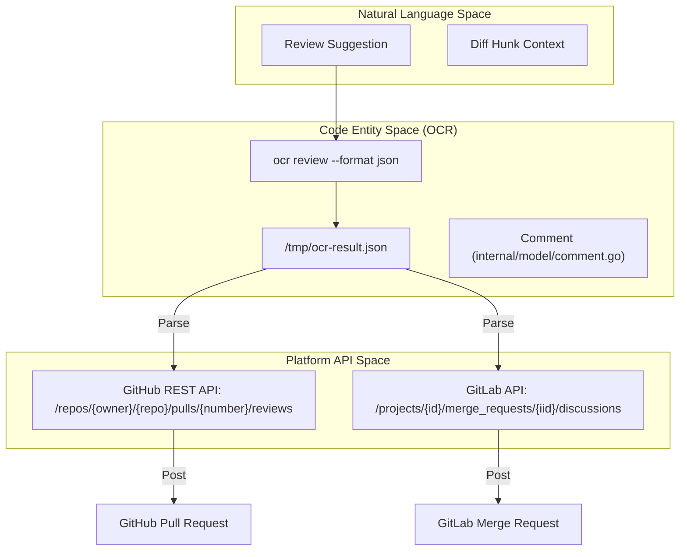
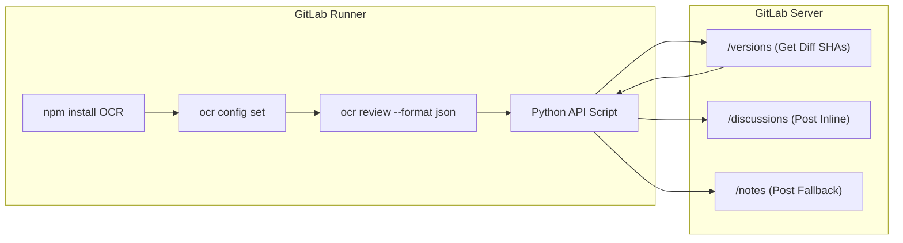

# CI/CD Integration Examples

Relevant source files

The following files were used as context for generating this wiki page:

- [examples/README.md](examples/README.md)
- [examples/github_actions/README.md](examples/github_actions/README.md)
- [examples/github_actions/ocr-review.yml](examples/github_actions/ocr-review.yml)
- [examples/gitlab_ci/.gitlab-ci.yml](examples/gitlab_ci/.gitlab-ci.yml)
- [examples/gitlab_ci/README.md](examples/gitlab_ci/README.md)

This page provides reference implementations for integrating OpenCodeReview (OCR) into automated CI/CD pipelines. It covers GitHub Actions and GitLab CI, detailing how to trigger reviews on Pull Requests (PRs) or Merge Requests (MRs), parse the resulting JSON output, and post inline comments using platform-specific APIs.

## Integration Architecture

The integration follows a standard pattern: the CI runner executes the `ocr review` command with the `--format json` flag, captures the output, and then uses a script (Node.js for GitHub, Python for GitLab) to translate the JSON entities into platform-native review comments.

Title: CI/CD Data Flow and Entity Mapping

**Sources:**
- [examples/github_actions/ocr-review.yml:94-98]()
- [examples/gitlab_ci/.gitlab-ci.yml:41-45]()

---

## GitHub Actions Integration

The GitHub Actions implementation utilizes `actions/github-script` to interact with the GitHub REST API. It supports triggers on PR creation and manual triggers via PR comments.

### Workflow Configuration
The workflow requires `OCR_LLM_URL` and `OCR_LLM_AUTH_TOKEN` as repository secrets [examples/github_actions/ocr-review.yml:10-12](). It grants `pull-requests: write` permissions to allow the `GITHUB_TOKEN` to post review comments [examples/github_actions/ocr-review.yml:27-29]().

### Trigger Mechanisms
- **Automatic**: Triggers when a PR is opened [examples/github_actions/ocr-review.yml:22-23]().
- **On-Demand**: Triggers when a user comments with `/open-code-review` or `@open-code-review` [examples/github_actions/ocr-review.yml:24-25]().

### Review Execution and Parsing
The workflow installs OCR via npm and runs the review command, comparing `origin/${{ github.base_ref }}` to `origin/${{ github.head_ref }}` [examples/github_actions/ocr-review.yml:69-96]().

The results are parsed in a `github-script` block:
1. **JSON Loading**: Reads `/tmp/ocr-result.json` [examples/github_actions/ocr-review.yml:110-117]().
2. **Comment Formatting**: Formats suggestions using GitHub's `suggestion` markdown syntax [examples/github_actions/ocr-review.yml:180-210]().
3. **API Call**: Uses `github.rest.pulls.createReview` to submit all inline comments in a single batch [examples/github_actions/ocr-review.yml:218-226]().

**Sources:**
- [examples/github_actions/ocr-review.yml:1-230]()
- [examples/github_actions/README.md:1-187]()

---

## GitLab CI Integration

The GitLab CI implementation uses a Python script within the `.gitlab-ci.yml` file to interact with the GitLab Discussions API.

### Pipeline Stage: `code-review`
The job runs in a `node:20` image and is restricted to `merge_requests` [examples/gitlab_ci/.gitlab-ci.yml:18-21](). It requires a `GITLAB_API_TOKEN` with `api` scope because the default `CI_JOB_TOKEN` lacks permissions for MR discussions [examples/gitlab_ci/README.md:56-58]().

### Logic Flow in GitLab

Title: GitLab CI Review Logic

### Position Calculation
GitLab requires specific `position` metadata to post inline comments, including `base_sha`, `start_sha`, and `head_sha` [examples/gitlab_ci/.gitlab-ci.yml:90-98](). The Python script fetches these from the `/merge_requests/{iid}/versions` endpoint to ensure comments align with the correct diff version [examples/gitlab_ci/.gitlab-ci.yml:168-183]().

### Fallback Mechanism
If a comment cannot be posted inline (e.g., the line is not part of the diff), the script catches the error and posts a general MR note with file and line references instead [examples/gitlab_ci/.gitlab-ci.yml:117-137]().

**Sources:**
- [examples/gitlab_ci/.gitlab-ci.yml:1-200]()
- [examples/gitlab_ci/README.md:1-120]()

---

## Advanced Customization

### Background Context
Both integrations support the `--background` flag. Passing the PR/MR title or description provides the LLM with high-level intent, improving review relevance [examples/github_actions/README.md:105-112](), [examples/gitlab_ci/README.md:112-119]().

### Concurrency Control
For large changesets, the `--concurrency` flag can be adjusted to limit simultaneous LLM requests and avoid rate limits [examples/github_actions/README.md:96-102]().

### Preventing Redundant Reviews
In GitLab CI, a wrapper script can be used to check for existing OCR comments before running a new review, saving tokens on subsequent pushes to the same MR [examples/gitlab_ci/README.md:125-168]().

**Sources:**
- [examples/github_actions/README.md:94-112]()
- [examples/gitlab_ci/README.md:101-168]()
