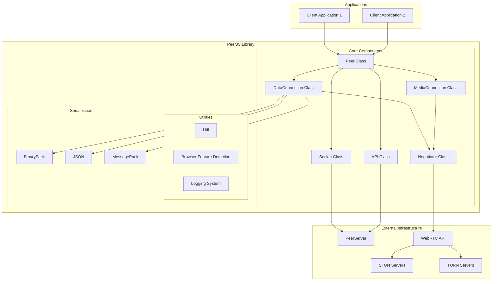
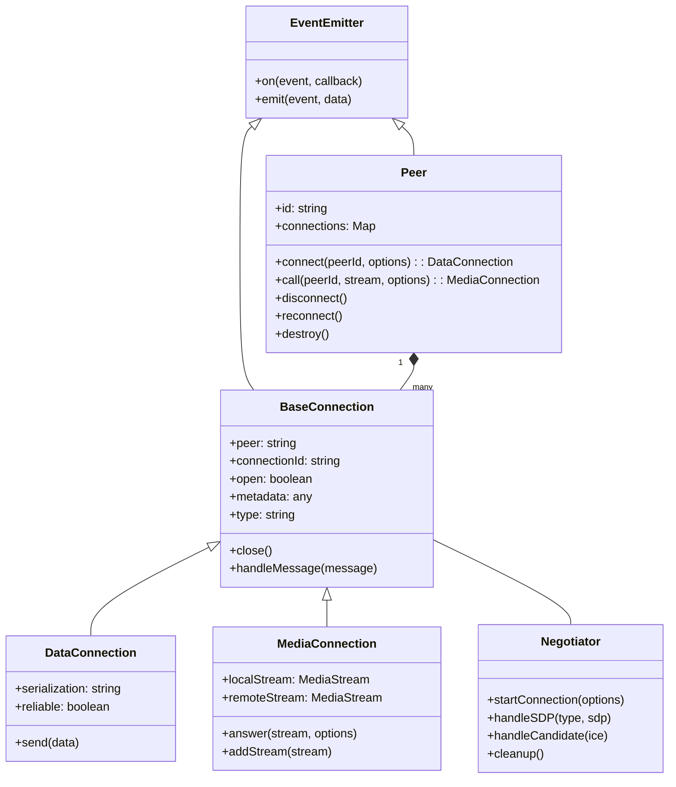
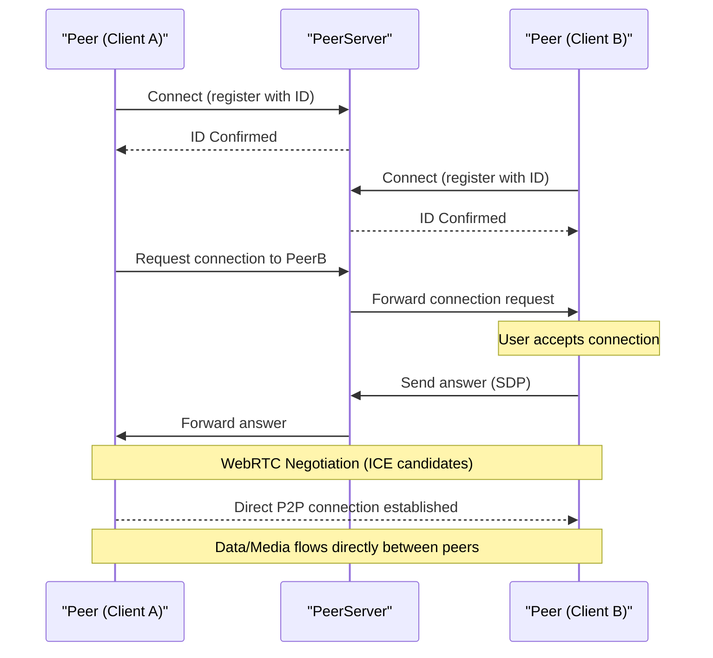
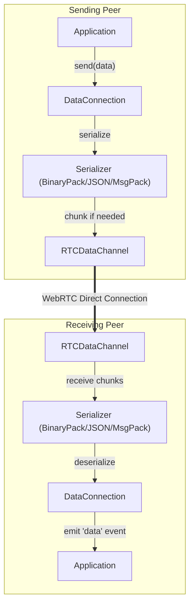
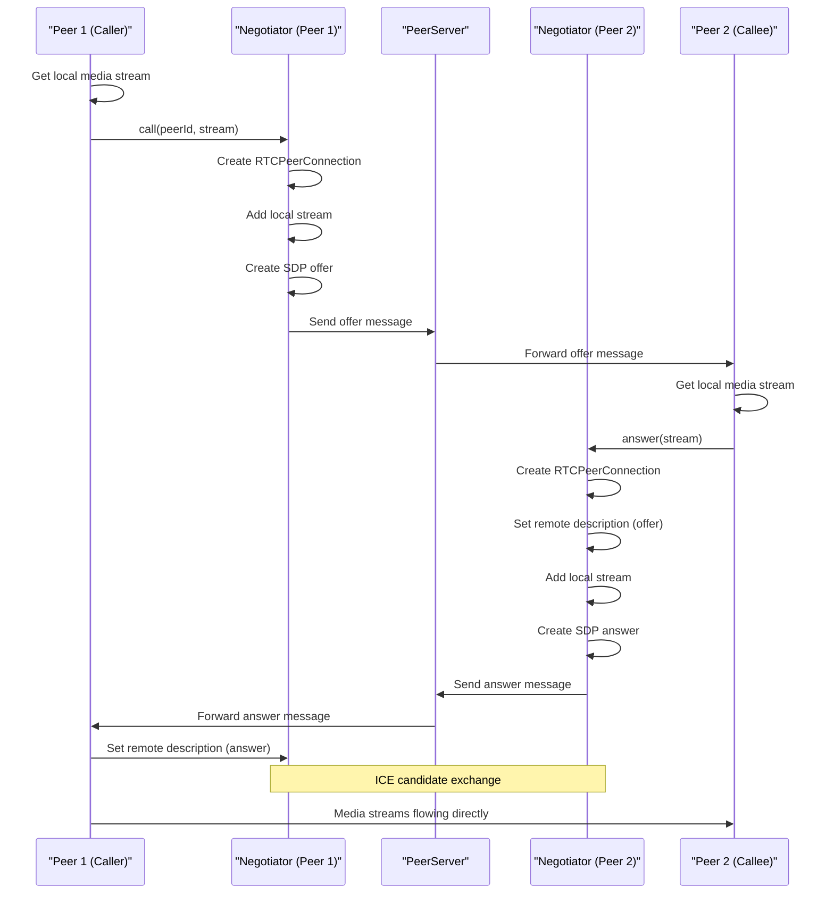

# Overview

Relevant source files

The following files were used as context for generating this wiki page:

- [.gitignore](.gitignore)
- [CHANGELOG.md](CHANGELOG.md)
- [README.md](README.md)
- [package-lock.json](package-lock.json)
- [package.json](package.json)

PeerJS is a JavaScript library that provides a complete, configurable, and easy-to-use peer-to-peer API built on top of WebRTC. It abstracts away the complexity of WebRTC implementation details, enabling developers to quickly build applications that support both data channels and media streams for real-time communication.

This document provides a high-level overview of the PeerJS library, its architecture, core components, and functionality. For installation instructions and usage examples, see [Installation and Usage](#1.1). For a complete API reference, see [API Reference](#1.2).

## Key Features

PeerJS offers several notable features that simplify WebRTC peer-to-peer communication:

- **Simplified API**: Easy-to-use interface for establishing peer connections
- **Data Channels**: Send and receive arbitrary data between peers
- **Media Streams**: Stream audio and video between peers
- **Multiple Serialization Options**: Support for different data serialization formats
- **Connection Management**: Automatic handling of connection establishment and maintenance
- **Signaling**: Built-in signaling through a PeerServer to facilitate peer discovery

Sources: [README.md:7-7](), [package.json:10-10]()

## System Architecture

The following diagram illustrates the high-level architecture of PeerJS:

The architecture follows a layered approach where:

1. **Applications** use the PeerJS library to establish peer-to-peer connections
2. **Core Components** handle connection management, data transmission, and media streaming
3. **External Infrastructure** provides the necessary signaling and network traversal capabilities

Sources: [README.md:7-13](), [package.json:206-211]()

## Core Components

### Peer Class

The `Peer` class is the primary entry point to the library. It manages peer identity, creates and maintains connections to other peers, and handles events for incoming connections.

### Connection Classes

PeerJS offers two types of connections:

1. **DataConnection**: Handles peer-to-peer data transfer using WebRTC data channels
2. **MediaConnection**: Manages audio/video streaming between peers

Both connection types inherit from a common base class and use the Negotiator for WebRTC connection setup.

### Negotiator

The `Negotiator` class handles WebRTC connection establishment, including SDP offer/answer exchange and ICE candidate processing.

### Socket and API

The `Socket` class maintains a WebSocket connection to the PeerServer for signaling, while the `API` class provides HTTP API functionality for peer registration and discovery.

Sources: [README.md:40-73](), [README.md:80-112]()

## Connection Flow

The following sequence diagram illustrates how peers establish a connection:

1. Both peers connect to the PeerServer and register with unique IDs
2. Peer A initiates a connection request to Peer B through the PeerServer
3. The PeerServer forwards the request to Peer B
4. Peer B accepts the connection and sends an answer back
5. After WebRTC negotiation completes, a direct P2P connection is established
6. Data and media flow directly between the peers without going through the server

Sources: [README.md:52-73](), [README.md:80-112]()

## Data Communication

### Data Serialization

PeerJS supports multiple serialization formats for efficient data transfer:

| Serialization | Description | Best For |
|---------------|-------------|----------|
| BinaryPack (default) | Binary format that supports complex JavaScript objects | General purpose data transfer |
| JSON | Text-based format for simple data structures | Debugging and human-readable data |
| MessagePack | Compact binary format | Performance-critical applications |

The data serialization process works as follows:

When sending data:
1. The application calls `send()` on a DataConnection
2. The data is serialized using the configured format
3. Large data is chunked if necessary
4. The data is sent through the RTCDataChannel
5. The receiving peer reassembles chunks and deserializes the data
6. A 'data' event is emitted with the received data

Sources: [package.json:206-211](), [README.md:51-69]()

## Media Streaming

PeerJS simplifies WebRTC media streaming with a straightforward API:

### Call Flow

This process establishes a direct media connection between peers, allowing for real-time audio and video communication.

Sources: [README.md:80-112]()

## Browser Support

PeerJS supports modern browsers with WebRTC capabilities:

| Browser | Minimum Version |
|---------|----------------|
| Chrome  | 83+            |
| Edge    | 83+            |
| Firefox | 80+            |
| Safari  | 15+            |

Note: Firefox 102+ is required for MessagePack serialization support.

Sources: [README.md:120-132](), [package.json:138-160]()

## Integration with PeerServer

PeerJS relies on a signaling server called PeerServer to facilitate peer discovery and connection establishment. PeerServer can be:

1. The default public server at `0.peerjs.com`
2. A self-hosted instance of [PeerServer](https://github.com/peers/peerjs-server)
3. A customized server implementation that follows the PeerJS protocol

Once a connection is established via the signaling server, peers communicate directly without server intermediation.

Sources: [README.md:143-143]()

## Summary

PeerJS provides a robust abstraction over WebRTC, simplifying the development of real-time peer-to-peer applications. By handling the complexities of WebRTC negotiation, connection management, and data serialization, PeerJS enables developers to focus on building their applications rather than dealing with the intricacies of the underlying technology.

For more detailed information about specific aspects of the library, please refer to the other sections of this documentation:

- For detailed installation and usage examples, see [Installation and Usage](#1.1)
- For a complete reference of the API, see [API Reference](#1.2)
- For in-depth architecture explanation, see [Architecture](#2)
- For detailed information about core components, see [Core Components](#2.1)
