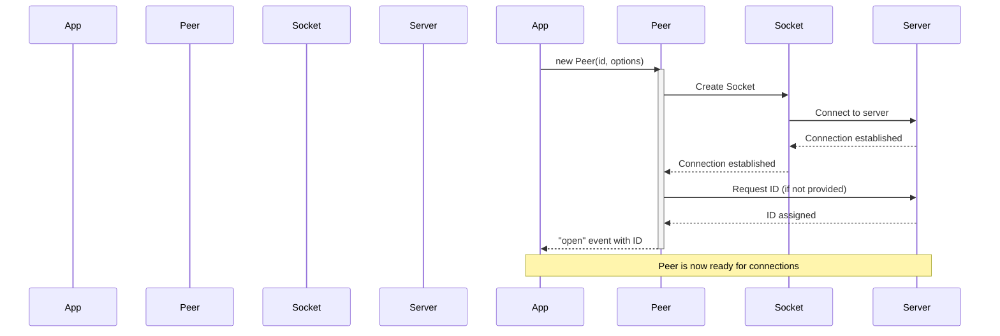
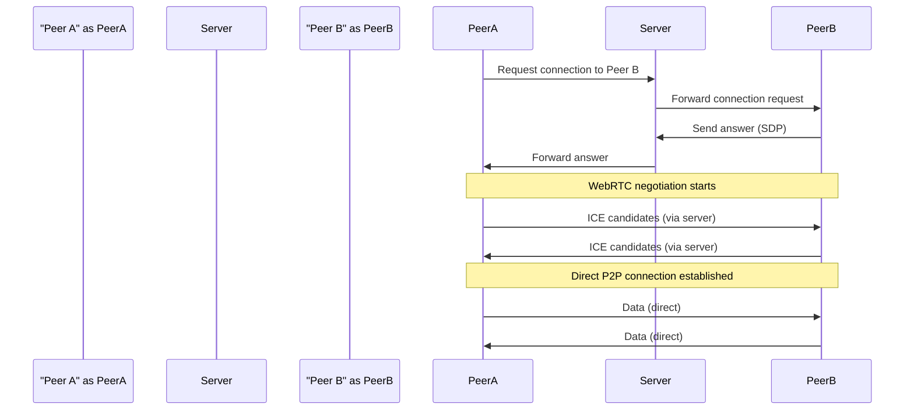
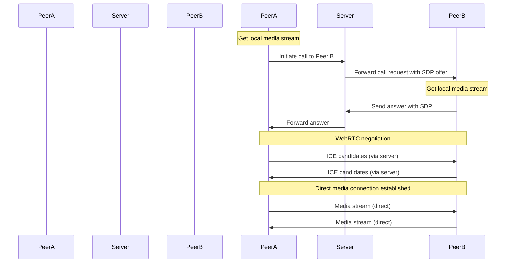
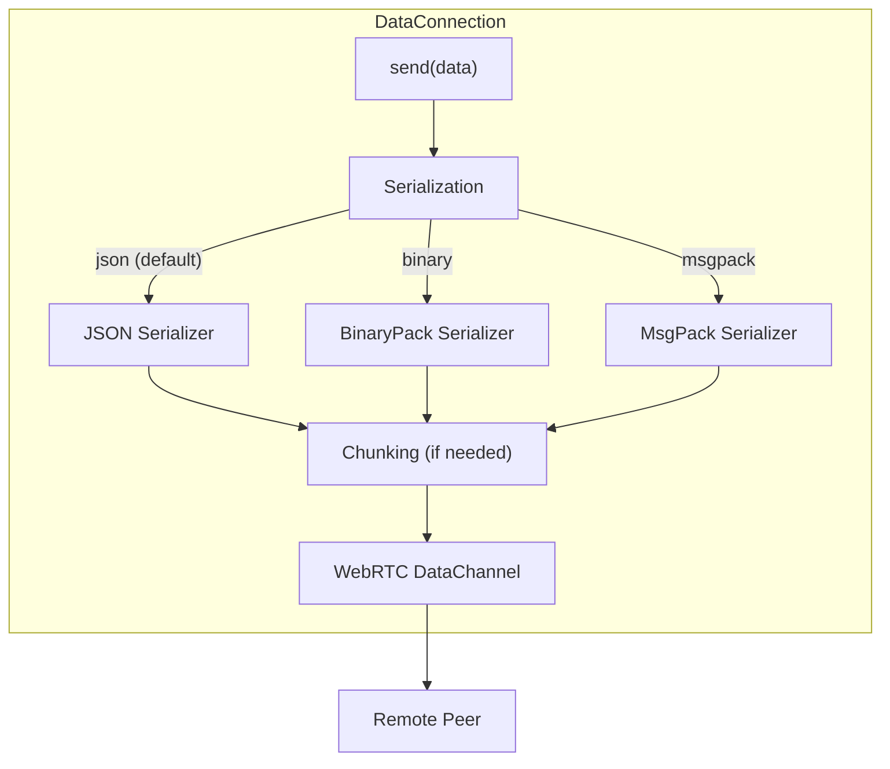
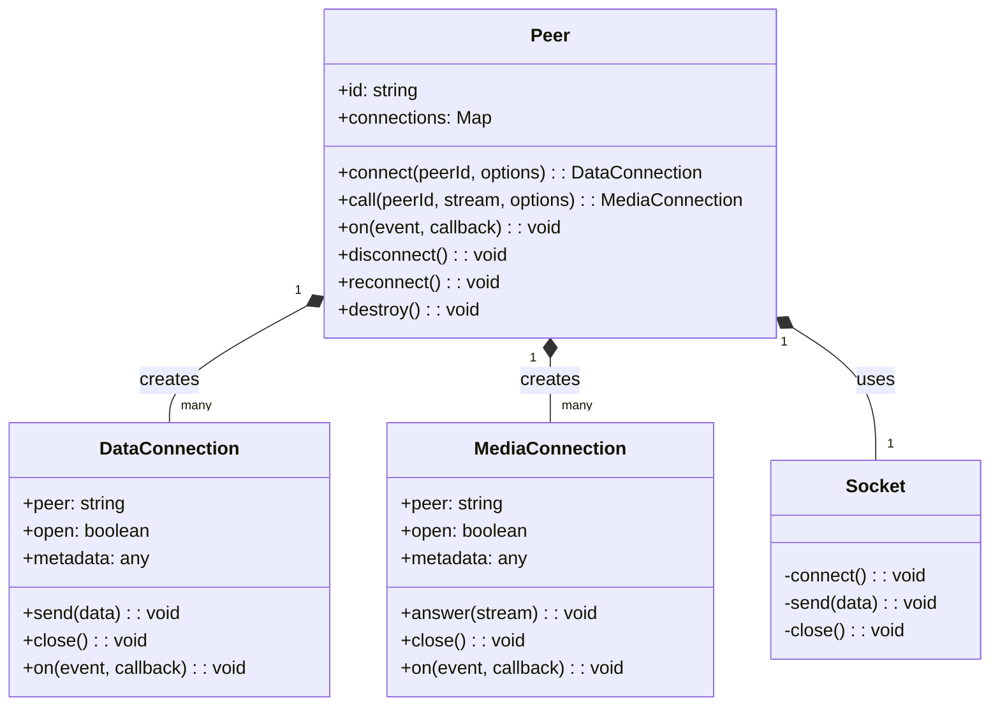

# Installation and Usage

<details>
<summary>Relevant source files</summary>

The following files were used as context for generating this wiki page:

- [.gitignore](.gitignore)
- [CHANGELOG.md](CHANGELOG.md)
- [README.md](README.md)
- [package-lock.json](package-lock.json)
- [package.json](package.json)

</details>


This page explains how to install the PeerJS library and provides basic usage examples for setting up peer-to-peer connections for both data and media sharing. For more detailed information about the API reference, see [API Reference](#1.2).

## Purpose and Scope

PeerJS is a library that simplifies WebRTC peer-to-peer connections by providing an easy-to-use API. This document covers:

- Different installation methods
- Basic setup and configuration
- Creating data connections
- Establishing media calls
- Supported browsers and requirements

## Installation Methods

There are multiple ways to install and include PeerJS in your project.

### Package Manager Installation

Using npm:

```bash
npm install peerjs
```

Using yarn:

```bash
yarn add peerjs
```

After installation, you can import the library in your JavaScript/TypeScript files:

```javascript
import { Peer } from "peerjs";
```

Sources: [package.json:206-210](), [README.md:33-42]()

### Browser Direct Include

You can also include PeerJS directly in your HTML from a CDN:

```html
<script src="https://unpkg.com/peerjs@1.5.4/dist/peerjs.min.js"></script>
```

This will expose a global `Peer` object that you can use directly in your scripts.

## Initialization and Configuration

### Creating a Peer Instance

To start using PeerJS, you need to create a new `Peer` instance:

```javascript
// Create a Peer with a specific ID
const peer = new Peer("your-chosen-id");

// Or let the server assign a random ID
const peer = new Peer();
```

### Configuration Options

You can configure your Peer instance by passing an options object:

```javascript
const peer = new Peer("your-chosen-id", {
  host: "your-peerjs-server.com",  // Default is 0.peerjs.com
  port: 443,                       // Default is 443
  path: "/peerjs",                 // Default is "/"
  secure: true,                    // Use SSL/TLS
  debug: 3,                        // Log level (0-3)
  config: {                        // ICE server configuration
    iceServers: [
      { urls: "stun:stun.l.google.com:19302" },
      { urls: "turn:your-turn-server.com", username: "username", credential: "password" }
    ]
  }
});
```

### Initialization Flow

The following diagram shows the initialization process of PeerJS:



Sources: [README.md:44-49]()

## Connecting to Other Peers

### Data Connections

Data connections allow you to send and receive data directly between peers.

#### Creating a Data Connection

To connect to another peer:

```javascript
// Connect to another peer
const conn = peer.connect("remote-peer-id");

// When the connection is open
conn.on("open", () => {
  // Send data to the remote peer
  conn.send("Hello!");
  conn.send({ key: "value" });
  conn.send(new Blob(["binary data"]));
});
```

#### Receiving Data Connections

To receive connections from other peers:

```javascript
// Listen for incoming connections
peer.on("connection", (conn) => {
  // Connection established
  conn.on("data", (data) => {
    // Handle received data
    console.log("Received:", data);
  });
  
  // You can also send data
  conn.on("open", () => {
    conn.send("Connection established!");
  });
});
```

#### Data Connection Flow



Sources: [README.md:51-73]()

### Media Connections

Media connections allow you to share audio and video streams between peers.

#### Making a Call

To make a video/audio call:

```javascript
// Get user media
navigator.mediaDevices.getUserMedia({ video: true, audio: true })
  .then((stream) => {
    // Display my video
    const myVideo = document.getElementById("my-video");
    myVideo.srcObject = stream;
    
    // Call another peer
    const call = peer.call("remote-peer-id", stream);
    
    // When they answer
    call.on("stream", (remoteStream) => {
      // Display remote video
      const remoteVideo = document.getElementById("remote-video");
      remoteVideo.srcObject = remoteStream;
    });
  })
  .catch((err) => {
    console.error("Failed to get media", err);
  });
```

#### Answering a Call

To answer an incoming call:

```javascript
// Listen for incoming calls
peer.on("call", (call) => {
  // Get user media
  navigator.mediaDevices.getUserMedia({ video: true, audio: true })
    .then((stream) => {
      // Display my video
      const myVideo = document.getElementById("my-video");
      myVideo.srcObject = stream;
      
      // Answer the call
      call.answer(stream);
      
      // When stream received
      call.on("stream", (remoteStream) => {
        // Display remote video
        const remoteVideo = document.getElementById("remote-video");
        remoteVideo.srcObject = remoteStream;
      });
    })
    .catch((err) => {
      console.error("Failed to get media", err);
    });
});
```

#### Media Connection Flow



Sources: [README.md:76-112]()

## Data Serialization Options

PeerJS supports different serialization options when sending data:



You can specify the serialization type when creating a connection:

```javascript
// Connect with specific serialization
const conn = peer.connect("remote-peer-id", {
  serialization: "binary" // 'json', 'binary', or 'msgpack'
});
```

Sources: [package.json:206-210]()

## Events and Error Handling

PeerJS uses an event-based system for handling various states and errors.

### Peer Events

```javascript
// Connection established with the signaling server
peer.on("open", (id) => {
  console.log("My peer ID is:", id);
});

// Error event
peer.on("error", (err) => {
  console.error("Peer error:", err);
});

// Disconnected from the signaling server
peer.on("disconnected", () => {
  console.log("Disconnected from signaling server");
  // You can reconnect if needed
  peer.reconnect();
});

// Completely closed and can't be reused
peer.on("close", () => {
  console.log("Peer connection closed");
});
```

### Connection Events

```javascript
// Data connection events
conn.on("open", () => {
  console.log("Connection opened");
});

conn.on("data", (data) => {
  console.log("Received data:", data);
});

conn.on("close", () => {
  console.log("Connection closed");
});

conn.on("error", (err) => {
  console.error("Connection error:", err);
});

// Media connection events
call.on("stream", (stream) => {
  console.log("Received remote stream");
});

call.on("close", () => {
  console.log("Call ended");
});

call.on("error", (err) => {
  console.error("Call error:", err);
});
```

## Component Relationships

This diagram shows the key components of the PeerJS library and their relationships:



Sources: [package.json:207-210](), [README.md:30-114]()

## Browser Compatibility

PeerJS supports modern browsers with WebRTC capabilities:

| Browser | Version |
|---------|---------|
| Chrome  | 83+     |
| Firefox | 80+     |
| Edge    | 83+     |
| Safari  | 15+     |

Firefox 102+ is required for MessagePack serialization support.

Sources: [README.md:121-132](), [package.json:138-160]()

## Additional Notes

- PeerJS requires a signaling server to establish connections. By default, it uses the PeerJS public server, but you can also use a self-hosted [PeerServer](https://github.com/peers/peerjs-server).

- For production applications, it's recommended to use your own PeerServer instance to ensure reliability and control over the signaling process.

- All connections between peers are direct (peer-to-peer) once established, with the server only used for initial signaling.

Sources: [README.md:142-143]()
