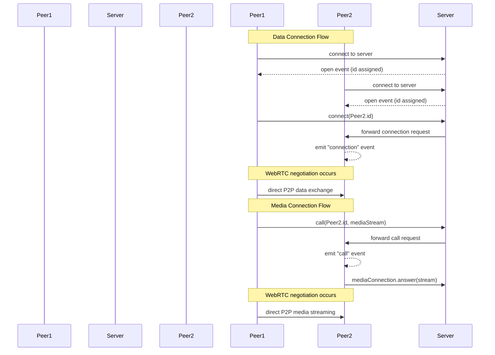
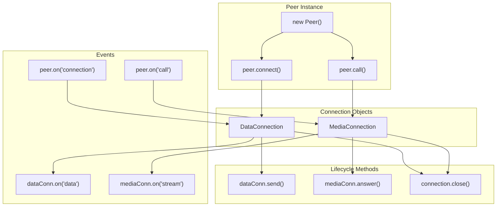

# API Reference

<details>
<summary>Relevant source files</summary>

The following files were used as context for generating this wiki page:

- [README.md](README.md)
- [lib/exports.ts](lib/exports.ts)
- [lib/mediaconnection.ts](lib/mediaconnection.ts)
- [lib/negotiator.ts](lib/negotiator.ts)
- [lib/peer.ts](lib/peer.ts)

</details>


This page provides a comprehensive reference for the PeerJS public API, documenting the main classes, methods, events, and options available to developers. This reference focuses on the components you'll interact with directly when building applications with PeerJS. For information about the underlying architecture, see [Architecture](#2).

## Core API Components

PeerJS provides a simple interface for WebRTC peer-to-peer connections, with three main components that developers interact with:

```mermaid
classDiagram
    class "Peer" {
        +id: string
        +connect(peerId, options): DataConnection
        +call(peerId, stream, options): MediaConnection
        +on(event, callback): void
    }
    
    class "DataConnection" {
        +peer: string
        +connectionId: string
        +send(data): void
        +on(event, callback): void
    }
    
    class "MediaConnection" {
        +peer: string
        +connectionId: string
        +answer(stream, options): void
        +on(event, callback): void
    }
    
    "Peer" --> "DataConnection" : creates
    "Peer" --> "MediaConnection" : creates
```

Sources: [lib/peer.ts:113-744](), [lib/mediaconnection.ts:31-187]()

## Peer Class

The `Peer` class is the main entry point to the PeerJS API. It represents a peer that can initiate and receive connections.

### Constructor

```typescript
// Create with randomly assigned ID
const peer = new Peer();

// Create with specific ID
const peer = new Peer('my-peer-id');

// Create with options
const peer = new Peer('my-peer-id', options);
// or
const peer = new Peer(options);
```

### Constructor Options

| Option | Type | Default | Description |
|--------|------|---------|-------------|
| `debug` | LogLevel (number) | 0 | Log level (0: none, 1: errors, 2: warnings, 3: all logs) |
| `host` | string | '0.peerjs.com' | PeerServer host |
| `port` | number | 443 | PeerServer port |
| `path` | string | '/' | Path where PeerServer is running |
| `key` | string | 'peerjs' | API key (deprecated) |
| `token` | string | random token | Connection token |
| `config` | RTCConfiguration | ICE/TURN default config | Configuration for RTCPeerConnection |
| `secure` | boolean | true for cloud server | Whether to use TLS |
| `serializers` | object | - | Custom serializers for DataConnection |

Sources: [lib/peer.ts:25-68]()

### Properties

| Property | Type | Description |
|----------|------|-------------|
| `id` | string | The ID of this peer |
| `connections` | Object | Hash of all connections |
| `disconnected` | boolean | Whether disconnected from server |
| `destroyed` | boolean | Whether this peer can no longer be used |

Sources: [lib/peer.ts:146-191]()

### Methods

| Method | Description |
|--------|-------------|
| `connect(peerId, options)` | Connect to remote peer and get DataConnection |
| `call(peerId, stream, options)` | Call remote peer with stream and get MediaConnection |
| `disconnect()` | Disconnect from the server (connections remain) |
| `reconnect()` | Reconnect to the server with the same ID |
| `destroy()` | Close all connections and disconnect |
| `listAllPeers(callback)` | Get list of available peer IDs from server |

Sources: [lib/peer.ts:490-743]()

### Events

PeerJS uses an event-based API. The `Peer` instance emits the following events:

| Event | Data | Description |
|-------|------|-------------|
| `open` | id (string) | Emitted when connection to server is established |
| `connection` | DataConnection | Emitted when a new data connection is established |
| `call` | MediaConnection | Emitted when a remote peer calls |
| `close` | - | Emitted when peer is destroyed |
| `disconnected` | currentId (string) | Emitted when disconnected from server |
| `error` | error (PeerError) | Emitted when an error occurs |

Sources: [lib/peer.ts:80-109]()

## Connection Flow

The following diagram illustrates the typical flow for establishing connections between peers:



Sources: [lib/peer.ts:490-555](), [lib/negotiator.ts:22-49]()

## DataConnection

The `DataConnection` represents a data connection between peers. It's created by calling `peer.connect()` or received in the `connection` event.

### Methods

| Method | Description |
|--------|-------------|
| `send(data)` | Send data to the peer |
| `close()` | Close the connection |

### Events

| Event | Data | Description |
|-------|------|-------------|
| `open` | - | Connection is ready for use |
| `data` | data (any) | Data received from peer |
| `close` | - | Connection closed |
| `error` | error (Error) | Connection error |

### Serialization Options

DataConnection supports multiple serialization methods:

| Value | Description |
|-------|-------------|
| `binary` (default) | Binary serialization using BinaryPack |
| `json` | JSON serialization |
| `raw` | Raw data (no serialization) |
| `binary-utf8` | Binary with UTF-8 strings |
| `msgpack` | MessagePack serialization (requires MsgPackPeer) |

Sources: [lib/peer.ts:116-123](), [lib/exports.ts:19-26]()

## MediaConnection

The `MediaConnection` represents a media (audio/video) connection between peers. It's created by calling `peer.call()` or received in the `call` event.

### Methods

| Method | Description |
|--------|-------------|
| `answer(stream, options)` | Answer an incoming call with optional media stream |
| `close()` | Close the connection |

### Properties

| Property | Type | Description |
|----------|------|-------------|
| `localStream` | MediaStream | The local media stream |
| `remoteStream` | MediaStream | The remote media stream |

### Events

| Event | Data | Description |
|-------|------|-------------|
| `stream` | stream (MediaStream) | Remote stream received |
| `close` | - | Connection closed |
| `error` | error (Error) | Connection error |
| `willCloseOnRemote` | - | Auxiliary data channel established |

Sources: [lib/mediaconnection.ts:10-187]()

## Connection Types and Lifecycle

This diagram shows the relationship between connection types and their lifecycle:



Sources: [lib/peer.ts:490-555](), [lib/mediaconnection.ts:125-186]()

## Error Handling

Errors in PeerJS are emitted through the `error` event on `Peer` and connection objects. The errors include a type and message.

### Error Types

PeerJS defines several error types in the `PeerErrorType` enum:

| Error Type | Description |
|------------|-------------|
| `BrowserIncompatible` | Browser doesn't support WebRTC |
| `Disconnected` | Cannot connect after disconnecting |
| `InvalidID` | Invalid peer ID format |
| `InvalidKey` | Invalid API key |
| `Network` | Lost connection to signaling server |
| `PeerUnavailable` | Could not connect to peer |
| `ServerError` | PeerServer error |
| `SocketClosed` | Underlying socket closed |
| `SocketError` | Socket error |
| `UnavailableID` | ID already taken |
| `WebRTC` | WebRTC error |

Example error handling:

```javascript
peer.on('error', (error) => {
  console.error(`Error type: ${error.type}, message: ${error.message}`);
  // Handle specific error types
  switch(error.type) {
    case 'network':
      // Handle network error
      break;
    case 'peer-unavailable':
      // Handle peer unavailable
      break;
    // ...
  }
});
```

Sources: [lib/peer.ts:107-108](), [lib/exports.ts:17]()

## Utility Methods and Supports

PeerJS includes utility methods and browser support detection:

```javascript
// Check if browser supports WebRTC
if (util.supports.audioVideo) {
  // Browser supports audio/video
}

if (util.supports.data) {
  // Browser supports data channels
}

// Generate random ID
const randomId = util.randomToken();
```

Sources: [lib/exports.ts:1-13](), [lib/peer.ts:276-283]()

## API Structure Overview

This diagram shows the overall API structure and relationships between the main components:

```mermaid
classDiagram
    class "EventEmitter" {
        +on(event, callback)
        +emit(event, data)
    }
    
    class "Peer" {
        +id: string
        +connect(peerId, options): DataConnection
        +call(peerId, stream, options): MediaConnection
        +disconnect()
        +reconnect()
        +destroy()
        +listAllPeers(callback)
    }
    
    class "BaseConnection" {
        +peer: string
        +connectionId: string
        +open: boolean
        +metadata: any
        +close()
    }
    
    class "DataConnection" {
        +send(data)
        +serialization: string
    }
    
    class "MediaConnection" {
        +localStream: MediaStream
        +remoteStream: MediaStream
        +answer(stream, options)
    }
    
    class "Negotiator" {
        +startConnection(options)
        +handleSDP(type, sdp)
        +handleCandidate(ice)
        +cleanup()
    }
    
    class "Socket" {
        +start(id, token)
        +send(data)
        +close()
    }
    
    EventEmitter <|-- Peer
    EventEmitter <|-- BaseConnection
    BaseConnection <|-- DataConnection
    BaseConnection <|-- MediaConnection
    Peer "1" *-- "*" BaseConnection
    BaseConnection -- Negotiator
    Peer "1" *-- "1" Socket
```

Sources: [lib/peer.ts:113-744](), [lib/mediaconnection.ts:31-187](), [lib/negotiator.ts:16-367]()
