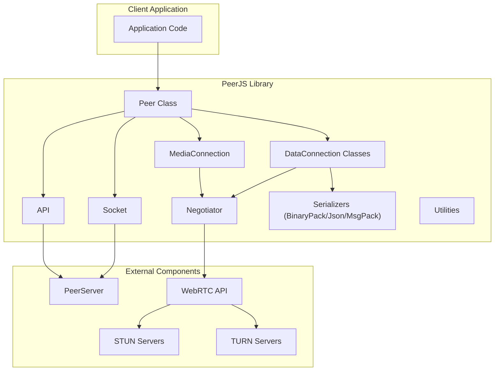
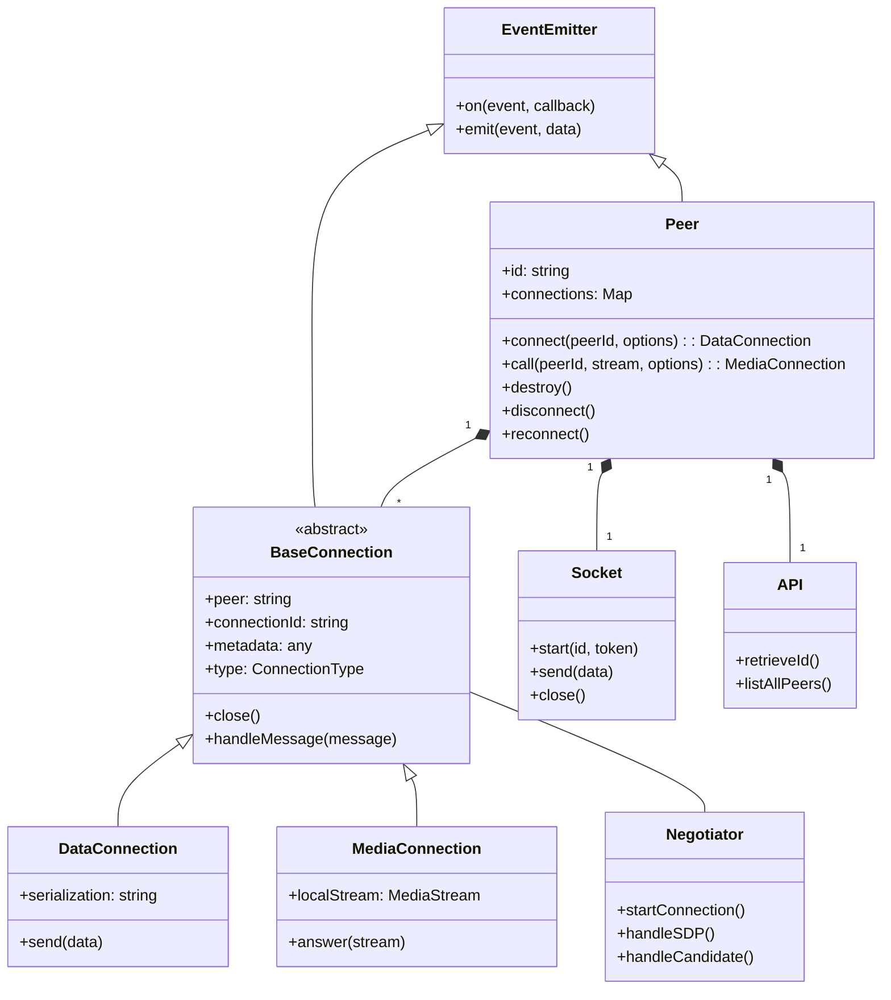
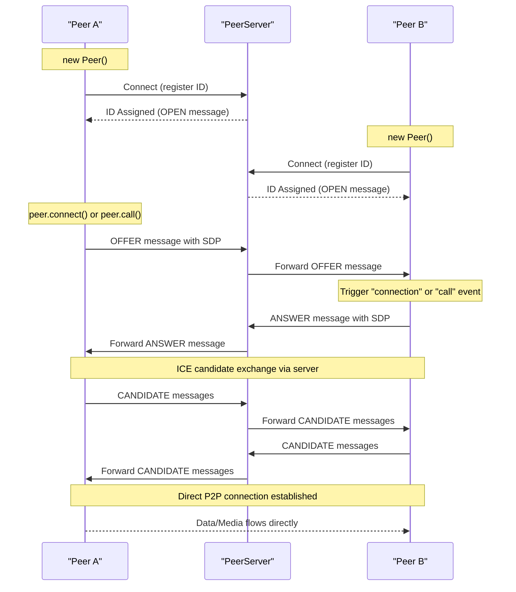
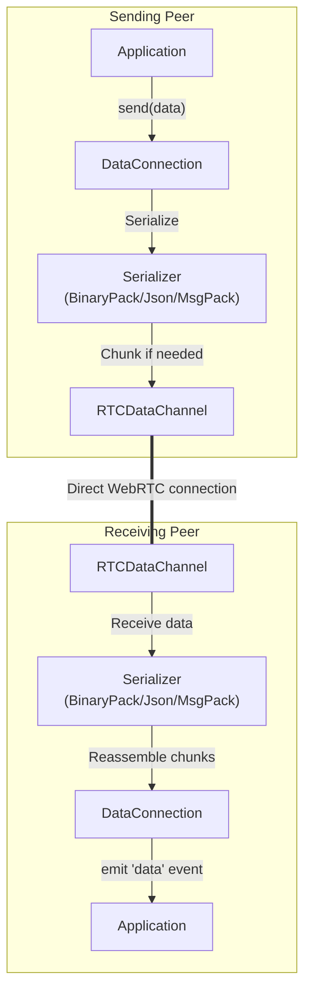
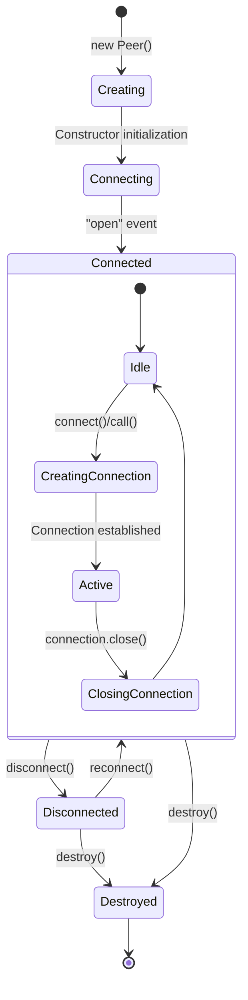
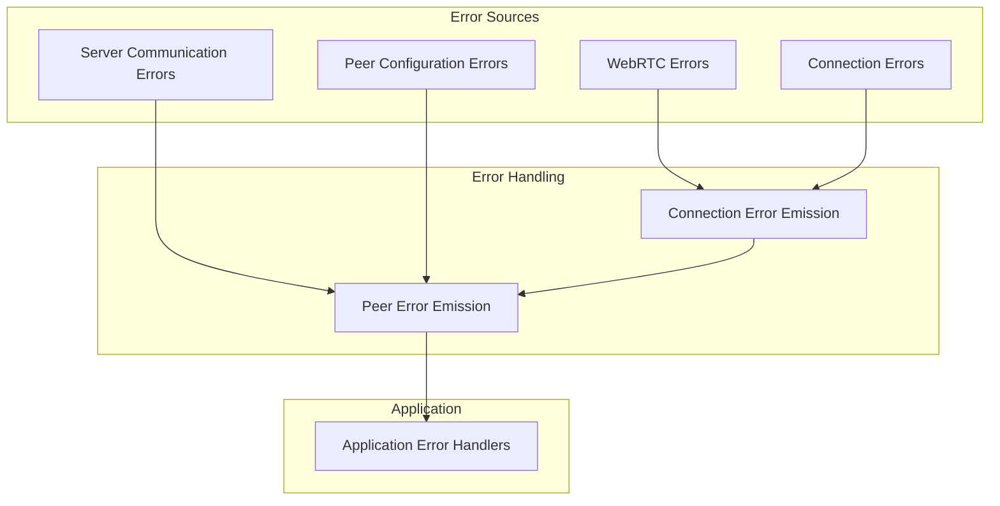
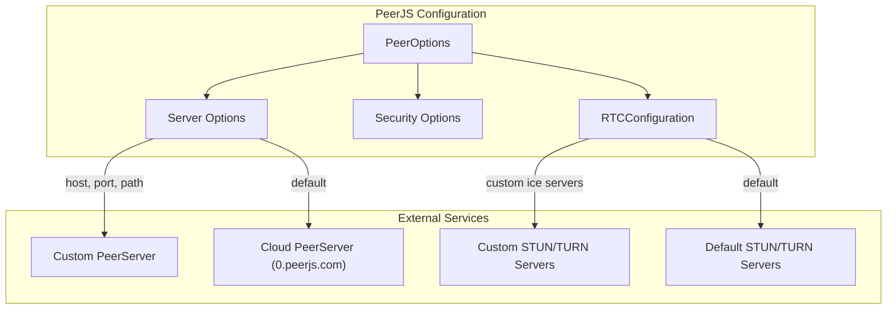

# Architecture

Relevant source files

The following files were used as context for generating this wiki page:

- [README.md](README.md)
- [lib/api.ts](lib/api.ts)
- [lib/baseconnection.ts](lib/baseconnection.ts)
- [lib/enums.ts](lib/enums.ts)
- [lib/exports.ts](lib/exports.ts)
- [lib/logger.ts](lib/logger.ts)
- [lib/optionInterfaces.ts](lib/optionInterfaces.ts)
- [lib/peer.ts](lib/peer.ts)
- [lib/servermessage.ts](lib/servermessage.ts)
- [lib/socket.ts](lib/socket.ts)
- [tsconfig.json](tsconfig.json)

This document provides an overview of the PeerJS architecture, explaining how the library is structured and how its components interact to enable WebRTC-based peer-to-peer communication. For information about individual components, see [Core Components](#2.1), and for details on how connections are established and managed, see [Connection Flow](#2.2).

## System Overview

PeerJS is designed with a hybrid architecture that uses a centralized signaling server (PeerServer) for peer discovery and initial connection establishment, followed by direct peer-to-peer communication through WebRTC. This approach simplifies the complex WebRTC API while maintaining the performance benefits of direct connections.

Sources: [lib/peer.ts:113-744](), [lib/socket.ts:10-172](), [lib/api.ts:6-85]()

## Core Components Structure

The PeerJS library consists of several interrelated components that work together to provide a simple interface for WebRTC functionality:

Sources: [lib/peer.ts:113-144](), [lib/baseconnection.ts:32-91](), [lib/socket.ts:10-20](), [lib/api.ts:6-7]()

## Key Component Responsibilities

The PeerJS architecture separates concerns into distinct components with specific responsibilities:

| Component | Responsibility | Key Files |
|-----------|---------------|-----------|
| **Peer** | The main entry point and controller, manages peer identity and connections | [lib/peer.ts]() |
| **BaseConnection** | Abstract base class for connections, defines common functionality | [lib/baseconnection.ts]() |
| **DataConnection** | Manages data transmission between peers | [lib/dataconnection/*.ts]() |
| **MediaConnection** | Handles media streams between peers | [lib/mediaconnection.ts]() |
| **Socket** | Manages WebSocket communication with the PeerServer | [lib/socket.ts]() |
| **API** | Handles HTTP requests to the PeerServer (e.g., retrieving ID) | [lib/api.ts]() |
| **Negotiator** | Manages WebRTC connection negotiation and ICE candidate exchange | [lib/negotiator.ts]() |
| **Serializers** | Handle data serialization (BinaryPack, JSON, MsgPack) | [lib/dataconnection/BufferedConnection/*.ts]() |

Sources: [lib/exports.ts:1-27](), [lib/peer.ts:113-196](), [lib/socket.ts:6-11](), [lib/api.ts:6-7]()

## Connection Establishment Flow

The process of establishing a connection between two peers involves several steps across both the signaling server and direct WebRTC connections:

Sources: [lib/peer.ts:348-458](), [lib/socket.ts:33-85](), [lib/peer.ts:484-555]()

## Data Flow and Serialization

PeerJS supports different serialization methods for data transmission, with each following a specific path from sender to receiver:

Sources: [lib/peer.ts:116-123](), [lib/exports.ts:19-22]()

## Peer Lifecycle Management

The `Peer` class manages the lifecycle of peer connections, from creation to destruction:

Sources: [lib/peer.ts:195-212](), [lib/peer.ts:640-730]()

## Error Handling Architecture

PeerJS implements a comprehensive error handling system that propagates errors through the component hierarchy:

Sources: [lib/enums.ts:6-61](), [lib/enums.ts:63-71](), [lib/peer.ts:107-108]()

## Integration with External Components

PeerJS relies on several external components for its functionality:

1. **PeerServer**: A signaling server that facilitates peer discovery and connection establishment
2. **WebRTC API**: Browser's native WebRTC implementation for establishing peer-to-peer connections
3. **STUN/TURN Servers**: For NAT traversal and fallback relay if direct connection isn't possible

The library provides configuration options to customize the connection to these external components through the `Peer` constructor options:

Sources: [lib/peer.ts:25-68](), [lib/optionInterfaces.ts:8-18]()

## Summary

The PeerJS architecture employs a layered design that abstracts the complexity of WebRTC while providing a robust and flexible API for peer-to-peer communication. The library uses a hybrid approach with a central signaling server for connection establishment and direct peer-to-peer connections for data and media transfer. This design allows for efficient communication while simplifying the developer experience.

The core components (Peer, DataConnection, MediaConnection, Socket, API, and Negotiator) work together to provide a complete solution for WebRTC-based peer-to-peer applications, with support for various serialization methods and connection types.

For more detailed information about the core components and their functionalities, see [Core Components](#2.1), and for an in-depth explanation of the connection flow, see [Connection Flow](#2.2).
