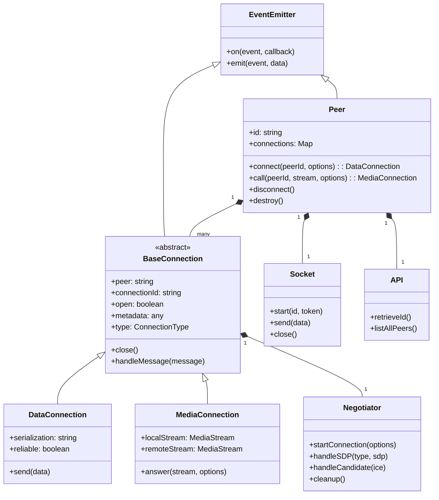
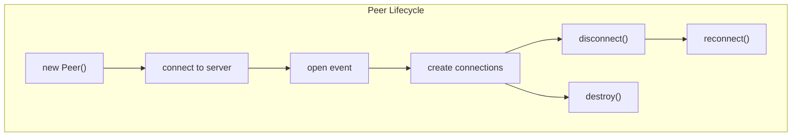
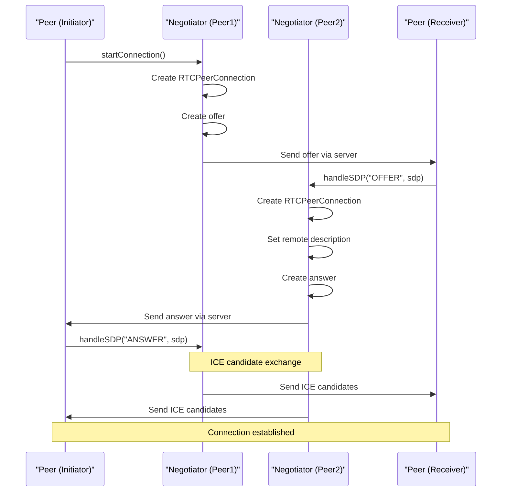
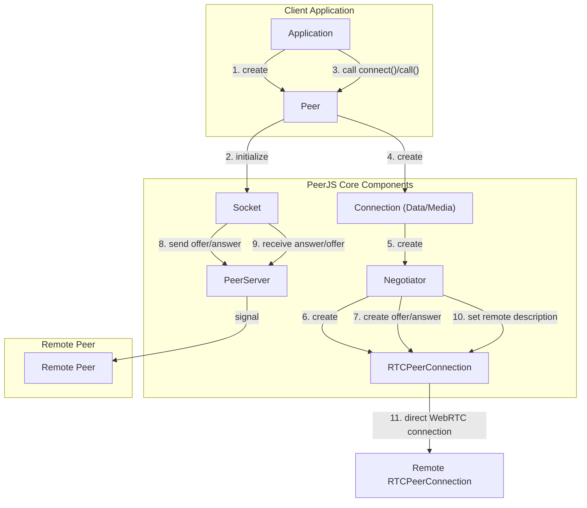
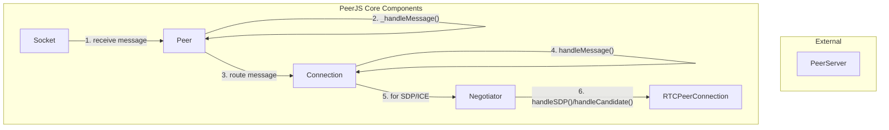

# Core Components

Relevant source files

The following files were used as context for generating this wiki page:

- [lib/baseconnection.ts](lib/baseconnection.ts)
- [lib/enums.ts](lib/enums.ts)
- [lib/exports.ts](lib/exports.ts)
- [lib/mediaconnection.ts](lib/mediaconnection.ts)
- [lib/negotiator.ts](lib/negotiator.ts)
- [lib/peer.ts](lib/peer.ts)
- [lib/servermessage.ts](lib/servermessage.ts)

This page describes the main components that form the core of the PeerJS library, focusing on their responsibilities and interactions. For details on how connections are established and managed, see [Connection Flow](#2.2).

## Overview

PeerJS is structured around several key components that work together to provide a simple peer-to-peer communication API built on WebRTC. The core components include:

1. **Peer** - The main entry point class representing a peer and managing connections
2. **BaseConnection** - The abstract base class for all connection types
3. **DataConnection** - Handles peer-to-peer data connections
4. **MediaConnection** - Handles peer-to-peer media (audio/video) connections
5. **Negotiator** - Manages WebRTC negotiation processes
6. **Socket** - Handles communication with the PeerServer for signaling
7. **API** - Provides methods to interact with the PeerServer API

These components form the foundation of the PeerJS library and enable developers to easily establish peer-to-peer connections without having to handle the complexities of WebRTC directly.

## Component Architecture

Sources: [lib/peer.ts:113-744](), [lib/baseconnection.ts:32-91](), [lib/mediaconnection.ts:31-187](), [lib/negotiator.ts:16-367]()

## Peer

The `Peer` class is the primary entry point to the PeerJS library. It represents a peer in the network and manages all connections to other peers.

### Responsibilities

- Creating and managing data and media connections to other peers
- Communicating with the PeerServer for signaling
- Handling messages from the server and other peers
- Managing the peer's lifecycle (connect, disconnect, destroy)

### Key Methods

| Method | Description |
|--------|-------------|
| `connect(peerId, options)` | Creates a data connection to another peer |
| `call(peerId, stream, options)` | Creates a media connection to another peer |
| `disconnect()` | Disconnects from the PeerServer without closing connections |
| `destroy()` | Closes all connections and disconnects from the server |
| `reconnect()` | Attempts to reconnect to the server with the same ID |
| `listAllPeers(cb)` | Gets a list of all available peer IDs from the server |

The `Peer` class extends `EventEmitterWithError` and emits events for connection establishment, peer connection, calls, errors, and more.

Sources: [lib/peer.ts:113-744]()

## Connections

PeerJS has two main types of connections: `DataConnection` for sending arbitrary data and `MediaConnection` for audio/video streams. Both inherit from the abstract `BaseConnection` class.

### BaseConnection

The `BaseConnection` class provides common functionality for all connection types, including:

- Tracking the connection state (open, closed)
- Managing metadata associated with the connection
- Handling basic events (close, error)
- Providing access to the underlying WebRTC `RTCPeerConnection`

Sources: [lib/baseconnection.ts:32-91]()

### MediaConnection

The `MediaConnection` class handles peer-to-peer media (audio/video) connections. It's created when using the `call()` method on a `Peer` instance or when receiving a call from another peer.

#### Responsibilities

- Managing media streams (local and remote)
- Providing methods to answer calls
- Handling WebRTC media negotiation through the `Negotiator`

#### Key Methods

| Method | Description |
|--------|-------------|
| `answer(stream, options)` | Accepts an incoming call and optionally sends a media stream |
| `close()` | Closes the media connection |
| `addStream(stream)` | Adds a remote stream to the connection |

Sources: [lib/mediaconnection.ts:31-187]()

### DataConnection

The `DataConnection` is an interface implemented by serializer-specific connection classes. It handles peer-to-peer data connections.

#### Responsibilities

- Managing data transmission between peers
- Serializing and deserializing data
- Handling chunking for large data transfers

#### Serialization Options

PeerJS supports multiple serialization methods:

1. **BinaryPack** - The default serializer, handles all data types
2. **Json** - Uses JSON serialization, limited to JSON-compatible data types
3. **Raw** - Sends data without serialization for maximum performance

Sources: [lib/peer.ts:116-123]()

## Negotiator

The `Negotiator` class manages the WebRTC negotiation process between peers. Each connection (data or media) has its own `Negotiator` instance.

### Responsibilities

- Creating and managing the `RTCPeerConnection`
- Handling SDP offer/answer exchange
- Processing ICE candidates
- Setting up data channels or media tracks

### Key Methods

| Method | Description |
|--------|-------------|
| `startConnection(options)` | Initiates the WebRTC connection process |
| `handleSDP(type, sdp)` | Processes received SDP messages (offer/answer) |
| `handleCandidate(ice)` | Processes received ICE candidates |
| `cleanup()` | Cleans up the peer connection when no longer needed |

Sources: [lib/negotiator.ts:16-367]()

## Socket and API

The `Socket` and `API` classes handle communication with the PeerServer, which is essential for the initial connection and signaling between peers.

### Socket

The `Socket` class manages the WebSocket connection to the PeerServer.

#### Responsibilities

- Establishing and maintaining the connection to the PeerServer
- Sending messages to the server
- Receiving and forwarding server messages to the `Peer` instance
- Handling connection errors and disconnection events

Sources: [lib/peer.ts:301-340]()

### API

The `API` class provides methods to interact with the PeerServer's REST API.

#### Responsibilities

- Retrieving a unique ID from the server
- Listing all available peers on the server

#### Key Methods

| Method | Description |
|--------|-------------|
| `retrieveId()` | Gets a unique ID from the server |
| `listAllPeers()` | Gets a list of all available peer IDs |

Sources: [lib/peer.ts:272-272](), [lib/peer.ts:738-743]()

## Communication Flows

### Connection Establishment Flow

Sources: [lib/peer.ts:294-340](), [lib/negotiator.ts:194-259](), [lib/negotiator.ts:261-303]()

### Message Handling Flow

Sources: [lib/peer.ts:349-458](), [lib/mediaconnection.ts:96-113](), [lib/negotiator.ts:306-338]()

## Lifecycle Management

PeerJS components have well-defined lifecycles that must be managed correctly to avoid memory leaks and ensure proper cleanup.

### Peer Lifecycle

- **Creation**: A new `Peer` instance is created with an optional ID
- **Connection**: The peer connects to the PeerServer
- **Open**: The connection to the server is established, and the peer ID is confirmed
- **Active**: The peer can create and receive connections
- **Disconnection**: The peer disconnects from the server but maintains existing connections
- **Destruction**: All connections are closed, and the peer ID is released

### Connection Lifecycle

- **Creation**: A new connection is created via `connect()` or `call()`
- **Negotiation**: WebRTC negotiation occurs through the `Negotiator`
- **Open**: The connection is established and ready for use
- **Active**: Data/media is exchanged
- **Close**: The connection is closed and resources are released

Sources: [lib/peer.ts:626-674](), [lib/mediaconnection.ts:160-186]()
