# Connection Flow

<details>
<summary>Relevant source files</summary>

The following files were used as context for generating this wiki page:

- [lib/api.ts](lib/api.ts)
- [lib/exports.ts](lib/exports.ts)
- [lib/logger.ts](lib/logger.ts)
- [lib/mediaconnection.ts](lib/mediaconnection.ts)
- [lib/negotiator.ts](lib/negotiator.ts)
- [lib/optionInterfaces.ts](lib/optionInterfaces.ts)
- [lib/peer.ts](lib/peer.ts)
- [lib/socket.ts](lib/socket.ts)
- [tsconfig.json](tsconfig.json)

</details>


This page explains the process of establishing and managing peer-to-peer connections in PeerJS. It covers the signaling mechanism, WebRTC negotiation, and the lifecycle of both data and media connections. For information on data serialization mechanisms, see [Data Serialization](#2.3).

## Overview

The PeerJS connection flow involves two main phases:
1. **Signaling Phase**: Peers connect to a centralized PeerServer to exchange connection information
2. **P2P Connection Phase**: Peers establish direct WebRTC connections after signaling completes

This diagram illustrates the high-level connection flow:

```mermaid
sequenceDiagram
    participant PeerA as "Peer (Initiator)"
    participant Server as "PeerServer"
    participant PeerB as "Peer (Receiver)"
    
    Note over PeerA,PeerB: 1. Signaling Phase
    PeerA->>Server: Connect & register ID
    PeerB->>Server: Connect & register ID
    
    PeerA->>Server: Send connection offer
    Server->>PeerB: Forward offer
    PeerB->>Server: Send answer
    Server->>PeerA: Forward answer
    
    Note over PeerA,PeerB: ICE candidate exchange via server
    
    Note over PeerA,PeerB: 2. P2P Connection Phase
    PeerA<-->PeerB: Direct WebRTC connection established
    
    Note over PeerA,PeerB: Data/Media flows directly between peers
```

Sources: [lib/peer.ts:143-144](), [lib/peer.ts:490-516](), [lib/peer.ts:524-555](), [lib/negotiator.ts:22-48]()

## Connection Initialization

When a new `Peer` instance is created, it connects to the PeerServer through a `Socket` object and registers its ID. This ID is either provided by the user or generated by the server.

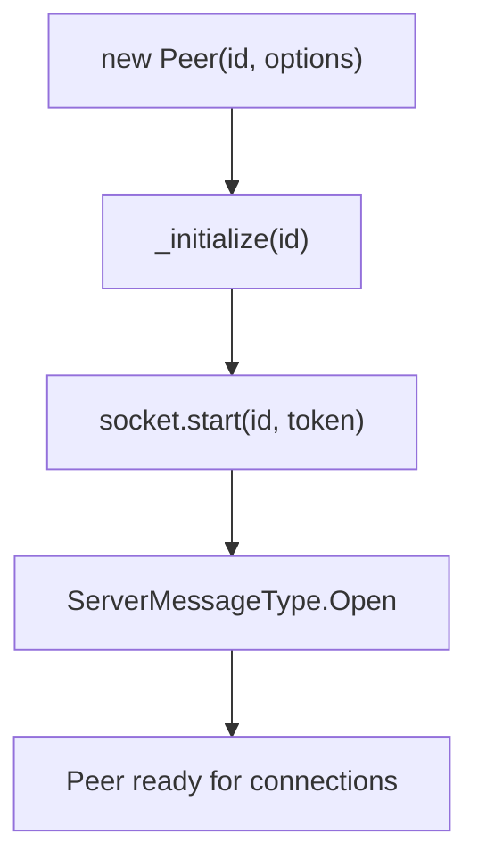

Sources: [lib/peer.ts:213-298](), [lib/peer.ts:343-346](), [lib/socket.ts:33-85]()

### Socket Connection Establishment

The `Socket` class manages the WebSocket connection to the PeerServer with a defined protocol:

1. The socket connects to the server with the peer's ID and token
2. Once connected, it processes queued messages and starts a heartbeat
3. The socket handles server messages and distributes them to the appropriate handlers

The `Peer` object listens for specific message types to handle connection setup:

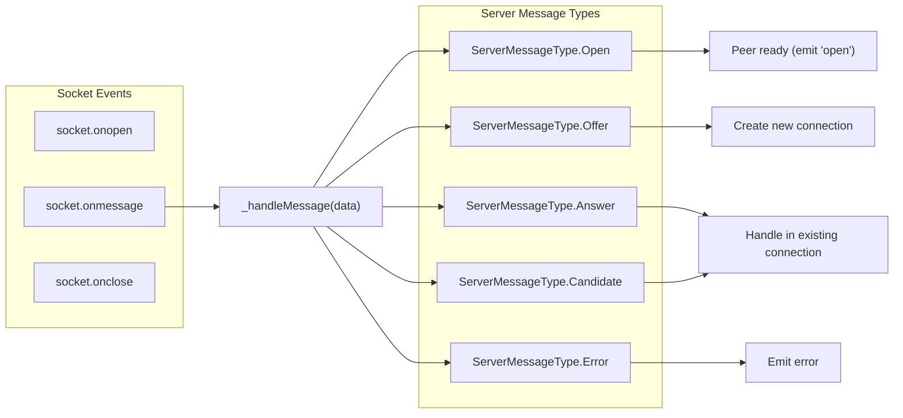

Sources: [lib/socket.ts:10-172](), [lib/peer.ts:349-458]()

## Creating Connections

PeerJS supports two types of connections:

1. **Data Connections**: For sending and receiving arbitrary data
2. **Media Connections**: For audio/video streaming

### Initiating a Connection

When a peer initiates a connection, it follows this process:

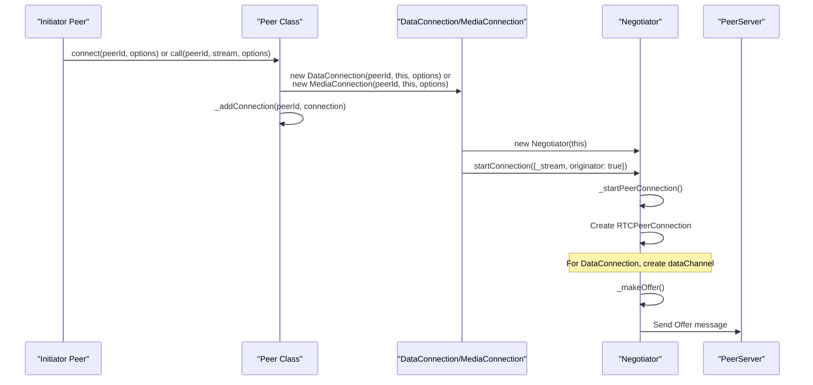

Sources: [lib/peer.ts:490-516](), [lib/peer.ts:524-555](), [lib/negotiator.ts:22-48](), [lib/negotiator.ts:194-259]()

### Receiving a Connection

When a peer receives a connection request, the process is as follows:

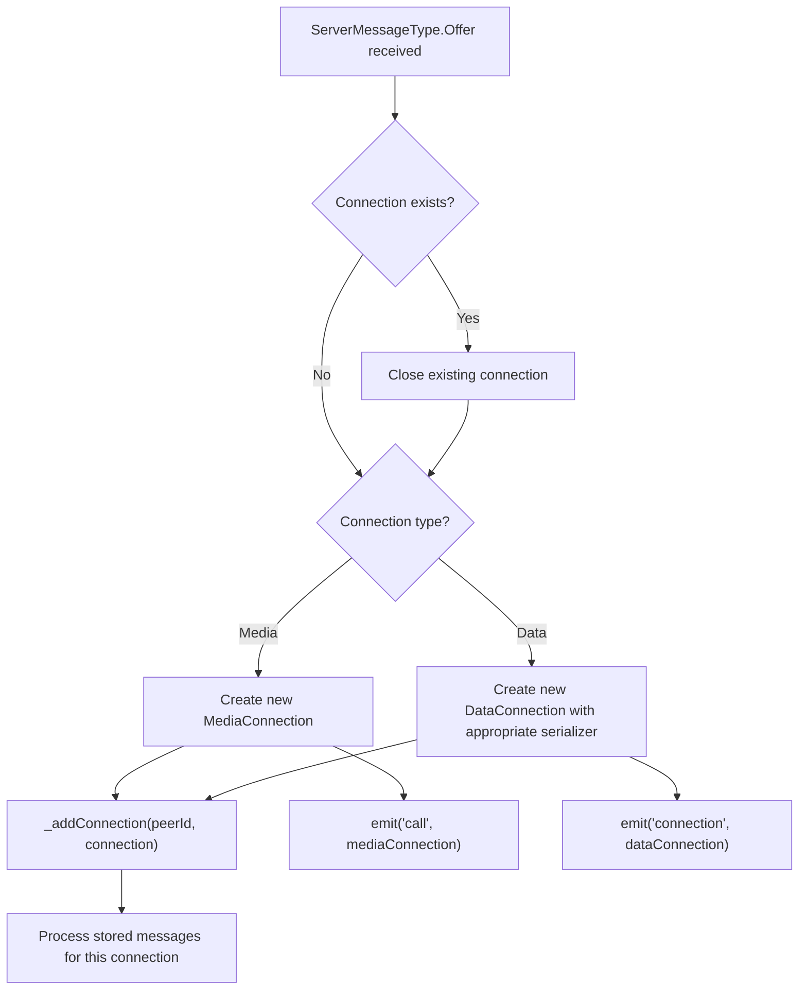

Sources: [lib/peer.ts:383-434](), [lib/mediaconnection.ts:54-70]()

## WebRTC Negotiation Process

The `Negotiator` class handles all WebRTC negotiations between peers. This includes creating offers and answers, handling Session Description Protocol (SDP) messages, and managing ICE candidates.

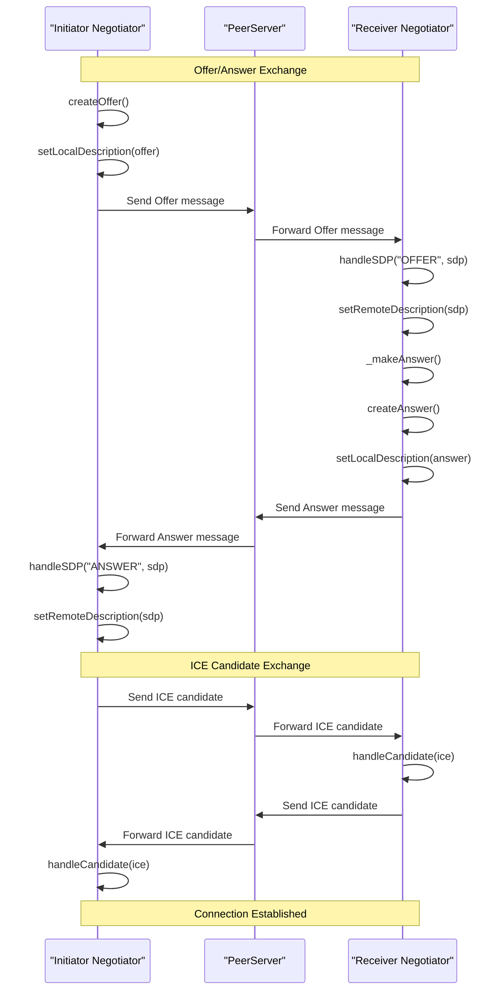

Sources: [lib/negotiator.ts:194-338]()

### ICE Candidate Handling

ICE (Interactive Connectivity Establishment) candidates are exchanged to determine the optimal network path between peers:

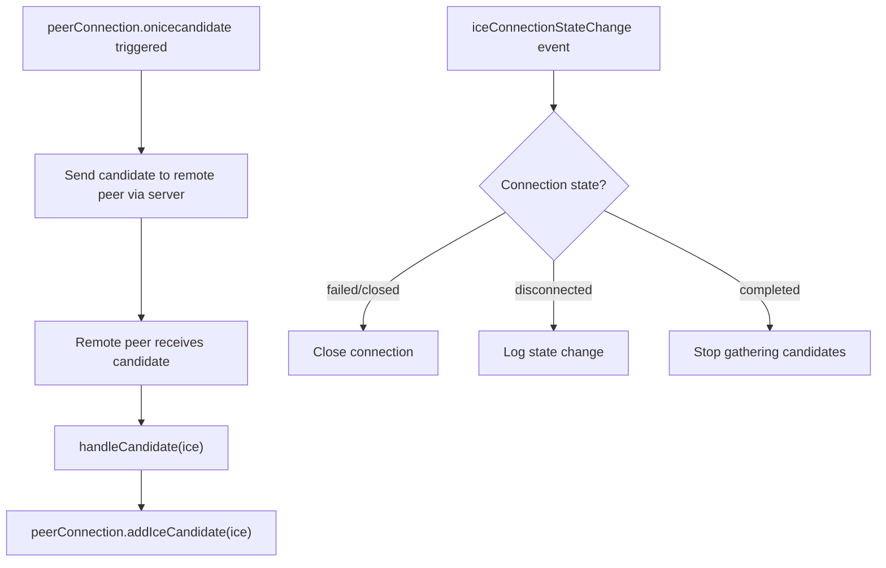

Sources: [lib/negotiator.ts:64-127](), [lib/negotiator.ts:327-338]()

## Data vs Media Connection Handling

PeerJS handles data and media connections differently based on their requirements:

### Data Connection Flow

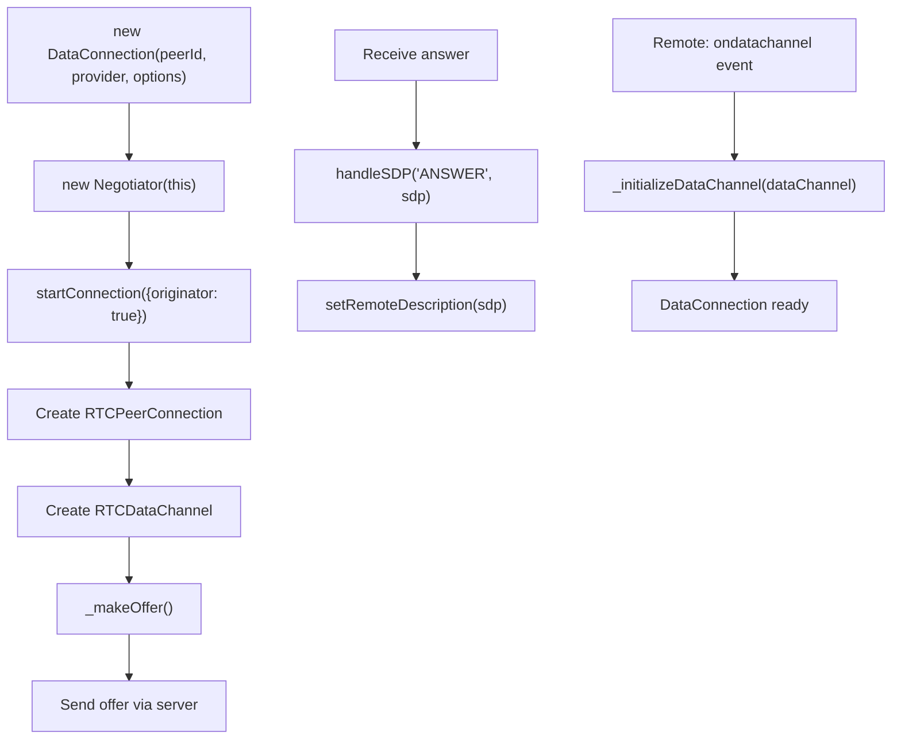

Sources: [lib/negotiator.ts:22-48](), [lib/negotiator.ts:131-142]()

### Media Connection Flow

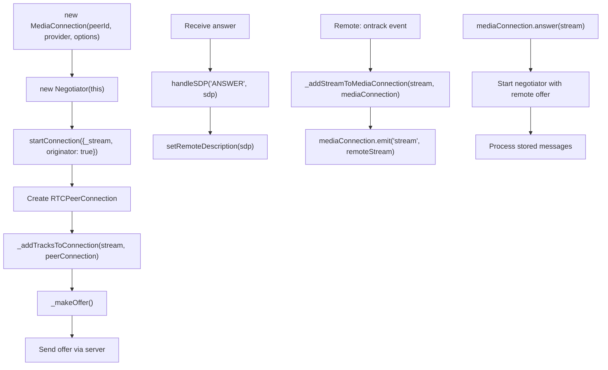

Sources: [lib/mediaconnection.ts:54-151](), [lib/negotiator.ts:147-158](), [lib/negotiator.ts:357-366]()

## Connection Lifecycle Management

The `Peer` class manages the lifecycle of all connections, including creation, tracking, and cleanup.

### Connection Tracking

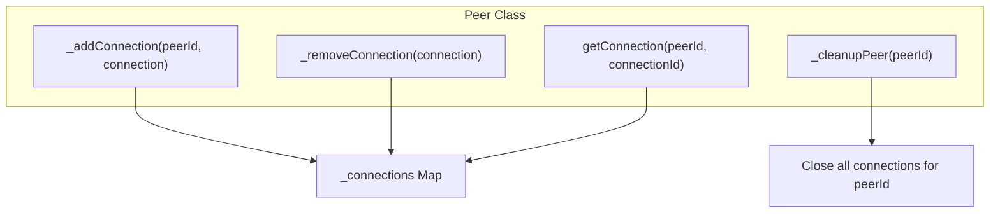

Sources: [lib/peer.ts:558-605](), [lib/peer.ts:656-674]()

### Connection Termination

Connections can be terminated in several ways:

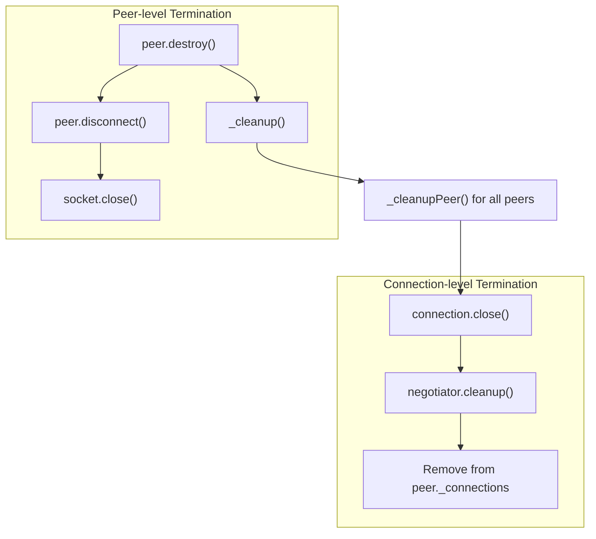

Sources: [lib/peer.ts:640-674](), [lib/peer.ts:682-700](), [lib/mediaconnection.ts:160-186](), [lib/negotiator.ts:161-192]()

## Message Handling and Storage

PeerJS uses a message queue system to handle messages that arrive before a connection is fully established:

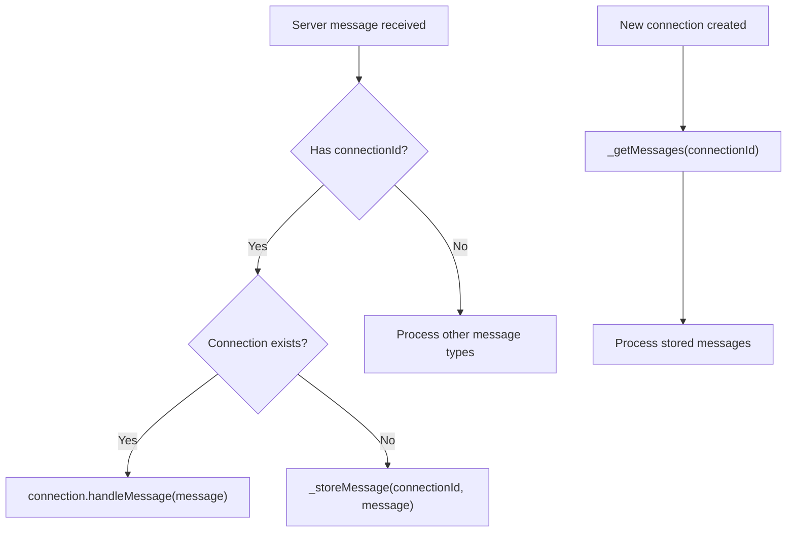

Sources: [lib/peer.ts:349-483]()

## Error Handling in Connection Flow

PeerJS implements a comprehensive error handling strategy for various connection scenarios:

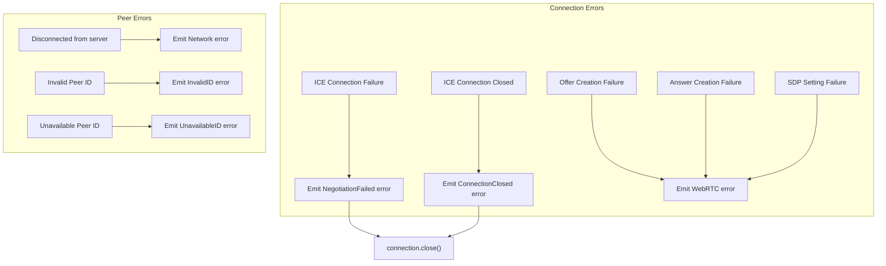

Sources: [lib/negotiator.ts:90-127](), [lib/negotiator.ts:195-259](), [lib/negotiator.ts:261-325](), [lib/peer.ts:354-365]()

## Connection Flow Summary

The PeerJS connection flow can be summarized as follows:

1. Peers connect to a signaling server (PeerServer)
2. An initiator peer creates a connection offer
3. The offer is sent to the target peer via the server
4. The target peer creates an answer and sends it back
5. Both peers exchange ICE candidates through the server
6. Once negotiation completes, a direct P2P WebRTC connection is established
7. Data or media can flow directly between peers without server intermediation
8. The connection is maintained until explicitly closed or an error occurs

This architecture allows PeerJS to provide a simple API for creating robust peer-to-peer connections while handling the complexities of WebRTC signaling and negotiation behind the scenes.

Sources: [lib/peer.ts](), [lib/negotiator.ts](), [lib/socket.ts](), [lib/mediaconnection.ts]()
