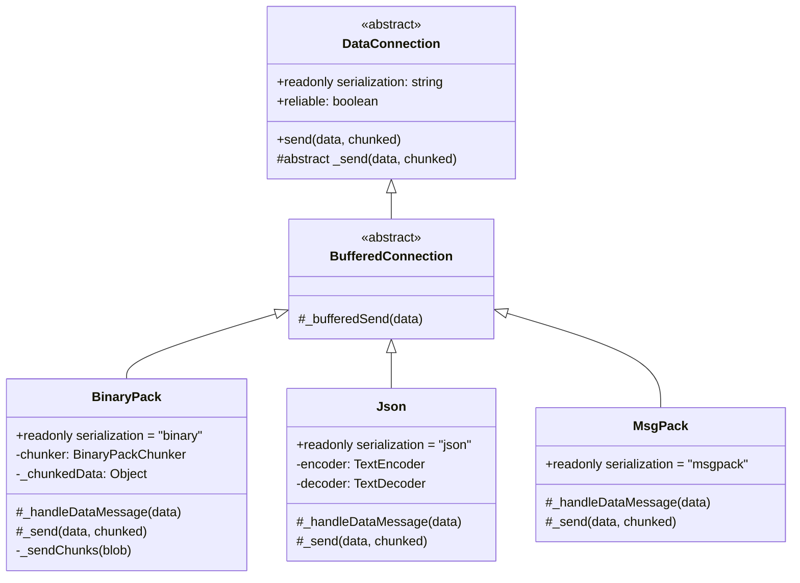
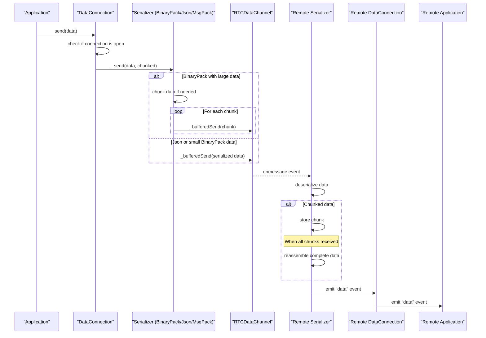
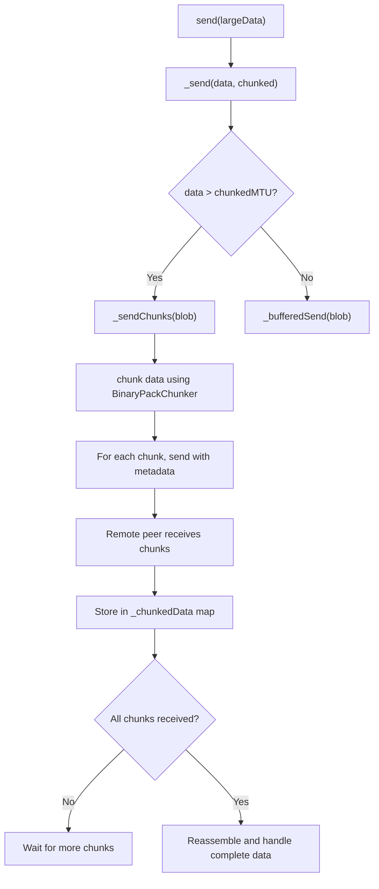

# Data Serialization

<details>
<summary>Relevant source files</summary>

The following files were used as context for generating this wiki page:

- [e2e/datachannel/blobs.js](e2e/datachannel/blobs.js)
- [e2e/datachannel/files.js](e2e/datachannel/files.js)
- [e2e/datachannel/serialization.js](e2e/datachannel/serialization.js)
- [lib/dataconnection/BufferedConnection/BinaryPack.ts](lib/dataconnection/BufferedConnection/BinaryPack.ts)
- [lib/dataconnection/BufferedConnection/Json.ts](lib/dataconnection/BufferedConnection/Json.ts)
- [lib/dataconnection/DataConnection.ts](lib/dataconnection/DataConnection.ts)
- [lib/msgPackPeer.ts](lib/msgPackPeer.ts)
- [lib/peerError.ts](lib/peerError.ts)

</details>


## Purpose and Overview

This document details how data is serialized, chunked, and transmitted between peers in the PeerJS library. It covers the serialization architecture, supported serialization formats, and the chunking mechanism used for large data transfers.

PeerJS provides multiple serialization options to optimize data transmission based on application needs. This system handles converting JavaScript objects and other data types into formats that can be efficiently transmitted over WebRTC data channels and then reconstructed on the receiving end.

For information about establishing connections between peers, see [Connection Flow](#2.2).

Sources: [lib/dataconnection/DataConnection.ts:126-139](), [lib/dataconnection/BufferedConnection/BinaryPack.ts:1-7](), [lib/dataconnection/BufferedConnection/Json.ts:1-5]()

## Serialization Architecture

PeerJS implements serialization through a flexible architecture that allows different serialization strategies to be used interchangeably.



The `DataConnection` abstract class defines the interface for all serialization implementations. Each concrete implementation provides its own serialization and deserialization logic through the `_send` and `_handleDataMessage` methods.

Sources: [lib/dataconnection/DataConnection.ts:31-161](), [lib/dataconnection/BufferedConnection/BinaryPack.ts:8-109](), [lib/dataconnection/BufferedConnection/Json.ts:5-38]()

## Data Flow

The following diagram illustrates how data flows through the serialization system:



Sources: [lib/dataconnection/DataConnection.ts:126-139](), [lib/dataconnection/BufferedConnection/BinaryPack.ts:27-75](), [lib/dataconnection/BufferedConnection/Json.ts:13-25]()

## Supported Serialization Formats

PeerJS supports three serialization formats:

### 1. BinaryPack

The default and most versatile serialization format. It can handle all JavaScript data types including Blobs, Files, ArrayBuffers, and standard objects.

Key features:
- Supports chunking for large data transfers
- Efficiently handles binary data
- Uses the `peerjs-js-binarypack` library for serialization

Implementation:
- Located in [lib/dataconnection/BufferedConnection/BinaryPack.ts]()
- Chunks data that exceeds the maximum transmission unit (MTU)
- Reassembles chunked data on the receiving end

### 2. JSON

A simpler serialization format that uses standard JSON encoding.

Key features:
- Easy to debug as data is stored as readable text
- Limited to data types that JSON can represent (no binary data)
- Has a message size limit - cannot handle very large messages

Implementation:
- Located in [lib/dataconnection/BufferedConnection/Json.ts]()
- Uses `TextEncoder` and `TextDecoder` for conversion between strings and binary data
- Will emit an error if the message size exceeds the chunked MTU

### 3. MsgPack (Experimental)

An efficient binary serialization format similar to BinaryPack but with smaller payload sizes.

Key features:
- More compact representation than JSON
- Faster serialization/deserialization
- Marked as experimental in the codebase

Implementation:
- Referenced in [lib/msgPackPeer.ts]()
- Specialized `MsgPackPeer` class that defaults to using MsgPack serialization

Sources: [lib/dataconnection/BufferedConnection/BinaryPack.ts:8-109](), [lib/dataconnection/BufferedConnection/Json.ts:5-38](), [lib/msgPackPeer.ts:1-12]()

## Chunking for Large Data

When sending large data (exceeding the MTU) using BinaryPack serialization, PeerJS automatically chunks the data into smaller pieces.



The chunking process:

1. When sending data that exceeds the maximum transmission unit (MTU), the `BinaryPack` serializer chunks it
2. Each chunk is tagged with metadata (id, chunk number, total chunks)
3. Chunks are sent individually through the data channel
4. The receiving peer stores chunks in a map indexed by their id
5. When all chunks for a specific id are received, they are reassembled
6. The complete data is then deserialized and emitted as a 'data' event

Sources: [lib/dataconnection/BufferedConnection/BinaryPack.ts:50-108]()

## Using Different Serialization Formats

### Choosing a Serialization Format

When establishing a connection between peers, you can specify which serialization format to use:

```javascript
// Connect with default serialization (BinaryPack)
const conn = peer.connect('remote-peer-id');

// Connect with JSON serialization
const jsonConn = peer.connect('remote-peer-id', { serialization: 'json' });

// Connect with MsgPack serialization (requires importing the MsgPack serializer)
const msgPackConn = peer.connect('remote-peer-id', { serialization: 'msgpack' });
```

For MsgPack serialization, you can also use the specialized `MsgPackPeer` class:

```javascript
import { MsgPackPeer } from 'peerjs';

const peer = new MsgPackPeer('my-peer-id');
// All connections will now use MsgPack serialization by default
```

### Serialization Considerations

When choosing a serialization format, consider:

1. **Data Types**: 
   - BinaryPack can handle all data types including binary data
   - JSON is limited to JSON-serializable types
   - MsgPack supports most data types with efficient encoding

2. **Data Size**:
   - BinaryPack supports chunking for large data transfers
   - JSON has a size limit and cannot handle large messages
   - MsgPack is more compact than JSON for the same data

3. **Performance**:
   - BinaryPack is generally fast but has overhead for chunking
   - JSON is slower for large objects but simple for small data
   - MsgPack is optimized for performance but is experimental

4. **Compatibility**:
   - BinaryPack is the most tested and stable option
   - JSON is widely supported
   - MsgPack is marked as experimental

Sources: [e2e/datachannel/serialization.js:61-72](), [lib/msgPackPeer.ts:1-12]()

## Implementation Details

### Error Handling

The serialization system includes robust error handling:

- JSON serializer will emit an error if the message is too large
- Connection errors are typified using the `DataConnectionErrorType` enum
- Errors are emitted through the EventEmitter system for applications to handle

### Special Messages

The serialization system handles special control messages:

- Close messages: When a peer wants to gracefully close a connection, it sends a special message with `__peerData` containing a close instruction
- Both the BinaryPack and JSON serializers recognize these control messages

Sources: [lib/peerError.ts:1-44](), [lib/dataconnection/BufferedConnection/Json.ts:13-25](), [lib/dataconnection/BufferedConnection/BinaryPack.ts:30-48]()
