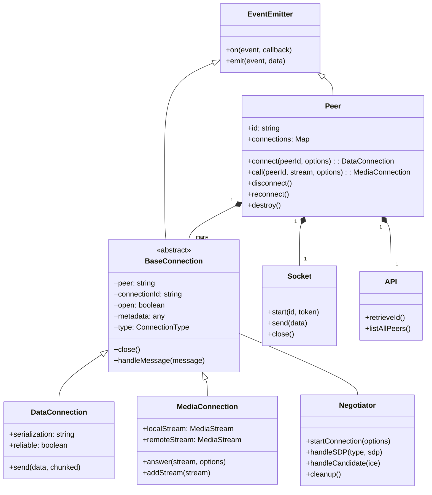
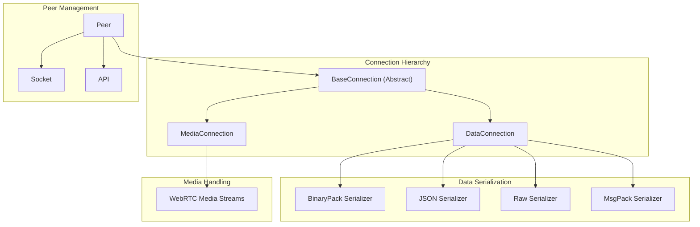
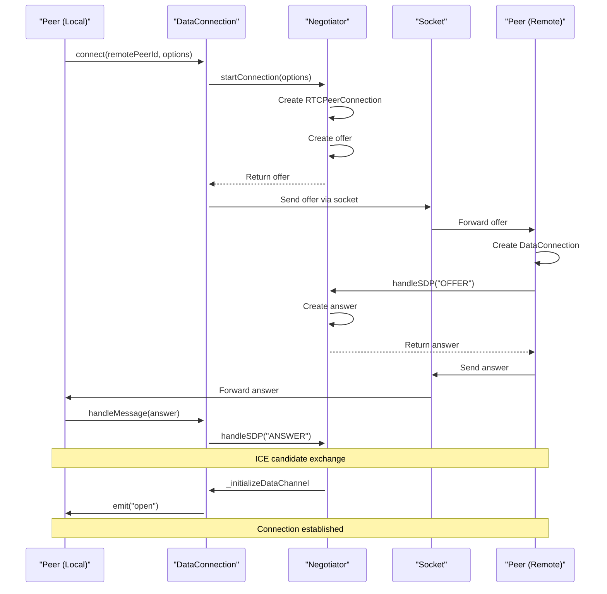

# Core Classes

Relevant source files

The following files were used as context for generating this wiki page:

- [lib/baseconnection.ts](lib/baseconnection.ts)
- [lib/enums.ts](lib/enums.ts)
- [lib/exports.ts](lib/exports.ts)
- [lib/peer.ts](lib/peer.ts)
- [lib/servermessage.ts](lib/servermessage.ts)

This page provides a technical overview of the main classes that form the foundation of the PeerJS library. It focuses on the core class structures, their relationships, and primary responsibilities. For information about how these classes interact during connection establishment, see [Connection Flow](#2.2).

## Class Hierarchy

The PeerJS library is built around a clear class hierarchy with the `Peer` class at its center. The following diagram illustrates the inheritance relationships and key dependencies between the core classes:

Sources: [lib/peer.ts:113-744]()/[lib/baseconnection.ts:32-91]()

## Peer Class

The `Peer` class is the primary entry point for using the PeerJS library. It manages peer identity, connections to other peers, and communication with the PeerServer.

### Key Responsibilities

- Establishing and maintaining identity with the PeerServer
- Creating connections to other peers
- Handling incoming connection requests
- Managing the lifecycle of all connections

### Important Properties

| Property | Type | Description |
|----------|------|-------------|
| `id` | string | The unique identifier for this peer |
| `connections` | Map | Map of all current connections keyed by peer ID |
| `open` | boolean | Whether the connection to the server is active |
| `disconnected` | boolean | Whether disconnected from the PeerServer |
| `destroyed` | boolean | Whether the peer has been destroyed |

### Core Methods

| Method | Description |
|--------|-------------|
| `connect(peerId, options)` | Creates a data connection to another peer |
| `call(peerId, stream, options)` | Creates a media connection to another peer |
| `disconnect()` | Disconnects from the PeerServer but keeps connections |
| `reconnect()` | Attempts to reconnect to the PeerServer with the same ID |
| `destroy()` | Closes all connections and disconnects from the server |
| `listAllPeers(callback)` | Retrieves a list of all available peer IDs |

### Events

The `Peer` class extends `EventEmitterWithError` and emits several events that applications can listen for:

| Event | Description |
|-------|-------------|
| `open` | Emitted when connection to the PeerServer is established |
| `connection` | Emitted when a new data connection is established |
| `call` | Emitted when a remote peer attempts to call you |
| `disconnected` | Emitted when disconnected from the PeerServer |
| `close` | Emitted when the peer is destroyed |
| `error` | Emitted when an error occurs |

Sources: [lib/peer.ts:113-744]()

## Connection Architecture

PeerJS abstracts WebRTC connections through a hierarchical class structure:

Sources: [lib/peer.ts:113-744]()/[lib/baseconnection.ts:32-91]()/[lib/exports.ts:1-28]()

## BaseConnection Class

`BaseConnection` is an abstract class that provides common functionality for all types of connections (data and media). It extends `EventEmitterWithError` to allow connections to emit events and errors.

### Key Properties

| Property | Type | Description |
|----------|------|-------------|
| `peer` | string | ID of the peer on the other end |
| `connectionId` | string | Unique identifier for this connection |
| `open` | boolean | Whether the connection is active |
| `metadata` | any | Optional metadata associated with the connection |
| `peerConnection` | RTCPeerConnection | The underlying WebRTC connection |

### Abstract Methods

| Method | Description |
|--------|-------------|
| `close()` | Closes the connection |
| `handleMessage(message)` | Processes messages related to this connection |
| `_initializeDataChannel(dc)` | Sets up the WebRTC data channel |
| `get type()` | Returns the connection type (data or media) |

### Events

| Event | Description |
|-------|-------------|
| `close` | Emitted when the connection is closed |
| `error` | Emitted when an error occurs |
| `iceStateChanged` | Emitted when the ICE connection state changes |

Sources: [lib/baseconnection.ts:32-91]()

## Connection Types

PeerJS supports two main types of connections, each represented by a specific class:

### DataConnection

The `DataConnection` class extends `BaseConnection` and is used for sending and receiving data between peers. It handles serialization of data using different formats.

Key features:
- Supports multiple serialization formats (Binary, JSON, Raw, MsgPack)
- Handles chunking of large data
- Provides reliable data transfer

### MediaConnection

The `MediaConnection` class extends `BaseConnection` and is used for audio/video streaming between peers.

Key features:
- Handles media streams using WebRTC
- Supports answering incoming calls
- Manages local and remote media streams

Sources: [lib/peer.ts:402-405]()/[lib/peer.ts:549-554]()/[lib/exports.ts:14-15]()

## Supporting Infrastructure

Several supporting classes enable the core functionality of PeerJS:

### Negotiator

The `Negotiator` class handles WebRTC connection negotiation between peers, including:
- Creating and processing SDP offers/answers
- Managing ICE candidates
- Establishing the RTCPeerConnection

### Socket

The `Socket` class manages the WebSocket connection to the PeerServer, which is used for:
- Signaling to establish WebRTC connections
- Registering peer ID with the server
- Heartbeat mechanism to maintain connection

### API

The `API` class provides methods for interacting with the PeerServer REST API:
- Retrieving a peer ID from the server
- Listing all available peers

Sources: [lib/peer.ts:272-309]()/[lib/peer.ts:738-743]()

## Connection Management Flow

The following diagram shows how the core classes interact during the connection lifecycle:

Sources: [lib/peer.ts:490-516]()/[lib/peer.ts:349-457]()

## Enumerations

PeerJS uses several enumerations to define constants and types across the library:

### ConnectionType

Defines the types of connections that can be established:
- `Data`: For sending/receiving data
- `Media`: For audio/video streaming

### PeerErrorType

Defines various error types that can occur, such as:
- `BrowserIncompatible`
- `Disconnected`
- `InvalidID`
- `Network`
- `PeerUnavailable`
- `ServerError`

### ServerMessageType

Defines message types exchanged with the PeerServer:
- `Heartbeat`
- `Candidate` 
- `Offer`
- `Answer`
- `Open`
- `Error`

Sources: [lib/enums.ts:1-98]()

## Error Handling

PeerJS uses a structured approach to error handling, with each class extending `EventEmitterWithError`. Errors are emitted as events with specific error types, allowing applications to catch and handle them appropriately.

For more details on error handling, see [Error Handling](#4.3).

Sources: [lib/peer.ts:113-744]()/[lib/baseconnection.ts:9-31]()
