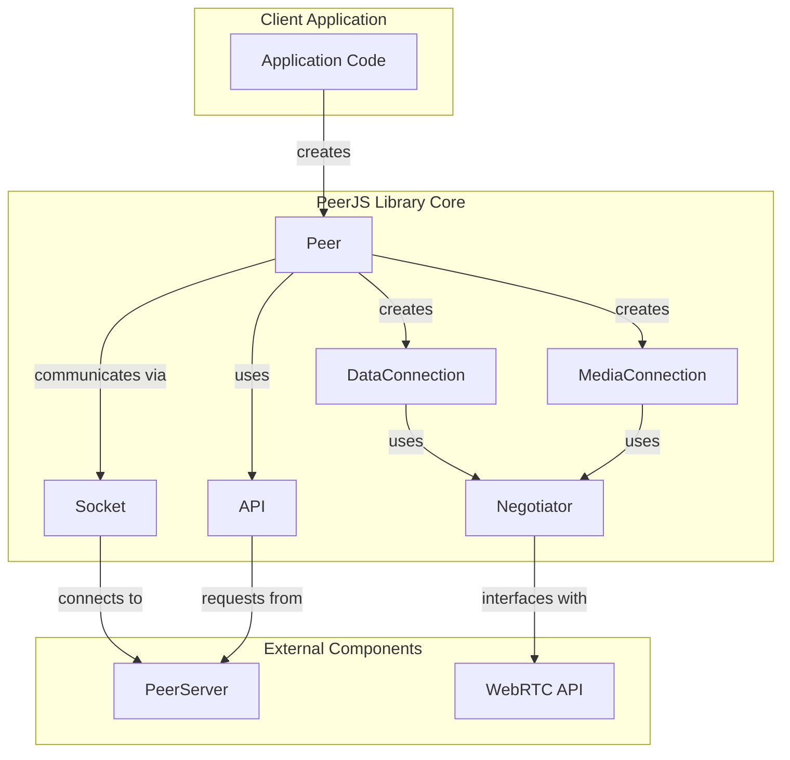
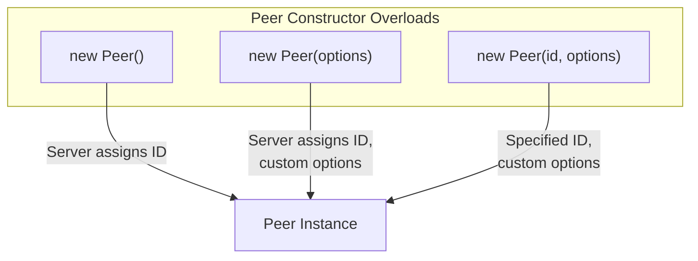
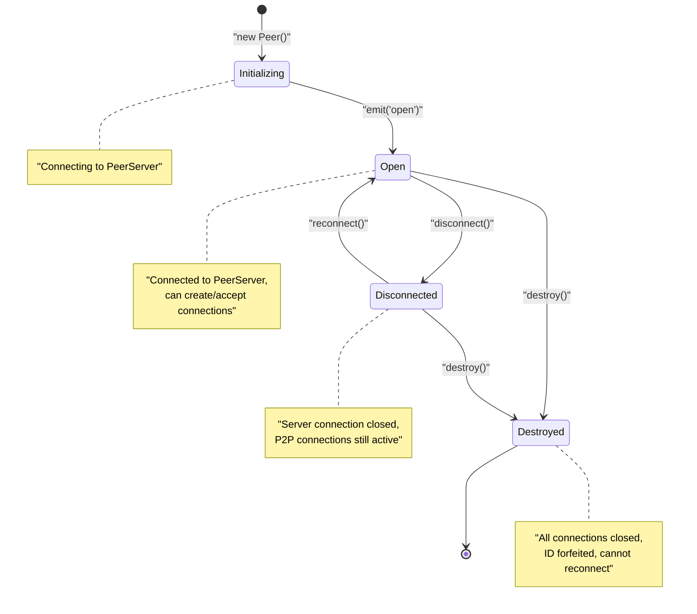
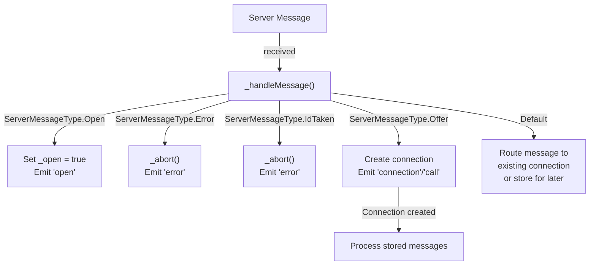
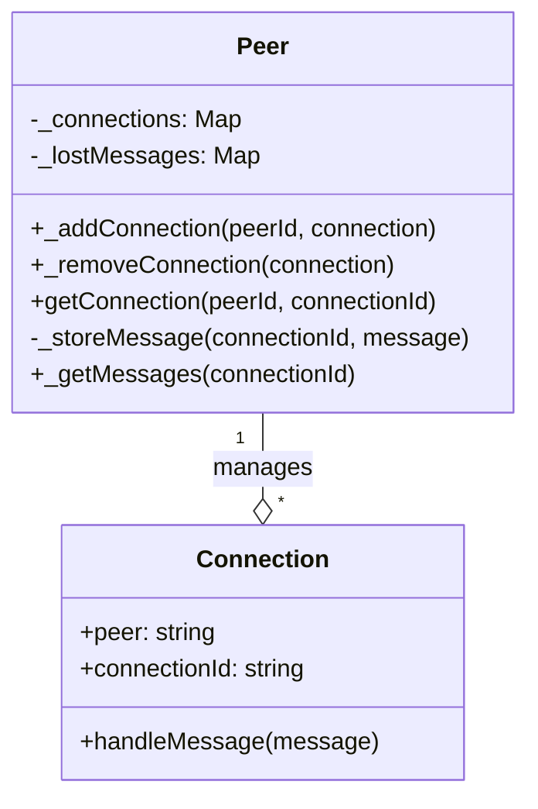

# Peer

<details>
<summary>Relevant source files</summary>

The following files were used as context for generating this wiki page:

- [lib/exports.ts](lib/exports.ts)
- [lib/peer.ts](lib/peer.ts)

</details>


The `Peer` class is the primary entry point to the PeerJS library, representing a node that can initiate and accept peer-to-peer connections with other peers. It serves as the main interface for establishing data and media connections, managing the connection lifecycle, and handling communication with the signaling server.

For information about specific connection types, see [DataConnection](#3.2) and [MediaConnection](#3.3).

## Overview

The `Peer` class is responsible for:

- Creating and managing connections with other peers
- Handling signaling through a PeerServer
- Managing its own lifecycle (initialization, disconnection, destruction)
- Routing messages between connections and the server
- Emitting events for connection state changes

### Peer in the PeerJS Architecture



Sources: [lib/peer.ts:113-744]()

## Instantiation

The `Peer` class can be instantiated in three ways:



Sources: [lib/peer.ts:196-212]()

### Constructor Options

The `Peer` class accepts configuration options through the `PeerOptions` interface:

| Option | Type | Default | Description |
|--------|------|---------|-------------|
| `debug` | `LogLevel` | `0` | Controls log verbosity (0: Errors, 1: Warnings, 3: All logs) |
| `host` | `string` | `'0.peerjs.com'` | Server host |
| `port` | `number` | `443` | Server port |
| `path` | `string` | `'/'` | Path where PeerServer is running |
| `key` | `string` | `'peerjs'` | API key (deprecated) |
| `token` | `string` | Random token | Authentication token |
| `config` | `object` | `util.defaultConfig` | RTCPeerConnection configuration |
| `secure` | `boolean` | Based on host | Whether to use TLS |
| `serializers` | `SerializerMapping` | Built-in serializers | Custom serializers for data connections |

Sources: [lib/peer.ts:25-78](), [lib/peer.ts:226-236]()

## Peer Lifecycle

The `Peer` class has several states throughout its lifecycle:



Sources: [lib/peer.ts:131-134](), [lib/peer.ts:640-653](), [lib/peer.ts:682-700](), [lib/peer.ts:709-730]()

### Properties Reflecting State

| Property | Type | Description |
|----------|------|-------------|
| `id` | `string \| null` | The peer's identifier (null if not connected) |
| `open` | `boolean` | Whether the connection to the server is open |
| `disconnected` | `boolean` | Whether disconnected from the server |
| `destroyed` | `boolean` | Whether the peer has been destroyed |

Sources: [lib/peer.ts:146-191]()

## Connection Management

The `Peer` class manages two types of connections:

1. **DataConnection**: For sending arbitrary data between peers
2. **MediaConnection**: For audio/video streaming between peers

### Creating Connections

```mermaid
sequenceDiagram
    participant ClientA as "Peer (Client A)"
    participant ServerA as "PeerServer"
    participant ClientB as "Peer (Client B)"
    
    Note over ClientA: peer.connect("peerB-id")
    ClientA->>ServerA: Send connection request
    ServerA->>ClientB: Forward connection request
    
    alt DataConnection
        Note over ClientB: emit("connection", dataConn)
        ClientB-->>ServerA: Send answer
        ServerA-->>ClientA: Forward answer
    else MediaConnection
        Note over ClientA: peer.call("peerB-id", stream)
        Note over ClientB: emit("call", mediaConn)
        ClientB-->>ServerA: Send answer
        ServerA-->>ClientA: Forward answer
    end
    
    Note over ClientA,ClientB: WebRTC negotiation
    
    ClientA<-->ClientB: Direct P2P connection established
```

Sources: [lib/peer.ts:490-555]()

### Connection Methods

- **`connect(peer: string, options?: PeerConnectOption): DataConnection`**  
  Establishes a data connection with a remote peer.

- **`call(peer: string, stream: MediaStream, options?: CallOption): MediaConnection`**  
  Establishes a media connection with a remote peer.

- **`getConnection(peerId: string, connectionId: string): null | DataConnection | MediaConnection`**  
  Retrieves an existing connection.

Sources: [lib/peer.ts:490-605]()

## Events

The `Peer` class extends `EventEmitterWithError` and emits various events:

| Event | Parameters | Description |
|-------|------------|-------------|
| `open` | `id: string` | Emitted when connection to the PeerServer is established |
| `connection` | `dataConnection: DataConnection` | Emitted when a new data connection is established from a remote peer |
| `call` | `mediaConnection: MediaConnection` | Emitted when a remote peer attempts to call |
| `disconnected` | `currentId: string` | Emitted when disconnected from the signaling server |
| `close` | None | Emitted when the peer is destroyed |
| `error` | `error: PeerError<PeerErrorType>` | Emitted when an error occurs |

Sources: [lib/peer.ts:80-109](), [lib/peer.ts:113]()

## Internal Message Handling



Sources: [lib/peer.ts:349-458](), [lib/peer.ts:461-483]()

## Connection Storage

The `Peer` class maintains two important data structures:

1. **`_connections`**: A Map that stores active connections, keyed by peer ID
2. **`_lostMessages`**: A Map that stores messages received before a connection is established



Sources: [lib/peer.ts:135-139](), [lib/peer.ts:558-605](), [lib/peer.ts:461-483]()

## Connection Lifecycle Management

The `Peer` class provides several methods to manage its lifecycle:

- **`disconnect()`**: Disconnects from the PeerServer but keeps peer connections active
- **`reconnect()`**: Attempts to reconnect to the server with the same ID
- **`destroy()`**: Completely tears down the peer, closing all connections
- **`_cleanupPeer(peerId)`**: Closes all connections to a specific peer
- **`_cleanup()`**: Disconnects all connections and removes all listeners

Sources: [lib/peer.ts:640-674](), [lib/peer.ts:682-730]()

## Example Usage

Here's how the `Peer` class is typically used:

1. Create a peer instance:
   ```javascript
   const peer = new Peer('my-id', {
     host: 'myserver.com',
     port: 9000,
     path: '/peerjs',
     debug: 2
   });
   ```

2. Listen for connection events:
   ```javascript
   peer.on('open', (id) => {
     console.log('My peer ID is: ' + id);
   });
   
   peer.on('connection', (conn) => {
     conn.on('data', (data) => {
       console.log('Received', data);
     });
   });
   
   peer.on('call', (call) => {
     // Answer the call
     call.answer(myStream);
   });
   ```

3. Connect to another peer:
   ```javascript
   const conn = peer.connect('another-peer-id');
   conn.on('open', () => {
     conn.send('Hello!');
   });
   ```

4. Make a video call:
   ```javascript
   navigator.mediaDevices.getUserMedia({video: true, audio: true})
     .then((stream) => {
       const call = peer.call('another-peer-id', stream);
       call.on('stream', (remoteStream) => {
         // Show remote stream
       });
     });
   ```

Sources: [lib/peer.ts:113-744]()

## Error Handling

The `Peer` class emits errors through the `error` event. Common error types include:

| Error Type | Description |
|------------|-------------|
| `BrowserIncompatible` | Browser doesn't support WebRTC |
| `InvalidID` | The provided ID is invalid |
| `UnavailableID` | The requested ID is already taken |
| `ServerError` | The server encountered an error |
| `SocketError` | Socket connection error |
| `NetworkError` | Network connectivity issue |
| `PeerUnavailable` | The peer you're trying to connect to is not available |
| `Disconnected` | Cannot perform operation while disconnected |

Sources: [lib/peer.ts:108](), [lib/peer.ts:618-628]()

## Additional Features

### Server Discovery

The `listAllPeers` method allows for discovering other peers connected to the same PeerServer:

```javascript
peer.listAllPeers((peers) => {
  console.log('Available peers:', peers);
});
```

This feature requires the PeerServer to have discovery enabled.

Sources: [lib/peer.ts:738-743]()
