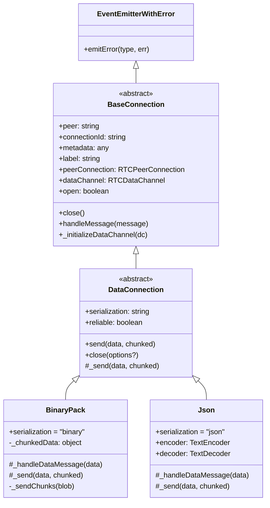
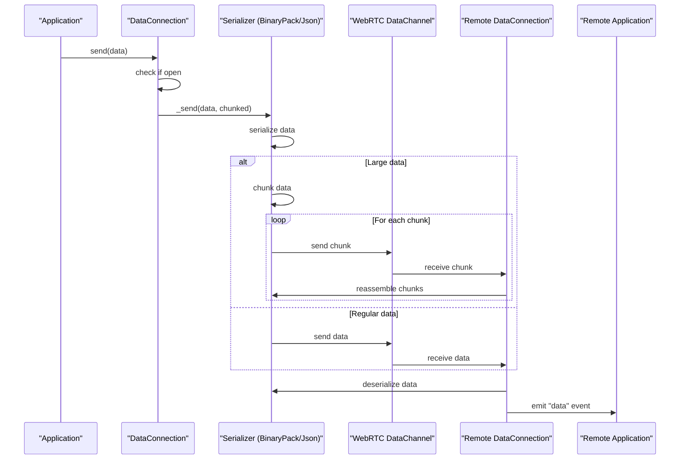
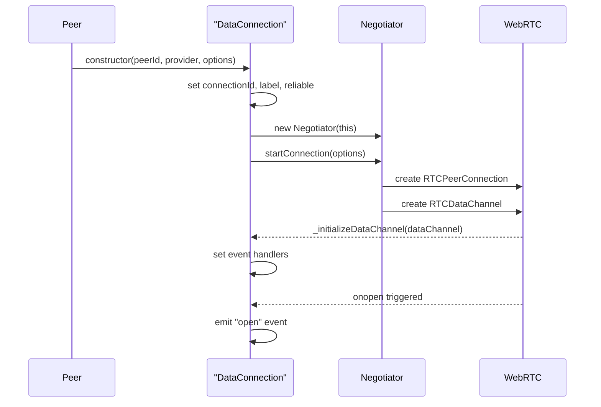
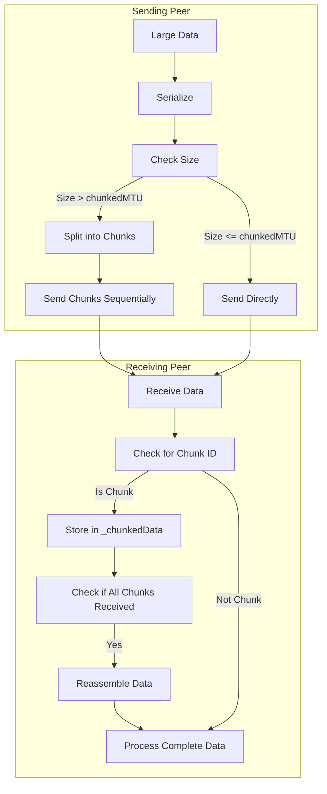

# DataConnection

<details>
<summary>Relevant source files</summary>

The following files were used as context for generating this wiki page:

- [e2e/datachannel/blobs.js](e2e/datachannel/blobs.js)
- [e2e/datachannel/files.js](e2e/datachannel/files.js)
- [lib/baseconnection.ts](lib/baseconnection.ts)
- [lib/dataconnection/BufferedConnection/BinaryPack.ts](lib/dataconnection/BufferedConnection/BinaryPack.ts)
- [lib/dataconnection/BufferedConnection/Json.ts](lib/dataconnection/BufferedConnection/Json.ts)
- [lib/dataconnection/DataConnection.ts](lib/dataconnection/DataConnection.ts)
- [lib/enums.ts](lib/enums.ts)
- [lib/peerError.ts](lib/peerError.ts)
- [lib/servermessage.ts](lib/servermessage.ts)

</details>


The `DataConnection` class is a core component of PeerJS that handles peer-to-peer data transmission over WebRTC data channels. It represents a connection between two peers specifically for exchanging data (as opposed to media streams, which are handled by [MediaConnection](#3.3)).

## Purpose and Scope

This document covers:
- The architecture of the `DataConnection` class and its inheritance hierarchy
- How data connections are established and managed
- Methods for sending and receiving data
- Data serialization approaches
- Error handling for data connections

Sources: [lib/dataconnection/DataConnection.ts:31-161](), [lib/baseconnection.ts:32-91]()

## Architecture Overview

`DataConnection` is an abstract class that extends `BaseConnection`. Concrete implementations for different serialization strategies are provided as subclasses. The class serves as a wrapper around a WebRTC `DataChannel`, providing a simpler API for establishing connections and sending data between peers.

### Class Hierarchy and Relationships



Sources: [lib/dataconnection/DataConnection.ts:31-161](), [lib/baseconnection.ts:32-91](), [lib/dataconnection/BufferedConnection/BinaryPack.ts:8-109](), [lib/dataconnection/BufferedConnection/Json.ts:5-38]()

### Data Flow in DataConnection



Sources: [lib/dataconnection/DataConnection.ts:127-139](), [lib/dataconnection/BufferedConnection/BinaryPack.ts:28-108](), [lib/dataconnection/BufferedConnection/Json.ts:13-37]()

## Establishing a Connection

A `DataConnection` is typically created through the `Peer.connect()` method, which instantiates an appropriate `DataConnection` subclass based on the specified serialization option. The connection process involves:

1. Creating a new `DataConnection` instance
2. Initializing a `Negotiator` to handle WebRTC connection setup
3. Establishing the WebRTC data channel
4. Emitting an `open` event when the connection is ready

The `DataConnection` constructor handles most of this process automatically:



Sources: [lib/dataconnection/DataConnection.ts:46-63](), [lib/dataconnection/DataConnection.ts:65-84]()

## Sending and Receiving Data

### Sending Data

The `send()` method is the primary API for transmitting data to the remote peer. This method:

1. Checks if the connection is open
2. Calls the internal `_send()` method which is implemented by subclasses
3. The serializer-specific implementation handles:
   - Serializing the data
   - Chunking large data if necessary
   - Transmitting through the WebRTC data channel

```javascript
// Simplified representation of the send method
send(data, chunked = false) {
    if (!this.open) {
        this.emitError(DataConnectionErrorType.NotOpenYet, "Connection is not open...");
        return;
    }
    return this._send(data, chunked);
}
```

Sources: [lib/dataconnection/DataConnection.ts:130-139]()

### Receiving Data

Data is received through event handlers set up when the data channel is initialized:

1. The data channel's `onmessage` event is triggered when data arrives
2. The `_handleDataMessage()` method (implemented by serializer subclasses) processes the data:
   - Deserializes the data
   - Handles any chunking/reassembly if needed
   - Emits a `data` event with the processed data

The application code can listen for the `data` event to receive incoming data:

```javascript
// Example usage in application code
dataConnection.on('data', (receivedData) => {
    console.log('Received data:', receivedData);
});
```

Sources: [lib/dataconnection/BufferedConnection/BinaryPack.ts:30-48](), [lib/dataconnection/BufferedConnection/Json.ts:14-25]()

## Serialization Types

`DataConnection` supports multiple serialization strategies, defined in the `SerializationType` enum:

| Serialization Type | Description | Advantages | Limitations |
|-------------------|-------------|------------|-------------|
| `Binary` | Binary serialization using BinaryPack | Efficient for complex data structures | More processing overhead |
| `BinaryUTF8` | Binary with UTF8 encoding | Better for string-heavy data | Not ideal for binary data |
| `JSON` | JSON serialization | Human-readable, widely compatible | Limited to JSON-serializable data, size limitation |
| `None` (raw) | No serialization | Minimal overhead | Limited to simple data types |

Each serialization type is implemented as a concrete subclass of `DataConnection`, providing specific implementations for the `_send()` and `_handleDataMessage()` methods.

Sources: [lib/enums.ts:73-78](), [lib/dataconnection/BufferedConnection/BinaryPack.ts:8-109](), [lib/dataconnection/BufferedConnection/Json.ts:5-38]()

### Chunking and Large Data Handling

For large data transfers, PeerJS implements a chunking mechanism that:

1. Splits large data into smaller chunks
2. Sends each chunk with metadata to identify its position
3. Reassembles the chunks on the receiving end

This is particularly important for the `BinaryPack` serializer, which can handle arbitrarily large data by chunking:



Sources: [lib/dataconnection/BufferedConnection/BinaryPack.ts:50-76](), [lib/dataconnection/BufferedConnection/BinaryPack.ts:101-108]()

## Error Handling

`DataConnection` includes robust error handling for common issues that may occur during data transmission. These errors are defined in the `DataConnectionErrorType` enum:

| Error Type | Description | Common Cause |
|------------|-------------|--------------|
| `NotOpenYet` | Attempt to send data before connection is open | Calling `send()` before the `open` event |
| `MessageToBig` | Data exceeds maximum size for the serializer | Sending very large objects with JSON serialization |

Errors are emitted through the `error` event, which applications can listen for:

```javascript
// Example error handling in application code
dataConnection.on('error', (error) => {
    console.error('Connection error:', error.type, error.message);
});
```

Sources: [lib/enums.ts:68-71](), [lib/dataconnection/DataConnection.ts:131-137](), [lib/peerError.ts:28-44]()

## Connection Lifecycle

The `DataConnection` lifecycle includes several key phases:

1. **Initialization**: Connection is created but not yet open
2. **Open**: Connection is established and ready for data transmission
3. **Active**: Data is being sent and received
4. **Closing**: Connection is being terminated
5. **Closed**: Connection is fully terminated

The most important events during this lifecycle are:

| Event | Description | When It Occurs |
|-------|-------------|----------------|
| `open` | Connection is ready | After the WebRTC data channel is established |
| `data` | Data received | When data arrives from the remote peer |
| `close` | Connection closed | When either peer closes the connection |
| `error` | Error occurred | When something goes wrong |

The `close()` method handles cleanup when terminating a connection:

```javascript
// Simplified representation of close behavior
close(options?: { flush?: boolean }) {
    if (options?.flush) {
        // Send a close message to peer first
        this.send({ __peerData: { type: "close" } });
        return;
    }
    
    // Clean up resources
    this._negotiator.cleanup();
    this.provider._removeConnection(this);
    
    // Close data channel
    this.dataChannel = null;
    
    // Update state and emit event
    this._open = false;
    this.emit("close");
}
```

Sources: [lib/dataconnection/DataConnection.ts:91-125](), [lib/dataconnection/DataConnection.ts:65-84]()

## Conclusion

The `DataConnection` class provides a high-level abstraction over WebRTC data channels, making it easy to establish peer-to-peer data connections and exchange various types of data. Its flexible serialization system and built-in support for large data transmission make it suitable for a wide range of applications, from simple text messaging to complex file transfers.

For media streaming capabilities, see the [MediaConnection](#3.3) documentation, which handles audio and video streaming between peers.

Sources: [lib/dataconnection/DataConnection.ts:31-161]()
