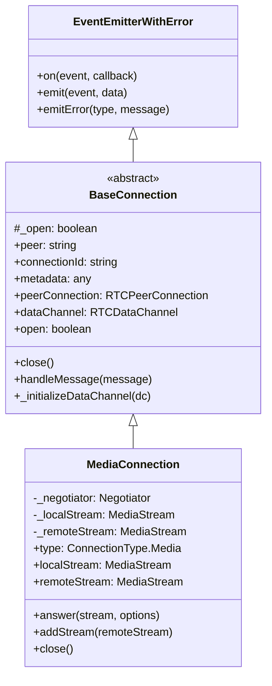
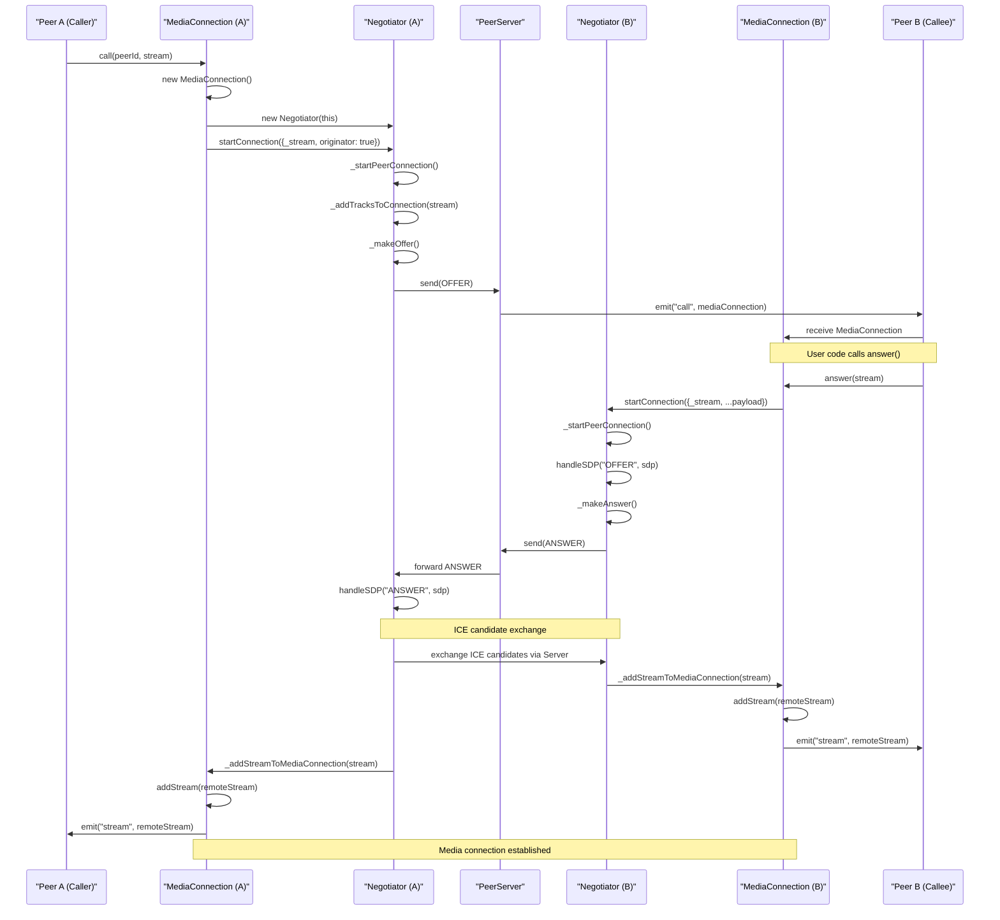
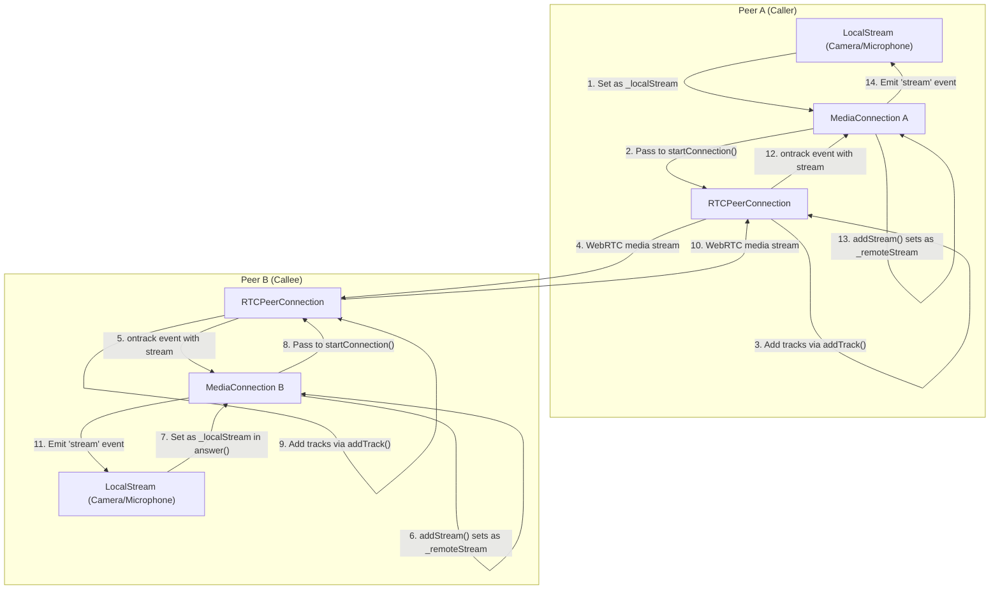

# MediaConnection

<details>
<summary>Relevant source files</summary>

The following files were used as context for generating this wiki page:

- [lib/baseconnection.ts](lib/baseconnection.ts)
- [lib/enums.ts](lib/enums.ts)
- [lib/mediaconnection.ts](lib/mediaconnection.ts)
- [lib/negotiator.ts](lib/negotiator.ts)
- [lib/servermessage.ts](lib/servermessage.ts)

</details>


The `MediaConnection` class in PeerJS is responsible for wrapping WebRTC's media streams and providing an abstraction for audio/video calls between peers. This document covers the structure, functionality, and usage of the `MediaConnection` class, which is a core component for enabling real-time media communication in PeerJS applications.

For information about data connections used for sending and receiving non-media information, see [DataConnection](#3.2).

## Class Overview

`MediaConnection` extends the `BaseConnection` class and provides specialized functionality for handling media streams using WebRTC. Instances of this class are typically created when:

1. A peer initiates a call using `Peer.call()`
2. A peer receives a call (via the `call` event on a `Peer` instance)



Sources: [lib/mediaconnection.ts:31-187](), [lib/baseconnection.ts:32-91]()

## Properties and Methods

The `MediaConnection` class provides the following key properties and methods:

| Property/Method | Type | Description |
|----------------|------|-------------|
| `type` | `ConnectionType.Media` | Identifies this as a media connection |
| `localStream` | `MediaStream` | The local media stream being sent to the remote peer |
| `remoteStream` | `MediaStream` | The media stream received from the remote peer |
| `answer(stream?, options?)` | `void` | Accepts an incoming call and optionally sends a media stream |
| `close()` | `void` | Closes the media connection |

Sources: [lib/mediaconnection.ts:42-53](), [lib/mediaconnection.ts:125-151](), [lib/mediaconnection.ts:160-186]()

## Events

`MediaConnection` emits the following events:

| Event | Arguments | Description |
|-------|-----------|-------------|
| `stream` | `(stream: MediaStream)` | Fired when a remote stream is received |
| `willCloseOnRemote` | None | Fired when the auxiliary data channel is established |
| `close` | None | Fired when the connection is closed |
| `error` | `(error: PeerError)` | Fired when an error occurs |
| `iceStateChanged` | `(state: RTCIceConnectionState)` | Fired when the ICE connection state changes |

Sources: [lib/mediaconnection.ts:10-25](), [lib/baseconnection.ts:12-30]()

## Media Connection Establishment

The process of establishing a media connection in PeerJS involves several steps and components:



Sources: [lib/mediaconnection.ts:54-69](), [lib/mediaconnection.ts:125-151](), [lib/negotiator.ts:22-48](), [lib/negotiator.ts:147-158](), [lib/negotiator.ts:305-325]()

## Media Stream Flow

The following diagram illustrates how media streams flow between peers:



Sources: [lib/mediaconnection.ts:86-91](), [lib/negotiator.ts:340-355](), [lib/negotiator.ts:357-366]()

## Implementation Details

### Constructor and Initialization

When a `MediaConnection` is created, it:

1. Initializes with the provided peer ID, provider, and options
2. Sets the local stream from options (if calling) or it will be set later (if receiving)
3. Creates a unique connection ID with the prefix "mc_"
4. Instantiates a `Negotiator` to handle WebRTC setup
5. If a local stream is provided, starts the connection as the originator

```mermaid
graph TD
    constructor["Constructor(peerId, provider, options)"]
    setLocalStream["Set _localStream from options._stream"]
    createConnectionId["Create connectionId with mc_ prefix"]
    createNegotiator["Create new Negotiator instance"]
    checkLocalStream["Check if _localStream exists"]
    startConnection["Start connection as originator"]
    
    constructor-->setLocalStream
    constructor-->createConnectionId
    constructor-->createNegotiator
    constructor-->checkLocalStream
    checkLocalStream-->|"Yes"|startConnection
    checkLocalStream-->|"No"|finish["Wait for answer() call"]
```

Sources: [lib/mediaconnection.ts:54-69]()

### Answering a Call

When receiving a call, the recipient can answer with their own media stream:

1. The `answer` method sets the local stream
2. It updates the SDP transform option if provided
3. It starts the connection with the received payload data
4. It processes any cached messages that were waiting for the connection
5. It marks the connection as open

Sources: [lib/mediaconnection.ts:125-151]()

### Message Handling

The `MediaConnection` class handles two types of messages from the remote peer:

1. **Answer** messages containing an SDP description, which are forwarded to the `Negotiator`
2. **Candidate** messages containing ICE candidates, also forwarded to the `Negotiator`

Sources: [lib/mediaconnection.ts:96-113]()

### Closing a Connection

When closing a media connection:

1. The `Negotiator` is cleaned up and nullified
2. Local and remote streams are cleared
3. References to the provider and streams in options are cleared
4. If the connection was open, it's marked as closed and a "close" event is emitted

Sources: [lib/mediaconnection.ts:160-186]()

## Integration with the Negotiator

The `MediaConnection` class works closely with the `Negotiator` class to handle the WebRTC specifics:

1. The `Negotiator` manages the creation of the RTCPeerConnection
2. It handles SDP offer and answer exchanges
3. It manages ICE candidate gathering and exchange
4. It adds tracks from media streams to the connection
5. When it receives a remote stream, it notifies the `MediaConnection` via `_addStreamToMediaConnection`

This separation of concerns allows the `MediaConnection` to focus on the high-level API while the `Negotiator` handles the WebRTC complexity.

Sources: [lib/negotiator.ts:22-48](), [lib/negotiator.ts:340-355](), [lib/negotiator.ts:357-366]()

## Usage Example

The following shows how to use `MediaConnection` in a typical application:

As a caller:
```javascript
// Get user media
navigator.mediaDevices.getUserMedia({video: true, audio: true})
  .then(stream => {
    // Call a peer with the stream
    const call = peer.call('remote-peer-id', stream);
    
    // Listen for the stream event to get the remote stream
    call.on('stream', remoteStream => {
      // Display the remote stream
      const video = document.querySelector('video');
      video.srcObject = remoteStream;
    });
  });
```

As a callee:
```javascript
// Listen for incoming calls
peer.on('call', call => {
  // Get user media
  navigator.mediaDevices.getUserMedia({video: true, audio: true})
    .then(stream => {
      // Answer the call with our stream
      call.answer(stream);
      
      // Listen for the stream event to get the remote stream
      call.on('stream', remoteStream => {
        // Display the remote stream
        const video = document.querySelector('video');
        video.srcObject = remoteStream;
      });
    });
});
```

## Related Components

The `MediaConnection` class interacts with several other components in the PeerJS system:

1. **Peer**: Creates and manages `MediaConnection` instances
2. **Negotiator**: Handles WebRTC negotiation for establishing connections
3. **BaseConnection**: Provides common functionality for all connection types
4. **Socket**: Facilitates communication with the PeerServer for signaling

For more information about these components, see their respective wiki pages: [Peer](#3.1), [Negotiator](#3.4), and [Socket and API](#3.5).
