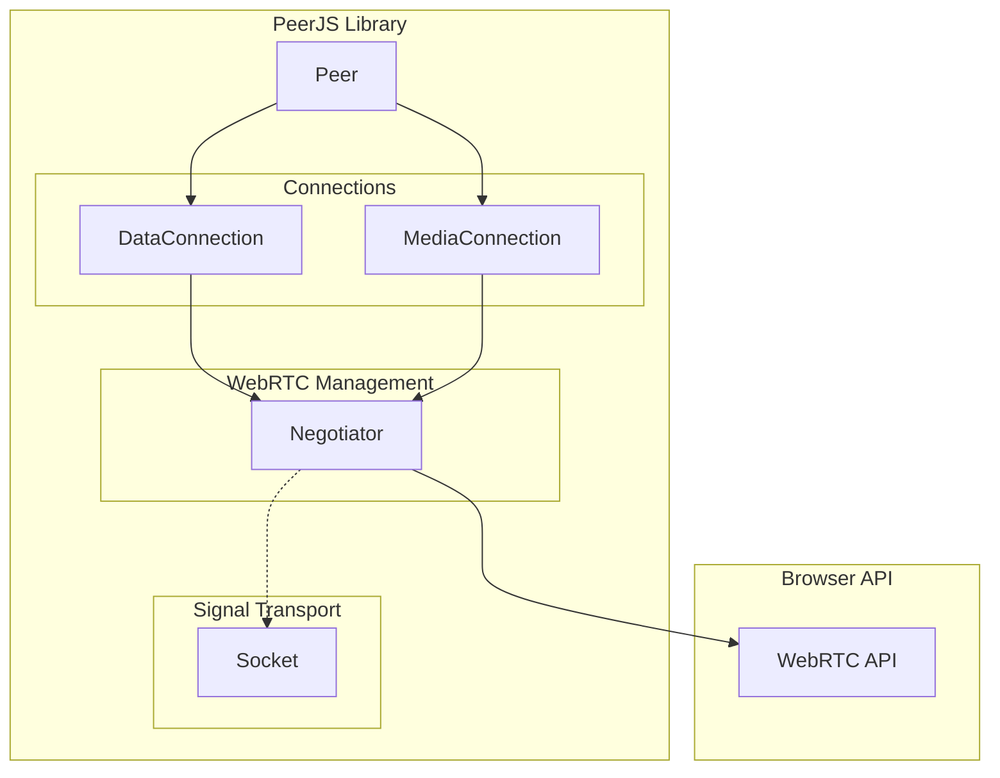
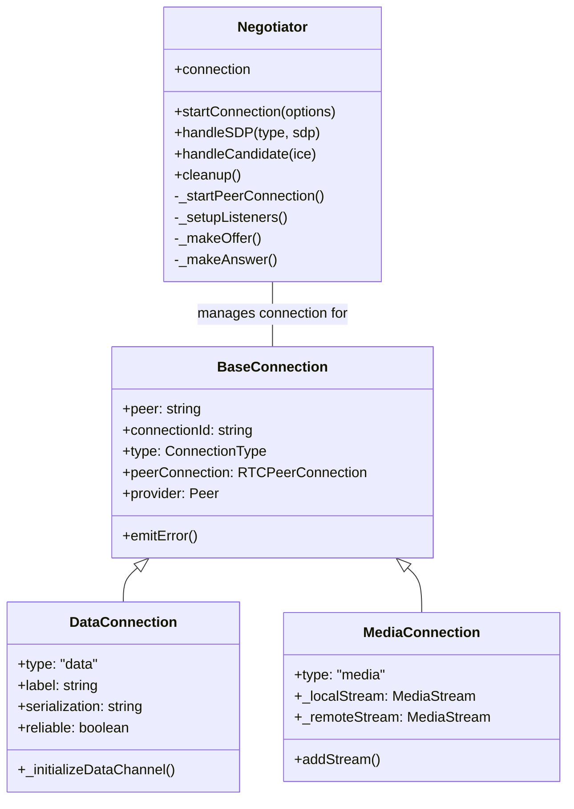
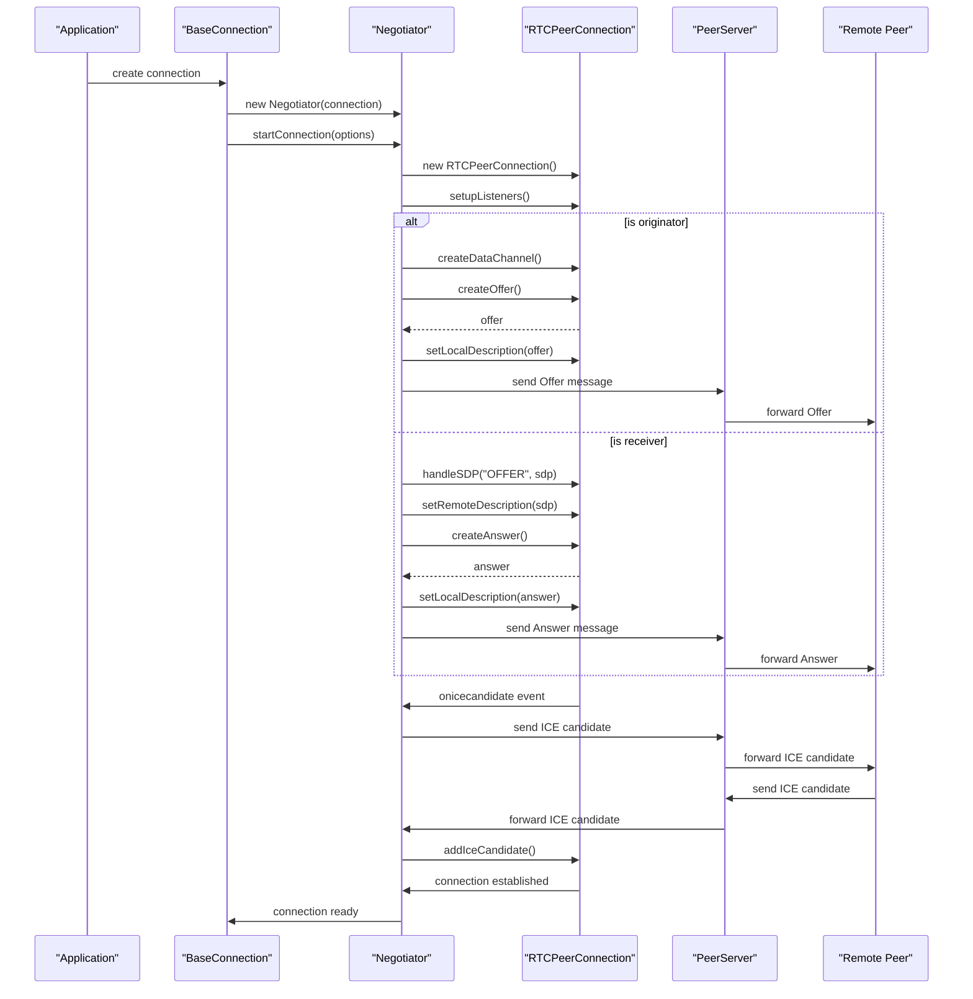

# Negotiator

<details>
<summary>Relevant source files</summary>

The following files were used as context for generating this wiki page:

- [lib/mediaconnection.ts](lib/mediaconnection.ts)
- [lib/negotiator.ts](lib/negotiator.ts)

</details>


The Negotiator class is a core component of the PeerJS library that manages all WebRTC connection negotiations between peers. It handles the intricate WebRTC signaling process, including creating and exchanging SDP (Session Description Protocol) offers/answers and ICE candidates, which are essential for establishing peer-to-peer connections.

This document details the Negotiator's architecture, responsibilities, and how it interacts with other PeerJS components. For information about the connections that use the Negotiator, see [DataConnection](#3.2) and [MediaConnection](#3.3).

## Purpose and Responsibilities

The Negotiator class serves as the WebRTC negotiation manager for both data and media connections in PeerJS. Its primary responsibilities include:

1. Creating and managing RTCPeerConnection objects
2. Generating SDP offers and answers
3. Processing ICE candidates
4. Setting up WebRTC event listeners
5. Handling media tracks for MediaConnection
6. Creating data channels for DataConnection
7. Managing connection state changes

Sources: [lib/negotiator.ts:13-19](). [lib/negotiator.ts:16-20]()

## Class Definition

The Negotiator is implemented as a generic class that can work with different types of connections. It functions as a helper class that both MediaConnection and DataConnection utilize to manage their underlying WebRTC connections.

```typescript
export class Negotiator<
    Events extends ValidEventTypes,
    ConnectionType extends BaseConnection<Events | BaseConnectionEvents>,
> {
    constructor(readonly connection: ConnectionType) {}
    
    // Methods for connection management
}
```

Sources: [lib/negotiator.ts:16-20]()

## Architecture and Relationships

The Negotiator sits at a critical position in the PeerJS architecture, serving as the bridge between the high-level connection abstractions (DataConnection and MediaConnection) and the low-level WebRTC API.

### Negotiator's Position in the PeerJS Architecture



Sources: [lib/negotiator.ts](). [lib/mediaconnection.ts:35-36]()

### Negotiator and Connection Class Relationship



Sources: [lib/negotiator.ts:16-20](). [lib/mediaconnection.ts:35-36]()

## Core Functionality

### Connection Initialization

The `startConnection` method initiates the WebRTC connection process:

1. Creates a new `RTCPeerConnection`
2. Sets up connection event listeners
3. For media connections, adds tracks from the local stream
4. For connections initiated by the local peer, creates a data channel and makes an offer
5. For connections initiated by the remote peer, handles the incoming offer

Sources: [lib/negotiator.ts:22-49]()

### WebRTC Event Listeners

The Negotiator sets up several critical event listeners on the RTCPeerConnection to manage the connection lifecycle:

| Event | Purpose |
|-------|---------|
| `onicecandidate` | Handles new ICE candidates and sends them to the remote peer |
| `oniceconnectionstatechange` | Monitors connection state changes and handles failures |
| `ondatachannel` | Handles incoming data channels for DataConnection |
| `ontrack` | Handles incoming media tracks for MediaConnection |

Sources: [lib/negotiator.ts:64-158]()

### WebRTC Negotiation Process



Sources: [lib/negotiator.ts:194-259](). [lib/negotiator.ts:261-325](). [lib/negotiator.ts:327-338]()

## Key Methods

### Making Offers and Answers

The Negotiator contains methods to create and process SDP offers and answers:

1. `_makeOffer()`: Creates an SDP offer and sends it to the remote peer
   - Creates an offer using `peerConnection.createOffer()`
   - Applies optional SDP transformations
   - Sets the local description
   - Sends the offer via the Socket to the remote peer

2. `_makeAnswer()`: Creates an SDP answer in response to an offer
   - Creates an answer using `peerConnection.createAnswer()`
   - Applies optional SDP transformations
   - Sets the local description
   - Sends the answer via the Socket to the remote peer

Sources: [lib/negotiator.ts:194-259](). [lib/negotiator.ts:261-303]()

### Handling Signaling Messages

The Negotiator processes incoming signaling messages:

1. `handleSDP()`: Processes SDP offers and answers
   - Sets the remote description on the peer connection
   - If receiving an offer, creates and sends an answer

2. `handleCandidate()`: Processes ICE candidates
   - Adds received ICE candidates to the peer connection

Sources: [lib/negotiator.ts:305-338]()

### Media Stream Management

For MediaConnection, the Negotiator provides methods for handling media streams:

1. `_addTracksToConnection()`: Adds tracks from a local stream to the peer connection
2. `_addStreamToMediaConnection()`: Adds a remote stream to the MediaConnection

Sources: [lib/negotiator.ts:340-366]()

## Error Handling

The Negotiator implements comprehensive error handling throughout the connection process:

1. Connection state monitoring through `iceconnectionstatechange` event
2. Error emission for failed negotiations
3. Error handling for WebRTC API calls
4. Validation of browser capabilities

Sources: [lib/negotiator.ts:90-127](). [lib/negotiator.ts:245-257]()

## Cleanup

The `cleanup()` method properly closes and cleans up the peer connection:

1. Removes all event listeners from the peer connection
2. Closes the peer connection if it's still open
3. Nullifies references to the peer connection

This ensures resources are properly released when a connection is closed.

Sources: [lib/negotiator.ts:161-192]()

## Integration with Connection Classes

The Negotiator is instantiated by both DataConnection and MediaConnection classes. The MediaConnection creates a Negotiator in its constructor:

```typescript
// In MediaConnection constructor
this._negotiator = new Negotiator(this);

if (this._localStream) {
  this._negotiator.startConnection({
    _stream: this._localStream,
    originator: true,
  });
}
```

When handling messages from the remote peer, the connection classes delegate WebRTC-specific messages to the Negotiator:

```typescript
// In MediaConnection.handleMessage()
switch (message.type) {
  case ServerMessageType.Answer:
    void this._negotiator.handleSDP(type, payload.sdp);
    this._open = true;
    break;
  case ServerMessageType.Candidate:
    void this._negotiator.handleCandidate(payload.candidate);
    break;
  // ...
}
```

Sources: [lib/mediaconnection.ts:54-69](). [lib/mediaconnection.ts:96-113]()

## Summary

The Negotiator is a critical component in the PeerJS library that abstracts and manages the complex WebRTC negotiation process. It provides a clean interface for the connection classes to establish and maintain peer-to-peer connections without needing to directly interact with the WebRTC API. By handling the details of SDP exchange, ICE candidate processing, and connection state management, it significantly simplifies the implementation of the DataConnection and MediaConnection classes.
