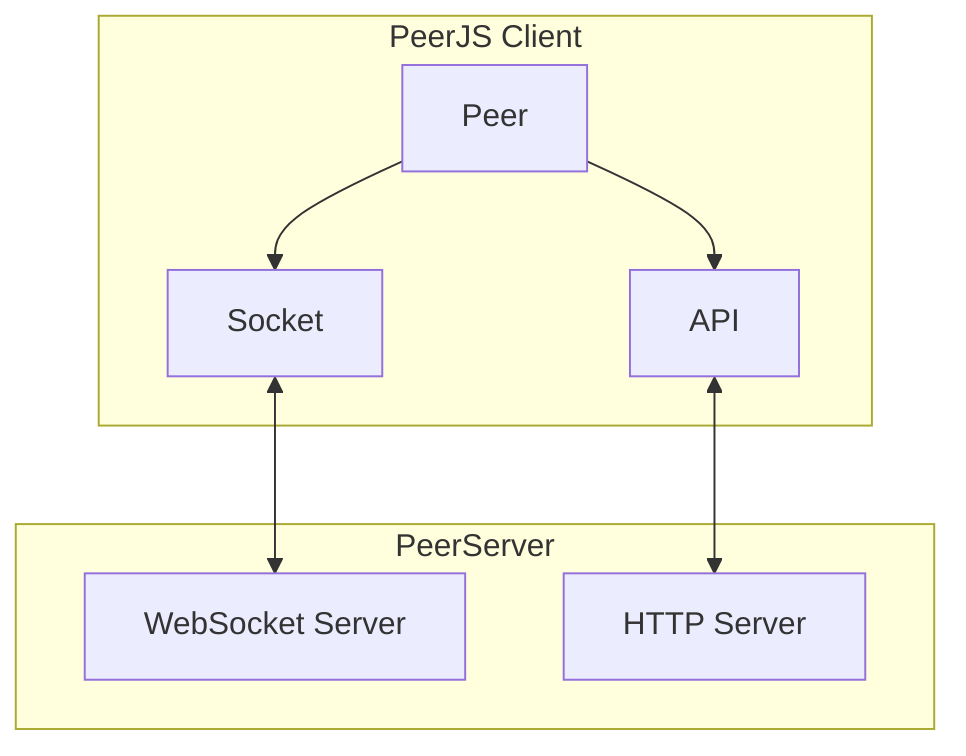
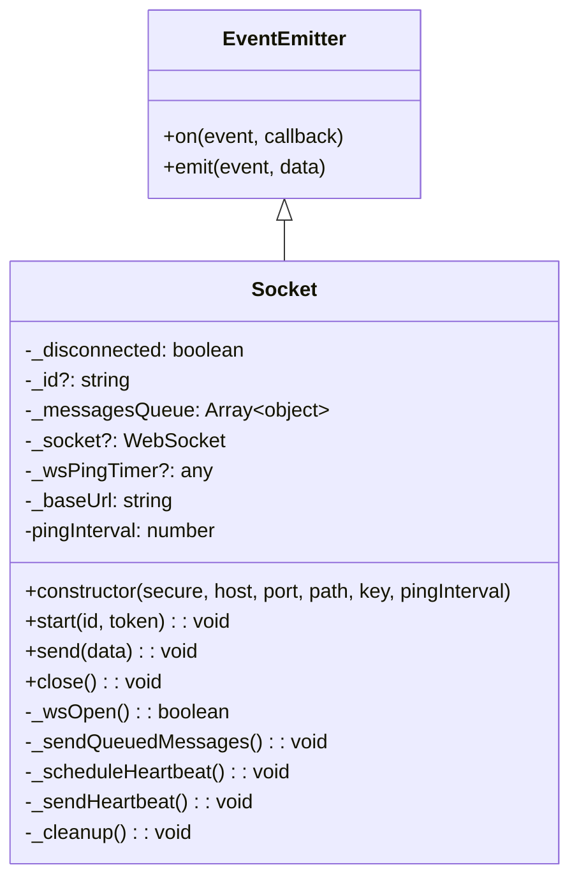
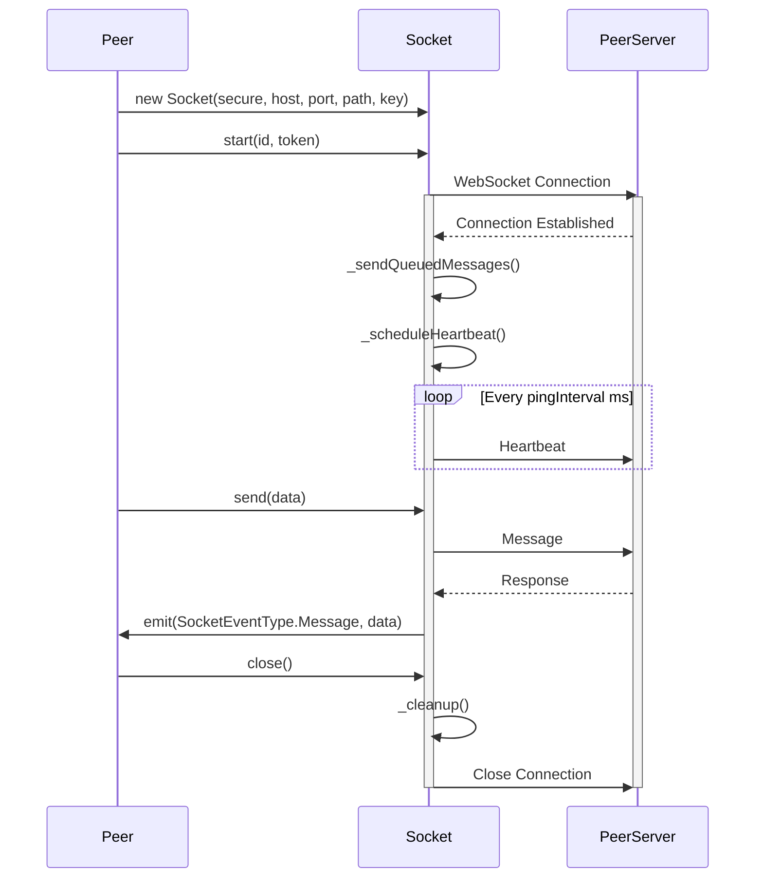
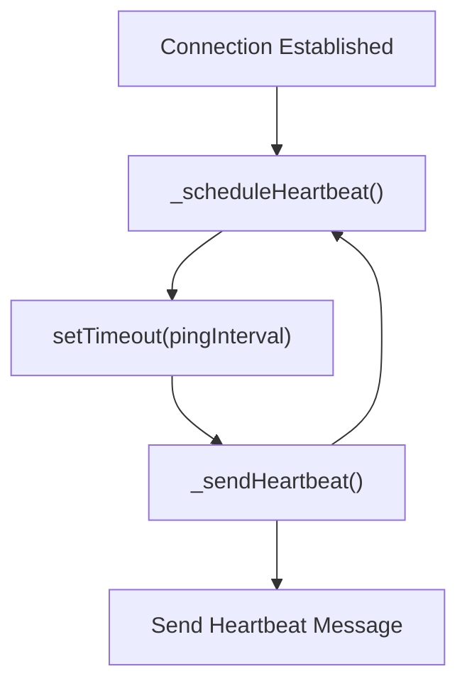
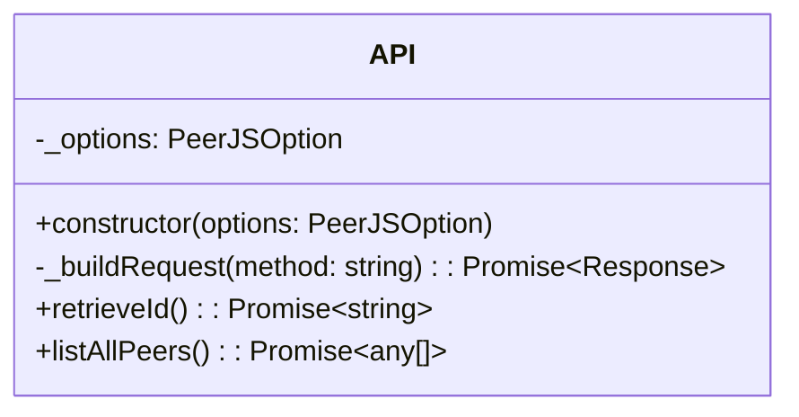
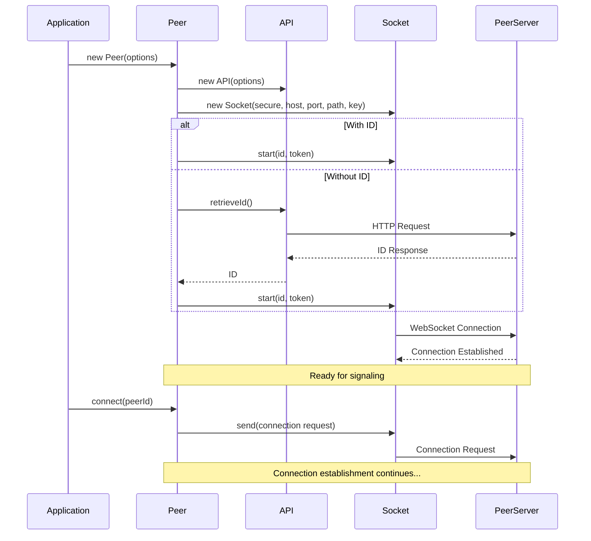

# Socket and API

<details>
<summary>Relevant source files</summary>

The following files were used as context for generating this wiki page:

- [lib/api.ts](lib/api.ts)
- [lib/logger.ts](lib/logger.ts)
- [lib/optionInterfaces.ts](lib/optionInterfaces.ts)
- [lib/socket.ts](lib/socket.ts)
- [tsconfig.json](tsconfig.json)

</details>


This document explains the `Socket` and `API` classes in PeerJS, which are responsible for handling communication between the client and the PeerServer. While the core WebRTC connections between peers are direct (peer-to-peer), these classes facilitate the initial signaling and connection discovery processes through a centralized server.

For information about how these components are used in peer connections, see [Connection Flow](#2.2). For details about the `Peer` class that uses these components, see [Peer](#3.1).

## Overview

The `Socket` and `API` classes serve different but complementary roles:

- `Socket`: Manages WebSocket connections with the PeerServer for real-time, bidirectional communication, primarily used for signaling and connection negotiation.
- `API`: Handles HTTP requests to the PeerServer for operations like retrieving a unique peer ID and listing available peers.



Sources: [lib/socket.ts:6-172](), [lib/api.ts:6-85]()

## Socket Class

The `Socket` class is an abstraction on top of WebSockets designed to provide fast and reliable connections for peers to exchange signaling information.

### Architecture and Responsibilities

The `Socket` class extends the `EventEmitter` class and manages:
- WebSocket connection lifecycle
- Message serialization and queuing
- Heartbeat mechanism to maintain connection
- Event-based communication



Sources: [lib/socket.ts:10-172]()

### Connection Lifecycle

The `Socket` class manages the full lifecycle of a WebSocket connection:

1. **Initialization**: When a new `Socket` is created, it builds the WebSocket URL based on provided parameters but doesn't connect immediately.
2. **Connection**: The `start()` method initiates the connection with the server using the peer ID and token.
3. **Message Handling**: Once connected, it processes incoming messages and sends queued messages.
4. **Heartbeat**: Periodically sends heartbeat messages to keep the connection alive.
5. **Disconnection**: The `close()` method terminates the connection and cleans up resources.



Sources: [lib/socket.ts:33-171]()

### Key Methods

#### `start(id: string, token: string): void`

Initializes the WebSocket connection with the server, establishing event handlers for message reception, connection closure, and connection establishment. If the connection is already established, this method has no effect.

```typescript
this._socket = new WebSocket(wsUrl + "&version=" + version);
this._disconnected = false;

this._socket.onmessage = (event) => {
    // Process message and emit events
};

this._socket.onclose = (event) => {
    // Handle connection closure
};

this._socket.onopen = () => {
    // Handle connection establishment
};
```

Sources: [lib/socket.ts:33-85]()

#### `send(data: any): void`

Sends a message to the server. If the socket is not yet connected or the peer ID is not yet assigned, the message is queued for later transmission.

```typescript
if (this._disconnected) {
    return;
}

// Queue messages if no ID is assigned yet
if (!this._id) {
    this._messagesQueue.push(data);
    return;
}

// Validate and send the message
if (!data.type) {
    this.emit(SocketEventType.Error, "Invalid message");
    return;
}

if (!this._wsOpen()) {
    return;
}

const message = JSON.stringify(data);
this._socket!.send(message);
```

Sources: [lib/socket.ts:124-148]()

#### `close(): void`

Closes the WebSocket connection and cleans up resources.

Sources: [lib/socket.ts:150-158]()

### Heartbeat Mechanism

The Socket class implements a heartbeat mechanism to keep the WebSocket connection alive:

1. After establishing a connection, `_scheduleHeartbeat()` is called
2. This sets a timer to call `_sendHeartbeat()` after the `pingInterval`
3. `_sendHeartbeat()` sends a heartbeat message to the server and schedules the next heartbeat



Sources: [lib/socket.ts:87-104]()

## API Class

The `API` class handles HTTP requests to the PeerServer for operations that don't require real-time communication.

### Architecture and Responsibilities

The `API` class is responsible for:
- Building HTTP requests to the PeerServer
- Retrieving a unique ID from the server
- Listing all connected peers (deprecated)
- Handling errors from server responses



Sources: [lib/api.ts:6-85]()

### Key Methods

#### `_buildRequest(method: string): Promise<Response>`

Builds an HTTP request to the PeerServer with the appropriate URL and parameters.

```typescript
private _buildRequest(method: string): Promise<Response> {
    const protocol = this._options.secure ? "https" : "http";
    const { host, port, path, key } = this._options;
    const url = new URL(`${protocol}://${host}:${port}${path}${key}/${method}`);
    url.searchParams.set("ts", `${Date.now()}${Math.random()}`);
    url.searchParams.set("version", version);
    return fetch(url.href, {
        referrerPolicy: this._options.referrerPolicy,
    });
}
```

Sources: [lib/api.ts:9-19]()

#### `retrieveId(): Promise<string>`

Retrieves a unique ID from the server, which is used to identify the peer.

```typescript
async retrieveId(): Promise<string> {
    try {
        const response = await this._buildRequest("id");

        if (response.status !== 200) {
            throw new Error(`Error. Status:${response.status}`);
        }

        return response.text();
    } catch (error) {
        // Error handling logic
        // ...
    }
}
```

Sources: [lib/api.ts:22-48]()

#### `listAllPeers(): Promise<any[]>` (Deprecated)

Retrieves a list of all connected peers from the server. This method is marked as deprecated.

Sources: [lib/api.ts:51-84]()

## Integration with PeerJS

The `Socket` and `API` classes are both instantiated by the `Peer` class during initialization and are used throughout the connection lifecycle.



Sources: [lib/socket.ts:10-172](), [lib/api.ts:6-85]()

## Configuration Options

Both the `Socket` and `API` classes are configured through the `PeerJSOption` interface:

| Option | Type | Description |
|--------|------|-------------|
| `key` | string | API key for the PeerServer |
| `host` | string | PeerServer host |
| `port` | number | PeerServer port |
| `path` | string | Path on the PeerServer |
| `secure` | boolean | Whether to use secure connections (WSS/HTTPS) |
| `token` | string | Authentication token (used by Socket) |
| `debug` | number | Debug level for logging |
| `referrerPolicy` | ReferrerPolicy | Referrer policy for HTTP requests |

Sources: [lib/optionInterfaces.ts:8-18]()

## Error Handling

Both classes implement error handling for various failure scenarios:

- The `Socket` class emits error events when messages can't be sent or the connection is lost
- The `API` class throws detailed error messages for failed HTTP requests, including helpful guidance for common issues

For more comprehensive information about error handling in PeerJS, see [Error Handling](#4.3).

Sources: [lib/socket.ts:136-139](), [lib/api.ts:26-46](), [lib/api.ts:54-82]()
