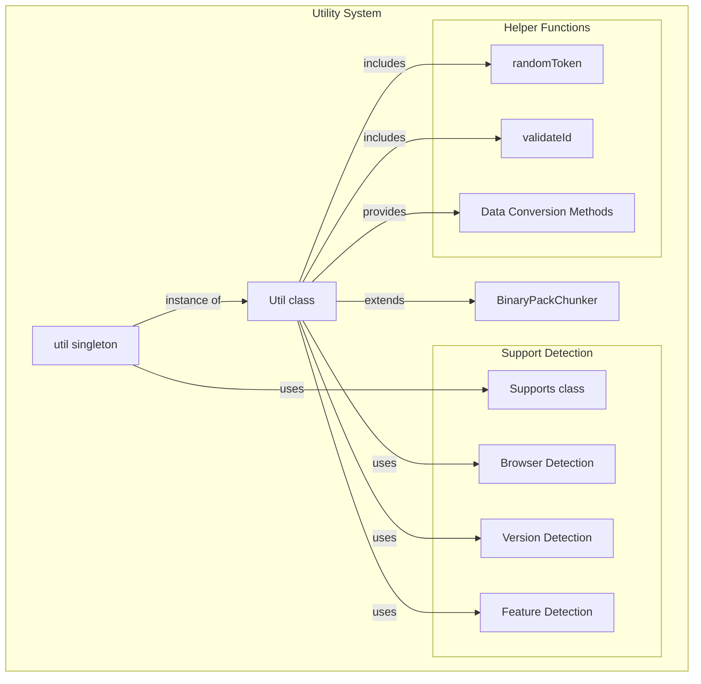
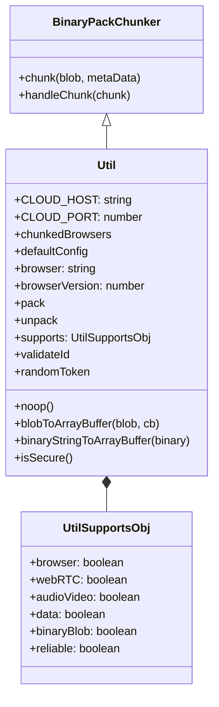
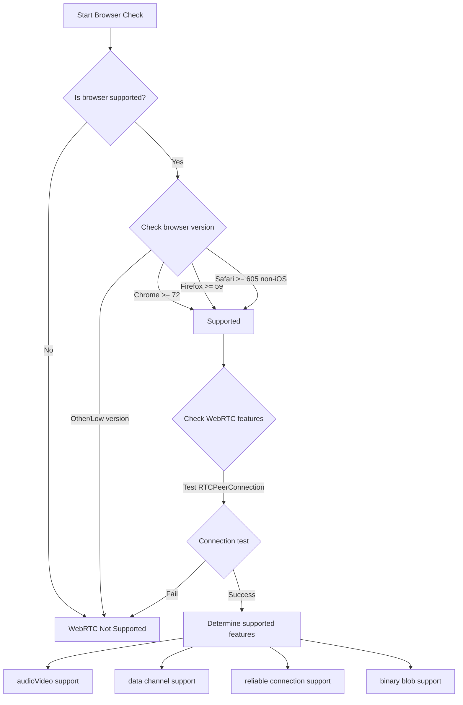
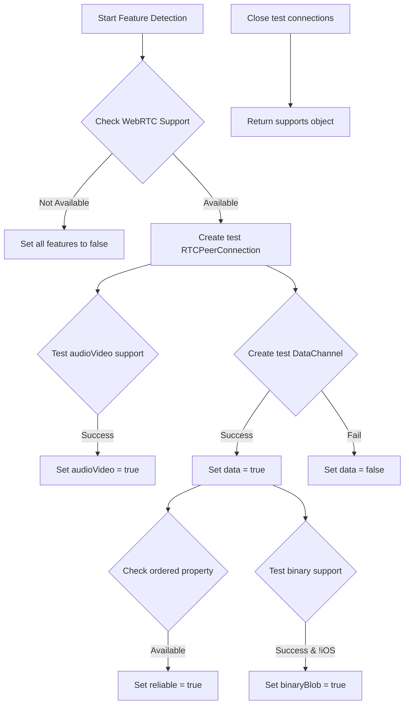
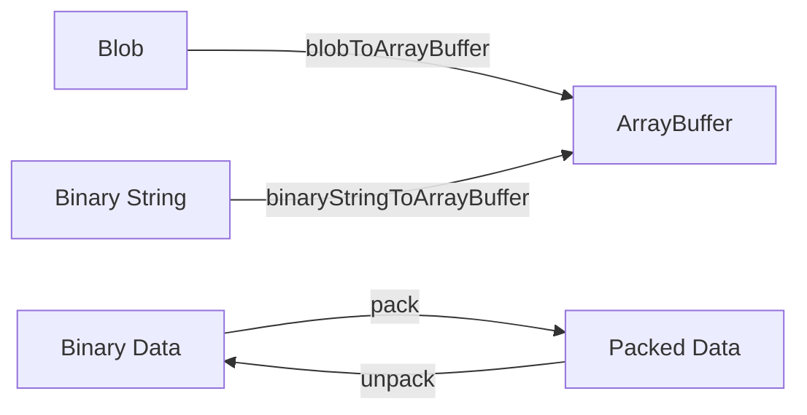
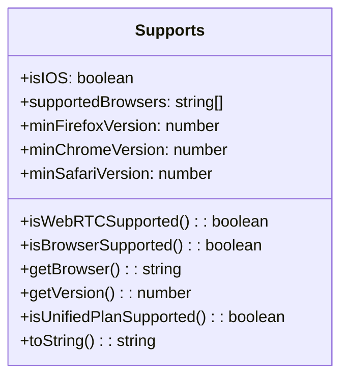
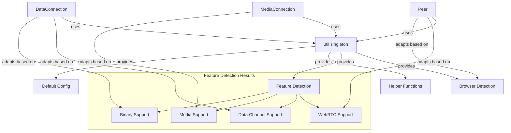

# Utilities and Support

<details>
<summary>Relevant source files</summary>

The following files were used as context for generating this wiki page:

- [lib/supports.ts](lib/supports.ts)
- [lib/util.ts](lib/util.ts)

</details>


This document describes the utility functions and browser support features in the PeerJS library. These components provide essential infrastructure for browser compatibility detection, data conversions, and various helper functions used throughout the library. For specific implementation details about utility functions, see [Utility Functions](#4.1), and for more details on browser support, see [Browser Support](#4.2).

## Overview

PeerJS provides a set of utility functions and browser support detection mechanisms to ensure a smooth peer-to-peer experience across different browsers and environments. This infrastructure handles compatibility detection, provides helper methods, and defines configuration constants used throughout the library.



Sources: [lib/util.ts:53-158](). [lib/supports.ts:7-84]()

## Utility System Architecture

The utility system in PeerJS is centered around the `Util` class and the `util` singleton instance that's exported for use throughout the codebase.



Sources: [lib/util.ts:7-36](), [lib/util.ts:53-158]()

The `Util` class extends `BinaryPackChunker` and provides:
- Singleton instance exported as `util`
- Constants for cloud server configuration
- Browser detection properties
- Feature detection through the `supports` object
- Helper methods for data conversion and validation

## Browser Support Detection

PeerJS includes comprehensive browser support detection through the `Supports` class, which determines compatibility with WebRTC features across different browsers.



Sources: [lib/supports.ts:7-84]()

The browser support detection system:
- Identifies the current browser type and version
- Checks against minimum version requirements (Chrome 72+, Firefox 59+, Safari 605+)
- Tests specific WebRTC capabilities like data channels and media streams
- Detects iOS devices which have more limited WebRTC support
- Provides detection for Unified Plan support

### Browser Version Requirements

PeerJS has defined minimum version requirements for each supported browser:

| Browser | Minimum Version | Notes |
|---------|----------------|-------|
| Chrome  | 72             | |
| Firefox | 59             | |
| Safari  | 605            | iOS not fully supported |

Sources: [lib/supports.ts:14-16]()

## Feature Detection System

PeerJS dynamically tests browser capabilities to determine which features are available:



Sources: [lib/util.ts:78-123]()

The feature detection process:
1. Checks if basic WebRTC is supported
2. Creates a test RTCPeerConnection
3. Tests audio/video capabilities
4. Tests data channel capabilities
5. Tests reliable connections
6. Tests binary blob support
7. Returns a comprehensive support object

## Utility Functions

The `util` singleton provides several helper functions for use throughout the PeerJS library:

### Data Conversion Utilities



Sources: [lib/util.ts:129-154]()

Key data conversion utilities include:
- `blobToArrayBuffer`: Converts a Blob to an ArrayBuffer using FileReader
- `binaryStringToArrayBuffer`: Converts a binary string to an ArrayBuffer
- `pack` and `unpack`: Methods from BinaryPack for serializing and deserializing data

### Helper Functions and Constants

The utility system also provides:
- `validateId`: Ensures IDs are alphanumeric
- `randomToken`: Generates random tokens
- `noop`: An empty function for use as a placeholder
- `isSecure`: Detects if the current connection is secure (HTTPS)
- `defaultConfig`: Default configuration for RTCPeerConnection including STUN/TURN servers
- Browser detection properties including `browser` and `browserVersion`

Sources: [lib/util.ts:54-67](), [lib/util.ts:125-157]()

## Default Configuration

PeerJS provides default ICE server configuration for WebRTC connections:

```javascript
const DEFAULT_CONFIG = {
  iceServers: [
    { urls: "stun:stun.l.google.com:19302" },
    {
      urls: [
        "turn:eu-0.turn.peerjs.com:3478",
        "turn:us-0.turn.peerjs.com:3478",
      ],
      username: "peerjs",
      credential: "peerjsp",
    },
  ],
  sdpSemantics: "unified-plan",
};
```

Sources: [lib/util.ts:38-51]()

This configuration provides:
- Public Google STUN server
- PeerJS-hosted TURN servers in EU and US regions
- Unified Plan SDP semantics for better interoperability

## Supports Class

The `Supports` class provides browser compatibility detection and is used by the Util class:



Sources: [lib/supports.ts:7-84]()

The `Supports` class:
- Detects iOS devices which have limited WebRTC support
- Lists supported browsers (Chrome, Firefox, Safari)
- Provides methods to check if the current browser is supported
- Checks if WebRTC is available in the current environment
- Tests for Unified Plan support
- Includes a detailed `toString()` method for debugging

## Integration with Core Components

The utility and support systems integrate with the core PeerJS components:



Sources: [lib/util.ts:53-158](), [lib/supports.ts:7-84]()

The utility and support systems provide essential information that allows PeerJS to:
1. Determine if the current environment can support peer-to-peer connections
2. Adapt to browser-specific implementations and limitations
3. Configure connections with appropriate settings
4. Handle data conversions efficiently

## Summary

The utilities and support infrastructure in PeerJS provides:
- Browser detection and feature compatibility testing
- Data conversion utilities for efficient peer-to-peer communication
- Default configuration values for WebRTC connections
- Helper functions used throughout the library

These components form a crucial foundation that enables PeerJS to provide a consistent API across different browsers while adapting to the specific capabilities and limitations of each environment.
