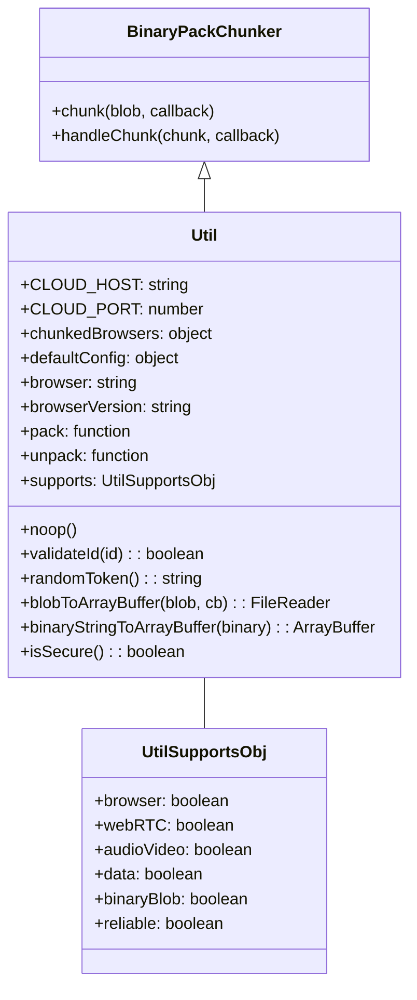
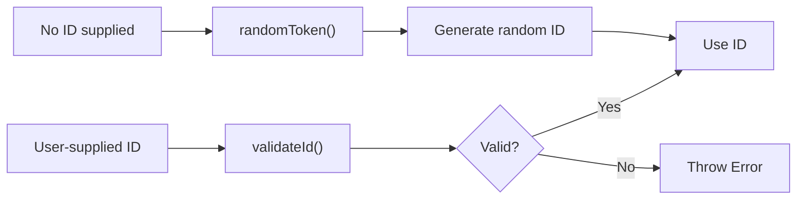
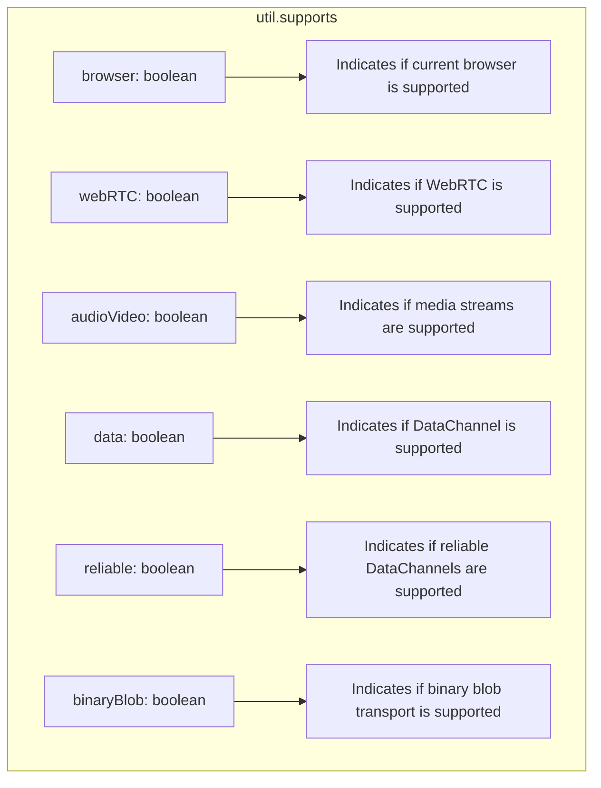
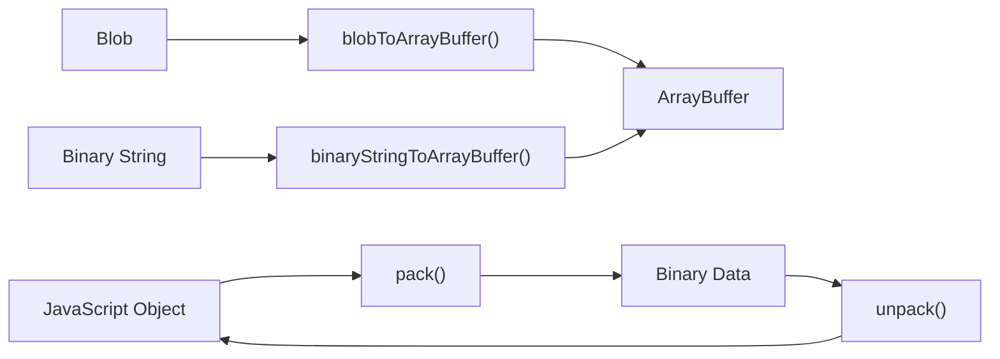
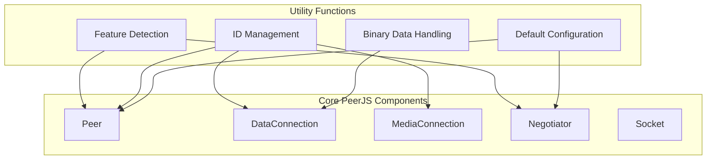

# Utility Functions

<details>
<summary>Relevant source files</summary>

The following files were used as context for generating this wiki page:

- [lib/util.ts](lib/util.ts)

</details>


## Purpose and Scope

This page documents the utility functions provided by PeerJS, which offer common functionality used throughout the library. These utilities handle tasks such as browser compatibility detection, binary data manipulation, ID validation, and default configuration settings. The utility functions serve as foundational tools for the core components of PeerJS to establish and maintain peer-to-peer connections.

For information about browser support detection specifically, see [Browser Support](#4.2). For error handling mechanisms, see [Error Handling](#4.3).

## Util Class Overview

The `Util` class in PeerJS provides a collection of helper methods and properties that support various core functionalities of the library. These utilities are exposed through a singleton instance called `util`.



Sources: [lib/util.ts:53-158](), [lib/util.ts:7-36]()

## Core Utility Functions

The utility functions provide essential capabilities for PeerJS operations:

| Function | Purpose | Source |
|----------|---------|--------|
| `validateId(id)` | Ensures IDs are alphanumeric and valid | [lib/util.ts:126]() |
| `randomToken()` | Generates random tokens for use as IDs | [lib/util.ts:127]() |
| `noop()` | Empty function that does nothing | [lib/util.ts:54]() |
| `isSecure()` | Checks if the current connection is over HTTPS | [lib/util.ts:155-157]() |

### ID Validation and Generation

PeerJS uses ID validation to ensure that peer IDs follow the required format, and provides a random token generator for creating unique IDs:



Sources: [lib/util.ts:126-127]()

## Browser and Feature Detection

A key utility in PeerJS is the browser compatibility and feature detection system. This is implemented through the `supports` object, which provides information about WebRTC support in the current browser environment.

### The `supports` Object

The `supports` object contains boolean flags indicating which WebRTC features are available:



Sources: [lib/util.ts:78-123]()

### Browser Detection

PeerJS includes browser detection to optimize connection handling for different browsers:

| Property | Description |
|----------|-------------|
| `browser` | The current browser identifier (e.g., 'firefox', 'chrome', 'safari', 'edge') |
| `browserVersion` | The version of the current browser |
| `chunkedBrowsers` | Object identifying browsers that require data chunking |

Sources: [lib/util.ts:65-66](), [lib/util.ts:60]()

## Binary Data Handling

PeerJS provides utilities for binary data manipulation, essential for efficient data transfer between peers:

### Binary Conversion Functions

| Function | Description |
|----------|-------------|
| `blobToArrayBuffer(blob, cb)` | Converts a Blob to an ArrayBuffer using FileReader |
| `binaryStringToArrayBuffer(binary)` | Converts a binary string to an ArrayBuffer |
| `pack` and `unpack` | Serialize and deserialize data using BinaryPack |



Sources: [lib/util.ts:129-154](), [lib/util.ts:68-69]()

## Constants and Default Configuration

The Util class provides important constants and default configurations used throughout PeerJS:

### Default ICE Server Configuration

PeerJS comes with a default configuration for ICE servers (STUN and TURN):

```
defaultConfig = {
  iceServers: [
    { urls: "stun:stun.l.google.com:19302" },
    {
      urls: [
        "turn:eu-0.turn.peerjs.com:3478",
        "turn:us-0.turn.peerjs.com:3478",
      ],
      username: "peerjs",
      credential: "peerjsp",
    },
  ],
  sdpSemantics: "unified-plan",
}
```

### Cloud Service Configuration

PeerJS defines default cloud service constants:

| Constant | Value | Purpose |
|----------|-------|---------|
| `CLOUD_HOST` | "0.peerjs.com" | Default PeerJS server host |
| `CLOUD_PORT` | 443 | Default PeerJS server port |

Sources: [lib/util.ts:56-57](), [lib/util.ts:38-51](), [lib/util.ts:63]()

## Integration with PeerJS Components

The utility functions integrate with and support various PeerJS components:



Sources: [lib/util.ts]()

## Usage Examples

Here are some examples of how the utility functions are used within PeerJS:

1. **Checking Browser Support**:
   ```javascript
   if (util.supports.data) {
     // Create data connection
   } else {
     // Data channels not supported
   }
   ```

2. **Validating a Peer ID**:
   ```javascript
   if (util.validateId(id)) {
     // Use the ID
   } else {
     // ID is invalid
   }
   ```

3. **Checking for Secure Connection**:
   ```javascript
   if (util.isSecure()) {
     // Using HTTPS
   } else {
     // Using HTTP, show security warning
   }
   ```

4. **Handling Binary Data**:
   ```javascript
   util.blobToArrayBuffer(blob, (arrayBuffer) => {
     // Process the ArrayBuffer
   });
   ```

Sources: [lib/util.ts]()
