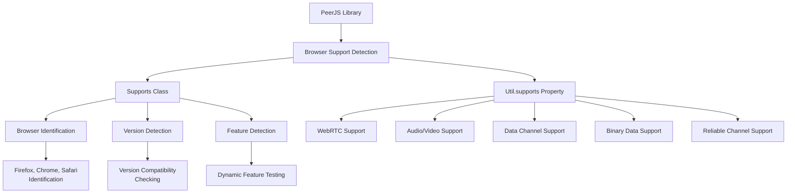
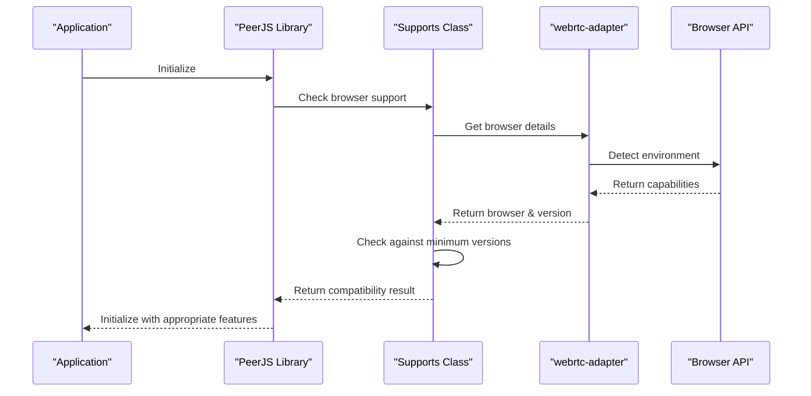
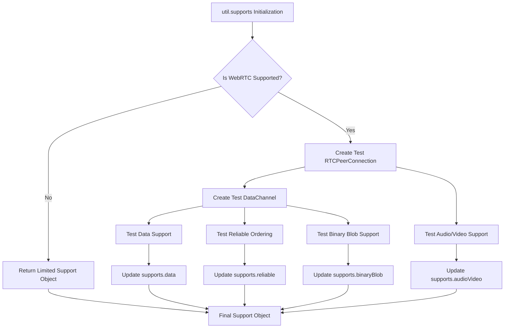
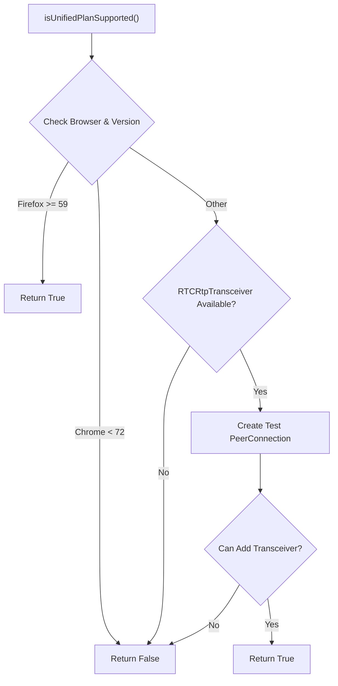

# Browser Support

<details>
<summary>Relevant source files</summary>

The following files were used as context for generating this wiki page:

- [lib/supports.ts](lib/supports.ts)
- [lib/util.ts](lib/util.ts)

</details>


This page documents how PeerJS detects and adapts to different browser capabilities. It explains the browser detection mechanisms, supported browsers and features, and how PeerJS adapts its behavior based on feature availability. For information about error handling related to browser incompatibilities, see [Error Handling](#4.3).

## Overview

PeerJS uses a robust browser feature detection system to ensure compatibility across different browsers and versions. The library performs capability checks to determine if the current browser environment supports the WebRTC features required for peer-to-peer connections.



Sources: [lib/supports.ts:7-84](), [lib/util.ts:78-123]()

## Supported Browsers and Versions

PeerJS has defined minimum versions for each major browser that can use the library effectively:

| Browser | Minimum Version | Notes |
|---------|----------------|-------|
| Chrome  | 72             | Full WebRTC support |
| Firefox | 59             | Full WebRTC support |
| Safari  | 605            | iOS Safari not supported |

The library includes methods to detect the current browser and version, then determine if they meet the minimum requirements.

Sources: [lib/supports.ts:12-16]()

## Browser Detection Mechanism

PeerJS uses the `webrtc-adapter` library to accurately identify browsers and normalize WebRTC implementations across them. This approach provides consistent browser identification even when user agent strings may be misleading.



The `Supports` class provides several key methods for browser detection:

- `getBrowser()`: Returns the current browser name (e.g., 'chrome', 'firefox', 'safari')
- `getVersion()`: Returns the browser version number
- `isBrowserSupported()`: Checks if the current browser and version are supported
- `isWebRTCSupported()`: Checks if WebRTC is supported in the current environment

Sources: [lib/supports.ts:18-44]()

## Feature Detection

Beyond basic browser identification, PeerJS performs actual feature testing by creating temporary WebRTC objects to verify capabilities. This pragmatic approach ensures that theoretical support translates to actual feature availability.

### WebRTC Feature Testing

The `util.supports` property provides a comprehensive feature detection mechanism by:

1. Creating a temporary RTCPeerConnection
2. Testing for audio/video support
3. Creating a data channel and testing its capabilities
4. Testing binary data support
5. Testing reliable channel ordering



The feature detection results are exposed through the `util.supports` object with the following properties:

- `browser`: Boolean indicating if the browser is supported
- `webRTC`: Boolean indicating if WebRTC is supported
- `audioVideo`: Boolean indicating if media streams are supported
- `data`: Boolean indicating if data channels are supported
- `binaryBlob`: Boolean indicating if binary blob data is supported
- `reliable`: Boolean indicating if reliable data channels are supported

Sources: [lib/util.ts:78-123]()

## iOS Support

PeerJS has special handling for iOS devices. The library detects iOS devices and applies specific limitations:

- Safari on iOS is not considered a supported browser
- Binary blob handling has specific limitations on iOS

The detection is performed by checking if the platform is one of: "iPad", "iPhone", or "iPod".

Sources: [lib/supports.ts:8-11](), [lib/util.ts:107]()

## Unified Plan Support

PeerJS checks for support of the "Unified Plan" SDP format, which is important for advanced WebRTC features:



This check is important for determining the negotiation approach used for establishing peer connections.

Sources: [lib/supports.ts:46-73]()

## Browser-Specific Adaptations

PeerJS adapts its behavior based on detected browser capabilities:

1. **Chunking for Large Data**: PeerJS identifies browsers that require chunking for large data transfers
   ```javascript
   readonly chunkedBrowsers = { Chrome: 1, chrome: 1 };
   ```

2. **Default Configuration**: Provides browser-agnostic default configuration for RTCPeerConnection
   ```javascript
   readonly defaultConfig = DEFAULT_CONFIG;
   ```

3. **Binary Data Handling**: Adapts binary data handling based on browser capabilities

Sources: [lib/util.ts:60-63]()

## Using Browser Support Information

Developers using PeerJS can access browser support information through the `util` object:

```javascript
// Check if the current browser is supported
if (util.supports.browser) {
  // PeerJS can work in this browser
}

// Check what browser is being used
if (util.browser === 'firefox') {
  // Firefox-specific code
}

// Check if data channels are supported
if (util.supports.data) {
  // Can use data channels
}

// Check if media is supported
if (util.supports.audioVideo) {
  // Can use audio/video
}
```

The browser property can have values like 'firefox', 'chrome', 'safari', 'edge', or messages indicating lack of support.

Sources: [lib/util.ts:7-36](), [lib/util.ts:65-66]()

## Internal Testing and Diagnostics

For debugging purposes, the `Supports` class provides a `toString()` method that outputs the current browser environment details:

```
Supports:
    browser:chrome
    version:96
    isIOS:false
    isWebRTCSupported:true
    isBrowserSupported:true
    isUnifiedPlanSupported:true
```

This can be useful for diagnosing issues related to browser compatibility.

Sources: [lib/supports.ts:75-83]()
