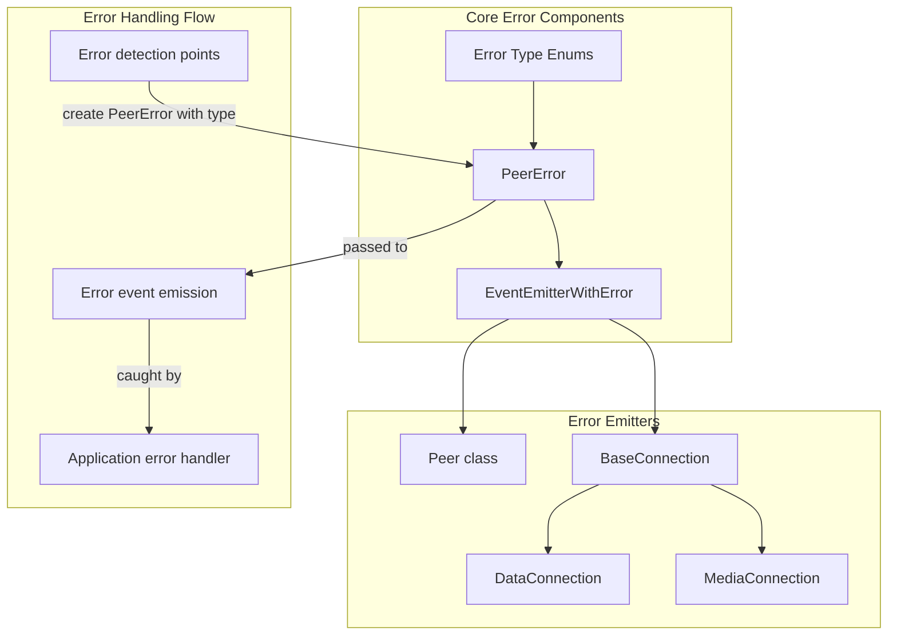
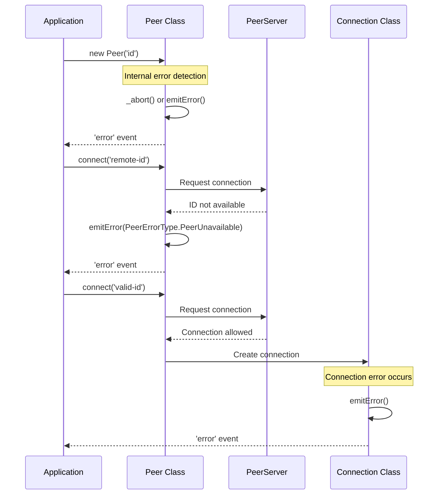
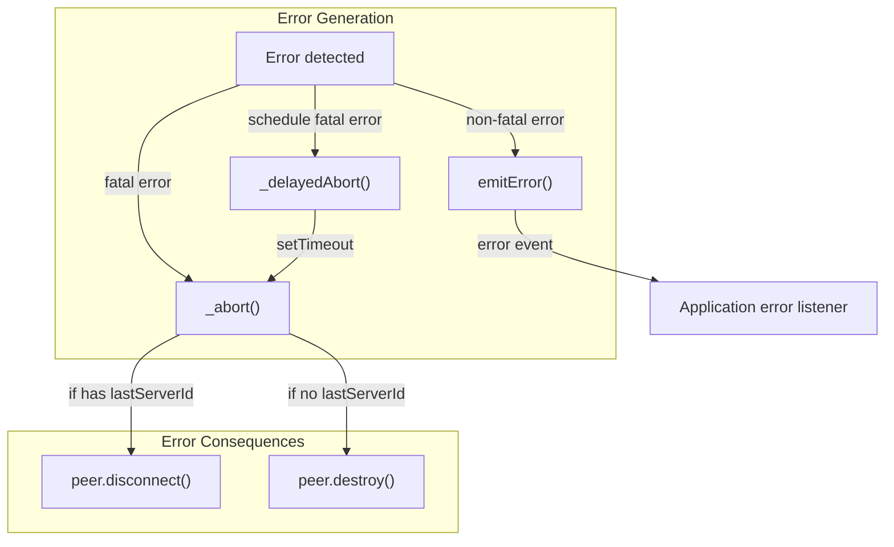

# Error Handling

<details>
<summary>Relevant source files</summary>

The following files were used as context for generating this wiki page:

- [e2e/peer/disconnected.html](e2e/peer/disconnected.html)
- [e2e/peer/id-taken.html](e2e/peer/id-taken.html)
- [e2e/peer/peer.page.ts](e2e/peer/peer.page.ts)
- [e2e/peer/peer.spec.ts](e2e/peer/peer.spec.ts)
- [e2e/peer/server-unavailable.html](e2e/peer/server-unavailable.html)
- [lib/baseconnection.ts](lib/baseconnection.ts)
- [lib/enums.ts](lib/enums.ts)
- [lib/exports.ts](lib/exports.ts)
- [lib/peer.ts](lib/peer.ts)
- [lib/servermessage.ts](lib/servermessage.ts)

</details>


This document describes how errors are handled and exposed to users of the PeerJS library. It covers the error types defined in the system, how errors propagate through the application, and best practices for handling errors in your applications using PeerJS.

For information about utility functions, see [Utility Functions](#4.1), and for browser support detection, see [Browser Support](#4.2).

## Error Architecture Overview

PeerJS implements a consistent error handling architecture based on events. The library uses custom error types to categorize different error scenarios, allowing application developers to handle specific errors appropriately.



Sources: [lib/peer.ts:23-23](), [lib/baseconnection.ts:6-9](), [lib/enums.ts:6-71]()

## Error Types

PeerJS categorizes errors into distinct types to help identify the cause and potential solutions. These are defined as enums in the codebase.

### Peer Error Types

These errors are related to the peer instance and its connection to the signaling server:

| Error Type | Description | Common Cause |
|------------|-------------|--------------|
| `BrowserIncompatible` | The client's browser doesn't support required WebRTC features | Using an old browser or one with limited WebRTC support |
| `Disconnected` | You've already disconnected this peer from the server | Trying to connect after calling `.disconnect()` |
| `InvalidID` | The ID passed into the Peer constructor contains illegal characters | Using special characters not allowed in IDs |
| `InvalidKey` | The API key is invalid | Providing an incorrect API key |
| `Network` | Connection to signaling server lost | Network disruption, server issues |
| `PeerUnavailable` | The peer you're trying to connect to doesn't exist | Peer has disconnected or ID is incorrect |
| `SslUnavailable` | PeerJS is using secure mode but server doesn't support SSL | Server configuration issue |
| `ServerError` | Unable to reach the server | Server down or misconfigured |
| `SocketError` | An error from the underlying socket | Network or connection issues |
| `SocketClosed` | The underlying socket closed unexpectedly | Server-side or network issues |
| `UnavailableID` | The ID passed into the Peer constructor is already taken | ID collision with another user |
| `WebRTC` | Native WebRTC errors | Various WebRTC internal issues |

Sources: [lib/enums.ts:6-61]()

### Connection Error Types

These errors relate to connections between peers:

| Error Type | Description |
|------------|-------------|
| `NegotiationFailed` | WebRTC negotiation process failed |
| `ConnectionClosed` | The connection has been closed |

Sources: [lib/enums.ts:63-66]()

### Data Connection Error Types

Specific to data connections:

| Error Type | Description |
|------------|-------------|
| `NotOpenYet` | Trying to send data before connection is established |
| `MessageToBig` | The message exceeds size limits |

Sources: [lib/enums.ts:68-71]()

## Error Events and Handling

### The Error Event

Both the `Peer` class and connection classes emit `error` events when errors occur. The event handler receives a `PeerError` object with a `type` property that corresponds to one of the error types described above.

```typescript
// Example of handling errors on a Peer instance
const peer = new Peer('your-id');
peer.on('error', (error) => {
  console.log(`Error type: ${error.type}`);
  
  // Handle specific error types
  if (error.type === 'unavailable-id') {
    console.log('The ID is taken, try another one');
  } else if (error.type === 'network') {
    console.log('Connection to server lost, will try to reconnect');
  }
});
```

Sources: [lib/peer.ts:108-108](), [lib/baseconnection.ts:28-28]()

### Error Flow Diagram



Sources: [lib/peer.ts:107-108](), [lib/peer.ts:607-628](), [lib/baseconnection.ts:35-38]()

## Error Handling in PeerJS Internals

PeerJS has several internal mechanisms for handling and propagating errors:

### The `emitError` Method

Both `Peer` and connection classes inherit from `EventEmitterWithError`, which provides an `emitError` method. This method creates a `PeerError` object and emits it through the 'error' event.

### Abort Mechanisms

The `Peer` class implements `_abort` and `_delayedAbort` methods for handling fatal errors:

1. `_delayedAbort`: Schedules an abort operation to run after the current execution context
2. `_abort`: Emits an error and destroys or disconnects the peer, depending on its state



Sources: [lib/peer.ts:607-628](), [lib/peerError.ts]()

### Fatal vs. Non-Fatal Errors

PeerJS distinguishes between fatal and non-fatal errors:

- **Fatal errors**: Terminate the peer's ability to function (e.g., browser incompatibility, SSL unavailability)
- **Non-fatal errors**: Allow the peer to continue operating (e.g., connection to a specific peer failed)

The documentation in `PeerEvents` interface notes: "Errors on the peer are almost always fatal and will destroy the peer."

Sources: [lib/peer.ts:104-108]()

## Best Practices for Error Handling

When using PeerJS, follow these best practices for error handling:

1. **Always listen for error events**:
   ```typescript
   peer.on('error', (error) => {
     console.error('PeerJS error:', error.type, error);
   });
   
   connection.on('error', (error) => {
     console.error('Connection error:', error.type, error);
   });
   ```

2. **Handle specific error types differently**:
   ```typescript
   peer.on('error', (error) => {
     switch(error.type) {
       case 'unavailable-id':
         // Suggest alternative ID or generate random one
         break;
       case 'network':
         // Show network reconnection interface
         break;
       case 'browser-incompatible':
         // Show browser compatibility warning
         break;
       // etc.
     }
   });
   ```

3. **Implement reconnection logic** when appropriate:
   ```typescript
   peer.on('error', (error) => {
     if (error.type === 'network' || error.type === 'socket-error') {
       attemptReconnection();
     }
   });
   
   function attemptReconnection() {
     if (peer.disconnected && !peer.destroyed) {
       peer.reconnect();
     }
   }
   ```

4. **Handle disconnection events** in addition to errors:
   ```typescript
   peer.on('disconnected', (peerId) => {
     console.log(`Disconnected from server, was using ID: ${peerId}`);
     // Decide whether to reconnect
   });
   ```

Sources: [e2e/peer/id-taken.html:36-47](), [e2e/peer/disconnected.html:25-33](), [lib/peer.ts:709-730]()

## Error Testing Examples

The PeerJS codebase includes several end-to-end tests that demonstrate error handling:

1. **ID taken scenario**: Tests how errors are handled when attempting to use an ID that's already taken
2. **Server unavailable scenario**: Tests error handling when the server cannot be reached
3. **Disconnected scenario**: Tests errors when attempting to establish connections after disconnection

These tests show practical examples of responding to specific error types in real-world scenarios.

Sources: [e2e/peer/id-taken.html](), [e2e/peer/server-unavailable.html](), [e2e/peer/disconnected.html](), [e2e/peer/peer.spec.ts:4-20]()

## PeerError Class Implementation

The `PeerError` class extends JavaScript's native `Error` class and is used to create structured error objects with specific types that match the error type enums. This allows for consistent error handling throughout the application.

This custom error implementation is the cornerstone of error handling in PeerJS, allowing errors to be categorized, identified, and handled appropriately.

Sources: [lib/peer.ts:23-23](), [lib/exports.ts:26-26]()
