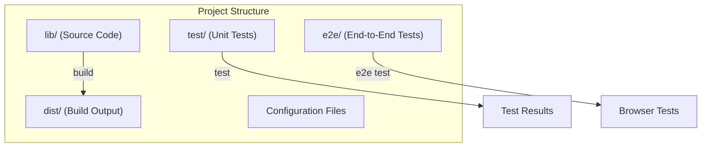
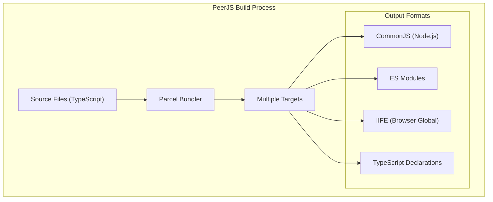
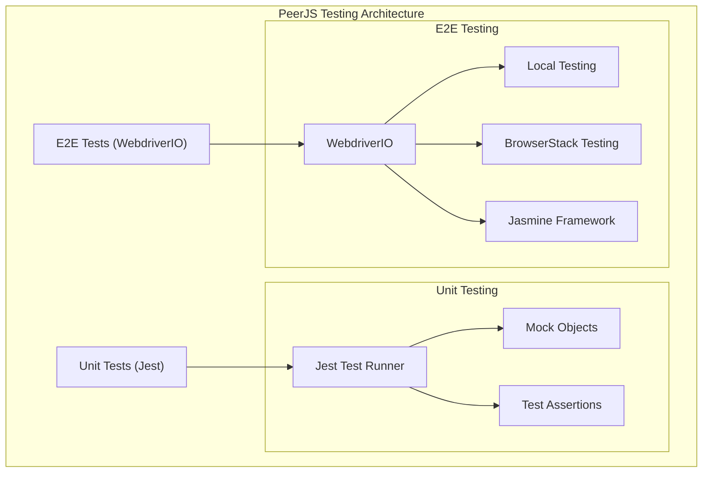
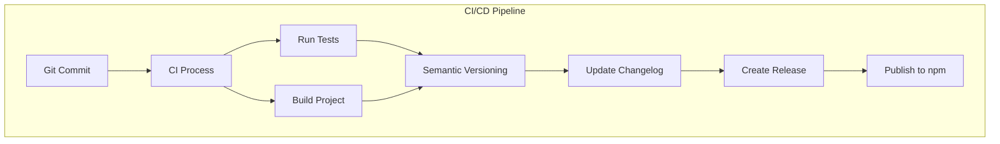
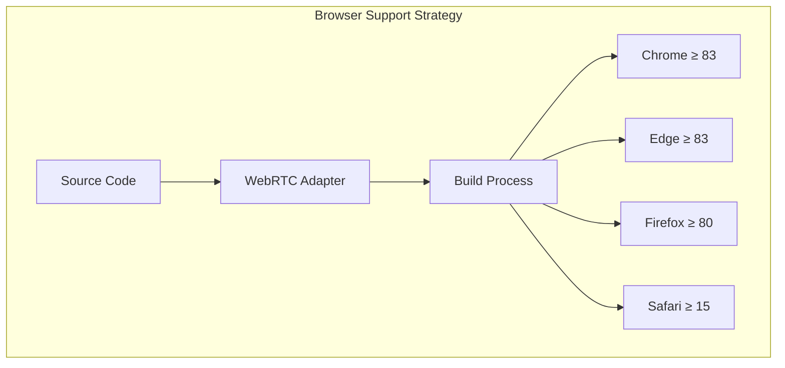

# Development

<details>
<summary>Relevant source files</summary>

The following files were used as context for generating this wiki page:

- [.gitignore](.gitignore)
- [CHANGELOG.md](CHANGELOG.md)
- [package-lock.json](package-lock.json)
- [package.json](package.json)

</details>


This page provides comprehensive information for developers who want to contribute to or build upon the PeerJS library. It covers the development environment setup, build processes, testing strategies, and CI/CD pipeline.

For information about using PeerJS in your applications, refer to [Installation and Usage](#1.1).

## Development Environment Setup

To contribute to PeerJS, you'll need to set up a local development environment. The project requires Node.js version 14 or higher.

### Prerequisites

- Node.js (>= 14)
- npm (comes with Node.js)
- Git

### Installation Steps

1. Clone the repository:
   ```bash
   git clone https://github.com/peers/peerjs.git
   cd peerjs
   ```

2. Install dependencies:
   ```bash
   npm install
   ```

3. Run type checking to ensure everything is set up correctly:
   ```bash
   npm run check
   ```

Sources: [package.json:112-114](), [package.json:164-177]()

## Project Structure

The PeerJS project is organized with a focus on maintainability and separation of concerns.



### Key Files and Directories

| Directory/File | Purpose |
|----------------|---------|
| `lib/` | Source code of the PeerJS library |
| `test/` | Jest unit tests |
| `e2e/` | End-to-end tests using WebdriverIO |
| `dist/` | Generated build files (not checked into version control) |
| `package.json` | Project configuration and dependencies |
| `.gitignore` | Files excluded from version control |

### Build Targets

PeerJS produces several different build outputs to support various usage scenarios:

| Target | Purpose | Output File |
|--------|---------|-------------|
| `main` | CommonJS bundle for Node.js | `dist/bundler.cjs` |
| `module` | ES module bundle | `dist/bundler.mjs` |
| `browser-minified` | Minified bundle for browsers | `dist/peerjs.min.js` |
| `browser-unminified` | Unminified bundle for browsers (for debugging) | `dist/peerjs.js` |
| `browser-minified-msgpack` | MsgPack serializer bundle | `dist/serializer.msgpack.mjs` |
| `types` | TypeScript declaration files | `dist/types.d.ts` |

Sources: [package.json:99-101](), [package.json:106-111](), [package.json:115-161]()

## Building the Project

PeerJS uses [Parcel](https://parceljs.org/) as its build tool. It's a zero-configuration bundler that simplifies the build process.

### Build Commands

- **Full build**: Creates all distribution files
  ```bash
  npm run build
  ```

- **Watch mode**: Rebuilds files when changes are detected
  ```bash
  npm run watch
  ```

### Build Process



The build process transpiles TypeScript code, bundles dependencies, and produces optimized outputs for different environments. The configuration in `package.json` defines various target configurations that Parcel uses to generate the appropriate bundles.

Sources: [package.json:164-177](), [package.json:115-161]()

## Testing

PeerJS employs a comprehensive testing strategy that includes both unit tests and end-to-end tests to ensure code quality and functionality.

### Unit Testing with Jest

Unit tests are written using Jest and focus on testing individual components in isolation.

- **Run unit tests**:
  ```bash
  npm test
  ```

- **Watch mode for unit tests**:
  ```bash
  npm run test:watch
  ```

- **Generate coverage report**:
  ```bash
  npm run coverage
  ```

### End-to-End Testing

End-to-end tests are implemented using WebdriverIO and verify that the library works correctly in actual browser environments.

- **Run local E2E tests**:
  ```bash
  npm run e2e
  ```

- **Run E2E tests on BrowserStack**:
  ```bash
  npm run e2e:bstack
  ```

### Testing Architecture



Sources: [package.json:169-172](), [package.json:175-176](), [package.json:186-204]()

## Code Formatting and Quality

PeerJS maintains code consistency using Prettier for formatting.

- **Format all files**:
  ```bash
  npm run format
  ```

- **Check formatting without making changes**:
  ```bash
  npm run format:check
  ```

Sources: [package.json:172-173]()

## Continuous Integration and Deployment

PeerJS uses a CI/CD pipeline for automated testing, versioning, and releases.

### Semantic Versioning

The project follows [Semantic Versioning](https://semver.org/) principles, managed through semantic-release:

- **Major version (X.0.0)**: Incompatible API changes
- **Minor version (0.X.0)**: Backwards-compatible functionality additions
- **Patch version (0.0.X)**: Backwards-compatible bug fixes

### Release Process



The release process is automated using semantic-release, which determines the next version number based on commit messages, updates the CHANGELOG.md file, and publishes the package to npm.

Sources: [package.json:174](), [package.json:183-184](), [CHANGELOG.md:1-100]()

## Supported Browsers and Environments

PeerJS targets modern browsers with WebRTC support. The build configuration specifies minimum browser versions:

- Chrome ≥ 83
- Edge ≥ 83
- Firefox ≥ 80 (≥ 102 for MsgPack serialization)
- Safari ≥ 15

These version requirements ensure that the library can use modern WebRTC APIs while maintaining broad compatibility.



The library uses `webrtc-adapter` to normalize WebRTC behavior across different browsers, ensuring consistent functionality despite browser-specific implementations.

Sources: [package.json:138-140](), [package.json:147-149](), [package.json:157-159](), [package.json:206-210]()

## Dependencies

PeerJS has minimal runtime dependencies, which helps keep the library lightweight:

| Dependency | Purpose |
|------------|---------|
| `@msgpack/msgpack` | Efficient binary serialization format |
| `eventemitter3` | Event handling implementation |
| `peerjs-js-binarypack` | Binary packing for data transmission |
| `webrtc-adapter` | Normalizes WebRTC APIs across browsers |

Sources: [package.json:206-210]()

## Contributing

When contributing to PeerJS, follow these guidelines:

1. **Code Style**: Ensure code formatting by running `npm run format` before submitting.
2. **Type Safety**: Maintain TypeScript type definitions and run `npm run check` to verify.
3. **Testing**: Add tests for new features and ensure all tests pass with `npm test`.
4. **Documentation**: Update relevant documentation when changing functionality.
5. **Commit Messages**: Follow semantic commit message format to enable proper versioning.

Sources: [package.json:164-177]()
