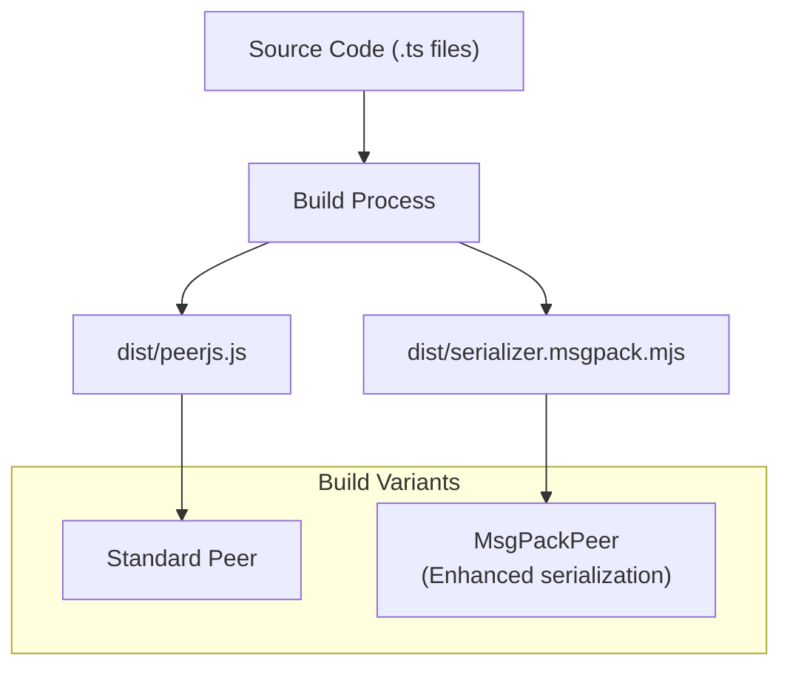
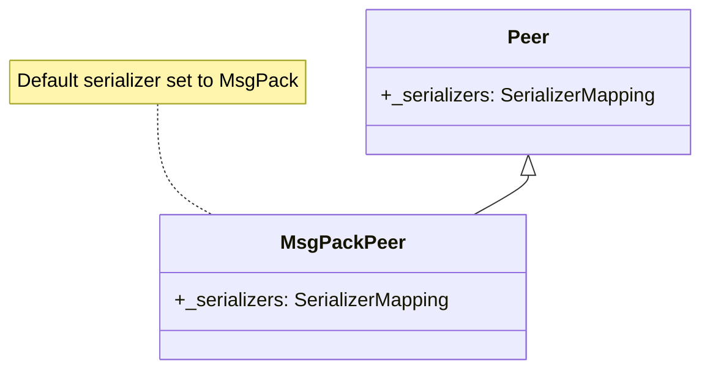
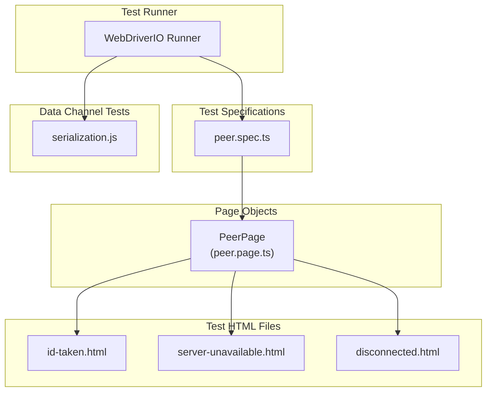
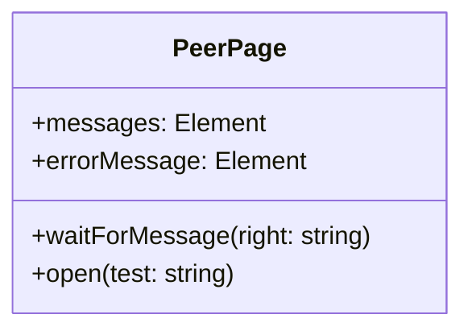
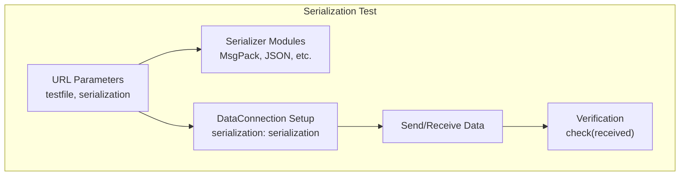
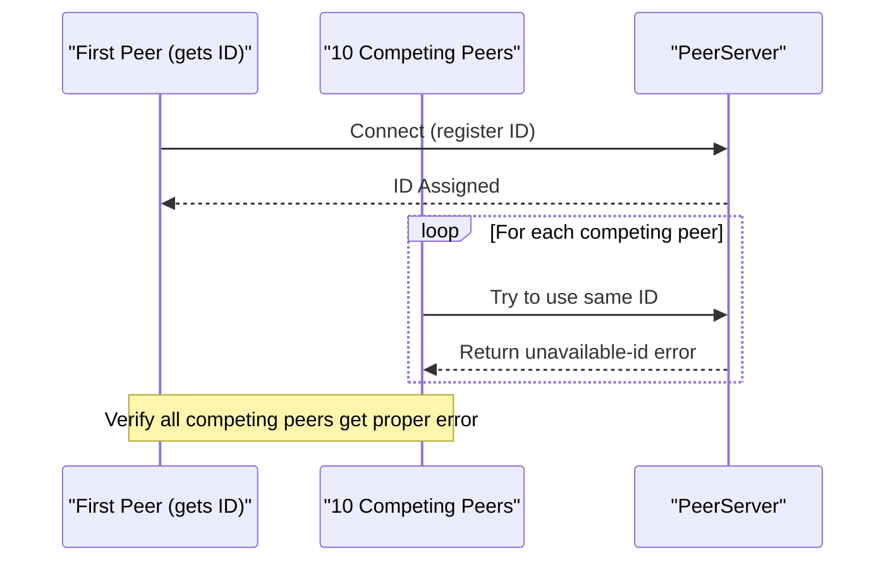

# Building and Testing

<details>
<summary>Relevant source files</summary>

The following files were used as context for generating this wiki page:

- [e2e/datachannel/serialization.js](e2e/datachannel/serialization.js)
- [e2e/peer/disconnected.html](e2e/peer/disconnected.html)
- [e2e/peer/id-taken.html](e2e/peer/id-taken.html)
- [e2e/peer/peer.page.ts](e2e/peer/peer.page.ts)
- [e2e/peer/peer.spec.ts](e2e/peer/peer.spec.ts)
- [e2e/peer/server-unavailable.html](e2e/peer/server-unavailable.html)
- [lib/msgPackPeer.ts](lib/msgPackPeer.ts)

</details>


This document explains how to build the PeerJS library from source code and how to run its test suite to verify functionality. It covers the development environment setup, build configuration options, and testing framework implementation.

For information about continuous integration and deployment processes, see [CI/CD Pipeline](#5.2).

## Development Environment

### Prerequisites

To build and test PeerJS, you need:

- Node.js and npm/yarn
- Web browser for end-to-end tests
- Git to clone the repository

## Building PeerJS

PeerJS can be built with different configurations, including specialized variants with alternative serialization methods.

### Build Process Overview



Sources: [lib/msgPackPeer.ts:1-13]()

### Serialization Options

The primary PeerJS library supports different serialization methods. As shown in the `MsgPackPeer` class, specialized build variants with alternative serialization implementations are available:



Sources: [lib/msgPackPeer.ts:1-13]()

## Testing Framework

PeerJS uses WebDriver.IO for end-to-end (E2E) testing, which verifies library functionality in real browser environments.

### Test Architecture



Sources: [e2e/peer/peer.spec.ts:1-21](), [e2e/peer/peer.page.ts:1-30]()

### Test Case Implementation

The tests use a Page Object Model pattern to separate test logic from browser interaction details. The `PeerPage` class provides methods to interact with test pages and assert results:



Sources: [e2e/peer/peer.page.ts:5-29]()

### Test Scenarios

The testing framework covers several key scenarios:

| Scenario | Test File | Purpose |
|----------|-----------|---------|
| ID Conflict | id-taken.html | Verifies proper handling of duplicate peer IDs |
| Server Unavailability | server-unavailable.html | Tests error handling when signaling server is unreachable |
| Disconnection | disconnected.html | Tests behavior when connection to server is lost |
| Serialization | serialization.js | Tests data transmission with different serialization methods |

Sources: [e2e/peer/id-taken.html:1-59](), [e2e/peer/server-unavailable.html:1-32](), [e2e/peer/disconnected.html:1-37](), [e2e/datachannel/serialization.js:1-97]()

## Running Tests

### End-to-End Tests

The end-to-end tests are defined in `peer.spec.ts` which uses WebDriver.IO to automate browser testing:

```typescript
describe("Peer", () => {
  it("should emit an error, when the ID is already taken", async () => {
    await P.open("id-taken");
    await P.waitForMessage("No ID takeover");
    expect(await P.errorMessage.getText()).toBe("");
  });
  // Additional tests...
});
```

Sources: [e2e/peer/peer.spec.ts:4-20]()

### Test Configuration

The tests require environment configuration, particularly the `BYPASS_WAF` environment variable used to bypass security measures for testing:

```typescript
const { BYPASS_WAF } = process.env;

class PeerPage {
  // ...
  async open(test: string) {
    await browser.url(`/e2e/peer/${test}.html?key=${BYPASS_WAF}`);
  }
}
```

Sources: [e2e/peer/peer.page.ts:3-26]()

## Serialization Testing

The PeerJS library includes comprehensive tests for its various serialization methods. These tests verify data integrity across peer connections using different serialization strategies.



Sources: [e2e/datachannel/serialization.js:6-94]()

The serialization tests dynamically import serializer modules and test them with different data types:

```javascript
const { MsgPack } = await import("/dist/serializer.msgpack.mjs");
serializers = {
  MsgPack,
};
```

Sources: [e2e/datachannel/serialization.js:13-16]()

## ID Conflict Testing

PeerJS tests include verification that ID conflicts are properly handled. The test creates multiple peers attempting to use an already-taken ID and verifies they receive the appropriate error:



Sources: [e2e/peer/id-taken.html:25-55]()

## Server Error Testing

The testing framework verifies proper error handling when:

1. The server is unavailable
   ```javascript
   new Peer({
     host: "thisserverwillneverexist.example.com",
   }).once(
     "error",
     (error) => void (messages.textContent = JSON.stringify(error)),
   );
   ```
   
2. The connection is lost
   ```javascript
   peer.once("open", (id) => {
     peer.disconnect();
     peer.connect("otherid");
   });
   ```

Sources: [e2e/peer/server-unavailable.html:22-28](), [e2e/peer/disconnected.html:30-33]()

## Test Automation

The WebDriver.IO framework automates the testing process, allowing for programmatic verification of PeerJS behavior across different browsers and scenarios. The test suite is designed to catch issues with:

1. Peer connection establishment
2. Error handling
3. Data transmission and serialization
4. Browser compatibility

Sources: [e2e/peer/peer.spec.ts:1-21]()
