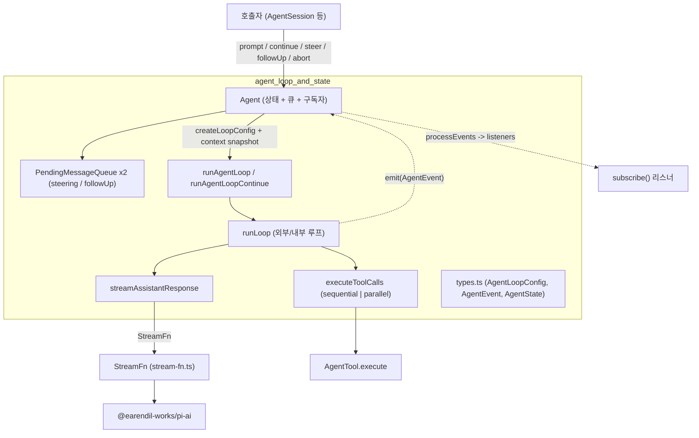
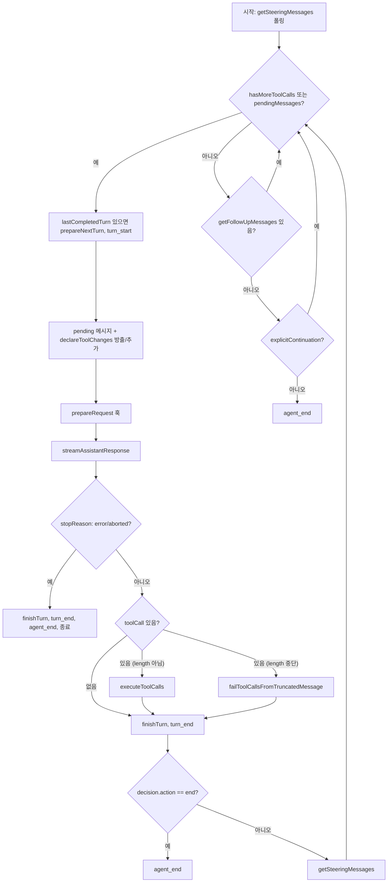
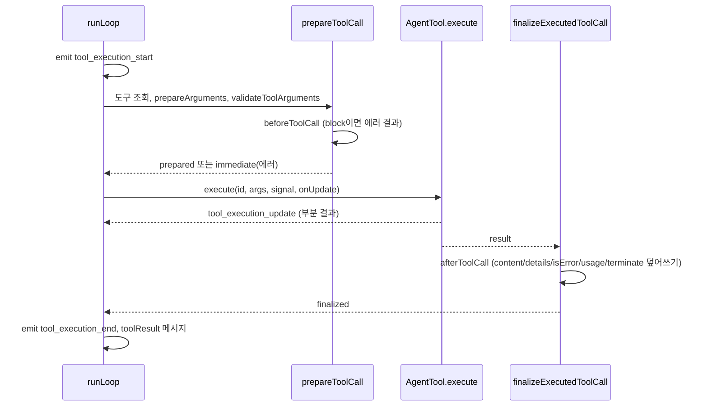
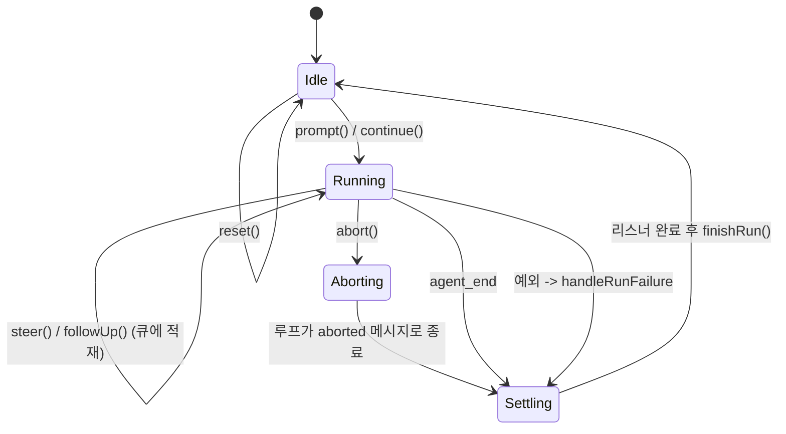
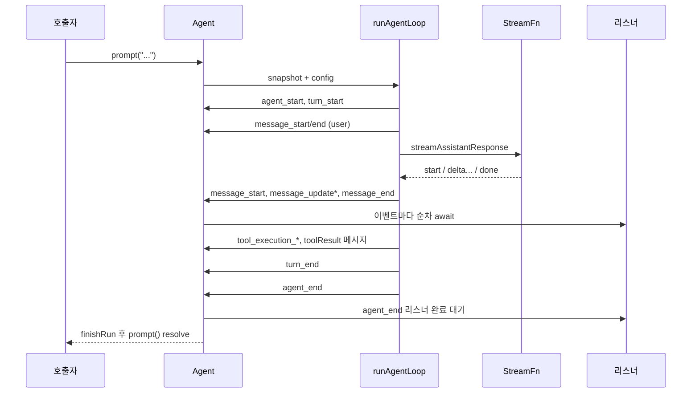

# agent_loop_and_state 모듈

## 개요

`agent_loop_and_state`는 `packages/agent`(`@earendil-works/pi-agent-core`)의 핵심 런타임이다. 두 계층으로 구성된다.

- **저수준 루프** (`packages/agent/src/agent-loop.ts`): `agentLoop`, `agentLoopContinue`. 상태가 없고, `AgentMessage[]` 컨텍스트를 받아 LLM 호출 → 도구 실행 → 조향(steering)/후속(follow-up) 메시지 처리를 반복하며 `AgentEvent`를 방출한다.
- **상태 보유 래퍼** (`packages/agent/src/agent.ts`): `Agent`. 대화 transcript, 실행 상태, 큐, 구독자, abort 제어를 소유하고 루프를 구동한다.
- **타입 계약** (`packages/agent/src/types.ts`): `AgentLoopConfig`, `AgentEvent`, `AgentState`, `AgentTool`, `CustomAgentMessages` 등.

스트리밍 프록시와 기본 stream 함수 등록은 형제 모듈 [agent_streaming_proxy](agent_streaming_proxy.md)에서 다룬다. 상위 모듈은 [agent_runtime_core](agent_runtime_core.md)이다. 이 모듈의 소비자는 [agent_session_core](agent_session_core.md)의 `AgentSession`이다. LLM 호출 자체는 [llm_provider_adapters](llm_provider_adapters.md)와 [model_registry](model_registry.md)가 담당한다.

> 검증 수준: 아래 내용은 제공된 소스 코드(`agent-loop.ts`, `agent.ts`, `types.ts`)를 직접 읽은 **코드 확인**이다. 설계 의도에 대한 서술은 `추론`으로 표시한다.

---

## 아키텍처

### 설계 포인트

- 루프는 `AgentMessage`(LLM 메시지 + `CustomAgentMessages` 확장)로 일관되게 동작하고, **LLM 경계(`streamAssistantResponse`)에서만** `transformContext` → `convertToLlm` → `normalizeContext`를 거쳐 `Message[]`로 변환한다.
- `Agent`는 루프의 이벤트를 `processEvents`에서 **리듀서처럼** 받아 내부 상태를 갱신한 뒤 리스너를 순서대로 `await`한다.
- 도구 선언은 transcript의 system 메시지(`toolsAdded`/`toolsRemoved`)로 전달된다 (`declareToolChanges`).

---

## 컴포넌트 상세

### `agentLoop` / `agentLoopContinue`

| 함수 | 역할 | 주의 |
|---|---|---|
| `agentLoop(prompts, context, config, signal, streamFn)` | 프롬프트 메시지를 컨텍스트에 추가하고 루프 시작 | `EventStream<AgentEvent, AgentMessage[]>` 반환. `agent_end`에서 종료되며 결과는 새 메시지 배열 |
| `agentLoopContinue(context, config, signal, streamFn)` | 새 메시지 없이 현재 컨텍스트에서 이어서 실행(재시도용) | 메시지가 비었거나 마지막이 `assistant`이면 즉시 throw |

내부적으로 각각 `runAgentLoop`/`runAgentLoopContinue`(`emit` 싱크 버전)를 호출한다. `Agent`는 스트림 대신 이 `emit` 버전을 직접 사용한다.

### `runLoop`: 이중 루프

- **내부 루프**: 도구 호출이 남았거나 steering 메시지가 있는 동안 반복.
- **외부 루프**: 에이전트가 멈추려 할 때 follow-up 메시지를 확인하고, 있으면 pending으로 올려 내부 루프 재진입.
- `finishTurn`이 `{action: "continue"}`를 반환하면(`explicitContinuation`) 자연스러운 다음 요청이 없을 때 현재 컨텍스트로 **정확히 한 번** 더 진행한다. `{action: "end"}`는 큐 폴링 없이 종료한다.
- `error`/`aborted` 응답은 항상 하드 종료다.
- `prepareNextTurn` 중 길어진 작업(예: compaction) 동안 쌓인 steering은, 이전 폴링이 비어 있었을 때만 다시 폴링한다. (one-at-a-time 모드에서 한 턴에 두 개가 전달되는 것을 방지하는 주석이 코드에 있음)

### `streamAssistantResponse`

1. `transformContext` (선택) → `convertToLlm` → `normalizeContext`.
2. `getApiKey(provider)`로 만료 가능한 토큰을 호출 직전에 해석, 없으면 `config.apiKey`.
3. `streamFunction(model, llmContext, {...config, apiKey, signal})` 호출.
4. 이벤트 처리: `start`에서 partial을 context에 push 후 `message_start`; 델타 계열은 마지막 항목을 교체하며 `message_update`; `done`/`error`에서 최종 메시지로 교체 후 `message_end`.
5. 결과 메시지에 `thinkingLevel`(요청된 reasoning 수준, 기본 `"off"`)을 기록한다.

`StreamFn` 계약(`types.ts`): 요청/모델/런타임 실패로 throw 하거나 reject 하지 말고, 최종 `AssistantMessage`의 `stopReason: "error" | "aborted"`와 `errorMessage`로 인코딩해야 한다.

### 도구 실행

- **모드**: `config.toolExecution === "sequential"`이거나 호출 중 하나라도 `executionMode === "sequential"`이면 순차 실행. 기본은 `"parallel"`.
- **parallel**: 준비(prepare)는 순차, 실행은 동시. `tool_execution_end`는 완료 순서, `toolResult` 메시지는 assistant 소스 순서로 방출.
- **오류 처리**: 알 수 없는 도구, 검증 오류, 차단, 예외 모두 throw 하지 않고 `isError: true` 결과로 변환된다.
- **조기 종료**: 배치 내 모든 결과가 `terminate === true`일 때만 `hasMoreToolCalls = false`.
- **길이 초과 중단**: `stopReason === "length"`면 인수가 잘렸을 수 있어 모든 도구 호출을 실행하지 않고 에러 결과로 반환한다.
- **`runToolCall`**: 다른 도구를 호출하는 도구가 동일 훅(권한 검사 등)을 적용받도록 export된 단일 호출 진입점. 이벤트/메시지는 방출하지 않는다. (`NestedToolCallRunner` 등과의 관계는 [agent_session_core](agent_session_core.md) 참고. 연결 지점은 `추론`)

### `declareToolChanges`

`context.tools`(실행 가능) 와 transcript가 선언한 도구(`getCurrentTools`) 차이를 `toolsAdded`/`toolsRemoved`로 계산해 system 메시지에 넣는다. 보류 중인 system 메시지가 있으면 그 도구 필드를 의도값으로 보고 재계산 결과로 교체하며, 없으면 첫 non-system 메시지 앞에 새 system 메시지를 삽입한다. 결과적으로 재생(replay)하면 항상 `context.tools`와 일치한다.

---

### `Agent` 클래스

#### 상태 (`AgentState`)

| 필드 | 설명 |
|---|---|
| `systemPrompt` | transcript의 system 메시지에서 재생된 읽기 전용 값 |
| `model`, `thinkingLevel` | 이후 턴에 사용할 모델/추론 수준 |
| `tools`, `messages` | 접근자 속성. 대입 시 최상위 배열이 복사됨 |
| `isStreaming` | 실행 중 true. `agent_end` 리스너가 모두 끝날 때까지 유지 |
| `streamingMessage` | 스트리밍 중인 partial 메시지 |
| `pendingToolCalls` | 실행 중인 toolCallId 집합 (불변 갱신) |
| `errorMessage` | 최근 실패/중단 턴의 오류 |

`createMutableAgentState`는 `initialState.messages`가 system으로 시작하지 않으면 `systemPrompt`와 도구 선언으로 선두 system 메시지를 만든다. 모델이 없으면 `DEFAULT_MODEL`(`"unknown"`)을 쓴다.

#### 주요 API

| 메서드 | 동작 |
|---|---|
| `prompt(input, images?)` | 문자열/메시지/배열을 정규화해 실행. 이미 실행 중이면 throw |
| `continue()` | 현재 transcript에서 재개. 마지막이 `assistant`이면 steering 큐 → follow-up 큐 순으로 drain해 실행하고, 둘 다 비면 throw |
| `steer(msg)` | 현재 턴이 끝난 뒤 주입할 메시지 적재 |
| `followUp(msg)` | 에이전트가 멈추려 할 때만 실행할 메시지 적재 |
| `clearAllQueues()` | 두 큐 비우기 (`clearSteeringQueue`, `clearFollowUpQueue`) |
| `steeringMode` / `followUpMode` | `QueueMode`: `"all"` 또는 `"one-at-a-time"` (기본) |
| `subscribe(listener)` | 이벤트 구독, 해제 함수 반환. 리스너는 구독 순서대로 `await`됨 |
| `signal` / `abort()` | 현재 실행의 `AbortSignal` / 중단 |
| `waitForIdle()` | 실행과 `agent_end` 리스너까지 모두 끝나면 resolve |
| `reset()` | 실행 중이면 throw. 선두 system 메시지(baseline)만 남기고 상태/큐 초기화 |

#### `PendingMessageQueue`

- `enqueue`: 단순 push.
- `peek`/`drain`: `mode === "all"`이면 전체, 아니면 가장 오래된 1개만 반환. `drain`은 반환한 만큼 제거한다.
- `clear`: 비우기.
- `peekQueuedMessages()`는 steering이 있으면 steering, 없으면 follow-up을 미리보기한다 (소비하지 않음).

#### 실행 수명주기 (`runWithLifecycle`)

1. `activeRun`(promise, `AbortController`) 생성, `isStreaming = true`.
2. `createContextSnapshot()`으로 messages/tools를 **복사본**으로 루프에 전달 (루프는 복사본을 변경하고, 실제 transcript는 `message_end` 이벤트로만 갱신됨).
3. `createLoopConfig()`가 `Agent`의 공개 필드(훅, `sessionId`, `transport`, `thinkingBudgets`, `maxRetryDelayMs`, `toolExecution` 등)와 큐 drain 콜백을 `AgentLoopConfig`로 조립. `continue()`가 steering을 직접 drain한 경우 `skipInitialSteeringPoll`로 첫 폴링을 건너뛰어 중복을 막는다.
4. 예외가 나면 `handleRunFailure`가 `stopReason: "aborted" | "error"`인 합성 assistant 메시지로 `message_start/end`, `turn_end`, `agent_end`를 직접 방출.
5. `finally`에서 `finishRun()`: 상태 정리 후 `activeRun.resolve()`.

#### `processEvents` 리듀서

| 이벤트 | 상태 변화 |
|---|---|
| `message_start` / `message_update` | `streamingMessage = message` |
| `message_end` | `streamingMessage` 해제, `messages.push(message)` |
| `tool_execution_start` / `end` | `pendingToolCalls`에 id 추가/제거 |
| `turn_end` | assistant `errorMessage`가 있으면 `errorMessage` 기록 |
| `agent_end` | `streamingMessage` 해제 |

이후 `activeRun`의 signal과 함께 모든 리스너를 순차 `await`한다. 실행 밖에서 호출되면 throw.

#### `defaultConvertToLlm`

`system`, `user`, `assistant`, `toolResult` 역할만 통과시키고 나머지(커스텀 메시지)는 필터링한다. 앱은 `convertToLlm` 옵션으로 커스텀 메시지를 변환한다.

### `CustomAgentMessages`

비어 있는 인터페이스로, 앱이 declaration merging으로 확장한다. `AgentMessage = Message | CustomAgentMessages[keyof CustomAgentMessages]`. `coding-agent`는 `packages/coding-agent/src/core/messages.ts`에서 자체 확장을 정의한다 ([agent_session_core](agent_session_core.md) 참고).

---

## 이벤트 흐름

`AgentEvent` 종류: `agent_start/end`, `turn_start/end`, `message_start/update/end`, `tool_execution_start/update/end`. 턴은 assistant 응답 1회 + 그 도구 호출/결과이다.

---

## 훅 요약 (`AgentLoopConfig`)

| 훅 | 시점 | 용도 |
|---|---|---|
| `transformContext` | LLM 호출 직전, `AgentMessage` 레벨 | 가지치기, 외부 컨텍스트 주입 |
| `convertToLlm` | 위 직후 | `AgentMessage[]` → `Message[]` |
| `getApiKey` | 매 호출 | 만료되는 OAuth 토큰 |
| `prepareRequest` | 매 요청 직전(첫 요청 포함) | context/model/thinkingLevel 교체. 큐는 폴링하지 않음 |
| `prepareNextTurn` | `turn_end` 이후, 다음 턴 직전 | compaction 등 상태 교체, 메시지 추가 |
| `finishTurn` | `turn_end` 직전 | `continue`/`end` 결정 |
| `getSteeringMessages` | 도구 실행 후 | 실행 중 조향 |
| `getFollowUpMessages` | 멈추기 직전 | 후속 입력 |
| `beforeToolCall` / `afterToolCall` | 도구 실행 전/후 | 차단, 결과 덮어쓰기 |

`transformContext`, `convertToLlm`, `getApiKey`, `getSteeringMessages`, `getFollowUpMessages`는 **throw 금지 계약**이다. 위반 시 정상 이벤트 시퀀스 없이 루프가 중단된다.

---

## 테스트/빌드 구성

`packages/agent/vitest.config.ts`: Node 환경, `globals: true`, `testTimeout: 30000`, CI에서는 `dot` + `github-actions` 리포터를 사용한다. `@earendil-works/pi-ai`, `pi-agent-core`, `pi-telemetry`를 `src/index.ts` 소스로 alias하고 `conditions: ["source"]`로 빌드 없이 소스를 테스트한다. 자세한 내용은 [build_and_test_config](build_and_test_config.md) 참고.

---

## 사용 시 유의점

- `Agent.prompt()`는 실행 중 재호출하면 throw한다. 실행 중에는 `steer()`/`followUp()`을 쓴다.
- `isStreaming`과 idle 판정은 `agent_end` 리스너 완료까지 포함하므로, 리스너가 오래 걸리면 `waitForIdle()`도 지연된다.
- `agentLoopContinue`/`Agent.continue()`의 마지막 메시지는 `convertToLlm` 후 `user` 또는 `toolResult`여야 한다. 루프는 이를 검증할 수 없다(코드 주석).
- `afterToolCall`의 병합은 필드 단위 얕은 교체이며 `content`만 바꾸면 `structuredContent`는 버려진다.

## 미확인 영역

- `getDefaultStreamFn`/`setDefaultStreamFn` 구현은 이 모듈 코드에 포함되지 않아 [agent_streaming_proxy](agent_streaming_proxy.md) 쪽에서 확인해야 한다 (미확인).
- `EventStream` 내부 구현(`@earendil-works/pi-ai`)은 [ai_runtime_utils](ai_runtime_utils.md) 참고 (미확인).
