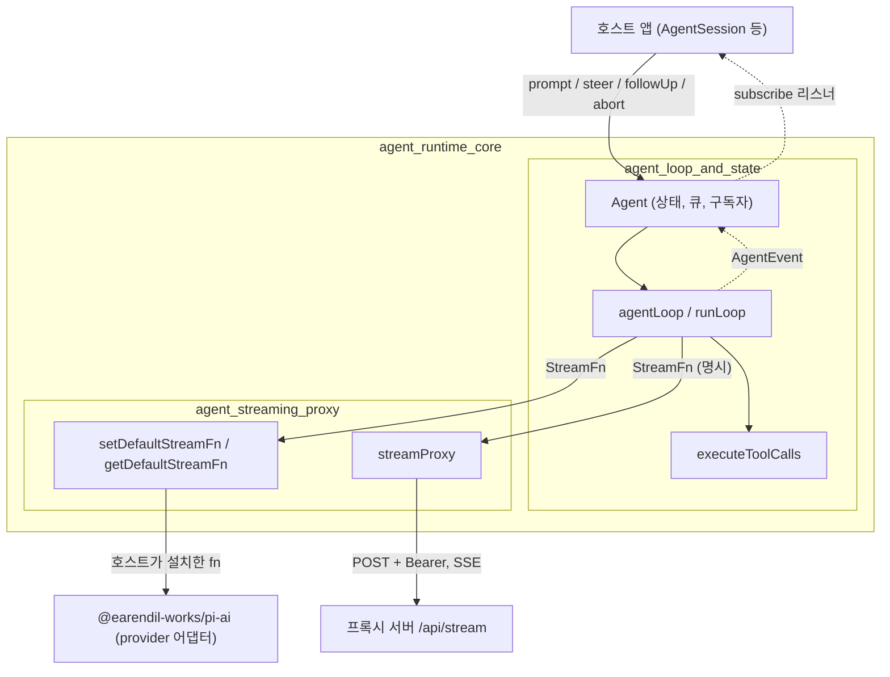
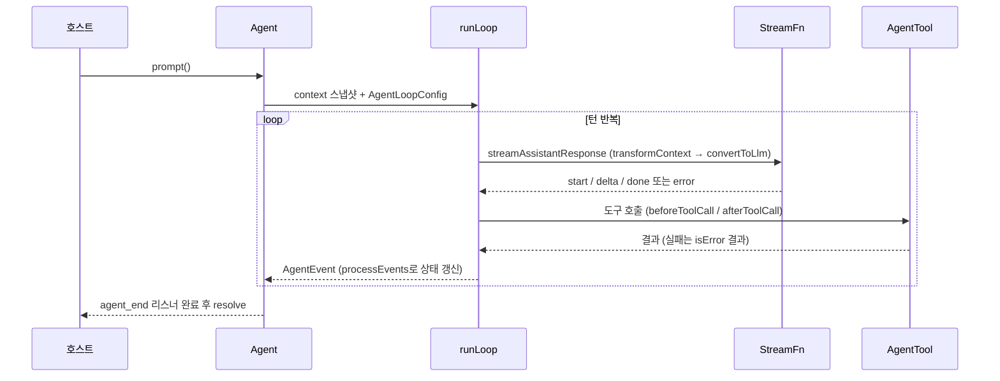

# agent_runtime_core 모듈 개요

> 검증 수준: 하위 모듈 문서(`agent_loop_and_state.md`, `agent_streaming_proxy.md`)를 읽고 정리했다. 각 문서가 소스(`packages/agent/src`)를 직접 읽어 작성한 **코드 확인** 내용을 따른다. 아래 "미확인" 항목은 하위 문서의 한계를 그대로 가져온 것이다.

## 목적

`agent_runtime_core`는 `packages/agent`(`@earendil-works/pi-agent-core`)의 런타임이다. LLM 호출, 도구 실행, 대화 transcript 관리를 하나의 에이전트 루프로 묶는다. 제공자 카탈로그나 UI에 의존하지 않고, `StreamFn` 계약과 훅(`AgentLoopConfig`)만으로 외부와 연결된다.

| 하위 모듈 | 책임 | 주요 파일 |
|---|---|---|
| [agent_loop_and_state](agent_loop_and_state.md) | 상태 없는 루프(`agentLoop`, `agentLoopContinue`)와 상태 보유 래퍼 `Agent`. 큐(steering/follow-up), 구독자, abort, 이벤트 리듀서 | `agent-loop.ts`, `agent.ts`, `types.ts` |
| [agent_streaming_proxy](agent_streaming_proxy.md) | LLM 호출 경로 교체. `streamProxy`(프록시 서버 SSE → `AssistantMessageEvent`), 전역 기본 `streamFn` 주입 | `proxy.ts`, `stream-fn.ts` |

## 아키텍처

### 실행 흐름

## 핵심 설계 포인트

- **두 계층 분리**: 루프는 상태가 없고, `Agent`가 transcript와 큐를 소유한다. 루프는 스냅샷 복사본을 변경하며, 실제 transcript는 `message_end` 이벤트로만 갱신된다.
- **이중 루프**: 내부 루프는 도구 호출과 steering을 처리하고, 외부 루프는 멈추기 직전에 follow-up을 확인한다.
- **실패는 예외가 아니라 이벤트**: `StreamFn`은 throw하지 않고 `stopReason: "error" | "aborted"`로 보고해야 한다. 도구 오류도 `isError: true` 결과로 바뀐다. `streamProxy`도 같은 규약을 따른다.
- **의존성 역전**: `setDefaultStreamFn`으로 호스트가 기본 모델 런타임을 주입하므로, 코어는 제공자 카탈로그에 의존하지 않는다.
- **훅 기반 확장**: `transformContext`, `convertToLlm`, `getApiKey`, `prepareRequest`, `prepareNextTurn`, `finishTurn`, `beforeToolCall`, `afterToolCall` 등. 일부 훅(`getApiKey`, `getSteeringMessages` 등)은 throw 금지 계약이다.
- **메시지 확장**: `CustomAgentMessages` declaration merging으로 앱이 커스텀 메시지를 추가한다. `AgentMessage`는 LLM 경계에서만 `Message[]`로 변환된다.
- **프록시 델타 복원**: 서버가 `partial`을 제거해 보내면 클라이언트의 `processProxyEvent`가 복원한다.

## 미확인 영역

- `Agent`/`agentLoop`가 `getDefaultStreamFn`을 호출하는 정확한 위치는 코드로 확인하지 못했다. 주석에 근거한 서술이다.
- `streamProxy`가 `ai_runtime_utils`의 프레임 유틸(`AssistantMessageFrameEncoder`, `reduceAssistantMessageFrames`)을 쓰는지는 확인하지 못했다.
- `EventStream` 내부 구현은 `@earendil-works/pi-ai` 쪽이며 이 문서 범위 밖이다.

## 관련 모듈

- 소비자: `agent_session_core`(`coding-agent`의 `AgentSession`)
- LLM 호출: `llm_provider_adapters`, `model_registry`
- 이벤트 스트림 유틸: `ai_runtime_utils`
- 테스트 설정: `build_and_test_config` (`packages/agent/vitest.config.ts`)