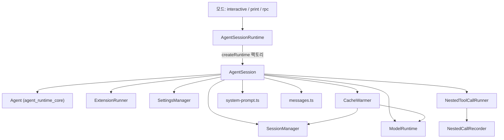
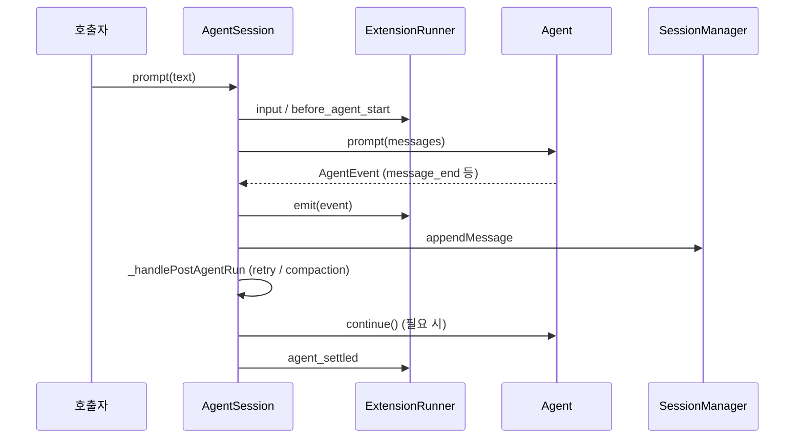
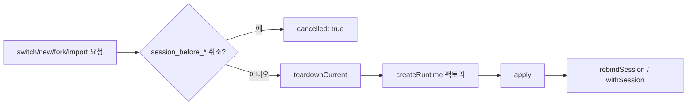

# agent_session_core 모듈

## 개요

`agent_session_core`는 `packages/coding-agent/src/core/`에 있는 **코딩 에이전트 세션의 생명주기 코어**입니다. 저수준 `Agent`(`packages/agent`)를 감싸서 세션 영속화, 확장(extension) 이벤트, 컴팩션, 재시도, 모델/사고 수준 관리, 도구 로드아웃, bash 실행을 한곳에서 조율합니다. interactive / print / rpc 모드는 모두 이 코어 위에 I/O 계층만 얹습니다.

| 파일 | 주요 구성요소 | 역할 |
|---|---|---|
| `agent-session.ts` | `AgentSession` | 세션 핵심 클래스 (이벤트, 프롬프트, 컴팩션, 재시도, 모델, 도구) |
| `agent-session-runtime.ts` | `AgentSessionRuntime`, `createAgentSessionRuntime` | 현재 `AgentSession` + cwd 종속 서비스 소유, 세션 교체(new/resume/fork/import) |
| `cache-warmer.ts` | `CacheWarmer` | 프롬프트 캐시 만료 전 1토큰 요청으로 캐시 유지 |
| `system-prompt.ts` | `buildSystemPrompt` 등 | 섹션 단위 구조화 시스템 프롬프트 생성 및 diff |
| `messages.ts` | `CustomAgentMessages`, `convertToLlm` | 커스텀 메시지 타입과 LLM 메시지 변환 |
| `nested-tool-calls.ts` | `NestedToolCallRunner`, `NestedCallRecorder` | 도구가 `ctx.executeTool()`로 호출하는 중첩 도구 실행·기록 |

> 이 모듈은 하위 모듈로 나누지 않고 단일 문서로 설명합니다.

## 아키텍처

의존 대상 모듈 문서: [agent_loop_and_state](agent_loop_and_state.md), [session_persistence_and_compaction](session_persistence_and_compaction.md), [settings_and_keybindings](settings_and_keybindings.md), [model_and_auth_management](model_and_auth_management.md), [extension_system](extension_system.md), [builtin_tools](builtin_tools.md), [interactive_mode](interactive_mode.md), [rpc_mode](rpc_mode.md).

## 구성요소 설명

### AgentSession (`agent-session.ts`)

- **이벤트 처리**: 생성자에서 `agent.subscribe(_handleAgentEvent)`로 구독. 확장에 먼저 emit한 뒤 공개 리스너에 전달하고, `message_end`에서 `SessionManager`에 영속화(`appendMessage`, `appendCustomMessageEntry`). `agent_end`에는 `willRetry`가 붙습니다.
- **Agent 훅 설치**: `beforeToolCall`/`afterToolCall`(확장 `tool_call`/`tool_result` 및 이미지 정규화), `prepareRequest`(세션 projection과 virtual model 라우팅), `finishTurn`(`turn_end` 경계), `prepareNextTurnWithContext`(컴팩션·프롬프트·도구 갱신), `transformContext`(hidden declaration 제거, 강제 시스템 프롬프트 투영).
- **프롬프트 흐름** `prompt()`: 확장 명령 → 컴팩션 중 차단 → `input` 핸들러 → 스킬/템플릿 확장 → 스트리밍 중이면 `steer`/`followUp` 큐잉 → 모델·인증 검증 → 사전 컴팩션 검사 → `before_agent_start` → 이미지 정규화 → `_runAgentPrompt`.
- **실행 루프** `_runAgentPrompt`: `agent.prompt` 후 `_handlePostAgentRun`(재시도/컴팩션/큐 확인)과 `_runBeforeSettleBoundary`로 `agent.continue()`를 반복하고, 종료 시 `agent_settled`를 emit하며 `CacheWarmer.onAgentSettled`를 호출합니다.
- **큐**: `steer`(현재 턴 도구 실행 후 다음 LLM 호출 전), `followUp`(에이전트 종료 시), `clearQueue`, 모드 `steeringMode`/`followUpMode`. 컨텍스트 전용 커스텀 메시지와 bash 메시지는 tool_use/tool_result 순서를 깨지 않도록 턴 종료 후 flush됩니다.
- **컴팩션**: 수동 `compact()`, 자동 `_checkCompaction` → `_runAutoCompaction`(overflow+재시도 1회, overflow 무재시도, threshold). `session_before_compact` 훅이 취소하거나 결과를 대체할 수 있습니다.
- **재시도**: `_isRetryableError`(컨텍스트 overflow 제외), `_prepareRetry`가 지수 백오프로 대기, 실패 시도는 `appendContextEdit(targetId, null)`로 모델 투영에서 제외.
- **모델/사고 수준**: `setModel`, `cycleModel`(scoped 우선), `setThinkingLevel`(모델 능력에 clamp), virtual model 선택 기록 `_recordSelection`.
- **도구 레지스트리**: `_refreshToolRegistry`, `_applyToolLoadout`(exposure: `direct`/`model-only`/`codemode`/`deferred`/`hidden`, `prepareLoadout` 훅), `_restoreToolsFromTranscript`.
- **기타**: `executeBash`/`recordBashResult`, `navigateTree`(브랜치 요약), `getSessionStats`, `getContextUsage`, `exportToHtml`/`exportToJsonl`, `reload`, `dispose`.

### AgentSessionRuntime (`agent-session-runtime.ts`)

현재 `AgentSession`과 cwd 종속 `AgentSessionServices`를 소유합니다. `switchSession`, `newSession`, `fork`, `importFromJsonl`은 모두 같은 순서를 따릅니다: `session_before_*` 이벤트(취소 가능) → `teardownCurrent`(`abort` → `session_shutdown` → `beforeSessionInvalidate` → `dispose`) → 저장된 `createRuntime` 팩토리로 새 런타임 생성 → `apply` → `rebindSession`/`withSession` 호출. 생성 실패 시 오류는 호출자에게 전파됩니다. `createAgentSessionRuntime`이 초기 런타임을 만듭니다.

노출 속성: `session`, `services`, `diagnostics`, `modelFallbackMessage`, `cwd`.

### CacheWarmer (`cache-warmer.ts`)

프롬프트 캐시 TTL의 90%(최소 10초 여유) 시점에 `maxTokens: 1`로 같은 요청을 재전송해 캐시를 유지합니다. 기대 절감액(`continuationProbability * missCost - warmCost`)이 $0.05 이상일 때만 실행하며, 스트리밍 중에는 확률 1, 유휴 시 0.15를 사용합니다. 안전 한도: 스트리밍 1시간, 유휴 30분. 확장은 `cache_warming_decision`으로 결정을 덮어쓸 수 있고, 성공한 갱신은 `appendUsage("cache_warm", ...)`로 기록되어 `AgentSession`이 `entry_appended`를 emit합니다. `status`와 `cancel`이 외부에 노출됩니다.

### system-prompt.ts

`buildSystemPromptSections`가 `preamble`, `tools`, `rules`, `docs`, `addendum`, `project_context`, `skills`, `cwd` 등 이름 있는 섹션을 만들고, `diffSystemPromptSections`가 전송 이력과 비교한 패치만 `SystemMessage.sections`로 남깁니다. `forceSystemPrompt`는 기록하지 않고 요청에만 투영됩니다. `buildSystemPrompt`는 전체 텍스트를 렌더링합니다.

### messages.ts

`bashExecution`, `custom`, `branchSummary`, `compactionSummary`를 `CustomAgentMessages`에 declaration merging으로 등록하고, `convertToLlm`이 이를 user 메시지로 변환합니다 (`excludeFromContext`인 bash 메시지는 제외).

### nested-tool-calls.ts

도구가 `ctx.executeTool()`로 호출한 중첩 호출을 `<callerId>/<n>` ID로 실행하고 `parentToolCallId`가 붙은 `tool_execution_*` 이벤트를 emit합니다. 순차 실행 필요 시 큐로 직렬화하며, `NestedCallRecorder`가 호출 기록과 usage를 모아 부모 tool result의 `nestedCalls`/`usage`에 기록합니다. 한도는 `NESTED_CALL_LIMITS`(호출 256개, 인자 호출당 8KB, 합계 32KB, 오류 500자)입니다.

## 테스트 설정

`packages/coding-agent/vitest.config.ts`가 이 모듈의 테스트 설정입니다 (세부는 [cli_entry_and_config](cli_entry_and_config.md) 참조). 프로젝트 규칙상 테스트는 `test/suite/harness.ts`와 faux provider를 사용합니다.

## 다른 모듈과의 관계

- 하위: [agent_loop_and_state](agent_loop_and_state.md) (`Agent`, 큐, 훅 지점), [llm_provider_adapters](llm_provider_adapters.md) 및 [ai_platform_foundation](ai_platform_foundation.md) (스트리밍·모델·인증).
- 같은 계층: [session_persistence_and_compaction](session_persistence_and_compaction.md) (`SessionManager`, `compact`), [settings_and_keybindings](settings_and_keybindings.md), [model_and_auth_management](model_and_auth_management.md).
- 상위/소비자: [user_interface_modes](user_interface_modes.md), [experimental_distributed_runtime](experimental_distributed_runtime.md), [extensibility_and_tooling](extensibility_and_tooling.md).
