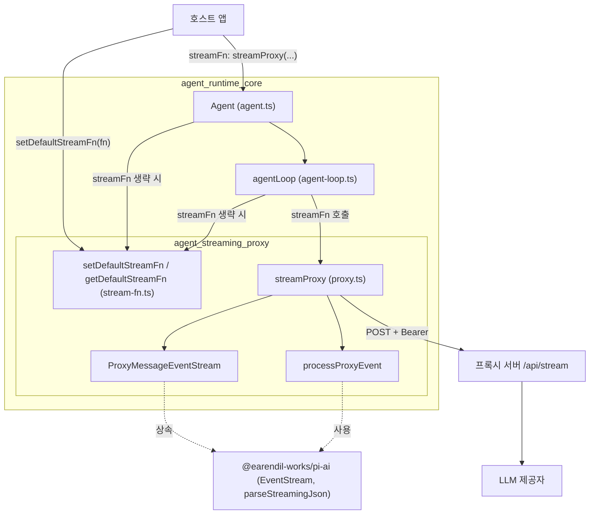
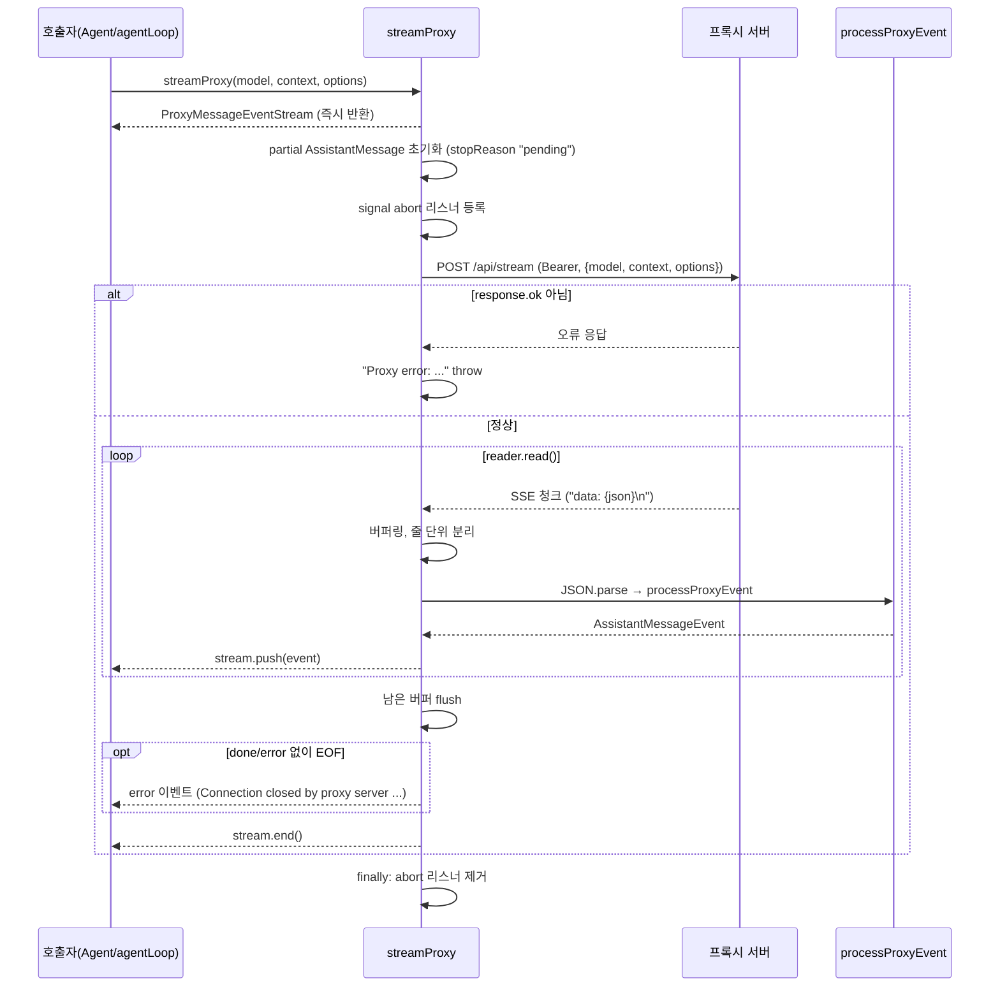
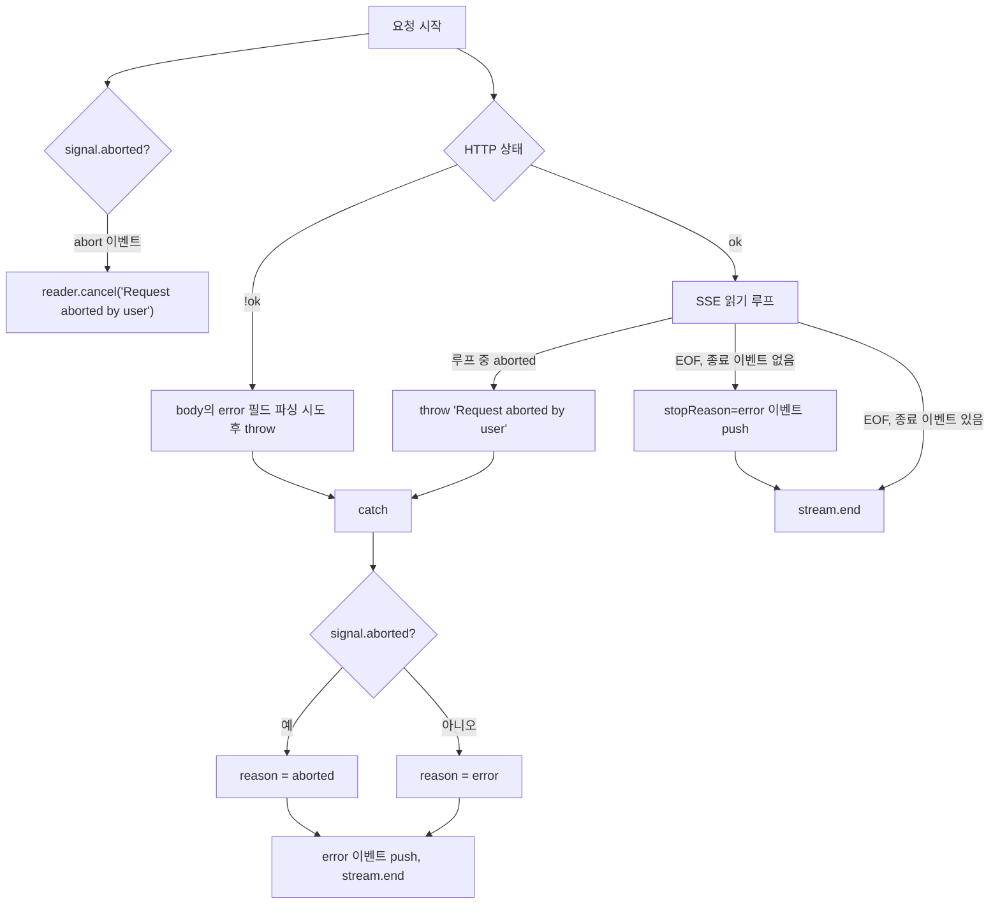

# agent_streaming_proxy 모듈

## 개요

`agent_streaming_proxy`는 `packages/agent`(pi-agent-core)에서 **LLM 호출 경로를 교체하는 두 가지 방법**을 제공한다.

| 구성요소 | 파일 | 역할 |
|---|---|---|
| `streamProxy` | `packages/agent/src/proxy.ts` | LLM 제공자를 직접 호출하지 않고, 인증과 제공자 호출을 담당하는 서버(`${proxyUrl}/api/stream`)로 요청을 보내고 SSE 응답을 `AssistantMessageEvent` 스트림으로 복원한다. |
| `setDefaultStreamFn` / `getDefaultStreamFn` | `packages/agent/src/stream-fn.ts` | `Agent`와 저수준 루프에서 호출자가 `streamFn`을 생략했을 때 쓰는 전역 기본 스트림 함수를 설정하고 조회한다. |

두 구성요소는 서로 직접 호출하지 않는다. 둘 다 `StreamFn`이라는 계약(`model, context, options` → 이벤트 스트림)에 맞물려 있다.
- `streamProxy`는 `StreamFn`의 한 구현이다.
- `setDefaultStreamFn`은 `StreamFn` 구현을 주입하는 자리다.

상위 모듈은 [agent_runtime_core](agent_runtime_core.md), 형제 모듈은 [agent_loop_and_state](agent_loop_and_state.md)다. 이벤트 스트림 기반 타입(`EventStream`, `AssistantMessageEvent`)은 [ai_runtime_utils](ai_runtime_utils.md)와 `@earendil-works/pi-ai` 쪽에 있다.

## 아키텍처



> 검증 수준: `streamProxy`와 `stream-fn.ts` 내부 동작은 코드 확인. `Agent`/`agentLoop`가 `getDefaultStreamFn`을 호출하는 정확한 위치는 이번에 제공된 코드에 없으므로 주석(“Agent and low-level loops”)에 근거한 것이며 **미확인**이다.

## 구성요소 상세

### 1. `setDefaultStreamFn` / `getDefaultStreamFn` (`stream-fn.ts`)

모듈 수준 변수 `defaultStreamFn` 하나를 보관한다.

- `setDefaultStreamFn(streamFn | undefined)`: 기본값을 설정하거나 `undefined`로 해제한다.
- `getDefaultStreamFn()`: 설정되어 있으면 반환하고, 없으면 다음 오류를 던진다.
  `No default stream function configured. Pass streamFn explicitly or call setDefaultStreamFn().`

설계 의도는 주석에 명시되어 있다. 기본 모델 런타임을 제공하는 호스트가 자신의 stream 함수를 여기에 설치하면, `pi-agent-core`가 제공자 카탈로그나 호환 계층에 의존하지 않아도 된다. 의존 방향을 역전시키는 작은 주입 지점이다.

주의점:
- 전역 상태라서 프로세스당 하나만 존재한다. 서로 다른 `Agent`가 다른 기본값을 쓰려면 `streamFn`을 명시해야 한다.
- 설정 전에 호출되면 빠르게 실패한다(조용한 폴백 없음).

### 2. `streamProxy` (`proxy.ts`)

```ts
streamProxy(model: Model<any>, context: TranscriptContext, options: ProxyStreamOptions): ProxyMessageEventStream
```

#### 입력

`ProxyStreamOptions`는 `SimpleStreamOptions`에서 직렬화 가능한 필드만 골라 확장한다.

- 직렬화되어 서버로 전송되는 필드: `temperature`, `samplingParams`, `maxTokens`, `reasoning`, `cacheRetention`, `sessionId`, `headers`, `metadata`, `transport`, `thinkingBudgets`, `maxRetryDelayMs` (`buildProxyRequestOptions`가 명시적으로 복사한다).
- 로컬 전용 필드: `signal`(`AbortSignal`), `authToken`, `proxyUrl`. 요청 본문에는 들어가지 않는다. `authToken`은 `Authorization: Bearer` 헤더로만 쓰인다.

요청 본문은 `{ model, context, options }`이다.

#### 출력

`ProxyMessageEventStream`은 `EventStream<AssistantMessageEvent, AssistantMessage>`를 상속한다. `done` 또는 `error` 이벤트가 종료 신호이고, 최종 결과는 각각 `event.message`, `event.error`이다.

함수는 스트림을 즉시 반환하고, 비동기 IIFE가 백그라운드에서 네트워크 읽기와 이벤트 push를 수행한다.

#### 프록시 이벤트와 `partial` 복원

서버는 대역폭을 줄이려고 델타 이벤트에서 `partial` 필드를 제거해서 보낸다(`ProxyAssistantMessageEvent`). 클라이언트는 `partial: AssistantMessage` 하나를 만들어 두고 `processProxyEvent`로 변경하면서 매 이벤트에 같은 객체를 붙여 `AssistantMessageEvent`로 되돌린다.

| 프록시 이벤트 | `partial` 변경 | 반환 이벤트 |
|---|---|---|
| `start` | 없음 | `start` |
| `text_start` / `thinking_start` | `content[idx]`에 빈 text/thinking 블록 생성 | 동일 이름 |
| `text_delta` / `thinking_delta` | 해당 블록 문자열에 delta 추가 | 동일 이름 (블록 타입이 다르면 `Error`) |
| `text_end` / `thinking_end` | `textSignature` / `thinkingSignature` 설정 | `content` 문자열 포함 |
| `toolcall_start` | `toolCall` 블록 생성 (`arguments: {}`, 임시 `partialJson`) | `toolcall_start` |
| `toolcall_delta` | `partialJson`에 누적, `parseStreamingJson`으로 `arguments` 갱신, 블록을 얕은 복사로 교체 | `toolcall_delta` |
| `toolcall_end` | 서버가 보낸 `toolCall`을 `Object.assign`, `partialJson` 삭제 | `toolcall_end` (블록이 `toolCall`이 아니면 `undefined`) |
| `done` | `stopReason`, `usage`, (선택) `providerThinkingLevel` 설정 | `done` |
| `error` | `stopReason`, `errorMessage`, `usage`, (선택) `providerThinkingLevel` 설정 | `error` |

`default` 분기는 `never` 검사로 새 이벤트 타입 추가 시 컴파일 오류가 나게 하고, 런타임에는 경고를 출력한 뒤 `undefined`를 반환한다(이벤트 무시).

#### 처리 흐름



#### 오류와 취소 처리



핵심 동작:
- **예외를 던지지 않고 스트림으로 보고한다.** 네트워크, HTTP, 파싱 오류는 모두 `partial.stopReason`과 `errorMessage`를 채운 `error` 이벤트가 되어 push된다. 소비자는 try/catch가 아니라 이벤트로 실패를 처리한다.
- **중도 단절 감지.** `done`/`error` 없이 깨끗하게 EOF가 오면 소비자가 영원히 기다리지 않도록 `"Connection closed by proxy server before the response completed"` 오류를 낸다.
- **마지막 줄 flush.** 마지막 이벤트가 개행으로 끝나지 않아도 `decoder.decode()` 후 남은 버퍼를 처리한다.
- **취소.** abort 시 `reader.cancel`을 호출하고, `finally`에서 리스너를 제거한다.
- **SSE 파싱은 최소 구현이다.** `data: ` 접두 줄만 처리하며, `event:`/`id:`/주석 줄과 다중 라인 `data:`는 무시한다. 서버가 한 줄 JSON을 보내는 것을 전제한다.

## 사용 방법

`streamFn`을 `Agent`에 직접 넘기는 방식(소스의 JSDoc 예시):

```typescript
const agent = new Agent({
  streamFn: (model, context, options) =>
    streamProxy(model, context, {
      ...options,
      authToken: await getAuthToken(),
      proxyUrl: "https://genai.example.com",
    }),
});
```

전역 기본값으로 설치하는 방식(호스트가 한 번 설정):

```typescript
setDefaultStreamFn(myHostStreamFn); // 이후 streamFn을 생략한 Agent/루프가 사용
```

## 서버 계약 요약

| 항목 | 값 |
|---|---|
| 엔드포인트 | `POST {proxyUrl}/api/stream` |
| 인증 | `Authorization: Bearer {authToken}` |
| 요청 본문 | `{ model, context, options }` (직렬화 가능 옵션만) |
| 응답 | SSE, `data: <ProxyAssistantMessageEvent JSON>` 줄 반복 |
| 종료 | `done` 또는 `error` 이벤트 (`reason`은 각각 `stop`/`length`/`toolUse`, `aborted`/`error`) |
| 오류 응답 | 비 2xx 시 JSON `{ error?: string }` 권장 |

서버 쪽 구현은 이 모듈에 없다. 서버가 보내는 `partial` 제거 포맷은 `ProxyAssistantMessageEvent` 타입이 곧 계약이다. 같은 이벤트 프레임을 다루는 유틸리티로는 [ai_runtime_utils](ai_runtime_utils.md)의 `AssistantMessageFrameEncoder`, `reduceAssistantMessageFrames`가 있으나, 이 모듈이 그것을 사용하는지는 **미확인**이다(`proxy.ts`는 자체 `processProxyEvent`를 쓴다).

## 의존성

- `@earendil-works/pi-ai`: `EventStream`, `parseStreamingJson`, 타입(`AssistantMessage`, `AssistantMessageEvent`, `Model`, `SimpleStreamOptions`, `StopReason`, `ToolCall`, `TranscriptContext`).
- `./types.ts`의 `StreamFn` 타입(`stream-fn.ts`). 정의는 [agent_loop_and_state](agent_loop_and_state.md) 계열 타입 파일에 있다.
- 전역 `fetch`, `TextDecoder`, `AbortSignal` (Node 18+ 및 브라우저 호환).

## 테스트·빌드 참고

`packages/agent/vitest.config.ts`가 이 패키지의 테스트 설정이다(자세한 내용은 [build_and_test_config](build_and_test_config.md)). 이 모듈 전용 테스트 파일의 존재 여부는 **미확인**이다.

## 유지보수 시 주의점

1. `ProxyAssistantMessageEvent`에 이벤트를 추가하면 `processProxyEvent`의 `never` 검사에서 컴파일 오류가 난다. 새 케이스를 반드시 추가한다.
2. `ProxySerializableStreamOptions`에 옵션을 추가하면 `buildProxyRequestOptions`에도 직접 복사 코드를 넣어야 한다. 누락되면 서버에 전달되지 않는다.
3. `toolcall_delta`는 `partialJson`을 `any` 캐스팅으로 임시 필드로 저장하고, `toolcall_end`에서 삭제한다. 도중에 오류가 나면 `partialJson`이 남은 블록이 `partial`에 있을 수 있다.
4. `toolcall_end`는 대응하는 `toolCall` 블록이 없으면 다른 케이스와 달리 예외 대신 이벤트를 조용히 버린다.
5. `headers`가 요청 옵션에 포함되어 서버로 전송된다. 민감 헤더를 넘길 때는 서버를 신뢰할 수 있는지 확인한다(추론).
