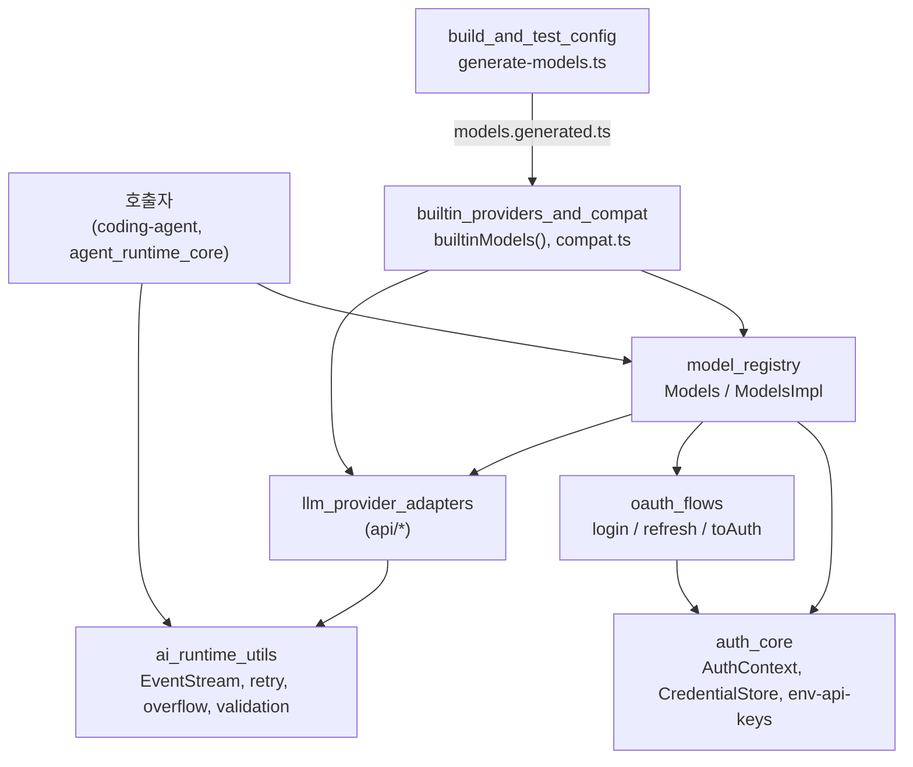
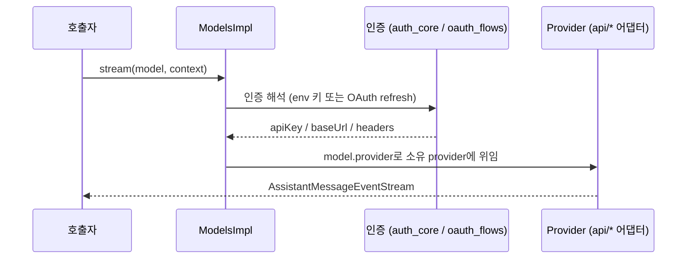

# ai_platform_foundation 개요

## 목적

`ai_platform_foundation`은 `packages/ai`(LLM 추상화 계층)의 **기반 인프라**를 묶은 모듈이다. 구성은 다음과 같다.
- 인증: 자격 증명 저장소, 환경변수 탐색, OAuth 로그인·갱신
- 모델 레지스트리: provider와 모델 카탈로그 관리, 요청 위임
- 내장 provider 조립: faux provider, 레거시 `compat` 진입점
- 공통 런타임 유틸리티: 스트림, 재시도, 오버플로 감지, 인자 검증
- 빌드·테스트 설정: vitest 설정, 모델 카탈로그 생성 스크립트

실제 API 호출은 상위 의존 모듈인 `llm_provider_adapters`(`packages/ai/src/api`)가 담당한다. 이 모듈은 어댑터가 쓰는 provider·모델·인증·유틸 계층을 제공한다.

> 검증 수준: 아래 내용은 하위 모듈 문서(CodeWiki 산출물, 분석 후보)를 근거로 정리했다. 코드 직접 검증은 각 문서에 명시된 범위에 한정되며, 소비자 관계는 일부 `추론`이다.

## 아키텍처

### 대표 요청 흐름

## 하위 모듈

| 모듈 | 경로 | 요약 | 문서 |
|---|---|---|---|
| `auth_core` | `packages/ai/src/auth` | `defaultProviderAuthContext`, `InMemoryCredentialStore`, provider별 환경변수 매핑. Node 내장 모듈은 동적 import로만 로드해 브라우저 번들과 호환 | [auth_core.md](auth_core.md) |
| `oauth_flows` | `packages/ai/src/auth/oauth` | Anthropic, Codex, ChatGPT, Copilot, OpenRouter 등의 PKCE·device code 로그인, 갱신, `toAuth` 변환. `load.ts`로 지연 로딩 | [oauth_flows.md](oauth_flows.md) |
| `model_registry` | `packages/ai/src` | `Models`/`Provider` 인터페이스, `ModelsStore`, 모델 타입 체계(chat/image/classifier), 카탈로그 평탄화 | [model_registry.md](model_registry.md) |
| `builtin_providers_and_compat` | `packages/ai/src/providers` | `builtinProviders()`/`builtinModels()`, 테스트용 faux provider, 전역 registry 기반 `compat.ts`, 로그인 CLI | [builtin_providers_and_compat.md](builtin_providers_and_compat.md) |
| `ai_runtime_utils` | `packages/ai/src/utils` | `EventStream`, `combineAbortSignals`, `retryAssistantCall`, `isContextOverflow`, `validateToolCall`, 세션 리소스 정리 | [ai_runtime_utils.md](ai_runtime_utils.md) |
| `build_and_test_config` | `packages` | 세 패키지의 vitest 설정과 `generate-models.ts`. 외부 카탈로그를 수집해 `models.generated.ts` 생성 | [build_and_test_config.md](build_and_test_config.md) |

## 핵심 설계 포인트

- **책임 분리**: `Provider`는 요청 동작을, `Models`는 provider 모음과 인증 적용을, `ModelsStore`는 동적 카탈로그 캐시를 맡는다.
- **번들 호환성**: Node 전용 코드(`node:fs`, `node:http`)는 변수 specifier 동적 import로 숨기고, Bun 단독 바이너리에서는 `registerBunOAuthFlows()`가 정적 import로 대체한다.
- **생성 데이터**: `models.generated.ts`는 직접 수정하지 않는다. `generate-models.ts`를 고쳐 재생성한다(레포 `AGENTS.md` 규칙).
- **전환기 계층**: `compat.ts`는 coding-agent의 ModelManager 마이그레이션 후 삭제 예정인 임시 진입점이다(주석 기준).

## 관련 모듈

- [llm_provider_adapters](llm_provider_adapters.md): 실제 API 구현
- [agent_runtime_core](agent_runtime_core.md): 유틸리티를 소비하는 에이전트 루프(`추론`)
- [model_and_auth_management](model_and_auth_management.md): 영속 `CredentialStore`를 주입하는 coding-agent 측 계층