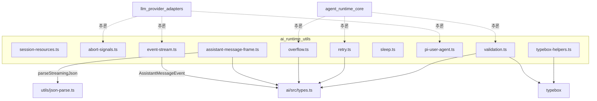
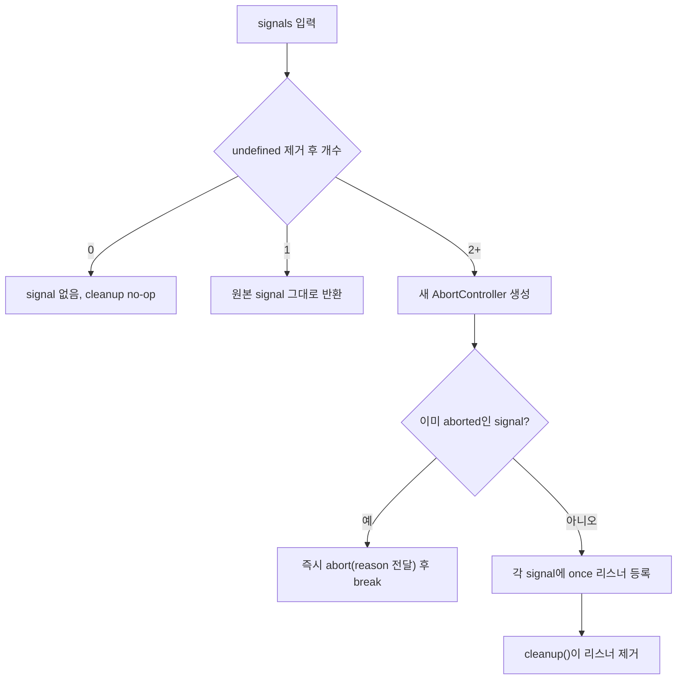
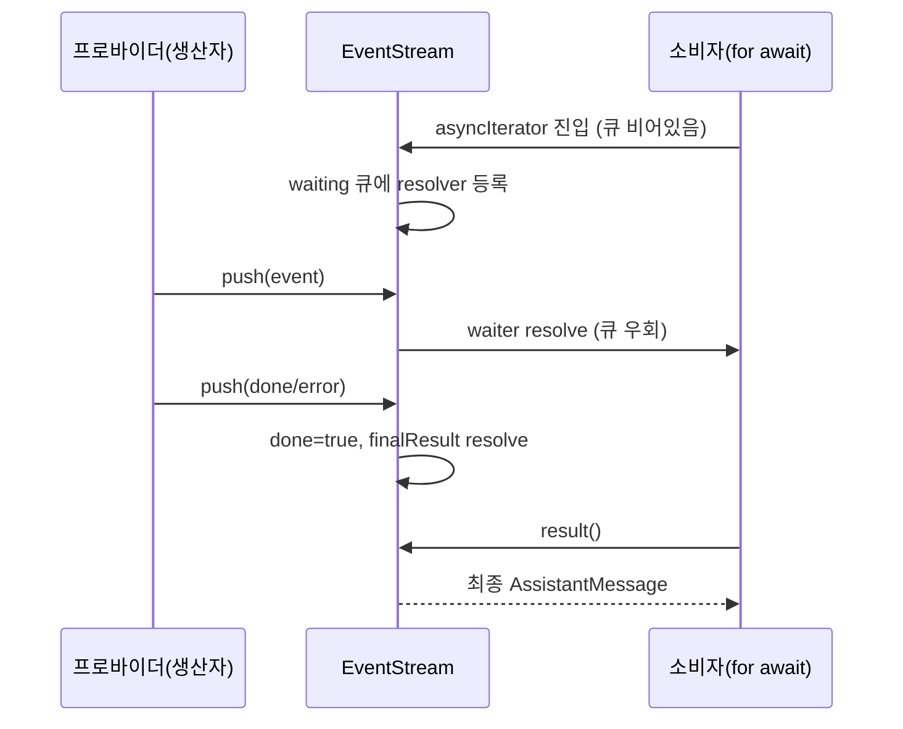
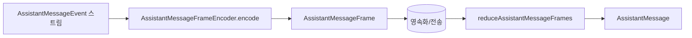
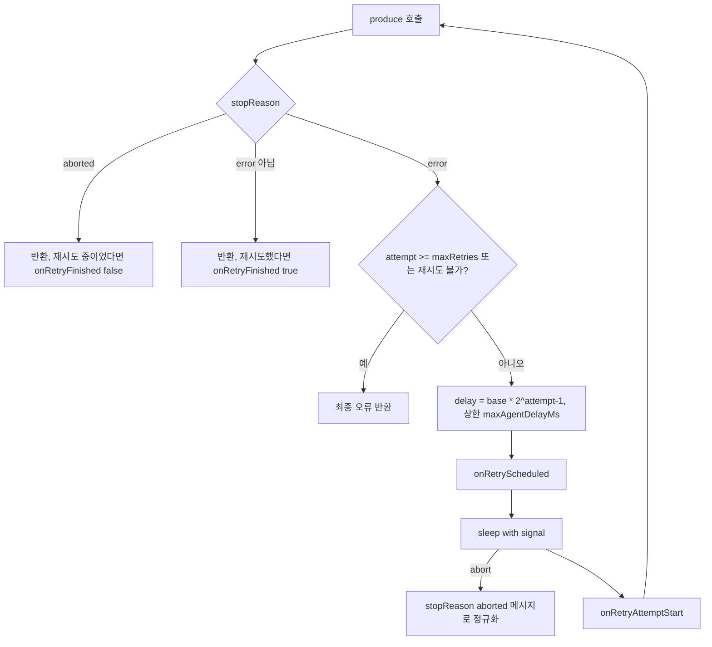
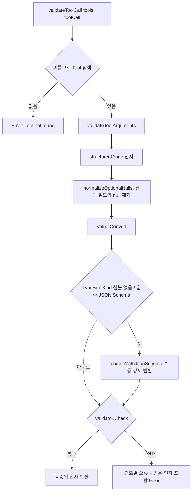

# ai_runtime_utils 모듈

`ai_runtime_utils`는 `packages/ai`가 공통으로 사용하는 **런타임 유틸리티 모음**이다. 취소 신호 결합, 비동기 이벤트 스트림, 어시스턴트 메시지의 압축 프레임 인코딩/재생, 컨텍스트 오버플로 감지, 재시도 정책, 툴 호출 인자 검증, 세션 리소스 정리 같은 "프로바이더에 독립적인 작은 부품"을 제공한다.

상위 모듈은 [ai_platform_foundation](ai_platform_foundation.md)이며, 프로바이더 어댑터([llm_provider_adapters](llm_provider_adapters.md))와 에이전트 루프([agent_runtime_core](agent_runtime_core.md))가 이 유틸리티를 소비한다.

> 검증 수준: 아래 내용은 제공된 소스 코드를 직접 읽고 작성했다(코드 확인). 호출 주체(소비자)에 대한 서술은 모듈 트리 기반 추론이며 `추론`으로 표시한다.

## 구성 요소 개요

| 파일 | 핵심 심볼 | 역할 |
|---|---|---|
| `packages/ai/src/session-resources.ts` | `registerSessionResourceCleanup`, `cleanupSessionResources` | 세션 종료 시 호출될 정리 콜백 레지스트리 |
| `packages/ai/src/utils/abort-signals.ts` | `combineAbortSignals` | 여러 `AbortSignal`을 하나로 결합 |
| `packages/ai/src/utils/event-stream.ts` | `FifoQueue`, `EventStream`, `AssistantMessageEventStream` | 푸시 기반 비동기 이터러블 |
| `packages/ai/src/utils/assistant-message-frame.ts` | `AssistantMessageFrameEncoder`, `reduceAssistantMessageFrames` | 스트리밍 이벤트 ↔ 압축 프레임 변환 |
| `packages/ai/src/utils/overflow.ts` | `isContextOverflow`, `isRecoverableLength`, `getOverflowPatterns` | 컨텍스트 윈도 초과 감지 |
| `packages/ai/src/utils/retry.ts` | `retryAssistantCall`, `isRetryableAssistantError`, `retryDelayMs`, `buildProviderErrorPattern` | 일시적 오류 분류 + 지수 백오프 재시도 |
| `packages/ai/src/utils/sleep.ts` | `sleep` | 취소 가능한 sleep |
| `packages/ai/src/utils/pi-user-agent.ts` | `loadNodeOs`, `getPiUserAgent` | 브라우저 안전한 User-Agent 문자열 |
| `packages/ai/src/utils/typebox-helpers.ts` | `StringEnum` | Google 등 호환 문자열 enum 스키마 |
| `packages/ai/src/utils/validation.ts` | `validateToolCall`, `validateToolArguments` | TypeBox 기반 툴 인자 검증 및 강제 변환 |

## 아키텍처

타입(`AssistantMessage`, `AssistantMessageEvent`, `Tool`, `ToolCall` 등)은 [model_registry](model_registry.md)가 속한 `packages/ai/src/types.ts`에서 가져온다.

## 컴포넌트 상세

### session-resources.ts: 세션 리소스 정리

모듈 전역 `Set<SessionResourceCleanup>`에 콜백을 등록한다. `registerSessionResourceCleanup(cleanup)`은 **등록 해제 함수**를 돌려준다. `cleanupSessionResources(sessionId?)`는 모든 콜백을 실행하며, 하나가 throw해도 나머지를 계속 실행하고 마지막에 `AggregateError`로 모아 던진다.

예: WebSocket 세션 풀 같은 프로바이더 리소스가 자기 정리 함수를 등록해 두면, 세션 종료 시 한 번의 호출로 모두 닫힌다(추론: `openai-codex-responses.ts`의 `closeOpenAICodexWebSocketSessions`가 대표 후보).

### abort-signals.ts: `combineAbortSignals`

- 반환값 `{ signal?, cleanup }`. 호출자는 작업이 끝나면 반드시 `cleanup()`을 호출해 장수명 signal에 리스너가 쌓이지 않게 해야 한다.
- 먼저 abort된 signal의 `reason`이 결과 signal에 전파된다.

### event-stream.ts: `EventStream`

`FifoQueue`는 두 개의 배열(incoming/outgoing)로 구현한 amortized O(1) 큐다. `enqueue`는 incoming에 push하고, `dequeue`는 outgoing이 비었을 때만 뒤집어 옮긴다. `length`는 두 배열 길이의 합이다.

`EventStream<T, R>`은 생산자가 `push`, 소비자가 `for await`로 읽는 구조다.

- `isComplete(event)`가 true인 이벤트가 오면 `done`이 되고 `result()` Promise가 `extractResult`로 해결된다. 이후 `push`는 무시된다.
- `end(result?)`는 대기 중인 모든 소비자에게 종료를 알린다.
- `AssistantMessageEventStream`은 `done`이면 `event.message`, `error`이면 `event.error`를 결과로 쓴다. `createAssistantMessageEventStream()`은 확장(extension)용 팩토리다.
- 주의: `result()`는 오류도 reject가 아닌 `AssistantMessage`(stopReason `error`)로 해결한다.

### assistant-message-frame.ts: 압축 프레임

스트리밍 이벤트는 `partial`(공유 누적 객체)을 매번 포함하므로 그대로 저장하면 크다. 이 파일은 이를 **재생 가능한 작은 프레임**(`AssistantMessageFrame`)으로 줄이고 다시 복원한다. 종료 이벤트(`done`/`error`)는 프레임에서 제외되며 별도로 저장해야 한다.

프레임 종류: `start`, `text_*`, `thinking_*`, `toolcall_start / checkpoint / delta / end`.

**Encoder (상태 기계)**
- `started`/`terminal` 플래그와 `blocks: Map<contentIndex, state>`를 유지한다. 순서 위반(start 전 이벤트, terminal 이후 이벤트, 중복 start, 타입 불일치 블록)은 모두 `Error`다.
- **텍스트/생각 델타 중복 제거**: `partial`이 공유 누적기라서 오래된 큐 이벤트를 소비할 때 이미 보이는 글자가 있을 수 있다. 블록 시작 시점의 `coveredChars`와 누적 `deltaChars`를 비교해 이미 덮인 부분은 잘라내고 새로운 부분만 `delta`로 내보낸다.
- **툴 호출 catch-up**: `toolcall_start` 시점의 인자 스냅샷이 빈 값(`EMPTY_PARSED_TOOL_ARGUMENTS`)이 아니면 `caughtUp=false`로 시작한다. 델타 JSON을 누적해 파싱한 결과가 스냅샷과 같거나(`isJsonPrefix`로 확장 관계) 이어지면 그때까지의 JSON을 하나의 `toolcall_checkpoint` 프레임으로 내보내고, 이후 델타는 그대로 통과시킨다. 아직 일치하지 않으면 `undefined`(프레임 없음)를 반환한다.
- `start` 프레임은 `cloneStartMessage`로 `content: []`, `stopReason: "pending"`인 빈 메시지만 담는다.

**Reducer**
- `reduceAssistantMessageFrames(frames)`는 프레임을 불변으로 읽어 `AssistantMessage`를 재구성한다. start 프레임이 없으면 `undefined`.
- `appendBlock`이 `contentIndex`가 현재 길이와 정확히 같을 때만 블록 추가를 허용해 gap/중복을 막는다. `*_end` 프레임은 최종 `content`와 서명(signature)으로 덮어쓴다.
- 종료되지 않은 툴 호출은 누적 JSON을 `parseStreamingJson`으로 파싱해 인자를 채운다(부분 복구).

### overflow.ts: 컨텍스트 오버플로 감지

- `OVERFLOW_PATTERNS`: Anthropic, OpenAI, Google, xAI, Groq, OpenRouter, Mistral, llama.cpp 등 프로바이더별 오류 문구 정규식 목록. `getOverflowPatterns()`는 테스트용 복사본을 반환한다.
- `NON_OVERFLOW_PATTERNS`(throttling, rate limit, too many requests)에 걸리면 제외한다. 예: Bedrock의 `Too many tokens, please wait` 는 일반 패턴과 겹치므로 먼저 걸러낸다.
- `isContextOverflow(message, contextWindow?)` 세 가지 경로:
  1. `stopReason === "error"` + 오류 메시지 패턴(Cerebras는 본문 없는 400/413 별도 처리)
  2. 조용한 오버플로(z.ai): `stop`인데 `usage.input + cacheRead > contextWindow`
  3. 길이 정지(Xiaomi MiMo): `length` + `output === 0` + 입력이 윈도의 99% 이상
- `isRecoverableLength(message, desiredMaxOutput)`: `length`로 끝났고 출력이 원래 의도한 한도보다 작으면 compact 후 1회 재시도 후보로 본다.

### retry.ts: 오류 분류와 재시도

- `isRetryableAssistantError(message)`: `stopReason === "error"`이고 메시지가 있어야 한다. `NON_RETRYABLE_PROVIDER_LIMIT_ERROR_PATTERN`(quota, billing, 구독 한도 등)에 걸리면 즉시 false, 그다음 `RETRYABLE_PROVIDER_ERROR_PATTERN`(과부하, 429/5xx, 네트워크, 스트림 조기 종료, WebSocket 오류 등)과 비교한다. 두 패턴은 `buildProviderErrorPattern`이 문자열 배열을 `|`로 합쳐 대소문자 무시 정규식으로 만든다.
- `RetryPolicy`: `enabled`, `maxRetries`, `baseDelayMs`, `maxAgentDelayMs?`(기본 `DEFAULT_MAX_AGENT_RETRY_DELAY_MS` = 60초). `retryDelayMs`는 지수 증가 + 안전 정수 클램프 + 상한 적용이다(지터는 이 함수에 없다. 문서 주석의 "before jitter"는 호출자 측 가정으로 보인다. 추론).
- 정책이 없거나 비활성이면 `produce()` 결과를 그대로 반환한다. 컨텍스트 오버플로는 호출자가 먼저 별도로 처리해야 한다.
- 주의: `retry.ts`에는 **파일 내부 전용 `sleep`**(abort 시 `RetrySleepAbortError`로 reject)이 있고, `sleep.ts`의 공개 `sleep`과는 별개다.

### sleep.ts

`sleep(ms, signal)`은 `signal.throwIfAborted()`로 시작해 타이머를 걸고, abort 시 타이머를 지우며 `signal.reason`으로 reject한다. 정상 종료 시 리스너를 제거한다. `signal`이 필수 인자라는 점이 `retry.ts`의 내부 버전과 다르다.

### pi-user-agent.ts

`loadNodeOs()`는 Node/Bun 환경에서만 `process.getBuiltinModule("node:os")`로 OS 모듈을 가져온다. 최상위 `import "node:os"`는 브라우저/Vite 빌드를 깨기 때문이다. `getPiUserAgent()`는 `pi (<platform> <release>; <arch>)` 또는 `pi (browser)`를 반환한다. [cli_entry_and_config](cli_entry_and_config.md)에 `packages/coding-agent/src/utils/pi-user-agent.ts`의 별도 구현이 있다(동명이지만 다른 파일).

### typebox-helpers.ts: `StringEnum`

`anyOf`/`const`를 지원하지 않는 프로바이더(Google 등)를 위해 `{ type: "string", enum: [...] }` 형태의 `Type.Unsafe` 스키마를 만든다. `description`, `default` 옵션을 받는다. 정적 타입은 `T[number]` 유니온이 된다.

### validation.ts: 툴 인자 검증

- `validatorCache`(WeakMap)가 스키마 객체별로 `Compile` 결과를 캐시한다.
- LLM이 자주 내는 형 오류를 관대하게 교정한다: 문자열 `"5"`→숫자, `"true"`→불린, `null`→기본 빈 값, 선택 필드의 `null` 삭제(스키마가 null을 허용하지 않을 때만). `anyOf/oneOf`는 먼저 그대로 통과하는 후보를 찾고, 없으면 복제본을 강제 변환해 통과하는 후보를 쓴다.
- 실패 메시지는 `formatValidationPath`로 `a.b.c: message` 형태이며, `required`는 누락된 속성명까지 경로에 붙인다.
- 원본 `toolCall.arguments`는 변경하지 않는다(`structuredClone`).

## 제약과 주의점

- `session-resources.ts`의 레지스트리는 모듈 전역이므로 테스트 간 상태가 공유된다. 반드시 반환된 해제 함수를 호출해야 한다.
- `combineAbortSignals`의 `cleanup()` 누락은 리스너 누수로 이어진다.
- `EventStream`은 단일 소비자를 전제로 한다고 보는 것이 안전하다(여러 소비자는 같은 큐를 나눠 가진다. 코드 확인).
- `AssistantMessageFrameEncoder`는 스트림 하나당 인스턴스 하나를 써야 한다(상태 보유).
- 오버플로/재시도 패턴은 문자열 매칭이므로 새 프로바이더 추가 시 `OVERFLOW_PATTERNS` 또는 재시도 패턴 목록을 갱신해야 한다. 사용자 정의 모델은 감지되지 않을 수 있다.

## 테스트 구성

`packages/ai/vitest.config.ts`: `globals: true`, `environment: "node"`, `testTimeout: 30000`(API 호출용), CI(`GITHUB_ACTIONS`)에서는 `["dot", "github-actions"]` 리포터, `silent: "passed-only"`. `@earendil-works/pi-telemetry`를 `../telemetry/src/index.ts`로 alias한다. 관련 빌드/테스트 설정은 [build_and_test_config](build_and_test_config.md)를 참고.

## 관련 모듈

- [ai_platform_foundation](ai_platform_foundation.md): 상위 모듈
- [llm_provider_adapters](llm_provider_adapters.md): 스트림/UA/취소 유틸리티의 주요 소비자(추론)
- [agent_runtime_core](agent_runtime_core.md): 툴 검증, 재시도, 오버플로 처리 소비자(추론)
- [model_registry](model_registry.md): 공용 타입 정의
