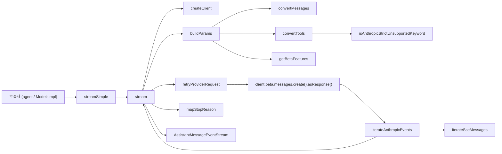
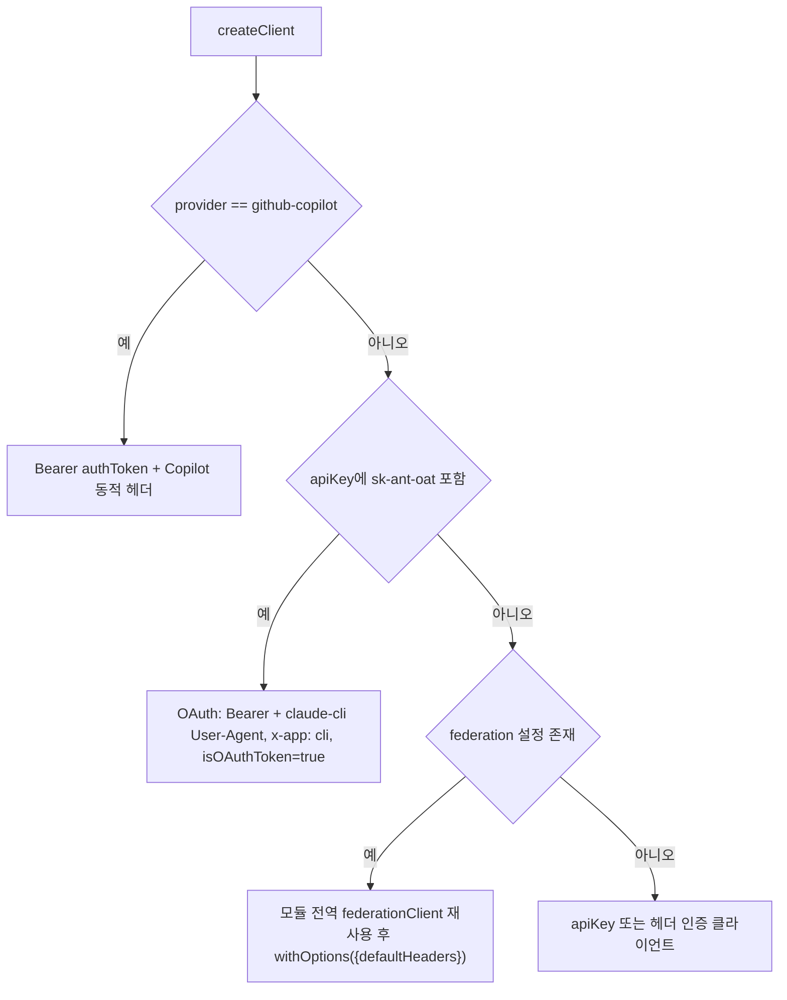
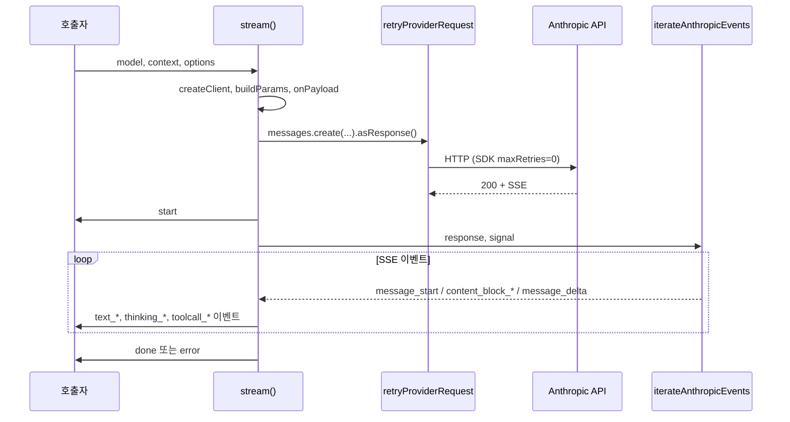

# anthropic_provider_api

`packages/ai/src/api/anthropic-messages.ts` 하나로 구성된 모듈이다. 내부 공통 메시지/도구/옵션 모델(`Model<"anthropic-messages">`, `TranscriptContext`, `StreamOptions`)을 Anthropic Messages API(beta) 요청으로 변환한다. 응답 SSE 스트림은 다시 `AssistantMessageEventStream` 이벤트로 바꿔 내보낸다. 상위 그룹은 [llm_provider_adapters](llm_provider_adapters.md)이고, 형제 어댑터는 [openai_provider_apis](openai_provider_apis.md), [bedrock_provider_api](bedrock_provider_api.md), [google_provider_apis](google_provider_apis.md) 등이다.

> 검증 수준: 아래 내용은 제공된 `anthropic-messages.ts` 소스를 직접 읽고 정리한 것이다(코드 확인). 다른 모듈과의 연결 설명은 import 구문에 근거한 것이며, 호출 주체는 이 문서에서 확인하지 않았다(미확인).

## 1. 핵심 컴포넌트

| 컴포넌트 | 역할 |
|---|---|
| `stream` / `streamSimple` | 공개 진입점. `streamSimple`은 `reasoning` 레벨을 effort 또는 thinking budget으로 매핑한 뒤 `stream`을 호출한다. |
| `createClient` | 인증 방식별 Anthropic SDK 클라이언트 생성 (Copilot / OAuth / API key·헤더 인증 / workload identity federation). |
| `PiAnthropic._shouldResolveDefaultCredentials` | `false`를 반환해 SDK 자체 credential chain(`ANTHROPIC_PROFILE`, federation env)이 pi의 auth resolver 뒤에서 돌지 못하게 막는다. |
| `buildParams` | `MessageCreateParamsStreaming` 조립: system, messages, tools, thinking, betas, fallbacks 등. |
| `convertMessages` / `convertTools` | 내부 메시지·도구를 Anthropic 블록/`BetaTool`로 변환. |
| `isAnthropicStrictUnsupportedKeyword` | strict tool use가 400으로 거부하는 JSON Schema 키워드 판별기. |
| `iterateAnthropicEvents` | `Response` 본문을 직접 SSE 파싱해 `RawMessageStreamEvent`를 yield. |
| `mapStopReason` | Anthropic `stop_reason`을 내부 `StopReason`으로 매핑. |
| `fromClaudeCodeName` | OAuth 모드에서 Claude Code 표준 대소문자 도구명을 원래 도구명으로 복원. |

## 2. 아키텍처

주요 외부 의존성:

- `@anthropic-ai/sdk` beta messages 타입과 클라이언트.
- `../env-api-keys.ts`의 `ANTHROPIC_*` federation 환경변수 이름 상수, `../models.ts`의 `calculateCost`.
- `../utils/*`: `retryProviderRequest`, `parseJsonWithRepair`, `parseStreamingJson`, `sanitizeSurrogates`, `transcript`(`resolveTranscript`, `getCurrentTools` 등), `AssistantMessageEventStream`. 자세한 내용은 [ai_runtime_utils](ai_runtime_utils.md) 참고.
- `./simple-options.ts`, `./transform-messages.ts`, `./constrained-sampling.ts`, `./github-copilot-headers.ts`.
- 인증 키 해석은 [auth_core](auth_core.md), [oauth_flows](oauth_flows.md)가 담당한다. 이 모듈은 이미 해석된 `apiKey`와 `headers`만 받는다.

## 3. 인증과 클라이언트 생성

`createClient`의 분기 순서는 다음과 같다.

- **OAuth 모드**(`isOAuthToken=true`): Claude Code로 위장한다. beta에 `claude-code-20250219`, `oauth-2025-04-20`을 추가하고, system 첫 블록에 `"You are Claude Code, Anthropic's official CLI for Claude."`를 넣는다. 도구명은 `toClaudeCodeName`으로 표준 casing으로 보내고, 응답의 `tool_use` 이름은 `fromClaudeCodeName(name, currentTools)`로 되돌린다.
- **Federation**: provider가 `anthropic`이고 key/auth 헤더가 없으며 `ANTHROPIC_FEDERATION_RULE_ID`, `ANTHROPIC_ORGANIZATION_ID`, `ANTHROPIC_IDENTITY_TOKEN_FILE`이 모두 있을 때만 활성화된다. SDK의 토큰 캐시를 공유하려고 `[baseUrl, federation]`을 키로 클라이언트 하나를 유지하고 요청마다 `withOptions()`로 복제한다.
- `options.client`가 주어지면 내부 생성을 건너뛴다(예: `AnthropicVertex`). 이 경우 `isOAuth=false`이다.
- 인증이 전혀 없으면(`apiKey`, `authorization`, `x-api-key`, `cf-aig-authorization` 헤더 모두 없음) `No API key for provider: ...` 오류를 던진다.
- OpenRouter류는 `sendSessionAffinityHeaders`에 따라 `x-session-id` 또는 `x-session-affinity` 헤더를 붙인다.

## 4. 요청 빌드 (`buildParams`)

1. **캐시**: `resolveCacheRetention`은 옵션, 그다음 `PI_CACHE_RETENTION=long`, 기본 `short` 순이다. `none`이면 `cache_control`을 생략한다. `long`이고 `supportsLongCacheRetention`이면 TTL `1h`를 붙인다. 마지막 user/system 메시지의 마지막 블록과 마지막 도구에 breakpoint를 둔다.
2. **System**: 초기 system 메시지만 `params.system`으로 간다. 이후의 system 메시지는 `supportsMidConvoSystemMessages`가 켜진 모델에서만 네이티브로 전달된다. 이때 `tool_result`가 `tool_use` 바로 뒤에 와야 하는 제약 때문에 다음 assistant 메시지 직전에 flush한다.
3. **Thinking**
   - `supportsMidConvoEffort`: 항상 `adaptive` + `block_binding.prefix_mismatch_behavior = "drop_block"`이고, effort는 system 메시지(`output_config`)로 삽입한다(`insertThinkingLevelMessages`).
   - `forceAdaptiveThinking`: `thinking: adaptive` + `output_config.effort`를 쓴다.
   - 그 외 reasoning 모델: `enabled` + `budget_tokens`(기본 1024). `thinkingEnabled === false`이면 `disabled`로 보낸다.
   - `thinkingDisplay` 기본값은 `summarized`이다.
   - `temperature`는 thinking 사용 중이거나 `supportsTemperature=false`, managed effort 모델에서는 보내지 않는다.
4. **Tools**: 일반 경로는 `getCurrentTools` 결과를 변환한다. *Native tool changes* 경로(`supportsMidConvoSystemMessages && supportsMidConvoToolChanges`, 초기 도구가 있고 재정의가 없을 때)에서는 초기 도구는 active로 두고, 이후 도구는 `defer_loading: true`로 선언한다. 변경은 `tool_addition`/`tool_removal` 블록으로 전달하고, 캐시 prefix 유지를 위해 `DEFERRED_TOOL_PLACEHOLDER`를 항상 선언한다.
5. **Strict tools**: `resolveJsonSchemaStrictSampling`이 `isAnthropicStrictUnsupportedKeyword`로 스키마를 검사한다. 이 판별기는 `minimum`, `maximum`, `multipleOf`, `maxItems` 등과 `minItems`(0/1 외), 지원 목록 밖의 `format`을 거부 대상으로 본다.
6. **Beta 헤더** (`getBetaFeatures`): `anthropic-beta` 헤더가 설정돼 있으면 그 값이 전부 우선한다(`null`이면 beta 없음). 없으면 OAuth, fine-grained tool streaming, interleaved thinking(비 adaptive 모델), server-side fallback, mid-conversation effort/tool changes beta를 조건부로 추가한다.
7. **기타**: `metadata.user_id`, `tool_choice`, `fallbacks`(`allowedFallbackModels`)를 매핑한다.

### 메시지 변환 규칙 (`convertMessages`)

- 모든 텍스트는 `sanitizeSurrogates`를 거치고, 빈 텍스트 블록은 제거한다.
- 이미지만 있는 tool result에는 `(see attached image)` 텍스트를 앞에 추가한다.
- thinking: `redacted`는 `redacted_thinking`으로 보낸다. 서명이 없으면(중단된 스트림 등) 일반 text로 강등한다. 단 `allowEmptySignature` 모델은 빈 서명으로 유지한다.
- 연속된 `toolResult` 메시지는 하나의 user 메시지로 합친다(z.ai 호환).
- tool call ID는 `normalizeToolCallId`로 `[a-zA-Z0-9_-]`, 최대 64자로 정규화한다.

## 5. 스트리밍 처리 흐름

- 재시도는 SDK가 아니라 `retryProviderRequest`가 수행한다(SDK `maxRetries: 0`).
- SDK 스트림 래퍼를 쓰지 않고 `asResponse()`로 받은 본문을 `iterateSseMessages`가 직접 디코딩한다(CR/LF/CRLF 처리). 이벤트는 6개 message 이벤트만 통과시키고 `error` 이벤트는 예외로 던진다. JSON은 `parseJsonWithRepair`로 파싱한다. `message_start`만 있고 `message_stop`이 없으면 `Anthropic stream ended before message_stop` 오류를 낸다.
- **usage**: `message_start`에서 입력/캐시 토큰을 먼저 잡아 중단 시에도 입력 토큰을 보존한다. `message_delta`에서는 null이 아닌 필드만 덮어쓴다. `totalTokens`는 직접 계산하고, `thinking_tokens`는 `usage.reasoning`에 넣는다. 비용은 `calculateCost`로 계산하며, fallback 모델이 응답하면 `allowedFallbackModels[].cost`를 적용한다.
- **블록 조립**: 블록은 SSE `index`로 매칭한다. 도구 인자는 `partialJson` 스크래치 버퍼에 누적하고 `parseStreamingJson`으로 점진 파싱한다. `content_block_stop`에서 `index`와 `partialJson`을 제거해 저장·재생 시 파싱된 인자만 남긴다. `fallback` 블록은 출력이 이미 시작됐다면 오류로 처리한다.
- **종료/오류**: 중단되면 `stopReason: "aborted"`, 그 외 오류는 `"error"`이다. 두 경우 모두 `error` 이벤트를 push한 뒤 스트림을 닫는다. 서버가 `input_transformations`를 보냈으면 `appendAssistantMessageDiagnostic`으로 진단 정보를 남긴다.

### `mapStopReason`

| Anthropic | 내부 |
|---|---|
| `end_turn`, `pause_turn`, `stop_sequence` | `stop` |
| `max_tokens` | `length` |
| `tool_use` | `toolUse` |
| `refusal` | `error` (`stop_details.explanation` 사용) |
| `sensitive` | `error` |
| 그 외 | 예외 `Unhandled stop reason` |

## 6. `streamSimple` 의 reasoning 매핑

- `reasoning` 없음: `thinkingEnabled: false`.
- `forceAdaptiveThinking`: `mapThinkingLevelToEffort`로 effort를 정한다. `model.thinkingLevelMap`이 우선이고, 없으면 minimal/low는 `low`, 그 외는 medium/high를 그대로 쓰며 기본은 `high`이다.
- 그 외: `adjustMaxTokensForThinking`과 `clampMaxTokensToContext`로 `maxTokens`를 정하고 `thinkingBudgetTokens = min(budget, max(0, maxTokens - 1024))`로 둔다.

## 7. 확장 및 주의 지점

- 모델별 동작 차이는 전부 `model.compat` 플래그(`getAnthropicCompat`)로 제어한다. 기본값 변경은 모델 카탈로그([model_registry](model_registry.md), `generate-models.ts`는 [build_and_test_config](build_and_test_config.md))와 함께 봐야 한다.
- `claudeCodeVersion`(`2.1.280`)과 `claudeCodeTools` 목록은 하드코딩이다. Claude Code 변경 시 수동 갱신이 필요하다.
- 모듈 전역 `federationClient`는 단일 슬롯 캐시라 설정이 번갈아 바뀌면 클라이언트를 재생성한다(코드 확인).
- 테스트 설정은 `packages/ai/vitest.config.ts`에 있다(내용은 이 문서에서 확인하지 않았다).
