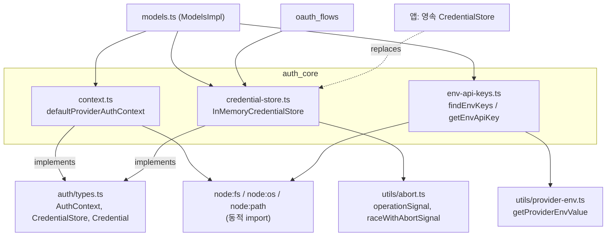
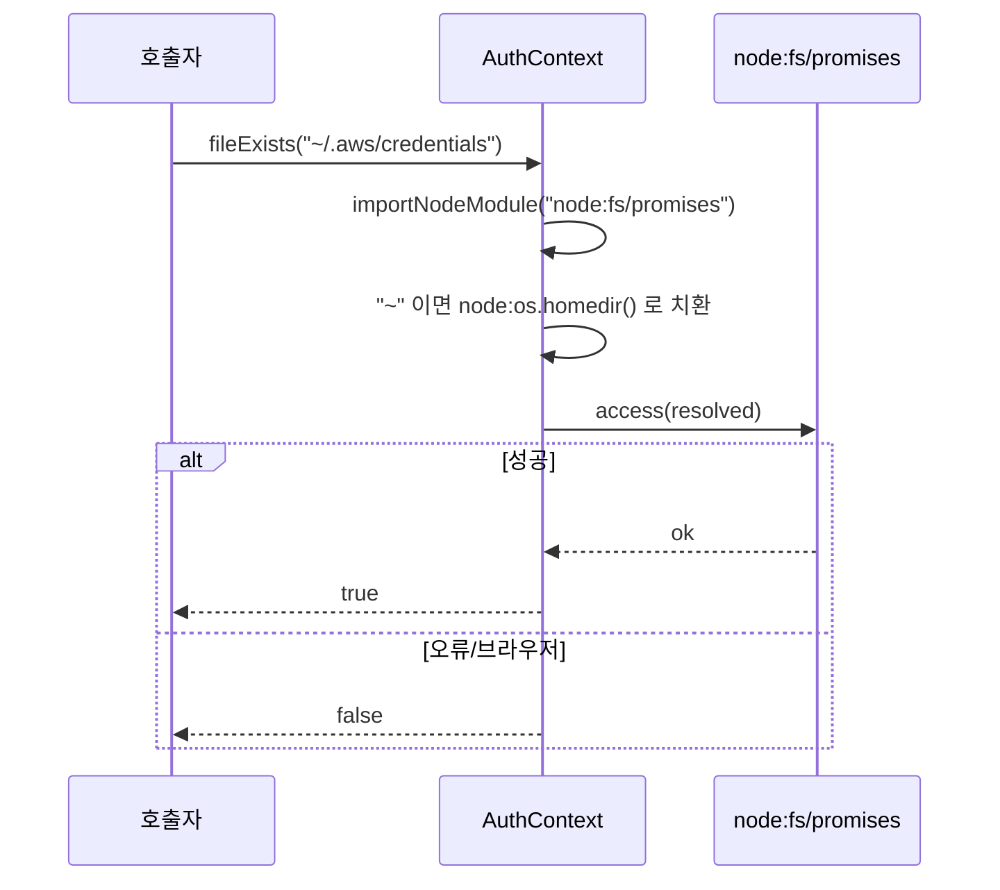
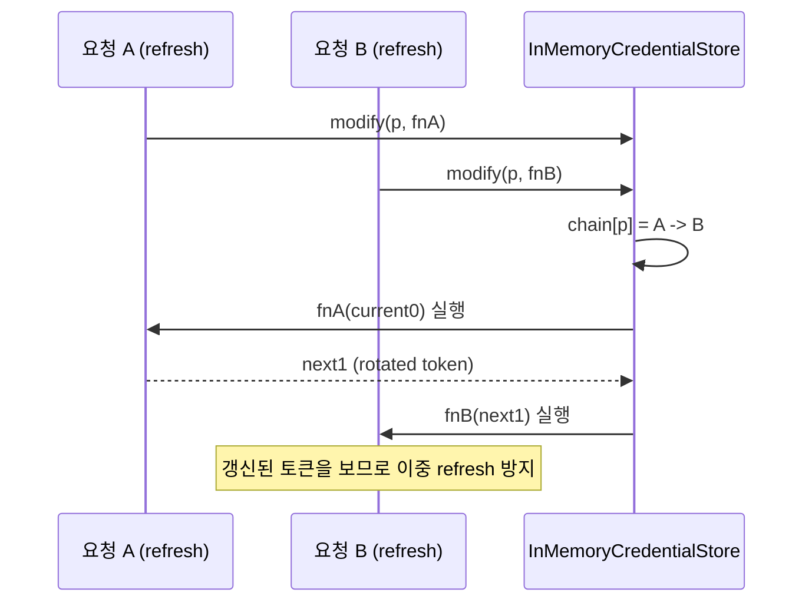
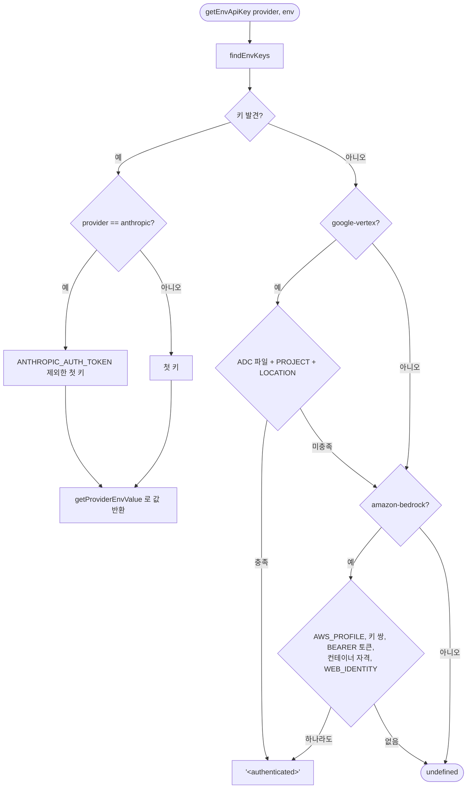
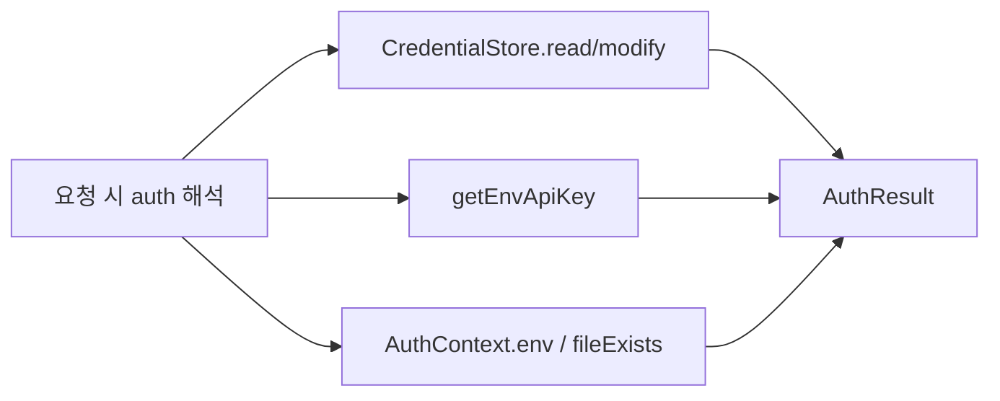

# auth_core 모듈

## 소개

`auth_core`는 `packages/ai`의 인증 기반 계층이다. 다음 세 가지를 제공한다.

| 파일 | 역할 |
|------|------|
| `packages/ai/src/auth/context.ts` | `defaultProviderAuthContext()` — 환경변수·파일 존재 여부를 읽는 기본 `AuthContext` |
| `packages/ai/src/auth/credential-store.ts` | `InMemoryCredentialStore` — provider별 직렬화되는 기본 인메모리 `CredentialStore` |
| `packages/ai/src/env-api-keys.ts` | provider → 환경변수 매핑, `findEnvKeys`, `getEnvApiKey` |

인터페이스(`AuthContext`, `CredentialStore`, `Credential`, `CredentialInfo`, `AuthOperationOptions`)는 `packages/ai/src/auth/types.ts`에 있다. 이 모듈은 그 인터페이스의 기본 구현과 환경변수 탐색 로직이다. 영속 저장소는 앱이 주입한다(예: coding-agent의 `AuthStorage`, [model_and_auth_management](model_and_auth_management.md)).

핵심 설계 제약은 **브라우저/Vite 번들 호환성**이다. Node 내장 모듈(`node:fs`, `node:os`, `node:path`)은 최상위 import 하지 않고 변수 specifier의 동적 import로만 로드한다.

> 검증 수준: 아래 내용은 제공된 소스 코드 확인 기준이며, 호출 주체(`Models` 등)에 관한 서술은 `types.ts` 주석 확인 또는 추론으로 표시했다.

## 아키텍처

관련 모듈: [model_registry](model_registry.md)(`ModelsImpl.login/logout/checkAuth`), [oauth_flows](oauth_flows.md)(OAuth 로그인·refresh), [ai_runtime_utils](ai_runtime_utils.md), [model_and_auth_management](model_and_auth_management.md).

## 컴포넌트

### defaultProviderAuthContext (`context.ts`)

`AuthContext`의 두 메서드를 구현한다.

- `env(name)`: `globalThis.process?.env`에서 값을 읽는다. 브라우저에서는 `process`가 없어 `undefined`. 공백뿐인 값은 `undefined`로 취급한다.
- `fileExists(path)`: `node:fs/promises`를 동적 import해 `access`로 확인한다. 선행 `~`는 `node:os`의 `homedir()`로 치환한다. 실패(브라우저 포함)는 모두 `false`.
- `NodeFsModule`, `NodeOsModule`은 동적 import 결과를 좁히기 위한 최소 인터페이스(`access`, `homedir`)다.

### InMemoryCredentialStore (`credential-store.ts`)

`Provider.id`를 키로, provider당 credential 하나를 `Map`에 보관한다.

| 메서드 | 동작 |
|--------|------|
| `read` | `signal`이 abort면 throw, 아니면 현재 값(만료되었을 수 있음) 반환. 큐를 거치지 않는다 |
| `list` | `{providerId, type}` 메타데이터만 반환(비밀값 미노출) |
| `modify` | provider별 큐에 넣어 read-modify-write. `fn(current)`가 `undefined`를 돌려주면 항목은 그대로 두고 `current` 반환 |
| `delete` | 같은 큐를 통해 삭제 |

**직렬화**: private `enqueue`가 `chains: Map<providerId, Promise>`로 provider별 promise 체인을 만든다. 앞선 작업이 실패해도(`previous.catch`) 다음 작업은 진행한다. 체인의 tail이 자신이면 완료 후 맵에서 제거해 누수를 막는다. `raceWithAbortSignal`로 호출자 측 대기는 abort 가능하지만, 이미 시작된 작업은 취소되지 않고 체인을 계속 점유한다("active work settles 전에 체인을 놓지 않음").

`modify`는 `fn` 실행 후 `signal.throwIfAborted()`를 다시 확인하므로, abort되면 쓰기가 일어나지 않는다.

이 구조가 `types.ts` 주석의 요구("`Models.getAuth()`가 `modify` 안에서 OAuth refresh를 수행해 rotate된 토큰의 이중 refresh를 막는다")를 충족한다. 프로세스 간 락은 제공하지 않는다(파일 락은 영속 저장소 구현 몫).

### env-api-keys.ts

**지연 Node 모듈 로딩**: Node/Bun이면 `existsSync`, `homedir`, `join`을 비동기로 미리 로드해 모듈 변수에 보관한다. specifier를 `"node:" + "fs"`처럼 쪼개 번들러의 정적 분석을 피한다. 파일 상단 주석 "NEVER convert to top-level imports"가 이 제약을 명시한다. `dynamicImport`가 이 모듈의 core component다.

**주요 export**

- 상수: `ANTHROPIC_AUTH_TOKEN_ENV`, `ANTHROPIC_OAUTH_TOKEN_ENV`, `ANTHROPIC_API_KEY_ENV`, `ANTHROPIC_FEDERATION_RULE_ID_ENV`, `ANTHROPIC_ORGANIZATION_ID_ENV`, `ANTHROPIC_SERVICE_ACCOUNT_ID_ENV`, `ANTHROPIC_IDENTITY_TOKEN_FILE_ENV`, `ANTHROPIC_WORKSPACE_ID_ENV`
- `findEnvKeys(provider, env?)`: 설정된 API 키 환경변수 이름 목록(없으면 `undefined`). AWS 프로필, Google ADC 같은 ambient 자격은 의도적으로 제외.
- `getEnvApiKey(provider, env?)`: 키 값 반환.

**provider → 환경변수** (`getApiKeyEnvVars`): `github-copilot`은 `COPILOT_GITHUB_TOKEN`, `anthropic`은 `[ANTHROPIC_AUTH_TOKEN, ANTHROPIC_OAUTH_TOKEN, ANTHROPIC_API_KEY]`, 나머지는 `envMap`(예: `openai`→`OPENAI_API_KEY`, `google`→`GEMINI_API_KEY`, `huggingface`→`HF_TOKEN`, `kimi-coding`→`KIMI_API_KEY`). 일부는 여러 provider가 변수를 공유한다(`moonshotai`/`moonshotai-cn`, `opencode`/`opencode-go`, `cloudflare-*`).

**getEnvApiKey 결정 흐름**

주의할 동작:

- `ANTHROPIC_AUTH_TOKEN`은 탐색/상태 표시(`findEnvKeys`)에는 포함되지만 `getEnvApiKey`는 건너뛴다. 요청 시 `Authorization: Bearer`로 따로 전달해야 하기 때문(소스 주석).
- `google-vertex`와 `amazon-bedrock`은 실제 키 대신 센티널 `"<authenticated>"`를 반환한다. 호출자는 이를 API 키로 쓰면 안 된다(SDK 기본 자격 체인 사용을 의미; 추론).
- **ADC 존재 캐시** (`hasVertexAdcCredentials`): `GOOGLE_APPLICATION_CREDENTIALS`가 `env`에 있으면 캐시 없이 매번 확인한다. 아니면 결과를 `cachedVertexAdcCredentialsExists`에 캐시하고, 기본 경로는 `~/.config/gcloud/application_default_credentials.json`이다. Node 모듈이 아직 로드되지 않은 시작 직후(async import race)에는 `false`를 **캐시하지 않고** 반환해 재시도한다. 브라우저로 확정된 경우에만 `false`를 영구 캐시한다.
- 캐시가 `env` 인자와 무관하게 전역이라는 점은 주의 대상이다(코드 확인: 두 번째 분기에서 `getProviderEnvValue("GOOGLE_APPLICATION_CREDENTIALS", env)`를 읽지만 첫 분기에서 이미 `env?.GOOGLE_APPLICATION_CREDENTIALS`를 처리하므로 사실상 `env`가 없는 `process.env` 경로에서만 도달; 세부는 `utils/provider-env.ts` 미확인).

## 데이터 흐름: API 키 해석

저장된 credential, 환경변수, ambient 컨텍스트 중 무엇을 우선하는지는 `ModelsImpl`(`models.ts`) 소관이며 이 모듈에서는 확인되지 않았다(미확인). 자세한 내용은 [model_registry](model_registry.md) 참고.

## 확장 지점과 유지보수 메모

- **영속 저장소 교체**: `CredentialStore`를 구현해 주입한다. `modify`의 per-provider 상호배제, `read`의 `undefined` 의미, `list`가 비밀값·명령 실행을 하지 않을 것이라는 계약을 지켜야 한다.
- **새 provider의 환경변수 추가**: `getApiKeyEnvVars`의 `envMap`에 항목을 추가한다. ambient 자격이 필요한 provider는 `getEnvApiKey`에 별도 분기가 필요하다.
- **금지 사항**: `env-api-keys.ts`, `context.ts`에 `node:*` 정적 import 추가 금지(브라우저/Vite 빌드 깨짐).
- **테스트**: `packages/ai/vitest.config.ts`가 `packages/ai` 테스트 설정이다(내용 미확인; [build_and_test_config](build_and_test_config.md) 참고).
