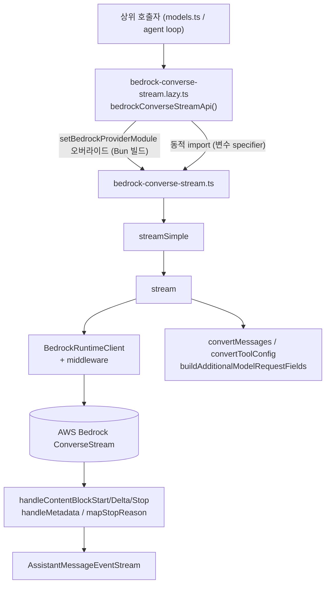
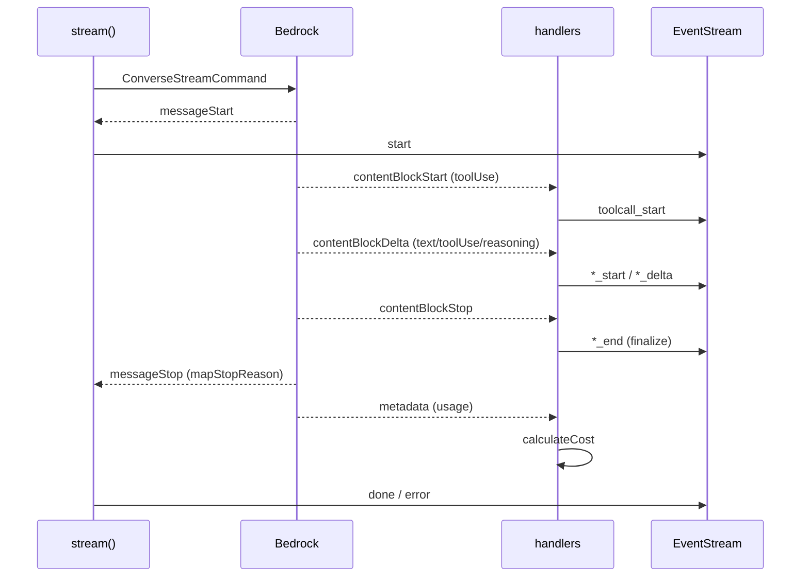

# bedrock_provider_api

## 개요

`bedrock_provider_api`는 `packages/ai`에서 AWS Bedrock의 **Converse Stream API**(`ConverseStreamCommand`)를 pi 공통 스트리밍 인터페이스(`StreamFunction<"bedrock-converse-stream", ...>`)로 어댑트하는 provider 모듈이다. 상위 모듈 `llm_provider_adapters`의 하위 모듈이며, Anthropic/OpenAI/Google 등 다른 provider 어댑터와 같은 계약(`AssistantMessageEventStream`)을 구현한다.

| 파일 | 역할 |
|---|---|
| `packages/ai/src/api/bedrock-converse-stream.ts` | 실제 구현: 클라이언트 구성, 메시지/툴 변환, 스트림 이벤트 처리, 오류 포맷 |
| `packages/ai/src/api/bedrock-converse-stream.lazy.ts` | Node 전용 AWS SDK를 번들러가 따라가지 못하도록 지연 로딩하는 래퍼 |

단일 구현 파일 중심이라 별도 sub-module 문서는 두지 않는다.

## 아키텍처

## 지연 로딩: `bedrock-converse-stream.lazy.ts`

- `bedrockConverseStreamApi()`는 `lazyApi(...)`로 구현을 감싸 첫 호출 시에만 로드한다.
- `importNodeOnlyApi`는 **변수 specifier**로 `import()`하여 브라우저 smoke / Bun compile 번들러가 AWS SDK까지 따라가지 않게 한다. 빌드 산출물(`.js`)에서는 `.ts` → `.js`로 치환한다.
- `setBedrockProviderModule(module)`: Bun 바이너리 빌드처럼 동적 import가 번들되지 않는 환경에서 정적 import한 모듈로 구현을 덮어쓴다.

## 요청 구성 (`stream`)

### 클라이언트 설정
- **프로필/자격 증명**: `options.profile` 또는 `env.AWS_PROFILE`이 명시되면 ambient `AWS_ACCESS_KEY_ID`보다 우선(`credentials`를 설정하지 않음). 프로필이 없을 때만 `getConfiguredBedrockCredentials`가 env 키(`AWS_ACCESS_KEY_ID`/`AWS_SECRET_ACCESS_KEY`/`AWS_SESSION_TOKEN`)를 사용한다.
- **인증 방식**: `bearerToken` → `apiKey` → `AWS_BEARER_TOKEN_BEDROCK` 순으로 Bearer 토큰 인증(`authSchemePreference: ["httpBearerAuth"]`)을 사용. `AWS_BEDROCK_SKIP_AUTH=1`이면 더미 자격 증명(인증 불필요 프록시용).
- **리전 결정**: 모델 ID가 inference profile ARN이면 ARN 내 리전 > `options.region` > `AWS_REGION`/`AWS_DEFAULT_REGION` > 표준 엔드포인트 리전 > `us-east-1`(ambient 프로필이 없을 때).
- **엔드포인트**: `shouldUseExplicitBedrockEndpoint`는 커스텀 엔드포인트(VPC/프록시)는 항상 고정하고, 표준 AWS 엔드포인트는 리전·ambient 프로필이 모두 없을 때만 고정한다.
- **프록시/HTTP1**: 프록시 URL이 있으면 `NodeHttpHandler`+`HttpProxyAgent`/`HttpsProxyAgent`, `AWS_BEDROCK_FORCE_HTTP1=1`이면 HTTP/1.1 핸들러를 사용.
- **Smithy 미들웨어**
  - `addCustomHeadersMiddleware`: `build` 단계(SigV4 서명 전)에 사용자 헤더 주입. `x-amz-*`, `authorization`, `host`는 예약 헤더로 무시.
  - `addResponseHeadersMiddleware`: `deserialize` 단계에서 원시 HTTP 응답을 캡처해 `onResponse` 콜백에 전달(`$metadata`에서 사라지는 게이트웨이 헤더 보존).

### 메시지/툴 변환
- `convertMessages`: `transformMessages`(+`normalizeToolCallId`로 64자 이내 `[a-zA-Z0-9_-]` 정규화) 후 Bedrock `Message[]`로 변환.
  - 빈 텍스트는 `<empty>` placeholder 또는 생략, 빈 assistant 메시지는 스킵.
  - 연속된 `toolResult`는 하나의 user 메시지로 병합(Bedrock 요구사항).
  - thinking: Anthropic Claude만 `signature` 전송, 서명이 없으면 일반 텍스트로 대체, `redacted`는 `redactedContent`로 base64 복원 후 재생(실패 시 블록 드롭).
  - 마지막 user 메시지에 prompt cache point 추가.
- `resolveCacheRetention`: 옵션 > `PI_CACHE_RETENTION=long` > 기본 `short`. `long`은 1시간 TTL. 캐시는 Claude 3.5 Haiku / 3.7 Sonnet / 4.x / 5 계열 또는 `AWS_BEDROCK_FORCE_CACHE=1`일 때만 적용.
- `convertToolConfig`: 툴을 `toolSpec`으로 변환, `toolChoice`(`auto`/`any`/특정 tool) 매핑, `none`이면 `undefined`. 모델이 `compat.supportsStrictMode`를 지원하면 strict 스키마 사용.
- `buildAdditionalModelRequestFields`: Claude 한정 reasoning 설정.
  - adaptive thinking 모델(Opus 4.6+, Sonnet 4.6/5 등): `thinking.type="adaptive"` + `output_config.effort`.
  - 그 외 Claude: `thinking.type="enabled"` + `budget_tokens`(기본 1024~16384), `interleaved-thinking` beta 헤더.
  - GovCloud 대상은 `thinking.display` 생략. 기본 `display`는 `"summarized"`.

### `streamSimple`
`SimpleStreamOptions`를 `BedrockOptions`로 변환한다. 비-adaptive Claude는 `adjustMaxTokensForThinking`/`clampMaxTokensToContext`로 `maxTokens`와 thinking budget을 조정한다.

## 스트림 이벤트 처리

- `handleContentBlockStart`: toolUse 블록만 시작 이벤트가 오므로 `toolCall` 블록 생성. text/thinking 블록은 첫 delta에서 생성.
- `handleContentBlockDelta`: text, toolUse(`parseStreamingJson`으로 부분 JSON 파싱), reasoningContent(텍스트/서명/암호화 `redactedContent`) 처리. 암호화 reasoning은 `[Reasoning redacted]` placeholder와 함께 chunk로 모아 base64로 `thinkingSignature`에 저장.
- `handleContentBlockStop` / `finalizeStreamingBlock`: `index`, `partialJson`, `redactedChunks` 같은 스트리밍 scratch 필드를 제거해 저장 메시지에 새어 나가지 않게 한다. 스트림이 블록 stop 없이 종료되어도 종료 경로에서 다시 호출.
- `handleMetadata`: 토큰 사용량(cache read/write, 1시간 TTL 캐시 포함)을 채우고 `calculateCost` 호출.
- `mapStopReason`: `end_turn`/`stop_sequence`→`stop`, `max_tokens`/`model_context_window_exceeded`→`length`, `tool_use`→`toolUse`, 그 외→`error`.

## 오류 처리

- `formatBedrockError`: SDK 예외 이름을 사람이 읽는 prefix(`Throttling error`, `Service unavailable` 등)로 매핑한다. 상위 agent-session의 재시도 패턴(`server.?error`, `service.?unavailable`)과 컨텍스트 오버플로 감지가 문자열 매칭에 의존하므로 형식을 유지해야 한다. HTTP body가 메시지에 없으면 `status: body`를 노출하고, data retention 오류에는 AWS 문서 링크를 덧붙인다.
- `appendBedrockFailureDiagnostic`: `errorMessage`는 그대로 두고 `bedrock_response_failure` 진단(`status`, `errorCode`, `requestId`)을 별도로 첨부한다. 알 수 없는 필드는 추측하지 않고 생략.
- 중단 시 `stopReason: "aborted"`, 그 외 `"error"`. 스트림이 stop reason 없이 끝나면 오류로 처리한다.

## 다른 모듈과의 관계

- 같은 상위 모듈의 형제 어댑터: [anthropic_provider_api](anthropic_provider_api.md), [openai_provider_apis](openai_provider_apis.md), [openai_codex_provider_api](openai_codex_provider_api.md), [google_provider_apis](google_provider_apis.md), [mistral_provider_api](mistral_provider_api.md)
- 모델 레지스트리/비용 계산(`calculateCost`): [model_registry](model_registry.md)
- 지연 로딩·번들 관련 유틸과 이벤트 스트림: [ai_runtime_utils](ai_runtime_utils.md)
- 테스트 설정: `packages/ai/vitest.config.ts` ([build_and_test_config](build_and_test_config.md))

검증 수준: 위 내용은 제공된 두 소스 파일 기준 `코드 확인`이며, 다른 모듈과의 호출 관계는 모듈 트리 기반 `추론`이다.
