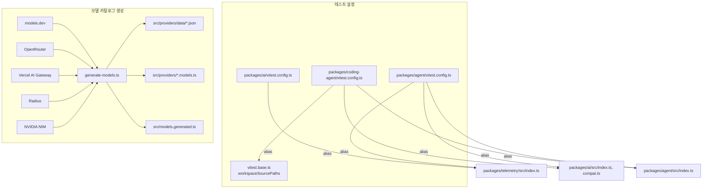
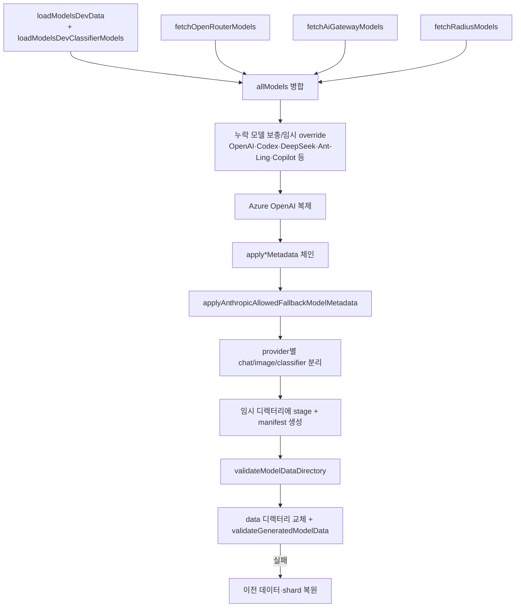

# build_and_test_config 모듈

## 개요

`build_and_test_config`는 `packages/ai`, `packages/agent`, `packages/coding-agent`의 **테스트 실행 설정(vitest)** 과 **모델 카탈로그 생성 스크립트**(`packages/ai/scripts/generate-models.ts`)를 묶은 빌드/테스트 인프라 모듈이다. 런타임 로직은 없고, 테스트 환경과 `packages/ai`의 생성 데이터(모델 카탈로그)를 책임진다.

| 파일 | 역할 |
|---|---|
| `packages/agent/vitest.config.ts` | agent 패키지 테스트 설정, 워크스페이스 소스 alias |
| `packages/ai/vitest.config.ts` | ai 패키지 테스트 설정, telemetry alias |
| `packages/coding-agent/vitest.config.ts` (산출물 목록) | `../../vitest.base.ts`를 `mergeConfig`로 확장, 오프라인 테스트 |
| `packages/ai/scripts/generate-models.ts` | 외부 카탈로그를 수집·보정해 `src/providers/data/*.json`, `*.models.ts`, `src/models.generated.ts` 생성 |

> 주의: `packages/ai/src/models.generated.ts`는 직접 수정하지 않고 `generate-models.ts`를 고쳐 재생성해야 한다(레포 `AGENTS.md` 규칙). 또한 `npm run build`/`npm test`는 요청 시에만, 비-e2e 테스트는 루트의 `./test.sh`로 실행한다.

## 아키텍처

## 테스트 설정

공통 사항(세 설정 모두): `globals: true`, `environment: "node"`, `testTimeout: 30000`, `GITHUB_ACTIONS`이면 `["dot", "github-actions"]` reporter, 아니면 `["dot"]`, `silent: "passed-only"`.

- **agent**: `resolve.conditions: ["source"]`(및 `ssr.resolve.conditions`)로 패키지 `source` export 조건을 사용하고, `@earendil-works/pi-telemetry`, `pi-agent-core`, `pi-ai`, `pi-ai/compat`를 각 `src` 진입점으로 alias하여 빌드 없이 소스를 직접 테스트한다.
- **ai**: telemetry만 `../telemetry/src/index.ts`로 alias한다.
- **coding-agent**: `vitest.base.ts`의 `baseConfig`와 `workspaceSourcePaths`(`aiIndex`, `agentIndex`, `aiOAuth`, `tuiIndex`)를 사용한다. `env: { PI_OFFLINE: "1" }`로 기본 오프라인이며 네트워크가 필요하면 `test/test-network-env.ts`의 `allowNetwork()`로 opt-in한다. `unstubEnvs: true`, `@silvia-odwyer/photon-node`는 `server.deps.external`로 처리한다. 구 스코프(`@mariozechner/pi-*`) alias도 함께 유지한다.

## 모델 카탈로그 생성기 (`generate-models.ts`)

### CLI 옵션 (`readGeneratorOptions`)
`--strict`(수집 실패 시 throw), `--data-only`(JSON 데이터만 재수화), `--json-only` + `--json-output <dir>`(레거시 형태 JSON 카탈로그 출력), `--pretty`. `--json-only`는 `--json-output` 필수, `--data-only`는 JSON 출력과 병용 불가.

### 처리 흐름 (`generateModels`)

핵심 포인트:

1. **소스 우선순위**: models.dev가 우선이며 OpenRouter/AI Gateway/Radius는 `??=`로 중복 시 뒤에 추가되지 않는다. 각 fetch는 실패 시 `--strict`가 아니면 빈 결과로 대체된다.
2. **provider별 변환**: Bedrock, Anthropic, Google/Vertex(`processGoogleModels`), OpenAI, Groq, Cerebras, Cloudflare, xAI, Meta, Z.ai(`processZaiModels`), Mistral, HuggingFace, Fireworks(`processFireworksModels`), NVIDIA, Together, Baseten(`processBasetenModels`), OpenCode, GitHub Copilot, MiniMax, Kimi, Moonshot, Xiaomi, Qwen Token Plan 등이 각각 `api`/`baseUrl`/`compat`/비용을 결정한다.
3. **메타데이터 보정 체인**(모델마다 순서대로 적용): `applyOpenAICompletionsCompatMetadata`(기본값과의 delta만 저장), `applyAnthropicMessagesCompatMetadata`, `applyModelsDevReasoningOptionMetadata`, `applyThinkingLevelMetadata`, `applyStrictToolCompatMetadata`, `applyOpenAIGrammarToolCompatMetadata`, `applyOpenAIToolSearchMetadata`, 트랜스크립트 계열 2종, `applyOpenAIExplicitPromptCacheMetadata`, `applyPromptCacheMetadata`, `applyImageInputMetadata`.
4. **Anthropic fallback**: `isAnthropicFallbackMetadataModel`이 대상 모델을 고르고, `ANTHROPIC_ALLOWED_FALLBACK_MODELS` 기반으로 `compat.allowedFallbackModels`(비용 포함)를 채운다. `supportsMidConvoEffort` 모델은 호환되는 fallback만 허용한다.
5. **병합 헬퍼**: `mergeOpenAICompletionsCompat`는 기존 `compat` 위에 새 값을 덮어쓴다(`mergeAnthropicMessagesCompat`, `mergeThinkingLevelMap`과 동일 패턴).
6. **`AiGatewayModel`**: Vercel AI Gateway `/models` 응답 항목의 타입. `type === "evaluation"`이면 `typesafe-system-one` classifier로, `tool-use` 태그가 있는 항목만 `anthropic-messages` chat 모델로 변환한다.
7. **원자적 쓰기**: `src/providers/.model-generation-*` 임시 디렉터리에 데이터를 stage하고 manifest(`createModelDataManifest`)를 검증한 뒤 교체한다. 실패하면 이전 `data/`와 `*.models.ts`, `models.generated.ts`를 복원한다.
8. **출력물**: `src/providers/data/<provider>.json`(API별 그룹), `src/providers/<provider>.models.ts`(`flatten*ModelCatalog` 호출), 집계 `src/models.generated.ts`(`MODELS`, `IMAGE_MODELS`, `CLASSIFIER_MODELS`). 이 파일들은 [ai_platform_foundation](ai_platform_foundation.md)의 `model_registry`/`builtin_providers_and_compat`가 소비한다.

### 외부 의존
`./models-dev-reasoning-options.ts`, `./openrouter-catalog.ts`, `./model-data.ts`, `../src/api/cloudflare.ts`, `../src/providers/radius-config.ts`, `../src/types.ts`. Radius 카탈로그 로직은 [llm_provider_adapters](llm_provider_adapters.md)의 `cloudflare_and_pi_gateway_apis`와 연결된다.

## 관련 모듈

- [ai_platform_foundation](ai_platform_foundation.md): 이 모듈의 상위 모듈, 생성된 카탈로그 소비자
- [agent_runtime_core](agent_runtime_core.md): agent 패키지(테스트 대상)
- [coding_agent_session_and_configuration](coding_agent_session_and_configuration.md): coding-agent 패키지(테스트 대상)

## 검증 수준

위 내용은 제공된 소스(`vitest.config.ts` 3종, `generate-models.ts`) 직접 확인(코드 확인)에 기반한다. `vitest.base.ts`와 `models-dev-reasoning-options.ts` 등의 내부 구현은 미확인이다.
