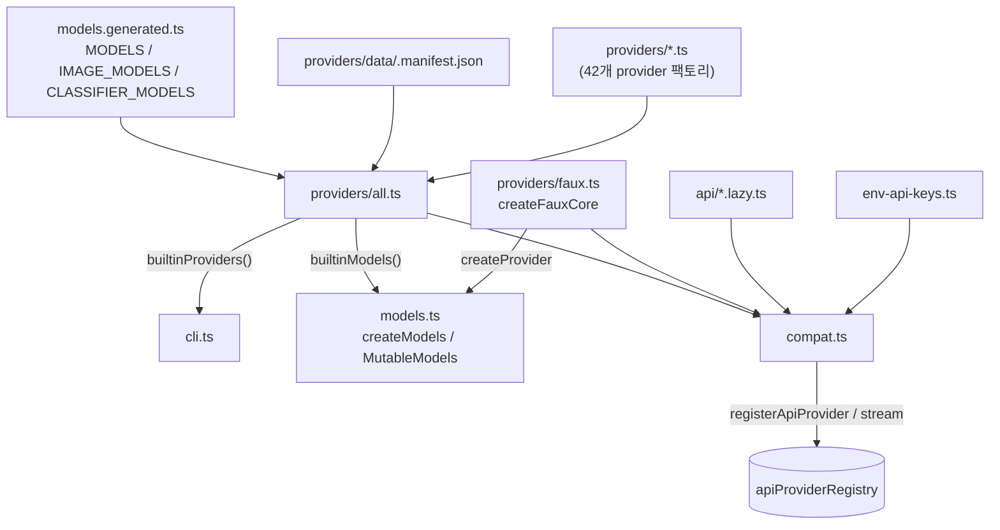
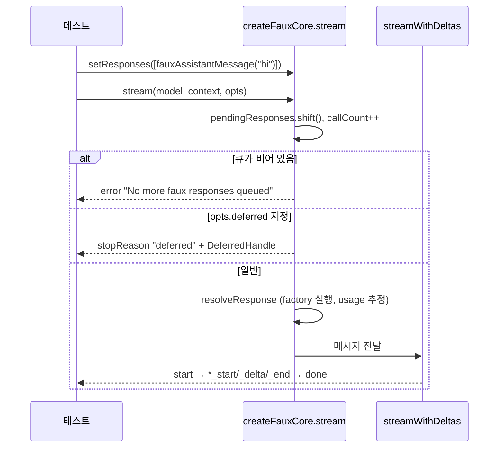
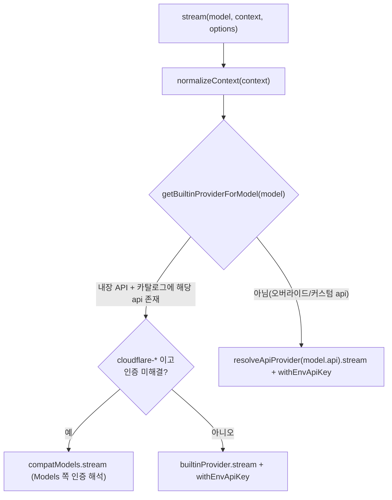

# builtin_providers_and_compat 모듈

`packages/ai`의 "조립 계층"이다. 생성된 모델 카탈로그(`models.generated.ts`)와 개별 provider 팩토리를 묶어 `Models` 컬렉션을 만들고, 테스트용 faux provider, 구(舊) 전역 API를 유지하는 `compat` 진입점, OAuth 로그인 개발용 CLI를 제공한다.

| 파일 | 역할 |
|---|---|
| `packages/ai/src/providers/all.ts` | 카탈로그 getter, `builtinProviders()`, `builtinModels()` |
| `packages/ai/src/providers/faux.ts` | 스크립트된 응답을 스트리밍하는 가짜 provider |
| `packages/ai/src/compat.ts` | 전역 api-registry 기반의 레거시 `stream()`/`complete()` 호환 계층 |
| `packages/ai/src/cli.ts` | `npx @earendil-works/pi-ai login/list` CLI |

관련 모듈: 실제 API 구현은 [llm_provider_adapters](llm_provider_adapters.md), `createModels`/`Provider`/`ModelsImpl`은 [model_registry](model_registry.md), OAuth 흐름은 [oauth_flows](oauth_flows.md), 인증 컨텍스트는 [auth_core](auth_core.md), 카탈로그 생성 스크립트는 [build_and_test_config](build_and_test_config.md), 스트림 유틸은 [ai_runtime_utils](ai_runtime_utils.md)를 참고한다.

## 아키텍처



## providers/all.ts

- **타입 안전한 카탈로그 읽기**: `getBuiltinModel`, `getBuiltinImageModel`, `getBuiltinClassifierModel`은 `provider`/`modelId`를 `keyof typeof MODELS` 계열로 제한하고, 반환 타입의 `api`를 `CatalogApi<...>`로 추론한다. 존재하지 않으면 런타임에는 `undefined`가 반환된다(캐스팅만 수행).
- **목록 조회**: `getBuiltinProviders()`는 `Object.keys(MODELS)`. `getBuiltinModels/ImageModels/ClassifierModels(provider)`는 종류별 목록, `getAllBuiltinModels(provider)`는 세 종류를 하나의 `AnyModel[]`로 합친다.
- **`getBuiltinModelDataGeneratedAt()`**: `data/.manifest.json`의 `generatedAt`을 파싱해 epoch ms 반환(파싱 실패 시 `undefined`).
- **`builtinProviders()`**: 호출할 때마다 새로 생성한 `Provider[]` (amazon-bedrock, anthropic, openai, openai-codex, google, google-vertex, mistral, openrouter, github-copilot, cloudflare-*, xai, zai, radius 등).
- **`builtinModels(options?)`**: `createModels(options)` 후 모든 provider를 `setProvider`로 등록한 `MutableModels`를 반환.
- `BuiltinProvider`는 생성 카탈로그에 있는 provider만 포함한다. `radius`처럼 정적 카탈로그가 없는 동적 provider는 `KnownProvider`에만 있다 (주석 기준).

## providers/faux.ts

테스트 전용 provider. 네트워크 없이 `AssistantMessageEventStream`을 흉내낸다.



핵심 동작 (코드 확인):
- 헬퍼 `fauxAssistantMessage`, `fauxThinking`, `fauxToolCall`(id 미지정 시 `randomId("tool")`), `fauxText`로 응답 구성. 응답 단계(`FauxResponseStep`)는 메시지 또는 `(context, options, state, model) => AssistantMessage` 팩토리.
- 응답은 큐(`setResponses`/`appendResponses`)에서 호출 순서대로 소비된다.
- `withUsageEstimate`: 토큰은 `ceil(length/4)`로 추정. `sessionId`가 있고 `cacheRetention !== "none"`이면 이전 프롬프트와의 공통 접두사로 `cacheRead`/`cacheWrite`를 계산.
- `streamWithDeltas`: 문자열을 `tokenSize`(기본 3~5 토큰)의 청크로 쪼개 thinking/text/toolcall 이벤트를 방출하고, `tokensPerSecond`가 있으면 `setTimeout`으로 지연, 없으면 microtask. 각 청크마다 `signal.aborted`를 확인해 `aborted` 오류로 종료.
- deferred 지원: `pendingFetches`만큼 `fetchDeferred`가 핸들을 그대로 반환한 뒤 최종 응답을 낸다. `cancelDeferred`는 `state.cancelledDeferred`에 기록하며, 취소된 핸들을 fetch하면 오류.
- 두 가지 노출 방식:
  - `fauxProvider(options)`: `createProvider`로 만든 `Provider`를 담은 `FauxProviderHandle`. `createModels()`와 함께 사용(전역 상태 없음).
  - `registerFauxProvider(options)`(compat): 전역 api-registry에 등록하고 `unregister()` 제공.

## compat.ts

주석상 "임시 호환 진입점"이며 coding-agent의 ModelManager 마이그레이션과 함께 삭제될 예정이다. 기존 `@earendil-works/pi-ai` 사용처는 import 경로를 `.../compat`으로 바꾸면 그대로 동작한다.

- **재수출**: `*.lazy.ts` API 래퍼, `env-api-keys`, `image-models`, `images`, `images-api-registry`, `index`, `legacy-api-aliases`, `providers/images/register-builtins`.
- **deprecated 별칭**: `getModel = getBuiltinModel`, `getModels = getBuiltinModels`, `getProviders = getBuiltinProviders`.
- **api-registry**: 모듈 전역 `Map` (`apiProviderRegistry`). `registerApiProvider`는 `model.api !== api`이면 `Mismatched api` 오류를 던지는 래퍼를 씌워 저장. `getApiProvider(s)`, `unregisterApiProviders(sourceId)`, `resetApiProviders()` 제공.
- **`registerBuiltInApiProviders()`**: `BUILTIN_APIS` 10종(anthropic-messages, openai-completions, openai-responses, openai-codex-responses, azure-openai-responses, google-generative-ai, google-vertex, mistral-conversations, bedrock-converse-stream, pi-messages)을 **기존 항목을 덮어쓰지 않고** 등록. 모듈 로드 시 즉시 실행된다.
- **디스패치(`stream`/`streamSimple`)**:



  - `withEnvApiKey`: `options.apiKey`가 비어 있으면 `getEnvApiKey(model.provider, options.env)`로 주입. 값이 `"<authenticated>"`(ambient 마커)면 주입하지 않는다.
  - `getBuiltinProviderForModel`: 레지스트리의 해당 api가 빌트인 인스턴스와 같고, provider가 그 api의 모델을 가진 경우에만 빌트인 경로 사용 → 테스트/확장이 빌트인 api id를 오버라이드하면 레지스트리 경로로 간다.
  - Cloudflare는 `apiKey` 또는 `cf-aig-authorization` 헤더가 없으면 `Models` 경로로 위임.
  - `complete`/`completeSimple`은 `stream(...).result()`.
- 등록되지 않은 api는 `No API provider registered for api: <api>` 오류.

## cli.ts

`builtinProviders()` 중 `auth.oauth`가 있는 것만 대상으로 하는 개발용 CLI.

- `help`/`list`/`login [provider]`. provider 미지정 시 번호 선택.
- `login`: `provider.auth.oauth.login(ctx, { getDeviceId: randomUUID })` 호출. `notify` 이벤트(`auth_url`, `device_code`, `info`, `progress`)를 콘솔에 출력하고, `select` 프롬프트는 번호 입력으로 처리.
- 결과 credential을 **현재 디렉터리의 `auth.json`**에 `{providerId: credential}`로 저장(평문 JSON). 설치 ID는 저장하지 않는다(코드 주석).
- 모듈 로드 시 `main()`이 즉시 실행되며 오류 시 `exit(1)`.

## 사용 예

```ts
// 신규 방식
const models = builtinModels();
const m = getBuiltinModel("anthropic", "<model-id>");

// 테스트
const faux = fauxProvider();
const ms = createModels();
ms.setProvider(faux.provider);
faux.setResponses([fauxAssistantMessage("hi")]);
```

## 검증 수준 및 주의

- 위 내용은 제공된 소스(`all.ts`, `faux.ts`, `compat.ts`, `cli.ts`) 기준 **코드 확인**. 실행은 하지 않았다.
- `*.lazy.ts`, `models.ts`, 개별 provider 파일 내부는 이 문서 범위 밖이며 **미확인**.
- `compat.ts`의 삭제 시점 설명은 소스 주석에 근거하며, 실제 일정은 **미확인**.
- `packages/ai/vitest.config.ts`는 테스트 설정이나 이 문서 작성 시 내용을 열람하지 않았다(**미확인**).
