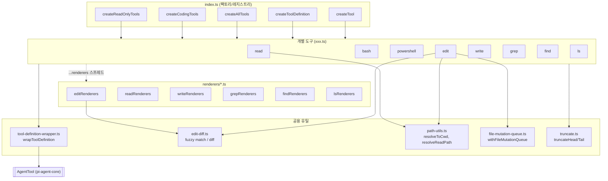
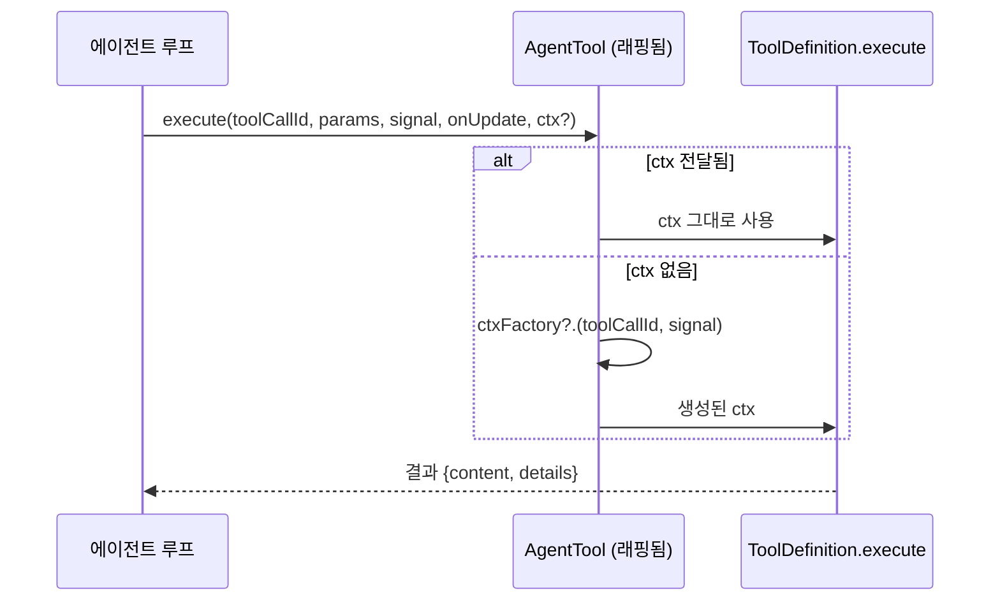
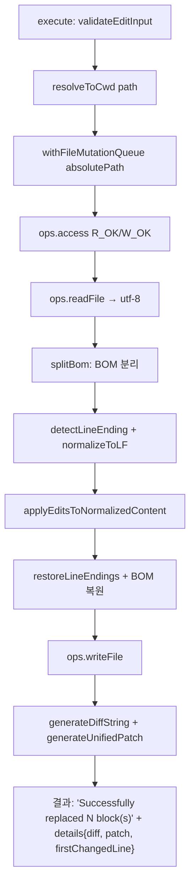
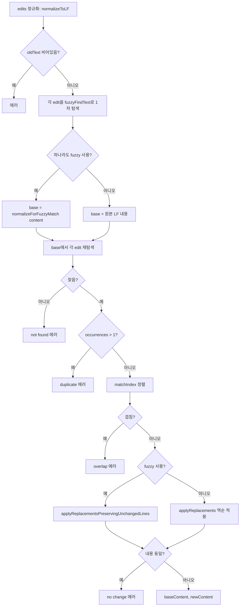
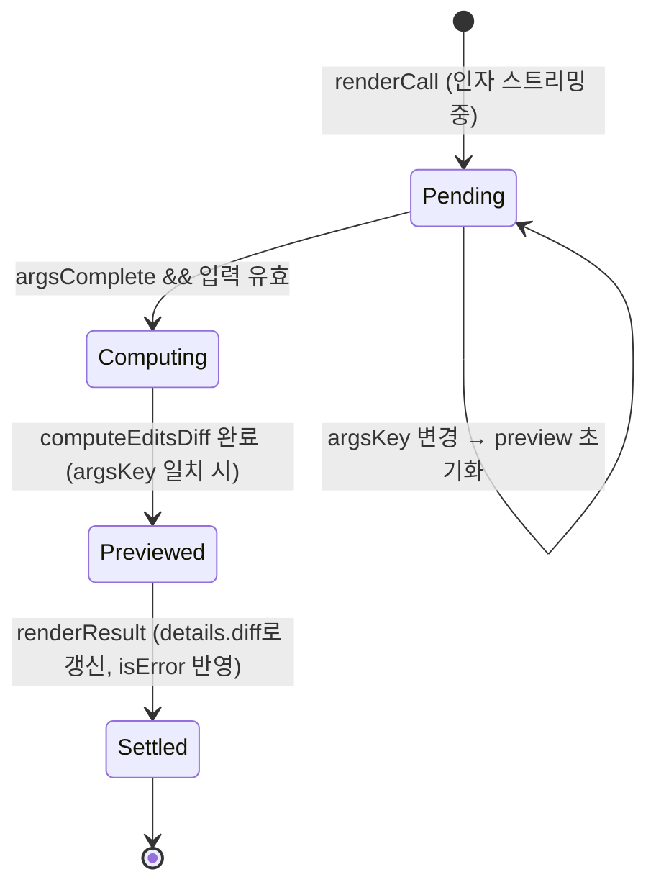
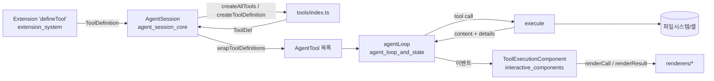

# builtin_tools 모듈

`packages/coding-agent/src/core/tools/` 아래에 있는 **내장 도구(built-in tools)** 모음이다. 코딩 에이전트가 파일시스템과 셸에 접근하는 8개 도구(`read`, `bash`, `powershell`, `edit`, `write`, `grep`, `find`, `ls`)를 정의하고, 이를 에이전트 런타임이 쓰는 `AgentTool`로 만드는 팩토리와 래퍼, 그리고 TUI 렌더러를 제공한다.

> 이 문서는 제공된 코어 컴포넌트(`index.ts`, `tool-definition-wrapper.ts`, `edit-diff.ts`, `edit.ts`, `path-utils.ts`, `renderers/*.ts`)의 코드를 기준으로 한다. `bash.ts`, `read.ts`, `grep.ts` 등 개별 도구 구현 본문과 `truncate.ts`, `file-mutation-queue.ts`, `render-utils.ts`는 이번 입력에 본문이 없으므로 `index.ts`의 export 목록과 렌더러의 import에서 알 수 있는 범위만 서술한다.

관련 모듈:
- 도구 이벤트 타입, `ToolDefinition`, `ExtensionToolContext`: [extension_system](extension_system.md)
- 번들 확장(codemode, tool-search 등)과 MCP 도구: [bundled_extensions](bundled_extensions.md), [mcp_integration](mcp_integration.md)
- 도구를 호출하는 에이전트 루프(`AgentTool`): [agent_loop_and_state](agent_loop_and_state.md)
- 도구를 레지스트리로 묶고 실행하는 세션: [agent_session_core](agent_session_core.md)
- 렌더러가 사용하는 테마/컴포넌트: [interactive_components](interactive_components.md), [interactive_mode](interactive_mode.md)

---

## 1. 구성 요소와 아키텍처

핵심 설계는 **정의(definition)와 실행 도구(tool)의 분리**다.

| 개념 | 타입 | 설명 |
|------|------|------|
| `ToolDefinition` (`ToolDef`) | `../extensions/types.ts` | 이름, 설명, 파라미터 스키마, `promptSnippet`/`promptGuidelines`, `execute`, `renderCall`/`renderResult`를 가진 풍부한 정의 |
| `AgentTool` (`Tool`) | `@earendil-works/pi-agent-core` | 에이전트 루프가 실행하는 최소 형태 |
| `wrapToolDefinition` | `tool-definition-wrapper.ts` | 전자를 후자로 변환 |

각 도구 파일은 `createXxxToolDefinition(cwd, options)`로 정의를 만들고, `createXxxTool(cwd, options)`는 `wrapToolDefinition(createXxxToolDefinition(...))`로 감싼 것이다(`edit.ts`에서 확인).

---

## 2. `index.ts`: 이름 기반 팩토리와 도구 세트

### 도구 이름과 옵션

- `ToolName = "read" | "bash" | "powershell" | "edit" | "write" | "grep" | "find" | "ls"`
- `allToolNames: Set<ToolName>`: 위 8개 이름 집합
- `ToolsOptions`: 도구별 옵션(`read`, `bash`, `powershell`, `write`, `edit`, `grep`, `find`, `ls`). 각 옵션은 해당 도구 모듈의 `XxxToolOptions` 타입이다.

### 팩토리 함수

| 함수 | 반환 | 포함 도구 |
|------|------|-----------|
| `createToolDefinition(name, cwd, options?)` | `ToolDef` | 이름 하나 (알 수 없는 이름은 `Unknown tool name` 예외) |
| `createTool(name, cwd, options?)` | `Tool` | 이름 하나 (동일) |
| `createCodingToolDefinitions` / `createCodingTools` | 배열 | `read`, `bash`, `edit`, `write` |
| `createReadOnlyToolDefinitions` / `createReadOnlyTools` | 배열 | `read`, `grep`, `find`, `ls` |
| `createAllToolDefinitions` / `createAllTools` | `Record<ToolName, …>` | 8개 전부 (`powershell` 포함) |

`powershell`은 coding/read-only 세트에 들어 있지 않고 `createAllTools`와 이름 기반 팩토리로만 만들 수 있다. 어떤 도구를 활성화할지는 이 모듈이 아니라 호출 측(세션)이 결정한다.

또한 `index.ts`는 각 도구의 `create*Tool`, `create*ToolDefinition`, `*Operations`, `*ToolDetails`, `*ToolInput`, `*ToolOptions` 타입, `withFileMutationQueue`, 그리고 `truncate.ts`의 `DEFAULT_MAX_BYTES`, `DEFAULT_MAX_LINES`, `formatSize`, `truncateHead`, `truncateLine`, `truncateTail`을 재노출한다. `bash.ts`는 `createLocalBashOperations`, `BashSpawnHook`을, `powershell.ts`는 `createLocalPowerShellOperations`, `PowerShellSpawnHook`을 추가로 내보낸다.

---

## 3. `tool-definition-wrapper.ts`

- `wrapToolDefinition(definition, ctxFactory?)`: `name`, `label`, `description`, `parameters`, `outputSchema`, `constrainedSampling`, `prepareArguments`, `executionMode`을 그대로 복사하고, `execute`는 컨텍스트(`ExtensionToolContext`)를 주입해 정의의 `execute`를 호출한다. 컨텍스트 우선순위는 호출 시 전달된 `ctx` → `ctxFactory(toolCallId, signal)`이다. 렌더러와 프롬프트 메타데이터는 `AgentTool`에 복사되지 않는다.
- `wrapToolDefinitions(definitions, ctxFactory?)`: 배열 버전.
- `createToolDefinitionFromAgentTool(tool)`: 반대 방향. 프롬프트 메타데이터나 렌더러가 없는 순수 `AgentTool` 오버라이드를 최소 `ToolDefinition`으로 합성한다. 주석상 `AgentSession` 내부 레지스트리를 definition-first로 유지하기 위한 것이다.

---

## 4. `edit` 도구와 `edit-diff.ts`

### 입력 스키마

`{ path: string, edits: [{ oldText, newText }, ...] }`. 한 호출에서 여러 개의 분리된 영역을 수정할 수 있다. `constrainedSampling: { type: "json_schema", strict: "prefer" }`로 선언돼 있다.

### `prepareEditArguments`: 모델별 입력 보정

스키마 검증 전에 `prepareArguments`로 실행되어 다음 변형을 정상화한다.

1. `edits`가 JSON 문자열로 온 경우 → 파싱 (배열이면 그대로, 단일 edit 객체면 `[obj]`). 코드 주석에 Opus 4.6, GLM-5.1이 이렇게 보낸다고 적혀 있다.
2. `edits`가 단일 객체인 경우 → `[obj]`로 감싼다.
3. 레거시 최상위 `oldText`/`newText`가 둘 다 문자열이면 `edits` 끝에 추가하고 최상위 필드는 제거한다.

파싱 실패는 조용히 무시한다(`catch {}`).

### 실행 흐름

주요 특징:

- **파일 단위 직렬화**: `withFileMutationQueue(absolutePath, …)`로 같은 파일에 대한 변경을 큐잉한다(구현 파일은 이번 입력에 없음).
- **중단 처리**: abort 이벤트 리스너에서 reject하지 않는다. 주석에 따르면 진행 중인 파일 연산이 끝나기 전에 큐 잠금이 풀리는 것을 막기 위해, 각 `await` 뒤에 `signal.aborted`를 확인(`throwIfAborted`)해 `Operation aborted`를 던진다.
- **BOM/줄바꿈 보존**: BOM은 매칭 전에 분리하고 쓸 때 복원한다. 줄바꿈은 원본이 `\r\n`이면 LF로 정규화해 처리한 뒤 `\r\n`으로 되돌린다. `detectLineEnding`은 첫 `\n`이 `\r\n`의 일부인지로 판정한다.
- **원격 실행 확장점**: `EditOperations { readFile, writeFile, access }`를 `EditToolOptions.operations`로 교체하면 SSH 같은 원격 파일 편집으로 위임할 수 있다. 기본값은 로컬 `fs/promises`.

### 매칭 알고리즘 (`applyEditsToNormalizedContent`)

- **모든 edit은 원본에 대해 매칭**된다(순차 적용 아님). 그래서 서로 겹치거나 중첩된 edit은 거부되고, 적용은 offset이 변하지 않도록 **역순**으로 한다.
- **정확 일치 우선, 실패 시 퍼지**: `fuzzyFindText`는 `indexOf` 후, 실패하면 `normalizeForFuzzyMatch`(NFKC, 줄 끝 공백 제거, 스마트 따옴표→ASCII, 유니코드 대시→`-`, 특수 공백→공백) 공간에서 찾는다.
- **고유성 검사**: `countOccurrences`는 항상 퍼지 정규화 공간에서 센다. 그래서 정확 일치로 찾은 경우에도 정규화 후 중복이면 duplicate 에러가 날 수 있다(코드상 동작).
- **퍼지 사용 시 변경 최소화**: `applyReplacementsPreservingUnchangedLines`는 변경이 닿는 줄 블록만 정규화본에서 다시 쓰고, 나머지 줄은 `originalContent`에서 그대로 복사한다. 줄 수가 다르면 에러를 던진다. 즉 퍼지 매칭이 파일 전체의 따옴표/공백을 조용히 바꿔 버리지 않는다.
- 에러 메시지는 edit이 1개일 때와 여러 개일 때(`edits[i]`)로 나뉜다.

### diff 생성

- `generateUnifiedPatch(path, old, new, contextLines=4)`: `diff` 라이브러리의 `createTwoFilesPatch`.
- `generateDiffString(old, new, contextLines=4)`: 줄 번호가 붙은 표시용 diff(`+N`, `-N`, 공백 컨텍스트, `...` 생략)와 새 파일 기준 `firstChangedLine`을 반환.
- `computeEditsDiff(path, edits, cwd)` / `computeEditDiff(path, oldText, newText, cwd)`: **파일을 쓰지 않고** diff만 계산한다. 접근/읽기/매칭 오류는 예외가 아니라 `{ error }`로 반환한다. TUI가 실행 전에 미리보기를 그릴 때 쓴다.

---

## 5. `path-utils.ts`

| 함수 | 역할 |
|------|------|
| `expandPath(p)` | `normalizePath(p, { normalizeUnicodeSpaces: true, stripAtPrefix: true })` |
| `resolveToCwd(p, cwd)` | `resolvePath`로 cwd 기준 절대 경로화. `~`와 절대 경로 처리(주석) |
| `resolveReadPath` / `resolveReadPathAsync` | 경로가 없으면 macOS 변형을 순서대로 시도하고 모두 실패하면 원래 경로 반환 |
| `pathExists` | 비동기 존재 확인 |

변형 시도 순서: 원본 → AM/PM 앞을 narrow no-break space(U+202F)로 → NFD 정규화 → 직선 `'`를 U+2019로 → NFD+U+2019 조합. macOS 스크린샷 파일명(예: `Capture d'écran`) 때문이다. 동기/비동기 버전은 로직이 중복되어 있다.

---

## 6. 렌더러 (`renderers/*.ts`)

각 도구의 표시 로직은 구현과 **별도 파일**로 분리돼 있다. 파일 헤더 주석에 따르면 출력 표시만 하는 프로세스가 실행 경로와 typebox 스키마를 로드하지 않게 하기 위함이다. 도구 정의 파일이 `...editRenderers`처럼 스프레드하므로 도구의 공개 형태는 변하지 않는다.

각 렌더러는 `Pick<ToolDefinition, "renderCall" | "renderResult">` 형태이며, `context.lastComponent`를 재사용하는 방식으로 컴포넌트를 갱신한다.

| 렌더러 | `renderCall` | `renderResult` |
|--------|-------------|----------------|
| `readRenderers` | `read <경로>:시작-끝`. `SKILL.md`, Pi 문서(`README.md`, `docs/`, `examples/`), `AGENTS.md`/`CLAUDE.md` 류는 접힌 상태에서 `[skill]`/`read docs`/`read resource` 요약으로 표시 | 확장(expanded)일 때만 본문 표시, 확장자 기반 구문 강조, 접힘 10줄, 잘림 경고 |
| `writeRenderers` | 경로와 쓰려는 내용을 스트리밍 중 점진적으로 구문 강조(캐시, 앞 50줄은 전체 재강조) | 오류일 때만 텍스트 표시 |
| `editRenderers` | 인자가 완성되면 `computeEditsDiff`로 미리보기 diff 계산 후 헤더 배경색(성공/오류/대기)과 함께 표시 | 실제 결과 diff가 미리보기와 다를 때만 `renderDiff`, 오류 시 에러 텍스트 |
| `grepRenderers` | `grep /pattern/ in path (glob) limit N` | 접힘 15줄, 매치 제한/잘림 경고 |
| `findRenderers` | `find pattern in path (limit N)` | 접힘 20줄, 결과 제한/잘림 경고 |
| `lsRenderers` | `ls path (limit N)` | 접힘 20줄, 엔트리 제한/잘림 경고 |

### edit 미리보기 상태 머신

`argsKey`(`path`+`edits`의 JSON)로 비동기 계산의 stale 결과를 걸러낸다. 완료되면 `context.invalidate()`로 다시 그린다. 헤더 배경은 `toolPendingBg` / `toolSuccessBg` / `toolErrorBg`.

세부 관찰:
- 렌더러는 `file_path`와 `path` 둘 다 받는다.
- `read` 렌더러는 `offset`/`limit`이 `null`로 올 수 있다는 주석(strict 스키마에서 선택 필드를 모델이 `null`로 보냄)에 따라 `== null`로 비교한다.
- 잘림 경고는 `truncate.ts`의 `DEFAULT_MAX_BYTES`, `DEFAULT_MAX_LINES`, `formatSize`를 사용하고, 확장 키 힌트는 `keyHint("app.tools.expand", …)`(키 하드코딩 금지 규칙)로 표시한다.
- 렌더러는 `modes/interactive/*`(테마, diff, 키 힌트)에 의존하므로 `core`가 UI 모드 코드를 참조하는 방향의 의존이 존재한다.

---

## 7. 시스템 내 위치와 데이터 흐름

- `extensions/types.ts`에는 `ReadToolCallEvent`, `BashToolResultEvent`, `isEditToolResult` 등 내장 도구 이름별 이벤트/타입 가드가 있어, 확장이 내장 도구 호출을 가로채거나 결과를 검사할 수 있다([extension_system](extension_system.md)).
- 내장 도구와 확장/MCP 도구는 같은 `ToolDefinition` 형태를 공유한다. 내장 도구만 `tools/index.ts`의 이름 기반 팩토리로 만들어진다.

## 8. 확장 포인트와 주의사항

- **Operations 주입**: 각 도구는 `*Operations`(예: `EditOperations`, `BashOperations`, `ReadOperations`)와 `*ToolOptions`로 I/O를 교체할 수 있다. 원격 실행이나 샌드박스 대체에 쓰는 지점이다. `bash`/`powershell`에는 추가로 spawn 훅(`BashSpawnHook`, `PowerShellSpawnHook`)이 있다.
- **cwd 결정**: `edit`은 `ctx?.cwd || cwd` 순으로 작업 디렉터리를 정한다(컨텍스트 우선). 팩토리에 넘긴 `cwd`는 기본값이다.
- **퍼지 매칭의 한계**: 정규화 공간에서 매칭하므로 원본과 유니코드 표기만 다른 텍스트를 의도치 않게 매칭할 수 있고, 중복 판정도 정규화 기준이다.
- **edit 겹침 거부**: 인접 변경은 하나의 edit으로 합치도록 모델에게 안내한다(`promptGuidelines`와 에러 메시지).
- **`resolveReadPath` 계열은 `read` 도구용**이다. `edit`은 `resolveToCwd`만 쓰므로 macOS 변형 경로 보정이 적용되지 않는다(코드 확인).

## 9. 테스트/빌드 참고

`packages/coding-agent/vitest.config.ts`가 이 패키지 테스트를 구성한다(이번 입력에서는 내용을 읽지 않았다). 저장소 규칙상 비 e2e 테스트는 루트의 `./test.sh`로 실행한다.
