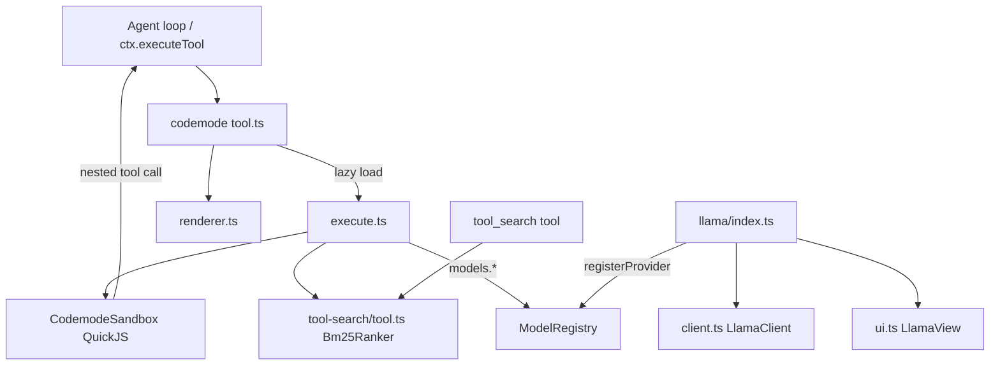
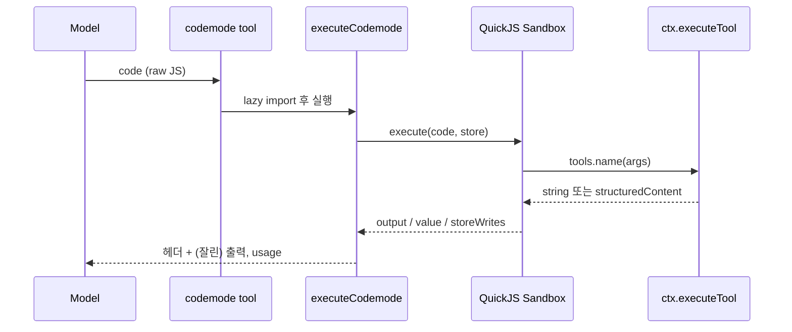
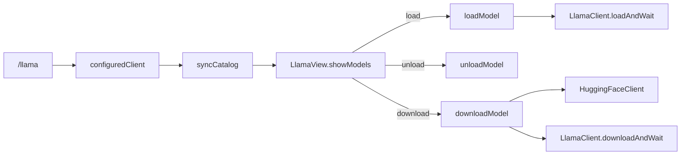

# bundled_extensions

## 개요

`bundled_extensions`는 `packages/coding-agent/src/extensions/` 아래에 pi coding-agent와 함께 배포되는 내장 확장 모음이다. 세 가지 확장을 다룬다.

| 확장 | 경로 | 역할 |
|---|---|---|
| codemode | `extensions/codemode/` | 모델이 JavaScript를 작성해 다른 툴을 호출하는 `codemode` 툴 (QuickJS 샌드박스) |
| tool-search | `extensions/tool-search/` | BM25 기반 툴 검색. `searchTools()`와 `tool_search` 툴이 공유 |
| llama | `extensions/llama/` | llama.cpp router 서버의 모델을 `/llama` 명령으로 관리 (load/unload/download) |

MCP 확장(`extensions/mcp/`)은 별도 모듈 `mcp_integration`에서 다룬다. 확장 로딩 구조는 `extension_system`, 내장 툴은 `builtin_tools`를 참고한다.

## 아키텍처

## codemode

### tool.ts
- `createCodemodeTool` / `createCodemodeToolDefinition`: `codemode` 툴 정의를 만든다. 입력은 원시 JavaScript(`code`)이며 `exposure: "model-only"`라서 스크립트가 다른 스크립트를 시작할 수 없다.
- `createCodemodeDescription`: 호출 가능한 툴의 선언을 모델용 설명으로 렌더링한다. `selectCatalog`가 토큰 예산(`DEFAULT_CODEMODE_INLINE_BUDGET = 3000`) 안에서 namespace별로 라운드 로빈 방식으로 툴을 고른다. `deferred` 툴은 설명에 나열하지 않아 MCP 서버 연결 시에도 설명이 바뀌지 않는다.
- `prepareCodemodeLoadout`: `codemode.mode`(`on`/`only`)에 따라 툴 설명과 `hiddenDeclarations`를 조정한다.
- 샌드박스는 첫 호출 때 `loadCodemodeExecutor()`(`execute.lazy.ts`)로 지연 로드한다.
- `store()`/`load()` 값은 세션의 `codemode-store` custom entry로 저장되어 브랜치별로 보인다.

### execute.ts
- `executeCodemode`: 스크립트를 `CodemodeSandbox`에서 실행한다. 메모리 한도 256 MiB(`CODEMODE_MEMORY_LIMIT_BYTES`), 타임아웃은 `// @options:` 줄로 지정한다.
- 중첩 툴 호출은 `ctx.executeTool`을 거치므로 검증, `tool_call`/`tool_result` 훅, 권한 검사가 직접 호출과 동일하게 적용된다. `outputSchema`가 있는 툴은 `structuredContent`로, 그 외는 텍스트로 스크립트에 전달된다.
- `createDiscoveryGlobals`: `searchTools()`, `describeTool()`, `describeNamespace()`.
- `createModelGlobals`: `models.getModelsOfType`, `getAvailableOfType`, `getModelOfType`, `classify`, `generateImages`. 동시 호출은 `createLimiter`로 4개까지(`MAX_CONCURRENT_MODEL_CALLS`). 모델은 provider/id로만 해석하며, `toModelInfo`가 `headers`를 제거해 자격 증명 유출을 막는다.
- `checkClassifierContext`, `checkImagesContext`: 스크립트가 넘긴 컨텍스트 형태를 검사해 provider 오류 대신 기대 형태를 알려 준다. `ModelCallResult`는 중첩 호출 행에 보고되는 `stopReason`/`errorMessage`/`usage` 필드다.
- `truncateOutput`: 출력이 토큰 예산(기본 10,000)을 넘으면 앞뒤만 남기고 전체를 임시 파일(`spillOutput`)에 쓴다.

### renderer.ts
- `renderCall`: 스크립트를 하이라이트해 표시한다(접힘 시 10줄).
- `renderResult`: 중첩 호출 목록(상태 아이콘, 소요 시간, 비용)과 스크립트 출력을 보여 주며, `Script completed` 헤더는 제거한다. 중첩 호출은 모델에 별도 툴 호출로 노출되지 않으므로 별도 툴 행이 아니다.

## tool-search (`tool-search/tool.ts`)

- `tokenize`/`stem`: camelCase 분리, 불용어 제거, 단순 단수화(`issues` → `issue`).
- `createToolSearchDocument`: 툴 이름, 설명, 스키마 설명·프로퍼티명, namespace 정보를 하나의 검색 텍스트로 만든다.
- `Bm25Ranker` (`ToolRanker` 구현): Okapi BM25(k1=1.2, b=0.75). 동점은 문서 순서를 유지한다.
- `createToolSearchToolDefinition`: `tool_search` 툴. `exposure`가 `codemode` 또는 `deferred`인 비활성 툴을 검색해 `setActiveTools`로 활성화하므로 다음 모델 호출부터 선언된다. 변경은 트랜스크립트에 기록되어 `/tree`, resume, fork에서도 유지된다.

## llama (`llama/`)

`/llama` 명령은 interactive(`tui`) 모드에서만 동작한다.

- `index.ts`의 `llamaExtension`: provider(`createLlamaProvider`)를 등록하고 `/llama` 명령을 정의한다. `syncCatalog`가 서버 모델 목록을 provider에 반영하고 `modelRegistry.refresh`를 호출한다(`PI_OFFLINE`에서도 허용). `loadModel`은 이미 로드된 모델이 있으면 unload 여부를 묻고, 실패나 취소 시 이전 모델을 복원한다. `downloadModel`은 Hugging Face 검색, gated 모델 안내, quantization 선택 후 다운로드한다.
- `client.ts`의 `LlamaClient`: `/models`, `/props`, `/models/load`, `/models/unload` 호출과 `/models/sse` 이벤트 스트림을 다룬다. `loadAndWait`/`downloadAndWait`는 SSE 이벤트와 목록 폴링을 병행한다(SSE가 끊겨도 폴링이 기준). `isModelInfo`는 응답이 router 모드인지 판별하고, `normalizeLlamaServerUrl`은 `http(s)`만 허용하고 `/v1`을 제거한다. 요청 타임아웃은 15초.
- `ui.ts`: `LlamaView`(`LlamaUi` 구현)가 모델 목록, 선택, 확인, 연결 오류, 진행률 화면을 전환한다. `HuggingFaceSearch`는 500ms 디바운스와 캐시를 쓰는 검색 입력 컴포넌트다. `runWithProgress`는 진행 화면에서 취소 키를 누르면 확인 후 `cancel()`과 `AbortController`로 작업을 중단한다.
- `huggingface.ts`, `provider.ts`는 이 모듈의 핵심 컴포넌트에 포함되지 않아 상세를 다루지 않았다(미확인).

## 테스트 설정

`packages/coding-agent/vitest.config.ts`가 이 패키지의 테스트 설정이다. 이 문서 작성 시 내용은 확인하지 않았다.

## 관련 모듈

- `extension_system`: 확장 로더·러너, `ExtensionAPI`, `ToolDefinition` 타입
- `builtin_tools`: `wrapToolDefinition` 등 툴 래퍼
- `mcp_integration`: MCP 툴이 `codemode`/`tool_search`의 주 대상
- `model_and_auth_management`: `ModelRegistry`, provider 등록
